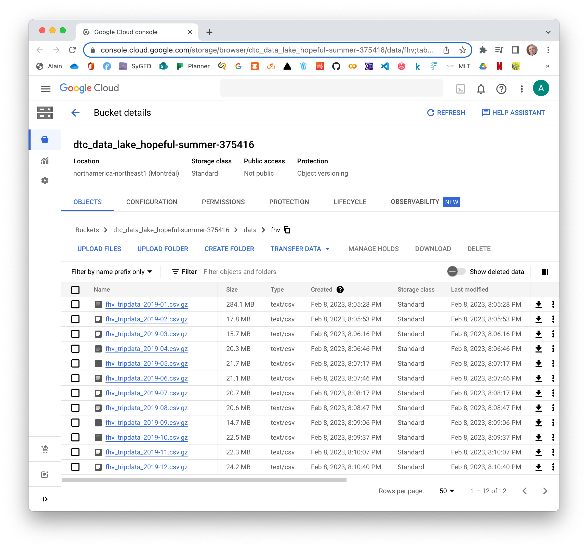
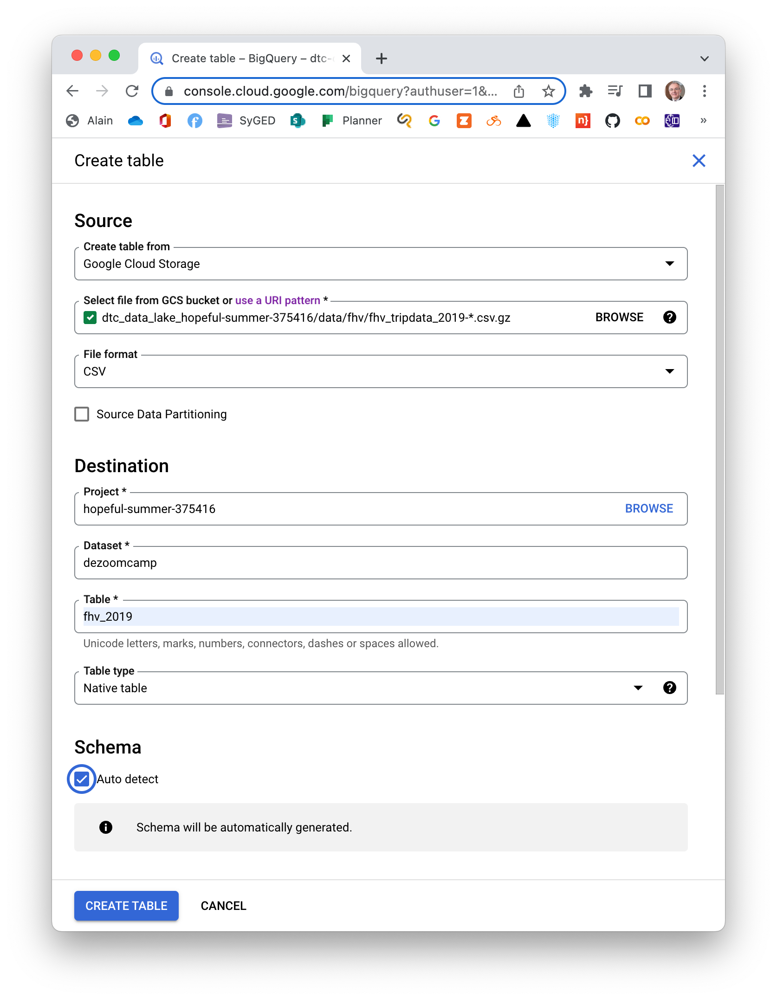
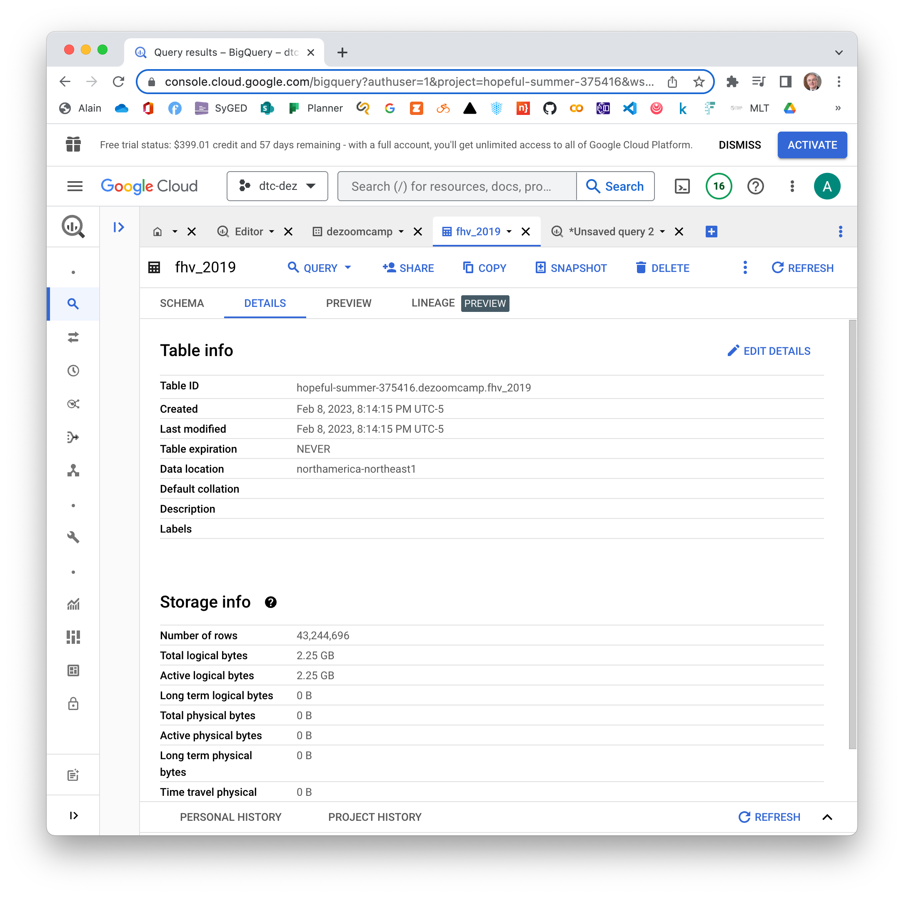
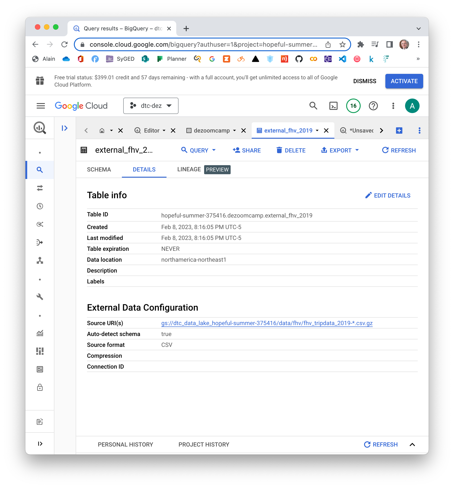

# Week 3 Homework

**IMPORTANT NOTE:** You can load the data however you would like, but keep the files in `.GZ` Format. If you are using orchestration such as
Airflow or Prefect do not load the data into Big Query using the orchestrator. Stop with loading the files into a
bucket.

**NOTE:** You can use the `CSV` option for the `GZ` files when creating an External Table.

**SETUP:** Create an external table using the `fhv 2019` data.  
Create a table in BigQuery using the `fhv 2019` data (do not partition or cluster this table).  
Data can be found here: <https://github.com/DataTalksClub/nyc-tlc-data/releases/tag/fhv>

## Question 1

What is the count for fhv vehicle records for year 2019?

- 65,623,481
- 43,244,696
- 22,978,333
- 13,942,414

## Solution 1

Start Prefect Orion.

``` bash
cd ~/github/de-zoomcamp/week3
conda activate zoom
prefect orion start
prefect profile use default
prefect config set PREFECT_API_URL=http://127.0.0.1:4200/api
```

Check out the dashboard at <http://127.0.0.1:4200>

Create a python script to load our data from GitHub repo to Google Cloud Storage (GCS).

**File `web_to_gcs.py`**

``` python
from pathlib import Path
import pandas as pd
from prefect import flow, task
from prefect_gcp.cloud_storage import GcsBucket
from random import randint


@task(retries=3, log_prints=True)
def fetch(dataset_url: str) -> pd.DataFrame:
    print(dataset_url)
    df = pd.read_csv(dataset_url, compression='gzip')
    return df


@task(log_prints=True)
def clean(df: pd.DataFrame) -> pd.DataFrame:
    """Fix dtype issues"""
    df["pickup_datetime"] = pd.to_datetime(df["pickup_datetime"])
    df["dropOff_datetime"] = pd.to_datetime(df["dropOff_datetime"])

    print(df.head(2))
    print(f"columns: {df.dtypes}")
    print(f"rows: {len(df)}")
    return df


@task()
def write_local(df: pd.DataFrame, dataset_file: str) -> Path:
    """Write DataFrame out locally as csv file"""
    Path(f"data/fhv").mkdir(parents=True, exist_ok=True)
    path = Path(f"data/fhv/{dataset_file}.csv.gz")
    df.to_parquet(path, compression="gzip")
    return path


@task
def write_gcs(path: Path) -> None:
    """Upload local parquet file to GCS"""
    gcs_block = GcsBucket.load("zoom-gcs")
    gcs_block.upload_from_path(from_path=path, to_path=path)
    return


@flow()
def web_to_gcs() -> None:
    year = 2019
    for month in range(1, 13):
        dataset_file = f"fhv_tripdata_{year}-{month:02}"
        dataset_url = f"https://github.com/DataTalksClub/nyc-tlc-data/releases/download/fhv/{dataset_file}.csv.gz"
        df = fetch(dataset_url)
        df_clean = clean(df)
        path = write_local(df_clean, dataset_file)
        write_gcs(path)


if __name__ == "__main__":
    web_to_gcs()
```

Run the code.

``` bash
python web_to_gcs.py
```

You should see your buckets on Google Cloud.



Then, we can create table `fhv_2019` like this.



This request may take several minutes.

Now, create external table, without partition or cluster, by running this query.

``` sql
--- Creating external table referring to gcs path
CREATE OR REPLACE EXTERNAL TABLE `dezoomcamp.external_fhv_2019`
OPTIONS (
  format = 'CSV',
  uris = ['gs://dtc_data_lake_hopeful-summer-375416/data/fhv/fhv_tripdata_2019-*.csv.gz']
);
```

We should see…​

<table>
<tr><td>

</td><td>

</td></tr>
</table>

Run these queries.

``` sql
SELECT COUNT(*) FROM `hopeful-summer-375416.dezoomcamp.fhv_2019`;
--- 43,244,696

SELECT COUNT(*) FROM `hopeful-summer-375416.dezoomcamp.external_fhv_2019`;
--- This query takes more time to execute.
--- 43,244,696
```

## Question 2

Write a query to count the distinct number of `affiliated_base_number` for the entire dataset on both the tables. What
is the estimated amount of data that will be read when this query is executed on the External Table and the Table?

- 25.2 MB for the External Table and 100.87MB for the BQ Table
- 225.82 MB for the External Table and 47.60MB for the BQ Table
- 0 MB for the External Table and 0MB for the BQ Table
- 0 MB for the External Table and 317.94MB for the BQ Table

## Solution 2

Run these queries.

``` sql
--- From External Table
--- This query will process 0 B when run.
--- 3,163
SELECT COUNT(DISTINCT affiliated_base_number)
FROM dezoomcamp.external_fhv_2019;

--- From BQ Table
--- This query will process 317.94 MB when run.
--- 3,163
SELECT COUNT(DISTINCT affiliated_base_number)
FROM dezoomcamp.fhv_2019;
```

## Question 3

How many records have both a blank (null) `PUlocationID` and `DOlocationID` in the entire dataset?

- 717,748
- 1,215,687
- 5
- 20,332

## Solution 3

``` sql
--- This query will process 0 B when run.
--- This query takes more time to execute.
--- 717,748
SELECT COUNT(*)
FROM dezoomcamp.external_fhv_2019
WHERE PUlocationID IS NULL AND DOlocationID IS NULL;

--- 717,748
SELECT COUNT(*)
FROM dezoomcamp.fhv_2019
WHERE PUlocationID IS NULL AND DOlocationID IS NULL;
```

## Question 4

What is the best strategy to optimize the table if query always filter by `pickup_datetime` and order by
`affiliated_base_number`?

- Cluster on `pickup_datetime` Cluster on `affiliated_base_number`
- Partition by `pickup_datetime` Cluster on `affiliated_base_number`
- Partition by `pickup_datetime` Partition by `affiliated_base_number`
- Partition by `affiliated_base_number` Cluster on `pickup_datetime`

## Solution 4

``` sql
--- Cluster on `pickup_datetime` Cluster on `affiliated_base_number`
CREATE OR REPLACE TABLE dezoomcamp.fhv_2019_1
CLUSTER BY DATE(pickup_datetime), Affiliated_base_number AS
  (SELECT *
   FROM dezoomcamp.fhv_2019);

--- Partition by `pickup_datetime` Cluster on `affiliated_base_number`
CREATE OR REPLACE TABLE dezoomcamp.fhv_2019_2
PARTITION BY DATE(pickup_datetime)
CLUSTER BY Affiliated_base_number AS
  (SELECT *
   FROM dezoomcamp.fhv_2019);

--- Partition by `pickup_datetime` Partition by `affiliated_base_number`
--- ERROR
--- Only a single PARTITION BY expression is supported but found 2
CREATE OR REPLACE TABLE dezoomcamp.fhv_2019_3
PARTITION BY DATE(pickup_datetime), Affiliated_base_number AS
  (SELECT *
   FROM dezoomcamp.fhv_2019);

--- Partition by `affiliated_base_number` Cluster on `pickup_datetime`
--- ERROR
--- PARTITION BY expression must be [...] <int64_value>]))
CREATE OR REPLACE TABLE dezoomcamp.fhv_2019_4
PARTITION BY Affiliated_base_number
CLUSTER BY DATE(pickup_datetime) AS
  (SELECT *
   FROM dezoomcamp.fhv_2019);

--- This query will process 647.87 MB when run.
SELECT COUNT(*)
FROM dezoomcamp.fhv_2019
WHERE DATE(pickup_datetime) BETWEEN '2019-03-01' AND '2019-03-31'
GROUP BY Affiliated_base_number;

--- This query will process 647.87 MB when run.
SELECT COUNT(*)
FROM dezoomcamp.fhv_2019_1
WHERE DATE(pickup_datetime) BETWEEN '2019-03-01' AND '2019-03-31'
GROUP BY Affiliated_base_number;

--- This query will process 23.05 MB when run.
--- This is the best strategy.
SELECT COUNT(*)
FROM dezoomcamp.fhv_2019_2
WHERE DATE(pickup_datetime) BETWEEN '2019-03-01' AND '2019-03-31'
GROUP BY Affiliated_base_number;
```

See [14 Best Practices to Tune BigQuery SQL
Performance](https://towardsdatascience.com/14-ways-to-optimize-bigquery-sql-for-ferrari-speed-at-honda-cost-632ec705979).

## Question 5

Implement the optimized solution you chose for question 4. Write a query to retrieve the distinct
`affiliated_base_number` between `pickup_datetime` 03/01/2019 and 03/31/2019 (inclusive).

Use the BQ table you created earlier in your from clause and note the estimated bytes. Now change the table in the from
clause to the partitioned table you created for question 4 and note the estimated bytes processed. What are these
values? Choose the answer which most closely matches.

- 12.82 MB for non-partitioned table and 647.87 MB for the partitioned table
- 647.87 MB for non-partitioned table and 23.06 MB for the partitioned table
- 582.63 MB for non-partitioned table and 0 MB for the partitioned table
- 646.25 MB for non-partitioned table and 646.25 MB for the partitioned table

## Solution 5

``` sql
--- Non-partitioned table.
--- This query will process 647.87 MB when run.
SELECT COUNT(DISTINCT affiliated_base_number)
FROM dezoomcamp.fhv_2019
WHERE DATE(pickup_datetime) BETWEEN '2019-03-01' AND '2019-03-31';

--- Partitioned table.
--- This query will process 23.05 MB when run.
SELECT COUNT(DISTINCT affiliated_base_number)
FROM dezoomcamp.fhv_2019_2
WHERE DATE(pickup_datetime) BETWEEN '2019-03-01' AND '2019-03-31';
```

## Question 6

Where is the data stored in the External Table you created?

- Big Query
- GCP Bucket
- Container Registry
- Big Table

## Solution 6

GCP Bucket.

## Question 7

It is best practice in Big Query to always cluster your data:

- True
- False 

## Solution 7

False.

You might consider alternatives to clustering in the following circumstances:

- You need a strict query cost estimate before you run a query. The cost of queries over clustered tables can only be
  determined after the query is run.
- Your query tables are smaller than 1 GB. Typically, clustering does not offer significant performance gains on tables
  less than 1 GB.

See [Introduction to clustered tables](https://cloud.google.com/bigquery/docs/clustered-tables).

## (Not required) Question 8

A better format to store these files may be parquet. Create a data pipeline to download the gzip files and convert them
into parquet. Upload the files to your GCP Bucket and create an External and BQ Table.

Note: Column types for all files used in an External Table must have the same datatype. While an External Table may be
created and shown in the side panel in Big Query, this will need to be validated by running a count query on the
External Table to check if any errors occur.

## Solution 8

Some of the data is integers and some columns are missing values. When read into pandas these will be interpreted as
float values and saved as such. Later in the course defining a schema when saving to a parquet file will be covered with
pyspark. There could be numerous "valid" ways to approach this issue

I should add that some files will end up having these columns as integers and some files will have these files as
floats. You won’t realize this until the files are in the bucket and you are creating the external table.

**Nullable integer data type**

In Working with missing data, we saw that pandas primarily uses NaN to represent missing data. Because NaN is a float,
this forces an array of integers with any missing values to become floating point. In some cases, this may not matter
much. But if your integer column is, say, an identifier, casting to float can be problematic. Some integers cannot even
be represented as floating point numbers.

See [Nullable integer data type](https://pandas.pydata.org/docs/user_guide/integer_na.html).

A simple solution is to use `dtype="Int64"` (note the capital "I", to differentiate from NumPy’s `` "int64"` `` dtype)
to replace missing values to `pandas.NA`.

``` txt
In [3]: pd.array([1, 2, np.nan], dtype="Int64")
Out[3]:
<IntegerArray>
[1, 2, <NA>]
Length: 3, dtype: Int64
```

**File `` web_ti_gcs.py` ``**

``` python
from pathlib import Path
import pandas as pd
from prefect import flow, task
from prefect_gcp.cloud_storage import GcsBucket
from random import randint


@task(retries=3, log_prints=True)
def fetch(dataset_url: str) -> pd.DataFrame:
    print(dataset_url)
    df = pd.read_csv(dataset_url, compression='gzip')
    return df


@task(log_prints=True)
def clean(df: pd.DataFrame) -> pd.DataFrame:
    """Fix dtype issues"""
    df["pickup_datetime"] = pd.to_datetime(df["pickup_datetime"])
    df["dropOff_datetime"] = pd.to_datetime(df["dropOff_datetime"])

    # See https://pandas.pydata.org/docs/user_guide/integer_na.html
    df["PUlocationID"] = df["PUlocationID"].astype('Int64')  
    df["DOlocationID"] = df["DOlocationID"].astype('Int64')

    print(df.head(2))
    print(f"columns: {df.dtypes}")
    print(f"rows: {len(df)}")
    return df


@task()
def write_local(df: pd.DataFrame, dataset_file: str) -> Path:
    """Write DataFrame out locally as csv file"""
    Path(f"data/fhv").mkdir(parents=True, exist_ok=True)

    #path = Path(f"data/fhv/{dataset_file}.csv.gz")
    #df.to_csv(path, compression="gzip")
    path = Path(f"data/fhv/{dataset_file}.parquet")  
    df.to_parquet(path, compression="gzip")

    return path


@task
def write_gcs(path: Path) -> None:
    """Upload local parquet file to GCS"""
    gcs_block = GcsBucket.load("zoom-gcs")
    gcs_block.upload_from_path(from_path=path, to_path=path)
    return


@flow()
def web_to_gcs() -> None:
    year = 2019
    for month in range(1, 13):
        dataset_file = f"fhv_tripdata_{year}-{month:02}"
        dataset_url = f"https://github.com/DataTalksClub/nyc-tlc-data/releases/download/fhv/{dataset_file}.csv.gz"
        df = fetch(dataset_url)
        df_clean = clean(df)
        path = write_local(df_clean, dataset_file)
        write_gcs(path)


if __name__ == "__main__":
    web_to_gcs()
```

- Cast to `Int64`.
- Save to `.parquet`.

Note that we could do this.

``` python
@task(log_prints=True)
def clean(df: pd.DataFrame) -> pd.DataFrame:
    return df.astype({
        'SR_Flag': 'Int64'
    })
```

``` python
def fetch(url: str) -> pd.DataFrame:
   return pd.read_csv(url, engine='pyarrow').astype({
        'PUlocationID': 'Int64',
        'DOlocationID': 'Int64',
        'SR_Flag': 'Int64'
   })

# Or...
def fetch(url: str) -> pd.DataFrame:
    return pd.read_csv(url, engine="pyarrow")

@task(log_prints=True)
def transform(df: pd.DataFrame) -> pd.DataFrame:
    return df.as_type({
        "PUlocationID": "Int64",
        "DOlocationID": "Int64",
        "SR_Flag": "Int64"
    })
```

