# Week 2 Homework

See
[homework.md](https://github.com/DataTalksClub/data-engineering-zoomcamp/blob/main/cohorts/2023/week_2_workflow_orchestration/homework.md)
for week 2.

The goal of this homework is to familiarise users with workflow orchestration.

## Question 1. Load January 2020 data

Using the `etl_web_to_gcs.py` flow that loads taxi data into GCS as a guide, create a flow that loads the green taxi CSV
dataset for January 2020 into GCS and run it. Look at the logs to find out how many rows the dataset has.

How many rows does that dataset have?

- 447,770
- 766,792
- 299,234
- 822,132

## Solution 1

I slightly modified the `etl_web_to_gcs.py` file to:

- correctly handle a column with an inconsistent type using the `convert_type` function;
- handle column names changing between data for yellow and green cabs;
- comment out the calls to the `write_local` and `write_gcs` functions that are not needed to answer question 1.

**File `etl_web_to_gcs.py`**

``` python
from pathlib import Path
import pandas as pd
from prefect import flow, task
from prefect_gcp.cloud_storage import GcsBucket
from random import randint

def convert_dtype(x):
    """Convert a column as string
    This code comes from
    https://www.roelpeters.be/solved-dtypewarning-columns-have-mixed-types-specify-dtype-option-on-import-or-set-low-memory-in-pandas/
    """
    if not x:
        return ''
    try:
        return x.astype(str)
    except:
        return ''

@task(retries=3)
def fetch(dataset_url: str) -> pd.DataFrame:
    """Read taxi data from web into pandas DataFrame"""
    # if randint(0, 1) > 0:
    #     raise Exception

    # See Data Dictionary
    # https://www.nyc.gov/assets/tlc/downloads/pdf/data_dictionary_trip_records_green.pdf
    df = pd.read_csv(dataset_url, compression='gzip',
        converters={'store_and_fwd_flag': convert_dtype})

    print(df.info(verbose=True))
    return df


@task(log_prints=True)
def clean(df: pd.DataFrame) -> pd.DataFrame:
    """Fix dtype issues"""
    if "tpep_pickup_datetime" in df.columns:
        df["tpep_pickup_datetime"] = pd.to_datetime(df["tpep_pickup_datetime"])
        df["tpep_dropoff_datetime"] = pd.to_datetime(df["tpep_dropoff_datetime"])
    else:
        df["lpep_pickup_datetime"] = pd.to_datetime(df["lpep_pickup_datetime"])
        df["lpep_dropoff_datetime"] = pd.to_datetime(df["lpep_dropoff_datetime"])

    print(df.head(2))
    print(f"columns: {df.dtypes}")
    print(f"rows: {len(df)}")
    return df


@task()
def write_local(df: pd.DataFrame, color: str, dataset_file: str) -> Path:
    """Write DataFrame out locally as parquet file"""
    Path(f"data/{color}").mkdir(parents=True, exist_ok=True)
    path = Path(f"data/{color}/{dataset_file}.parquet")
    df.to_parquet(path, compression="gzip")
    return path


@task
def write_gcs(path: Path) -> None:
    """Upload local parquet file to GCS"""
    gcs_block = GcsBucket.load("zoom-gcs")
    gcs_block.upload_from_path(from_path=path, to_path=path)
    return


@flow()
def etl_web_to_gcs() -> None:
    """The main ETL function"""

    # Initial parameters.
    # color = "yellow"
    # year = 2021
    # month = 1

    # Parameters for question 1.
    color = "green"
    year = 2020
    month = 1

    dataset_file = f"{color}_tripdata_{year}-{month:02}"
    dataset_url = f"https://github.com/DataTalksClub/nyc-tlc-data/releases/download/{color}/{dataset_file}.csv.gz"

    df = fetch(dataset_url)
    df_clean = clean(df)
    # path = write_local(df_clean, color, dataset_file)
    # write_gcs(path)


if __name__ == "__main__":
    etl_web_to_gcs()
```

Then I activate the conda environment, start Prefect and run the python script with the following commands.

``` bash
cd ~/github/prefect
conda activate zoom
prefect orion start
python flows/02_gcp/etl_web_to_gcs.py
```

Below is the output appearing in the terminal window.

``` txt
19:03:26.003 | INFO    | prefect.engine - Created flow run 'asparagus-dog' for flow 'etl-web-to-gcs'
19:03:26.082 | INFO    | Flow run 'asparagus-dog' - Created task run 'fetch-b4598a4a-0' for task 'fetch'
19:03:26.083 | INFO    | Flow run 'asparagus-dog' - Executing 'fetch-b4598a4a-0' immediately...
<class 'pandas.core.frame.DataFrame'>
RangeIndex: 447770 entries, 0 to 447769
Data columns (total 20 columns):
 #   Column                 Non-Null Count   Dtype
---  ------                 --------------   -----
 0   VendorID               331719 non-null  float64
 1   lpep_pickup_datetime   447770 non-null  object
 2   lpep_dropoff_datetime  447770 non-null  object
 3   store_and_fwd_flag     447770 non-null  object
 4   RatecodeID             331719 non-null  float64
 5   PULocationID           447770 non-null  int64
 6   DOLocationID           447770 non-null  int64
 7   passenger_count        331719 non-null  float64
 8   trip_distance          447770 non-null  float64
 9   fare_amount            447770 non-null  float64
 10  extra                  447770 non-null  float64
 11  mta_tax                447770 non-null  float64
 12  tip_amount             447770 non-null  float64
 13  tolls_amount           447770 non-null  float64
 14  ehail_fee              0 non-null       float64
 15  improvement_surcharge  447770 non-null  float64
 16  total_amount           447770 non-null  float64
 17  payment_type           331719 non-null  float64
 18  trip_type              331718 non-null  float64
 19  congestion_surcharge   331719 non-null  float64
dtypes: float64(15), int64(2), object(3)
memory usage: 68.3+ MB
None
19:03:27.637 | INFO    | Task run 'fetch-b4598a4a-0' - Finished in state Completed()
19:03:27.651 | INFO    | Flow run 'asparagus-dog' - Created task run 'clean-b9fd7e03-0' for task 'clean'
19:03:27.651 | INFO    | Flow run 'asparagus-dog' - Executing 'clean-b9fd7e03-0' immediately...
19:03:27.832 | INFO    | Task run 'clean-b9fd7e03-0' -    VendorID lpep_pickup_datetime lpep_dropoff_datetime store_and_fwd_flag  ...  total_amount  payment_type  trip_type  congestion_surcharge
0       2.0  2019-12-18 15:52:30   2019-12-18 15:54:39                     ...          4.81           1.0        1.0                   0.0
1       2.0  2020-01-01 00:45:58   2020-01-01 00:56:39                     ...         24.36           1.0        2.0                   0.0

[2 rows x 20 columns]
19:03:27.833 | INFO    | Task run 'clean-b9fd7e03-0' - columns: VendorID                        float64
lpep_pickup_datetime     datetime64[ns]
lpep_dropoff_datetime    datetime64[ns]
store_and_fwd_flag               object
RatecodeID                      float64
PULocationID                      int64
DOLocationID                      int64
passenger_count                 float64
trip_distance                   float64
fare_amount                     float64
extra                           float64
mta_tax                         float64
tip_amount                      float64
tolls_amount                    float64
ehail_fee                       float64
improvement_surcharge           float64
total_amount                    float64
payment_type                    float64
trip_type                       float64
congestion_surcharge            float64
dtype: object
19:03:27.833 | INFO    | Task run 'clean-b9fd7e03-0' - rows: 447770
19:03:27.846 | INFO    | Task run 'clean-b9fd7e03-0' - Finished in state Completed()
19:03:27.859 | INFO    | Flow run 'asparagus-dog' - Finished in state Completed('All states completed.')
```

The answer is in the output of the terminal window.

## Question 2. Scheduling with Cron

Cron is a common scheduling specification for workflows.

Using the flow in `etl_web_to_gcs.py`, create a deployment to run on the first of every month at 5am UTC. What’s the
cron schedule for that?

- `0 5 1 * *` 
- `0 0 5 1 *`
- `5 * 1 0 *`
- `* * 5 1 0`

## Solution 2.

This site <https://crontab.guru/> helps to understand what schedules mean according to cron syntax.

- `0 5 1 * *` : “At 05:00 on day-of-month 1”.
- `0 0 5 1 *` : “At 00:00 on day-of-month 5 in January”.
- `5 * 1 0 *` : Invalid cron schedule.
- `* * 5 1 0` : “At every minute on day-of-month 5 and on Sunday in January”.

The presumed answer is `0 5 1 * *`.

To check if this is the answer, we can run the python script according to the `0 5 1 * *` schedule in Prefect with the
following commands.

``` bash
cd ~/github/prefect
conda activate zoom
prefect orion start
prefect deployment build flows/02_gcp/etl_web_to_gcs.py:etl_web_to_gcs -n etl --cron "0 5 1 * *" -a
```

We should see this.

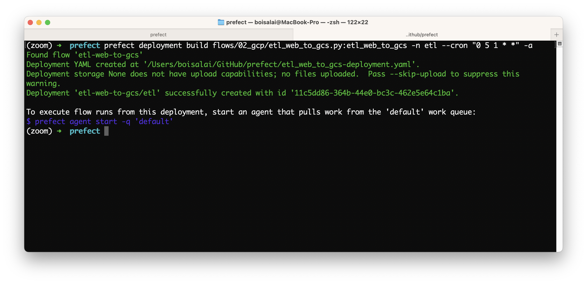

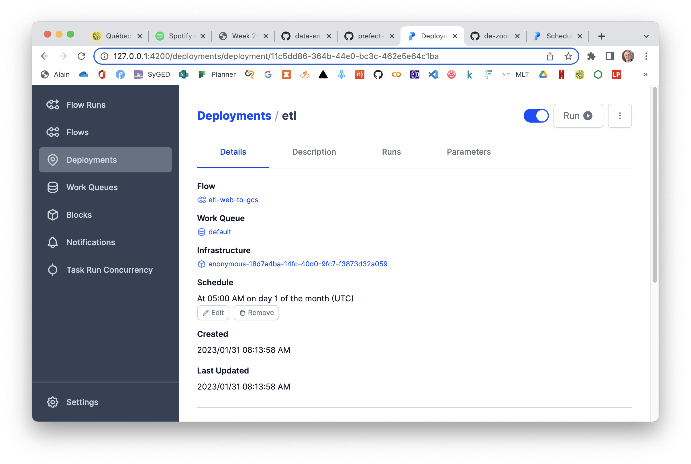

See [Creating schedules through the CLI with the `deployment build`
command](https://docs.prefect.io/concepts/schedules/#creating-schedules-through-the-cli-with-the-deployment-build-command)
for more information.

## Question 3. Loading data to BigQuery

Using `etl_gcs_to_bq.py` as a starting point, modify the script for extracting data from GCS and loading it into
BigQuery. This new script should not fill or remove rows with missing values. (The script is really just doing the E and
L parts of ETL).

The main flow should print the total number of rows processed by the script. Set the flow decorator to log the print
statement.

Parametrize the entrypoint flow to accept a list of months, a year, and a taxi color.

Make any other necessary changes to the code for it to function as required.

Create a deployment for this flow to run in a local subprocess with local flow code storage (the defaults).

Make sure you have the parquet data files for Yellow taxi data for Feb. 2019 and March 2019 loaded in GCS. Run your
deployment to append this data to your BiqQuery table. How many rows did your flow code process?

- 14,851,920
- 12,282,990
- 27,235,753
- 11,338,483

## Solution 3.

First I need to create the data in Google Cloud Storage (GCS). I’m using `parameterized_flow.py` which I adjust to read
February 2019 and March 2019 files.

**File `parameterized_flow.py`**

``` python
from pathlib import Path
import pandas as pd
from prefect import flow, task
from prefect_gcp.cloud_storage import GcsBucket
from random import randint
from prefect.tasks import task_input_hash
from datetime import timedelta


#task(retries=3, cache_key_fn=task_input_hash, cache_expiration=timedelta(days=1))
@task(retries=3)
def fetch(dataset_url: str) -> pd.DataFrame:
    """Read taxi data from web into pandas DataFrame"""
    # if randint(0, 1) > 0:
    #     raise Exception

    df = pd.read_csv(dataset_url)
    return df


@task(log_prints=True)
def clean(df: pd.DataFrame) -> pd.DataFrame:
    """Fix dtype issues"""
    df["tpep_pickup_datetime"] = pd.to_datetime(df["tpep_pickup_datetime"])
    df["tpep_dropoff_datetime"] = pd.to_datetime(df["tpep_dropoff_datetime"])
    print(df.head(2))
    print(f"columns: {df.dtypes}")
    print(f"rows: {len(df)}")
    return df


@task()
def write_local(df: pd.DataFrame, color: str, dataset_file: str) -> Path:
    """Write DataFrame out locally as parquet file"""
    path = Path(f"data/{color}/{dataset_file}.parquet")
    df.to_parquet(path, compression="gzip")
    return path


@task()
def write_gcs(path: Path) -> None:
    """Upload local parquet file to GCS"""
    gcs_block = GcsBucket.load("zoom-gcs")
    gcs_block.upload_from_path(from_path=path, to_path=path)
    return


@flow()
def etl_web_to_gcs(year: int, month: int, color: str) -> None:
    """The main ETL function"""
    dataset_file = f"{color}_tripdata_{year}-{month:02}"
    dataset_url = f"https://github.com/DataTalksClub/nyc-tlc-data/releases/download/{color}/{dataset_file}.csv.gz"

    df = fetch(dataset_url)
    df_clean = clean(df)
    path = write_local(df_clean, color, dataset_file)
    write_gcs(path)


@flow()
def etl_parent_flow(
    months: list[int] = [1, 2], year: int = 2021, color: str = "yellow"
):
    for month in months:
        etl_web_to_gcs(year, month, color)


if __name__ == "__main__":
    color = "yellow"
    months = [2, 3]
    year = 2019
    etl_parent_flow(months, year, color)
```

I run this python script `parameterized_flow.py` with these commands.

``` bash
cd ~/github/prefect
conda activate zoom
prefect orion start
python flows/03_deployments/parameterized_flow.py
```

We see that both files were created in Google Cloud Storage.

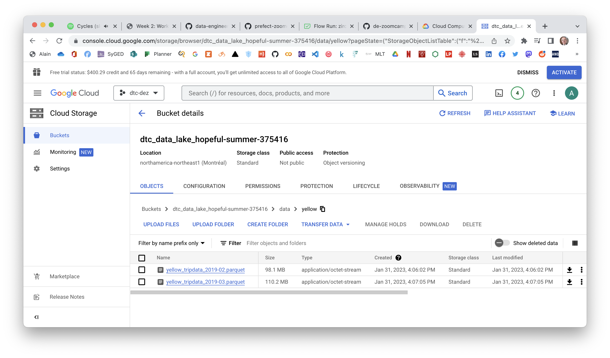

Then I modify `etl_gcs_to_bq.py` to pull the data from GCS and load it into BigQuery without performing any data
transformation.

- I add in the main flow of the instructions to display the number of lines of the processed files.
- I also set the stream decorator to save the print statement.
- Finally, I set up the entry point stream to accept a list of months, year, and taxi color.

**File `etl_gcs_to_bq_w2q3.py`**

``` python
from pathlib import Path
import pandas as pd
from prefect import flow, task
from prefect_gcp.cloud_storage import GcsBucket
from prefect_gcp import GcpCredentials


@task(retries=3)
def extract_from_gcs(color: str, year: int, month: int) -> Path:
    """Download trip data from GCS"""
    gcs_path = f"data/{color}/{color}_tripdata_{year}-{month:02}.parquet"
    gcs_block = GcsBucket.load("zoom-gcs")
    gcs_block.get_directory(from_path=gcs_path, local_path=f"../data/")
    return Path(f"../data/{gcs_path}")


@task()
def read_from_gcs(path: Path) -> pd.DataFrame:
    """Read file from GCS"""
    df = pd.read_parquet(path)
    return df


@task()
def write_bq(df: pd.DataFrame) -> None:
    """Write DataFrame to BiqQuery"""

    gcp_credentials_block = GcpCredentials.load("zoom-gcp-creds")

    df.to_gbq(
        destination_table="dezoomcamp.rides",
        project_id="hopeful-summer-375416",
        credentials=gcp_credentials_block.get_credentials_from_service_account(),
        chunksize=500_000,
        if_exists="append",
    )


@flow()
def etl_gcs_to_bq(year: int, month: int, color: str)-> int:
    """Main ETL flow to load data into Big Query"""
    path = extract_from_gcs(color, year, month)
    df = read_from_gcs(path)
    write_bq(df)
    return len(df)


@flow(log_prints=True)
def etl_parent_flow(
    months: list[int] = [2, 3], year: int = 2019, color: str = "yellow"
):
    for month in months:
        rows = etl_gcs_to_bq(year, month, color)
        print(f"year: {year}, month: {month}, rows: {rows}")


if __name__ == "__main__":
    color = "yellow"
    months = [2, 3]
    year = 2019
    etl_parent_flow(months, year, color)
```

Then I create a deployment for this flow and I start the agent.

``` bash
prefect deployment build flows/02_gcp/etl_gcs_to_bq_w2q3.py:etl_parent_flow -n etl-q3 -a
prefect agent start -q 'default'
```

We see this in the terminal window.

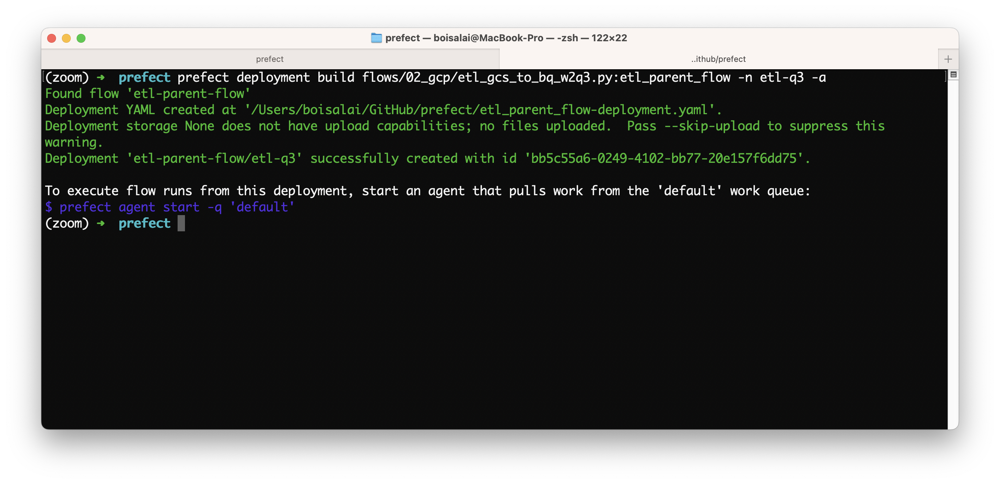

Then I go to Orion, select the deployment and click on **Quick start**.

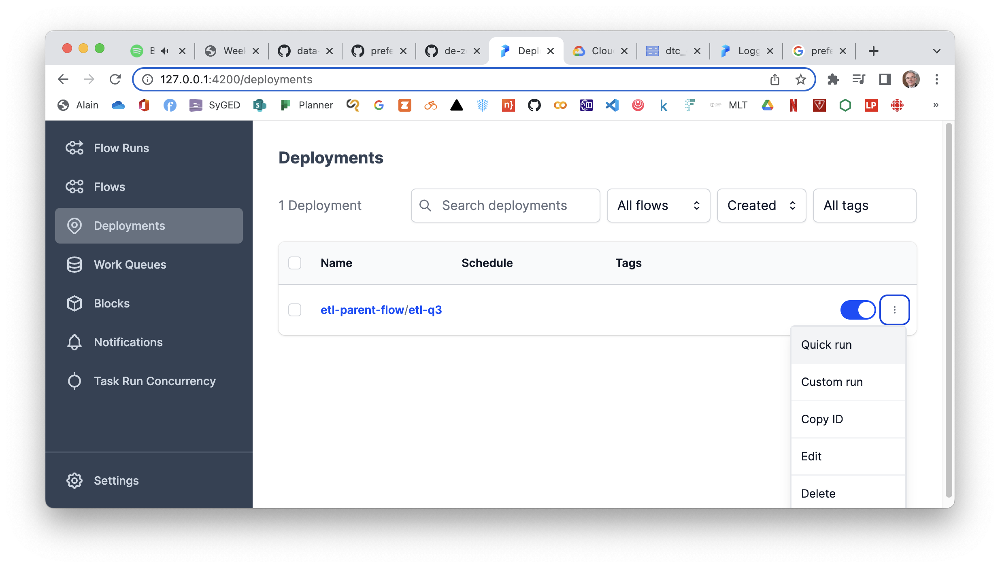

In the log of the main flow run, we can see the number of rows.

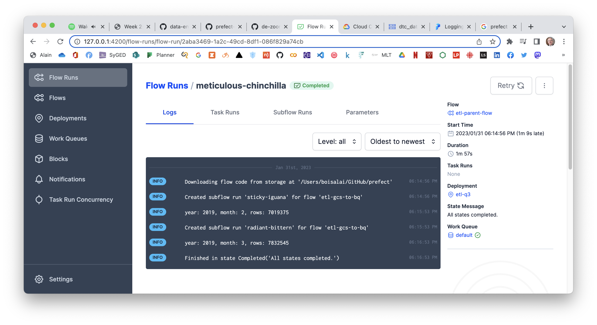

I see X,XXX,XXX for the February 2019 file and X,XXX,XXX for the March 2019 file. So that’s XX,XXX,XXX in total.

## Question 4. Github Storage Block

Using the `web_to_gcs` script from the videos as a guide, you want to store your flow code in a GitHub repository for
collaboration with your team. Prefect can look in the GitHub repo to find your flow code and read it. Create a GitHub
storage block from the UI or in Python code and use that in your Deployment instead of storing your flow code locally or
baking your flow code into a Docker image.

Note that you will have to push your code to GitHub, Prefect will not push it for you.

Run your deployment in a local subprocess (the default if you don’t specify an infrastructure). Use the Green taxi data
for the month of November 2020.

How many rows were processed by the script?

- 88,019
- 192,297
- 88,605
- 190,225

## Solution 4.

To answer this question, I did the following steps:

1. Modify `web_to_gcs.py` to use green taxi data for the month of November 2020.
2. Push the code to a GitHub repository.
3. Create a GitHub block (I might do this first).
4. Next, create and apply a deployment.

**Step 1**: Modify `web_to_gcs.py` to use the green taxi data for the month of November 2020.

**File `web_to_gcs.py`**

``` python
from pathlib import Path
import pandas as pd
from prefect import flow, task
from prefect_gcp.cloud_storage import GcsBucket
from random import randint

def convert_dtype(x):
    """Convert a column as string
    This code comes from
    https://www.roelpeters.be/solved-dtypewarning-columns-have-mixed-types-specify-dtype-option-on-import-or-set-low-memory-in-pandas/
    """
    if not x:
        return ''
    try:
        return x.astype(str)
    except:
        return ''

@task(retries=3)
def fetch(dataset_url: str) -> pd.DataFrame:
    """Read taxi data from web into pandas DataFrame"""
    # if randint(0, 1) > 0:
    #     raise Exception

    # See Data Dictionary
    # https://www.nyc.gov/assets/tlc/downloads/pdf/data_dictionary_trip_records_green.pdf
    # df = pd.read_csv(dataset_url, compression='gzip',
    #     converters={'store_and_fwd_flag': convert_dtype})
    df = pd.read_csv(dataset_url)

    print(df.info(verbose=True))
    return df


@task(log_prints=True)
def clean(df: pd.DataFrame) -> pd.DataFrame:
    """Fix dtype issues"""
    if "tpep_pickup_datetime" in df.columns:
        df["tpep_pickup_datetime"] = pd.to_datetime(df["tpep_pickup_datetime"])
        df["tpep_dropoff_datetime"] = pd.to_datetime(df["tpep_dropoff_datetime"])
    else:
        df["lpep_pickup_datetime"] = pd.to_datetime(df["lpep_pickup_datetime"])
        df["lpep_dropoff_datetime"] = pd.to_datetime(df["lpep_dropoff_datetime"])

    print(df.head(2))
    print(f"columns: {df.dtypes}")
    print(f"rows: {len(df)}")
    return df


@task()
def write_local(df: pd.DataFrame, color: str, dataset_file: str) -> Path:
    """Write DataFrame out locally as parquet file"""
    Path(f"data/{color}").mkdir(parents=True, exist_ok=True)
    path = Path(f"data/{color}/{dataset_file}.parquet")
    df.to_parquet(path, compression="gzip")
    return path


@task
def write_gcs(path: Path) -> None:
    """Upload local parquet file to GCS"""
    gcs_block = GcsBucket.load("zoom-gcs")
    gcs_block.upload_from_path(from_path=path, to_path=path)
    return


@flow()
def etl_web_to_gcs() -> None:
    """The main ETL function"""
    color = "green"
    year = 2020
    month = 11

    dataset_file = f"{color}_tripdata_{year}-{month:02}"
    dataset_url = f"https://github.com/DataTalksClub/nyc-tlc-data/releases/download/{color}/{dataset_file}.csv.gz"

    df = fetch(dataset_url)
    df_clean = clean(df)
    path = write_local(df_clean, color, dataset_file)
    write_gcs(path)


if __name__ == "__main__":
    etl_web_to_gcs()
```

**Step 2**: Push the flow code to a GitHub repo.

``` bash
git add .
git commit -m "commit $(date)"
git push -u origin main
# To github.com:boisalai/de-zoomcamp-2023.git
```

**Step 3**: Create a GitHub block inside Orion server.

In Orion server, I go to **Blocks** and add a **GitHub** block.

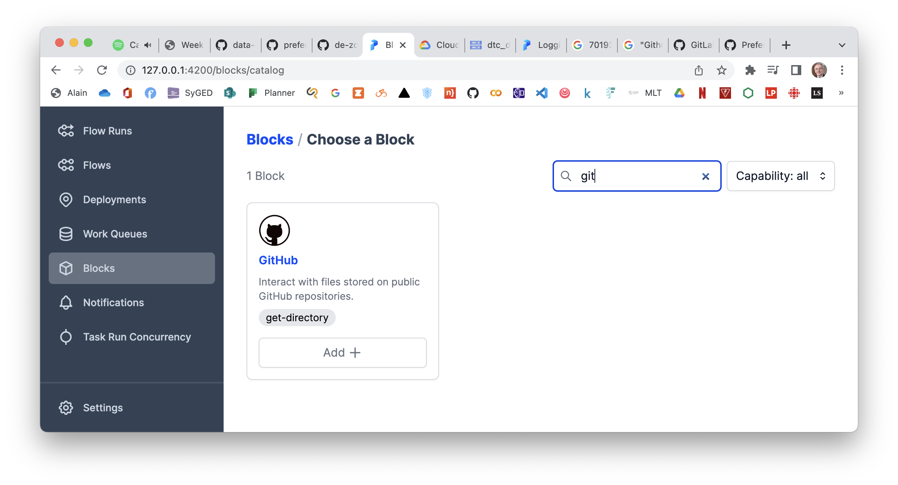

I enter the following parameters:

<table>
<tr><td>
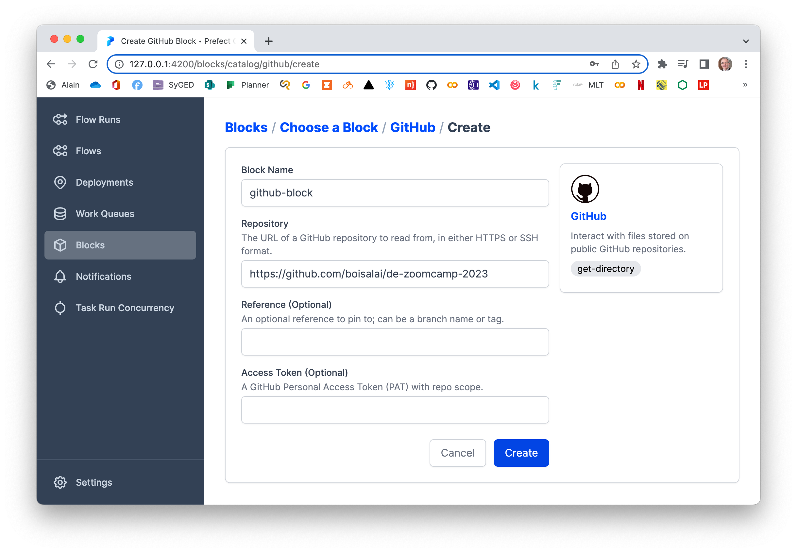
</td><td>
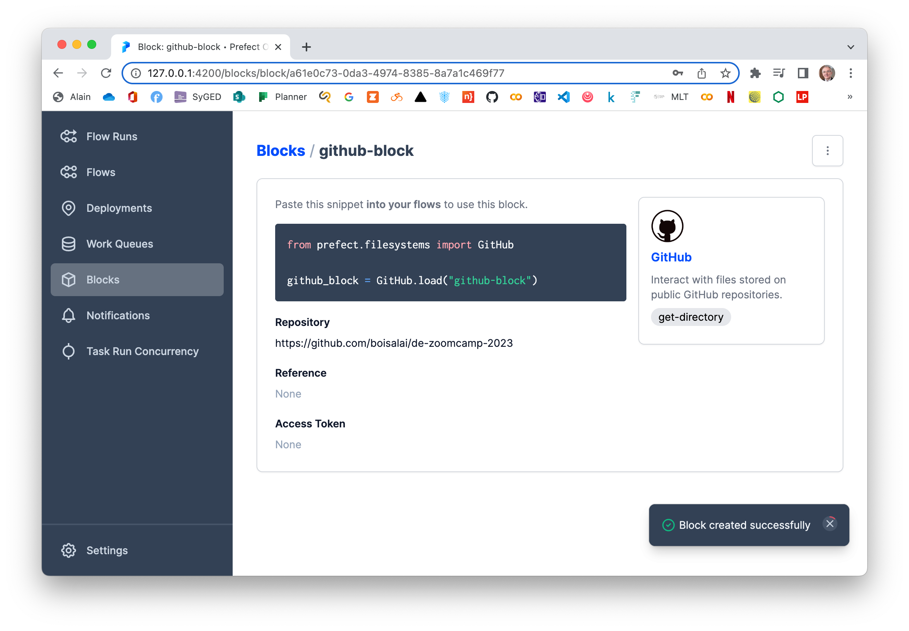
</td></tr>
</table>

**Step 4**: Then build and apply a deployment with this python script.

``` bash
prefect deployment build ./week_2/web_to_gcs.py:etl_web_to_gcs -n "GitHub Storage Flow" -sb github/github-block -o web_to_gcs_github-deployment.yaml --apply
prefect agent start -q 'default'
```

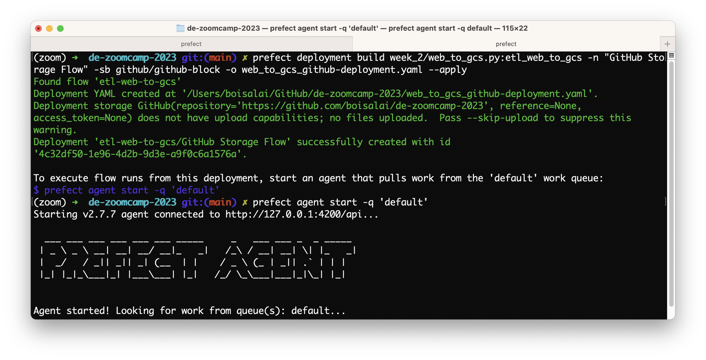

Next, I select my deployment et click on **Quick start** button.

<table>
<tr><td>
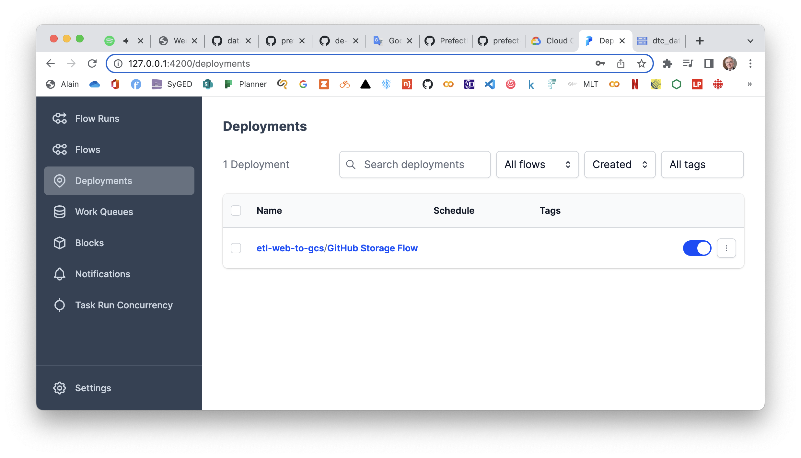
</td><td>
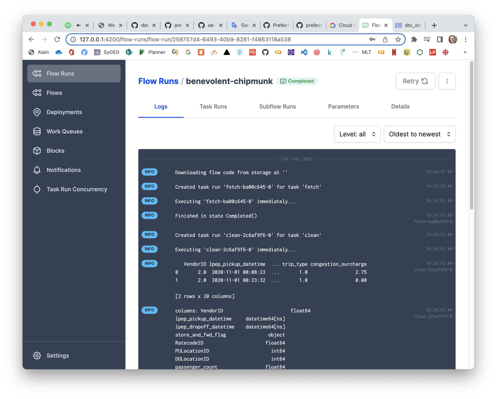
</td></tr>
</table>

Than answer is in the log.

**Log**

``` txt
(zoom) ➜  de-zoomcamp-2023 git:(main) ✗ prefect deployment build ./week_2/web_to_gcs.py:etl_web_to_gcs -n "GitHub Storage Flow" -sb github/github-block -o web_to_gcs_github-deployment.yaml --apply
Found flow 'etl-web-to-gcs'
Deployment YAML created at '/Users/boisalai/GitHub/de-zoomcamp-2023/web_to_gcs_github-deployment.yaml'.
Deployment storage GitHub(repository='https://github.com/boisalai/de-zoomcamp-2023', reference=None,
access_token=None) does not have upload capabilities; no files uploaded.  Pass --skip-upload to suppress this
warning.
Deployment 'etl-web-to-gcs/GitHub Storage Flow' successfully created with id
'f0185ac7-5936-4b62-8082-c312ce30a807'.

To execute flow runs from this deployment, start an agent that pulls work from the 'default' work queue:
$ prefect agent start -q 'default'
(zoom) ➜  de-zoomcamp-2023 git:(main) ✗ prefect agent start -q 'default'
Starting v2.7.7 agent connected to http://127.0.0.1:4200/api...

  ___ ___ ___ ___ ___ ___ _____     _   ___ ___ _  _ _____
 | _ \ _ \ __| __| __/ __|_   _|   /_\ / __| __| \| |_   _|
 |  _/   / _|| _|| _| (__  | |    / _ \ (_ | _|| .` | | |
 |_| |_|_\___|_| |___\___| |_|   /_/ \_\___|___|_|\_| |_|


Agent started! Looking for work from queue(s): default...
11:15:31.057 | INFO    | prefect.agent - Submitting flow run '60e95ba2-f90f-4705-a73d-28e91837d4e7'
11:15:31.128 | INFO    | prefect.infrastructure.process - Opening process 'lilac-cougar'...
11:15:31.151 | INFO    | prefect.agent - Completed submission of flow run '60e95ba2-f90f-4705-a73d-28e91837d4e7'
/Users/boisalai/miniconda3/envs/zoom/lib/python3.9/runpy.py:127: RuntimeWarning: 'prefect.engine' found in sys.modules after import of package 'prefect', but prior to execution of 'prefect.engine'; this may result in unpredictable behaviour
  warn(RuntimeWarning(msg))
11:15:32.795 | INFO    | Flow run 'lilac-cougar' - Downloading flow code from storage at ''
11:15:37.635 | INFO    | Flow run 'lilac-cougar' - Created task run 'fetch-ba00c645-0' for task 'fetch'
11:15:37.636 | INFO    | Flow run 'lilac-cougar' - Executing 'fetch-ba00c645-0' immediately...
week_2/web_to_gcs.py:29: DtypeWarning: Columns (3) have mixed types. Specify dtype option on import or set low_memory=False.
  df = pd.read_csv(dataset_url)
11:15:38.496 | INFO    | Task run 'fetch-ba00c645-0' - Finished in state Completed()
11:15:38.509 | INFO    | Flow run 'lilac-cougar' - Created task run 'clean-2c6af9f6-0' for task 'clean'
11:15:38.510 | INFO    | Flow run 'lilac-cougar' - Executing 'clean-2c6af9f6-0' immediately...
11:15:38.573 | INFO    | Task run 'clean-2c6af9f6-0' -    VendorID lpep_pickup_datetime  ... trip_type congestion_surcharge
0       2.0  2020-11-01 00:08:23  ...       1.0                 2.75
1       2.0  2020-11-01 00:23:32  ...       1.0                 0.00

[2 rows x 20 columns]
11:15:38.574 | INFO    | Task run 'clean-2c6af9f6-0' - columns: VendorID                        float64
lpep_pickup_datetime     datetime64[ns]
lpep_dropoff_datetime    datetime64[ns]
store_and_fwd_flag               object
RatecodeID                      float64
PULocationID                      int64
DOLocationID                      int64
passenger_count                 float64
trip_distance                   float64
fare_amount                     float64
extra                           float64
mta_tax                         float64
tip_amount                      float64
tolls_amount                    float64
ehail_fee                       float64
improvement_surcharge           float64
total_amount                    float64
payment_type                    float64
trip_type                       float64
congestion_surcharge            float64
dtype: object
11:15:38.575 | INFO    | Task run 'clean-2c6af9f6-0' - rows: 88605
11:15:38.575 | INFO    | Task run 'clean-2c6af9f6-0' - This code comes from my github repo...
11:15:38.588 | INFO    | Task run 'clean-2c6af9f6-0' - Finished in state Completed()
11:15:38.602 | INFO    | Flow run 'lilac-cougar' - Created task run 'write_local-09e9d2b8-0' for task 'write_local'
11:15:38.603 | INFO    | Flow run 'lilac-cougar' - Executing 'write_local-09e9d2b8-0' immediately...
11:15:38.819 | INFO    | Task run 'write_local-09e9d2b8-0' - Finished in state Completed()
11:15:38.833 | INFO    | Flow run 'lilac-cougar' - Created task run 'write_gcs-67f8f48e-0' for task 'write_gcs'
11:15:38.833 | INFO    | Flow run 'lilac-cougar' - Executing 'write_gcs-67f8f48e-0' immediately...
11:15:38.937 | INFO    | Task run 'write_gcs-67f8f48e-0' - Getting bucket 'dtc_data_lake_hopeful-summer-375416'.
11:15:39.372 | INFO    | Task run 'write_gcs-67f8f48e-0' - Uploading from PosixPath('data/green/green_tripdata_2020-11.parquet') to the bucket 'dtc_data_lake_hopeful-summer-375416' path 'data/green/green_tripdata_2020-11.parquet'.
11:15:39.911 | INFO    | Task run 'write_gcs-67f8f48e-0' - Finished in state Completed()
11:15:39.935 | INFO    | Flow run 'lilac-cougar' - Finished in state Completed('All states completed.')
<class 'pandas.core.frame.DataFrame'>
RangeIndex: 88605 entries, 0 to 88604
Data columns (total 20 columns):
 #   Column                 Non-Null Count  Dtype
---  ------                 --------------  -----
 0   VendorID               48491 non-null  float64
 1   lpep_pickup_datetime   88605 non-null  object
 2   lpep_dropoff_datetime  88605 non-null  object
 3   store_and_fwd_flag     48491 non-null  object
 4   RatecodeID             48491 non-null  float64
 5   PULocationID           88605 non-null  int64
 6   DOLocationID           88605 non-null  int64
 7   passenger_count        48491 non-null  float64
 8   trip_distance          88605 non-null  float64
 9   fare_amount            88605 non-null  float64
 10  extra                  88605 non-null  float64
 11  mta_tax                88605 non-null  float64
 12  tip_amount             88605 non-null  float64
 13  tolls_amount           88605 non-null  float64
 14  ehail_fee              0 non-null      float64
 15  improvement_surcharge  88605 non-null  float64
 16  total_amount           88605 non-null  float64
 17  payment_type           48491 non-null  float64
 18  trip_type              48491 non-null  float64
 19  congestion_surcharge   48491 non-null  float64
dtypes: float64(15), int64(2), object(3)
memory usage: 13.5+ MB
None
11:15:40.221 | INFO    | prefect.infrastructure.process - Process 'lilac-cougar' exited cleanly.
```


## Question 5. Email notifications

The hosted Prefect Cloud lets you avoid running your own server and has automations that allow you to get notifications
when certain events occur or don’t occur.

Create a free forever Prefect Cloud account at \[app.prefect.cloud\](<https://app.prefect.cloud/>) and connect your
workspace to it following the steps in the UI when you sign up.

Set up an Automation that will send yourself an email when a flow run succeeds. Run the deployment used in Q4 for the
Green taxi data for April 2019. Check your email to see a success notification.

How many rows were processed by the script?

- `125,268`
- `377,922`
- `728,390`
- `514,392` 

## Solution 5.

Prefect Cloud is a workflow coordination-as-a-service platform. Prefect Cloud provides all the capabilities of the
Prefect Orion Server and UI in a hosted environment, plus additional features such as automations, workspaces, and
organizations.

I created a Prefect Cloud account from there <https://www.prefect.io/pricing/> using the free **Personal** package.

I follow instruction from [Getting Started with Prefect Cloud](https://docs.prefect.io/ui/cloud-getting-started/)

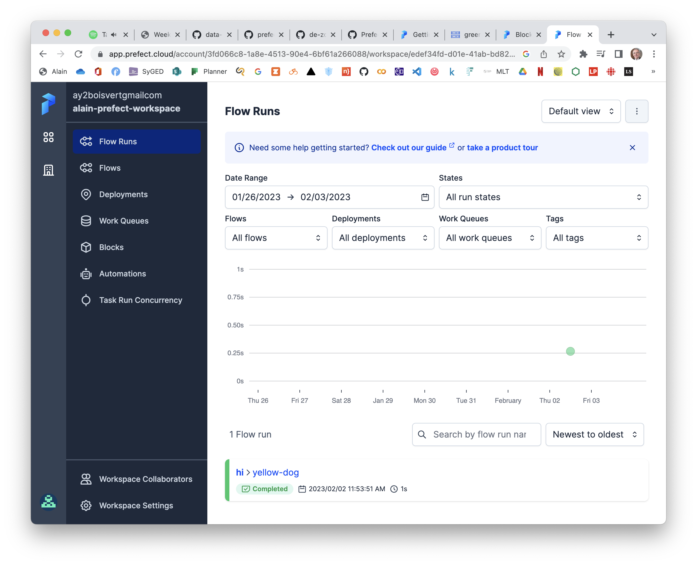

Now, I start Prefect Orion on my local computer.

``` bash
cd ~/github/flows
conda activate zoom
prefect orion start
```

Next, I run this CLI command to switch to my prefect cloud workspace.

``` bash
prefect cloud workspace set --workspace "ay2boisvertgmailcom/alain-prefect-workspace"
```

This message appears in my terminal window:  
`Successfully set workspace to 'ay2boisvertgmailcom/alain-prefect-workspace' in profile 'default'`.

To view blocks in Prefect Cloud, I run the following command:

``` bash
prefect block register -m prefect_gcp
pip install prefect-github
prefect block register -m prefect_github
```

Then I modified the `q5_web_to_gcs.py` script by adding a tag to the `write_gcs` function, a `my-etl` name to the main
flow and indicating to read the April 2019 file.


**File `q5_web_to_gcs.py`**


``` python
@task(tags=["write"])
def write_gcs(path: Path) -> None:
    """Upload local parquet file to GCS"""
    gcs_block = GcsBucket.load("zoom-gcs")
    gcs_block.upload_from_path(from_path=path, to_path=path)
    return


@flow(name="my-etl")
def etl_web_to_gcs() -> None:
    """The main ETL function"""
    color = "green"
    year = 2019
    month = 4

    dataset_file = f"{color}_tripdata_{year}-{month:02}"
    dataset_url = f"https://github.com/DataTalksClub/nyc-tlc-data/releases/download/{color}/{dataset_file}.csv.gz"

    df = fetch(dataset_url)
    df_clean = clean(df)
    path = write_local(df_clean, color, dataset_file)
    write_gcs(path)
```

Then I run the following commands:

``` bash
cd ~/github/de-zoomcamp-2023

git add .
git commit -m "commit $(date)"
git push -u origin main
# To github.com:boisalai/de-zoomcamp-2023.git

prefect deployment build week_2/q5_web_to_gcs.py:etl_web_to_gcs -n "GitHub Storage Flow" -sb github/github-block -o web_to_gcs_github-deployment.yaml --apply
```

Unfortunately, it doesn’t work.

I get an error message...​ I’ll have to look at this later

## Question 6. Secrets

Prefect Secret blocks provide secure, encrypted storage in the database and obfuscation in the UI. Create a secret block
in the UI that stores a fake 10-digit password to connect to a third-party service. Once you’ve created your block in
the UI, how many characters are shown as asterisks on the next page of the UI (\*).

- 5
- 6
- 8
- 10

## Solution to question 6


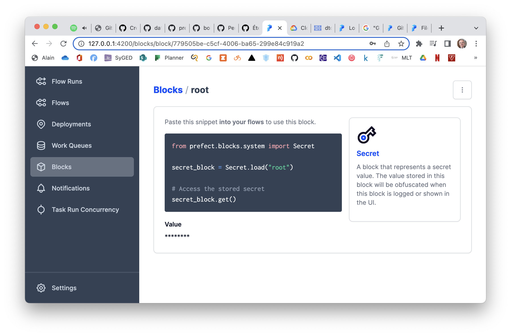


