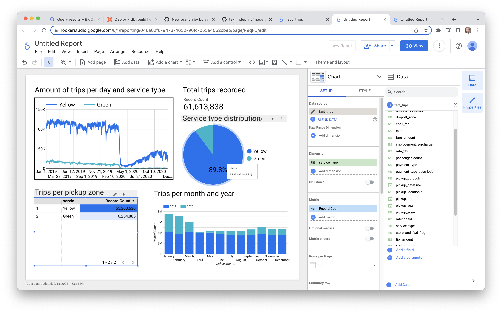
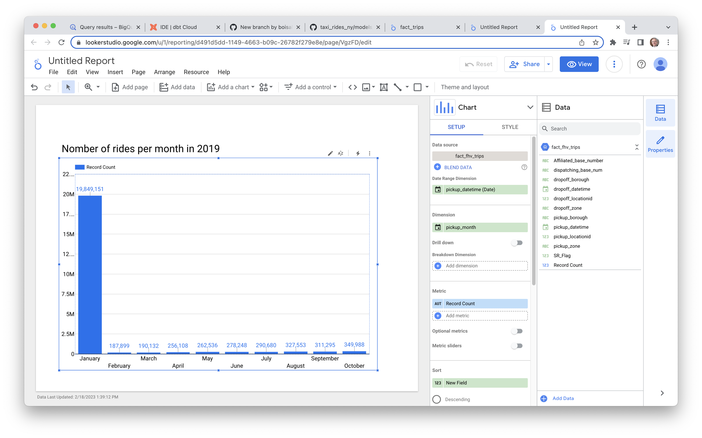

# Week 4 Homework

In this homework, we'll use the models developed during the week 4 videos and enhance the already presented dbt project using the already
loaded Taxi data for fhv vehicles for year 2019 in our DWH.

We will use the data loaded for:

- Building a source table: `stg_fhv_tripdata`
- Building a fact table: `fact_fhv_trips`
- Create a dashboard

**Note**: if your answer doesn't match exactly, select the closest option

## Question 1

**What is the count of records in the model `fact_trips` after running all models with the test run variable disabled and filtering for 2019 and 2020 data only (pickup datetime)**

You'll need to have completed the "Build the first dbt models" video and have been able to run the models via the CLI. 
You should find the views and models for querying in your DWH.

- 41648442
- 51648442
- 61648442
- 71648442

### Solution 1

In dbt cloud, I run this.

```bash
dbt build --var 'is_test_run: false'
```

In BigQuery, I run this.

```sql
SELECT COUNT(*) FROM `hopeful-summer-375416.dbt_aboisvert.fact_trips`;
-- 61,615,515

SELECT service_type,COUNT(*) FROM `hopeful-summer-375416.dbt_aboisvert.fact_trips`
GROUP BY service_type;
-- Green    6,254,885
-- Yellow  55,360,630
```

But, Looker shows 61,613,838 trips recorded. This is very strange.



We see that the figures of the table are correct but not those of the pie chart nor those of the scorecard.
There must be a bug in looker.

## Question 2

**What is the distribution between service type filtering by years 2019 and 2020 data as done in the videos**

You will need to complete "Visualising the data" videos, either using data studio or metabase.

- 89.9/10.1
- 94/6
- 76.3/23.7
- 99.1/0.9

### Solution 2

See image of solution 1.

## Question 3

**What is the count of records in the model `stg_fhv_tripdata` after running all models with the test run variable disabled (:false)**  

Create a staging model for the fhv data for 2019 and do not add a deduplication step. Run it via the CLI without limits (is_test_run: false).
Filter records with pickup time in year 2019.

- 33244696
- 43244696
- 53244696
- 63244696

### Solution 3

Below the `models/staging/stg_fhv_tripdata.sql` and `models/core/fact_fhv_trips.sql` files.

File `models/staging/stg_fhv_tripdata.sql`

```sql
{{ config(materialized='view') }}

select
    -- identifiers
	dispatching_base_num,
    cast(pickup_datetime as timestamp) as pickup_datetime,
    cast(dropoff_datetime as timestamp) as dropoff_datetime,
    cast(pulocationid as integer) as  pickup_locationid,
    cast(dolocationid as integer) as dropoff_locationid,
    SR_Flag, 
    Affiliated_base_number
from {{ source('staging','fhv_tripdata') }}

-- dbt build --m <model.sql> --var 'is_test_run: false'


  limit 100


```

File `models/core/fact_fhv_trips.sql`

```sql
{{ config(materialized='table') }}

with dim_zones as (
    select * from {{ ref('dim_zones') }}
    where borough != 'Unknown'
)

select 
    fhv_data.dispatching_base_num,
    fhv_data.pickup_datetime,
    fhv_data.dropoff_datetime,
    fhv_data.pickup_locationid,
    -- pickup_zone.borough as pickup_borough, 
    -- pickup_zone.zone as pickup_zone, 
    fhv_data.dropoff_locationid,
    -- dropoff_zone.borough as dropoff_borough, 
    -- dropoff_zone.zone as dropoff_zone,  
    fhv_data.SR_Flag,
    fhv_data.Affiliated_base_number 
from {{ ref('stg_fhv_tripdata') }} as fhv_data

-- inner join dim_zones as pickup_zone
-- on fhv_data.pickup_locationid = pickup_zone.locationid
-- inner join dim_zones as dropoff_zone
-- on fhv_data.dropoff_locationid = dropoff_zone.locationid
```

I run this command.

```bash
dbt build --var 'is_test_run: false'
```

Below the logs for `fact_fhv_trips` model.

```txt
18:06:36  Began running node model.taxi_rides_ny.fact_fhv_trips
18:06:36  16 of 19 START sql table model dbt_aboisvert.fact_fhv_trips .................... [RUN]
18:06:36  Acquiring new bigquery connection 'model.taxi_rides_ny.fact_fhv_trips'
18:06:36  Began compiling node model.taxi_rides_ny.fact_fhv_trips
18:06:36  Writing injected SQL for node "model.taxi_rides_ny.fact_fhv_trips"
18:06:36  Timing info for model.taxi_rides_ny.fact_fhv_trips (compile): 2023-02-18 18:06:36.687033 => 2023-02-18 18:06:36.705419
18:06:36  Began executing node model.taxi_rides_ny.fact_fhv_trips
18:06:36  Opening a new connection, currently in state closed
18:06:36  Writing runtime sql for node "model.taxi_rides_ny.fact_fhv_trips"
18:06:36  On model.taxi_rides_ny.fact_fhv_trips: /* {"app": "dbt", "dbt_version": "1.4.1", "profile_name": "user", "target_name": "default", "node_id": "model.taxi_rides_ny.fact_fhv_trips"} */

    create or replace table `hopeful-summer-375416`.`dbt_aboisvert`.`fact_fhv_trips`
    
    OPTIONS()
    as (
      
with dim_zones as (
    select * from `hopeful-summer-375416`.`dbt_aboisvert`.`dim_zones`
    where borough != 'Unknown'
)

select 
    fhv_data.dispatching_base_num,
    fhv_data.pickup_datetime,
    fhv_data.dropoff_datetime,
    fhv_data.pickup_locationid,
    -- pickup_zone.borough as pickup_borough, 
    -- pickup_zone.zone as pickup_zone, 
    fhv_data.dropoff_locationid,
    -- dropoff_zone.borough as dropoff_borough, 
    -- dropoff_zone.zone as dropoff_zone,  
    fhv_data.SR_Flag,
    fhv_data.Affiliated_base_number 
from `hopeful-summer-375416`.`dbt_aboisvert`.`stg_fhv_tripdata` as fhv_data

-- inner join dim_zones as pickup_zone
-- on fhv_data.pickup_locationid = pickup_zone.locationid
-- inner join dim_zones as dropoff_zone
-- on fhv_data.dropoff_locationid = dropoff_zone.locationid
    );
  
18:06:41  BigQuery adapter: https://console.cloud.google.com/bigquery?project=hopeful-summer-375416&j=bq:northamerica-northeast1:8d6eca11-0235-4421-8301-a012d1066576&page=queryresults
18:06:41  Timing info for model.taxi_rides_ny.fact_fhv_trips (execute): 2023-02-18 18:06:36.705917 => 2023-02-18 18:06:41.995682
18:06:41  Sending event: {'category': 'dbt', 'action': 'run_model', 'label': 'a69cbdaf-935b-4abd-861a-d7ac7c0776ae', 'context': [<snowplow_tracker.self_describing_json.SelfDescribingJson object at 0x7f24fc4c2f70>]}
18:06:41  16 of 19 OK created sql table model dbt_aboisvert.fact_fhv_trips ............... [CREATE TABLE (43.2m rows, 1.9 GB processed) in 5.31s]
18:06:41  Finished running node model.taxi_rides_ny.fact_fhv_trips
```

In BigQuery, I run these queries.

```sql
SELECT date_trunc(pickup_datetime, YEAR), count(*) as records
FROM `hopeful-summer-375416.trips_data_all.fhv_tripdata` 
GROUP BY 1
ORDER BY 1 DESC;
-- 2019-01-01 00:00:00 UTC: 43,244,696

SELECT date_trunc(pickup_datetime, YEAR), count(*) as records
FROM `hopeful-summer-375416.dbt_aboisvert.fact_fhv_trips` 
GROUP BY 1
ORDER BY 1 DESC;
-- 2019-01-01 00:00:00 UTC: 43,244,696
```

## Question 4

**What is the count of records in the model `fact_fhv_trips` after running all dependencies with the test run variable disabled (:false)**  

Create a core model for the `stg_fhv_tripdata` joining with `dim_zones`.
Similar to what we've done in `fact_trips`, keep only records with known pickup and dropoff locations entries for pickup and dropoff locations. 
Run it via the CLI without limits (is_test_run: false) and filter records with pickup time in year 2019.

- 12998722
- 22998722 
- 32998722
- 42998722

### Solution 4

Below the `models/core/fact_fhv_trips.sql` file.

```sql
{{ config(materialized='table') }}

with dim_zones as (
    select * from {{ ref('dim_zones') }}
    where borough != 'Unknown'
)

select 
    fhv_data.dispatching_base_num,
    fhv_data.pickup_datetime,
    fhv_data.dropoff_datetime,
    fhv_data.pickup_locationid,
    pickup_zone.borough as pickup_borough, 
    pickup_zone.zone as pickup_zone, 
    fhv_data.dropoff_locationid,
    dropoff_zone.borough as dropoff_borough, 
    dropoff_zone.zone as dropoff_zone,  
    fhv_data.SR_Flag,
    fhv_data.Affiliated_base_number 
from {{ ref('stg_fhv_tripdata') }} as fhv_data

inner join dim_zones as pickup_zone
on fhv_data.pickup_locationid = pickup_zone.locationid
inner join dim_zones as dropoff_zone
on fhv_data.dropoff_locationid = dropoff_zone.locationid
```

I run this command.

```bash
dbt build --var 'is_test_run: false'
```

In BigQuery, I run this query.

```sql
SELECT date_trunc(pickup_datetime, YEAR), count(*) as records
FROM `hopeful-summer-375416.dbt_aboisvert.fact_fhv_trips` 
GROUP BY 1
ORDER BY 1 DESC;
-- 2019-01-01 00:00:00 UTC: 22,998,722
```

## Question 5

**What is the month with the biggest amount of rides after building a tile for the `fact_fhv_trips` table**

Create a dashboard with some tiles that you find interesting to explore the data. One tile should show the
amount of trips per month, as done in the videos for `fact_trips`, based on the `fact_fhv_trips` table.

- March
- April
- January
- December

### Solution 5

The solution is in the image below.


