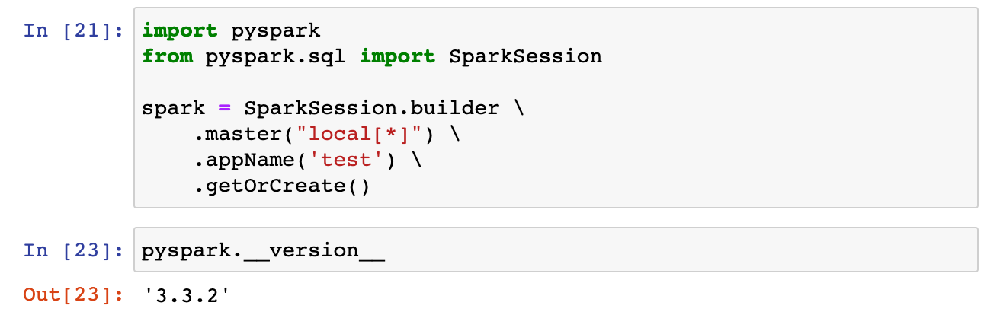
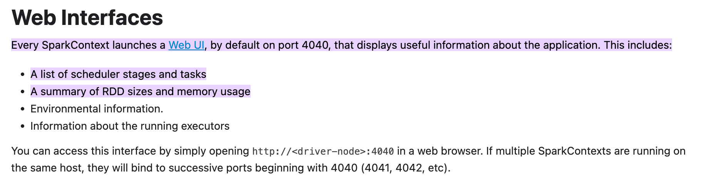

# Week 5 Homework

In this homework we’ll put what we learned about Spark in practice.

For this homework we will be using the FHVHV 2021-06 data found here.<br>
[FHVHV Data](https://github.com/DataTalksClub/nyc-tlc-data/releases/download/fhvhv/fhvhv_tripdata_2021-06.csv.gz).

## Question 1

**Install Spark and PySpark**

- Install Spark
- Run PySpark
- Create a local spark session
- Execute spark.version.

What’s the output?

- 3.3.2
- 2.1.4
- 1.2.3
- 5.4

### Solution 1

See my notes explaining in detail how I installed Spark and PySpark
[here](https://github.com/boisalai/de-zoomcamp-2023/blob/main/week5.md#install-apache-spark).



## Question 2

**HVFHW June 2021**

Read it with Spark using the same schema as we did in the lessons.<br>
We will use this dataset for all the remaining questions.<br>  
Repartition it to 12 partitions and save it to parquet.<br>  
What is the average size of the Parquet (ending with `.parquet extension`) Files that were created (in MB)?

Select the answer which most closely matches.

- 2 MB
- 24 MB
- 100 MB
- 250 MB

### Solution 2

``` python
!wget https://github.com/DataTalksClub/nyc-tlc-data/releases/download/fhvhv/fhvhv_tripdata_2021-06.csv.gz

%%sh
gzip -d fhvhv_tripdata_2021-06.csv.gz
!ls -lh fhvhv_tripdata_2021-06.csv
# -rw-rw-r-- 1 boisalai boisalai 878M Dec 20 00:13 fhvhv_tripdata_2021-06.csv

schema = types.StructType([
    types.StructField('dispatching_base_num', types.StringType(), True),
    types.StructField('pickup_datetime', types.TimestampType(), True),
    types.StructField('dropoff_datetime', types.TimestampType(), True),
    types.StructField('PULocationID', types.IntegerType(), True),
    types.StructField('DOLocationID', types.IntegerType(), True),
    types.StructField('SR_Flag', types.StringType(), True),
    types.StructField('Affiliated_base_number', types.StringType(), True),
])

df = spark.read \
    .option("header", "true") \
    .schema(schema) \
    .csv('fhvhv_tripdata_2021-06.csv')

df.printSchema()
# root
#  |-- dispatching_base_num: string (nullable = true)
#  |-- pickup_datetime: timestamp (nullable = true)
#  |-- dropoff_datetime: timestamp (nullable = true)
#  |-- PULocationID: integer (nullable = true)
#  |-- DOLocationID: integer (nullable = true)
#  |-- SR_Flag: string (nullable = true)
#  |-- Affiliated_base_number: string (nullable = true)

!head -n 11 fhvhv_tripdata_2021-06.csv > head.csv
!cat head.csv
# dispatching_base_num,pickup_datetime,dropoff_datetime,PULocationID,DOLocationID,SR_Flag,Affiliated_base_number
# B02764,2021-06-01 00:02:41,2021-06-01 00:07:46,174,18,N,B02764
# B02764,2021-06-01 00:16:16,2021-06-01 00:21:14,32,254,N,B02764
# B02764,2021-06-01 00:27:01,2021-06-01 00:42:11,240,127,N,B02764
# B02764,2021-06-01 00:46:08,2021-06-01 00:53:45,127,235,N,B02764
# B02510,2021-06-01 00:45:42,2021-06-01 01:03:33,144,146,N,
# B02510,2021-06-01 00:18:15,2021-06-01 00:25:47,49,17,N,
# B02510,2021-06-01 00:33:06,2021-06-01 00:42:46,49,225,N,
# B02510,2021-06-01 00:46:27,2021-06-01 00:56:50,225,177,N,
# B02764,2021-06-01 00:48:06,2021-06-01 01:04:10,209,45,N,B02764
# B02875,2021-06-01 00:18:54,2021-06-01 00:26:14,80,256,N,B02875

df = df.repartition(12)
df.write.parquet('data/pq/fhvhv/2021/06/')

!ls -lh data/pq/fhvhv/2021/06/
# total 271M
# -rw-r--r-- 1 boisalai boisalai   0 Feb 23 01:22 _SUCCESS
# -rw-r--r-- 1 boisalai boisalai 23M Feb 23 01:22 part-00000-1128dd63-5842-4e4a-9c0e-8861d8c630c5-c000.snappy.parquet
# -rw-r--r-- 1 boisalai boisalai 23M Feb 23 01:22 part-00001-1128dd63-5842-4e4a-9c0e-8861d8c630c5-c000.snappy.parquet
# -rw-r--r-- 1 boisalai boisalai 23M Feb 23 01:22 part-00002-1128dd63-5842-4e4a-9c0e-8861d8c630c5-c000.snappy.parquet
# -rw-r--r-- 1 boisalai boisalai 23M Feb 23 01:22 part-00003-1128dd63-5842-4e4a-9c0e-8861d8c630c5-c000.snappy.parquet
# -rw-r--r-- 1 boisalai boisalai 23M Feb 23 01:22 part-00004-1128dd63-5842-4e4a-9c0e-8861d8c630c5-c000.snappy.parquet
# -rw-r--r-- 1 boisalai boisalai 23M Feb 23 01:22 part-00005-1128dd63-5842-4e4a-9c0e-8861d8c630c5-c000.snappy.parquet
# -rw-r--r-- 1 boisalai boisalai 23M Feb 23 01:22 part-00006-1128dd63-5842-4e4a-9c0e-8861d8c630c5-c000.snappy.parquet
# -rw-r--r-- 1 boisalai boisalai 23M Feb 23 01:22 part-00007-1128dd63-5842-4e4a-9c0e-8861d8c630c5-c000.snappy.parquet
# -rw-r--r-- 1 boisalai boisalai 23M Feb 23 01:22 part-00008-1128dd63-5842-4e4a-9c0e-8861d8c630c5-c000.snappy.parquet
# -rw-r--r-- 1 boisalai boisalai 23M Feb 23 01:22 part-00009-1128dd63-5842-4e4a-9c0e-8861d8c630c5-c000.snappy.parquet
# -rw-r--r-- 1 boisalai boisalai 23M Feb 23 01:22 part-00010-1128dd63-5842-4e4a-9c0e-8861d8c630c5-c000.snappy.parquet
# -rw-r--r-- 1 boisalai boisalai 23M Feb 23 01:22 part-00011-1128dd63-5842-4e4a-9c0e-8861d8c630c5-c000.snappy.parquet
```

## Question 3

**Count records**

How many taxi trips were there on June 15? <br> 
Consider only trips that started on June 15.

- 308,164
- 12,856
- 452,470
- 50,982

### Solution 3

``` python
df = spark.read.parquet('data/pq/fhvhv/2021/06/')

from pyspark.sql import functions as F

df.withColumn('pickup_date', F.to_date(df.pickup_datetime)) \
    .filter("pickup_date = '2021-06-15'") \
    .count()
# 452,470

df.createOrReplaceTempView('fhvhv_2021_06')
spark.sql("""
SELECT
    COUNT(1)
FROM
    fhvhv_2021_06
WHERE
    to_date(pickup_datetime) = '2021-06-15';
""").show()
# +--------+
# |count(1)|
# +--------+
# |  452470|
# +--------+
```

## Question 4

**Longest trip for each day**

Now calculate the duration for each trip. <br> 
How long was the longest trip in Hours?

- 66.87 Hours
- 243.44 Hours
- 7.68 Hours
- 3.32 Hours

### Solution 4

``` python
df.columns
# ['dispatching_base_num',
#  'pickup_datetime',
#  'dropoff_datetime',
#  'PULocationID',
#  'DOLocationID',
#  'SR_Flag',
#  'Affiliated_base_number']

df.withColumn('duration', (df.dropoff_datetime.cast('long') - df.pickup_datetime.cast('long'))/60/60) \
    .withColumn('pickup_date', F.to_date(df.pickup_datetime)) \
    .groupBy('pickup_date') \
        .max('duration') \
    .orderBy('max(duration)', ascending=False) \
    .limit(5) \
    .show()
# +-----------+------------------+
# |pickup_date|     max(duration)|
# +-----------+------------------+
# | 2021-06-25| 66.87888888888888|
# | 2021-06-22|25.549722222222222|
# | 2021-06-27|19.980833333333333|
# | 2021-06-26| 18.19722222222222|
# | 2021-06-23|16.466944444444444|
# +-----------+------------------+

spark.sql("""
SELECT
    to_date(pickup_datetime) AS pickup_date,
    MAX((CAST(dropoff_datetime AS LONG) - CAST(pickup_datetime AS LONG)) / 60 / 60) AS duration
FROM
    fhvhv_2021_06
GROUP BY
    1
ORDER BY
    2 DESC
LIMIT 10;
""").show()
# +-----------+------------------+
# |pickup_date|          duration|
# +-----------+------------------+
# | 2021-06-25| 66.87888888888888|
# | 2021-06-22|25.549722222222222|
# | 2021-06-27|19.980833333333333|
# | 2021-06-26| 18.19722222222222|
# | 2021-06-23|16.466944444444444|
# +-----------+------------------+
```

## Question 5

**User Interface**

Spark’s User Interface which shows application’s dashboard runs on which local port?

- 80
- 443
- 4040
- 8080

### Solution 5



See <https://spark.apache.org/docs/latest/monitoring.html>

## Question 6

**Most frequent pickup location zone**

Load the zone lookup data into a temp view in Spark  
[Zone Data](https://github.com/DataTalksClub/nyc-tlc-data/releases/download/misc/taxi_zone_lookup.csv).

Using the zone lookup data and the fhvhv June 2021 data, what is the name of the most frequent pickup location
zone?

- East Chelsea
- Astoria
- Union Sq
- Crown Heights North

### Solution 6

``` python
df_zones = spark.read.parquet('zones')
df_zones.columns
# ['LocationID', 'Borough', 'Zone', 'service_zone']

df.columns
# ['dispatching_base_num',
#  'pickup_datetime',
#  'dropoff_datetime',
#  'PULocationID',
#  'DOLocationID',
#  'SR_Flag',
#  'Affiliated_base_number']

df_zones.createOrReplaceTempView("zones")
spark.sql("""
SELECT zones.Zone, COUNT(1)
FROM
    fhvhv_2021_06 fhv
    LEFT JOIN zones ON fhv.PULocationID = zones.LocationID
GROUP BY 1
ORDER BY 2 DESC
LIMIT 5;
""").show()
# +-------------------+--------+
# |               Zone|count(1)|
# +-------------------+--------+
# |Crown Heights North|  231279|
# |       East Village|  221244|
# |        JFK Airport|  188867|
# |     Bushwick South|  187929|
# |      East New York|  186780|
# +-------------------+--------+
```

