# Creating a Simple GitHub Pull Request

I want to add a link in a page from the DataTalksClub’s Data Engineering Zoomcamp GitHub repository.

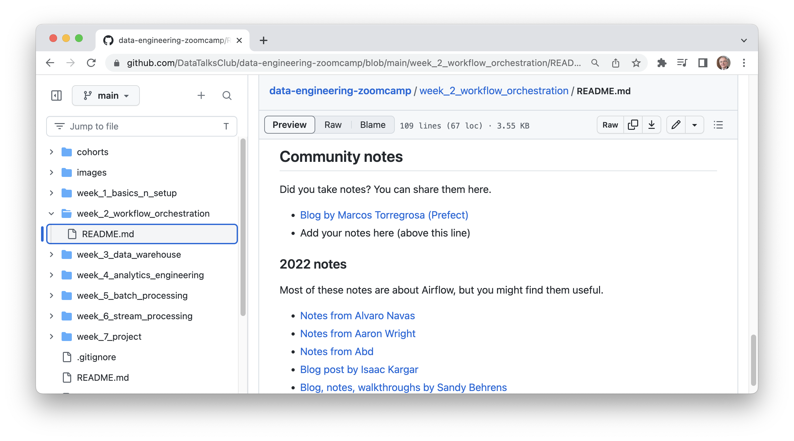

The link I want to add is **Notes by Alain Boisvert** pointing to this URL:
<https://github.com/boisalai/de-zoomcamp-2023/blob/main/week2.md>.

To do this, I will use **pull requests**.
Pull requests let you tell others about changes you’ve pushed to a branch in a repository on GitHub.

Before starting, I recommend you to watch this excellent video on Youtube: [Creating a Simple Github Pull
Request](https://www.youtube.com/watch?v=rgbCcBNZcdQ) from Jake Vanderplas. And take the opportunity to give it a star!
:star:

Then, to create a pull request, I will do the following steps:

1. Fork the GitHub repository
2. Clone this forked repo
3. Create a new branch
4. Modify the README.md file
5. Commit and push
6. Compare and pull request

## 1. Fork the GitHub repository

Go to the GitHub repository <https://github.com/DataTalksClub/data-engineering-zoomcamp> and click on the **Fork**
button at the top right.

A **fork** is a copy of a repository. Forking a repository allows me to change the README page without affecting the
original project.

Click on the green **Create fork** button at the bottom.

|                                  |                                  |
|----------------------------------|----------------------------------|
| 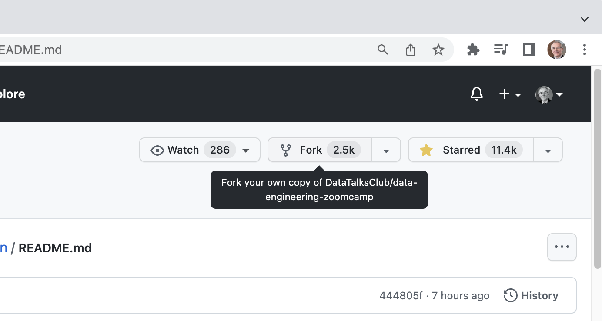 | 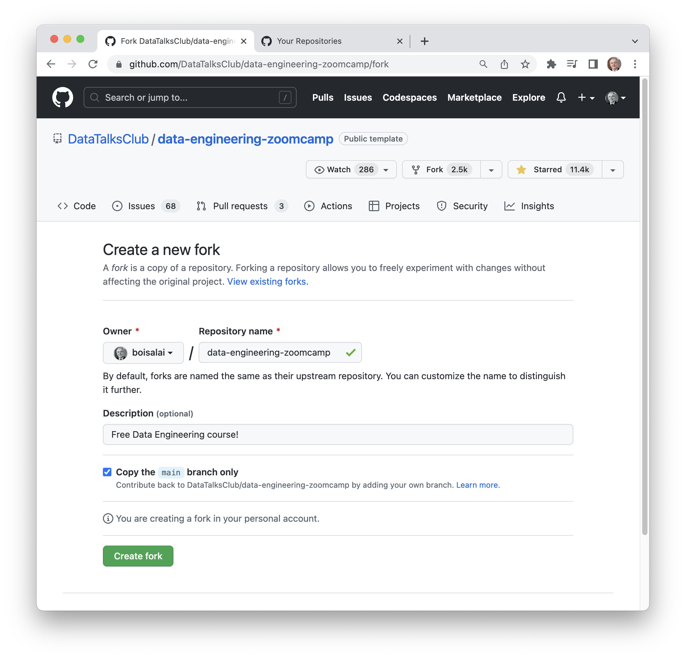 |

A fork is created in my personal GitHub account. We see at the top left, it is indicated "forked from
[DataTalksClub/data-engineering-zoomcamp](https://github.com/DataTalksClub/data-engineering-zoomcamp)".

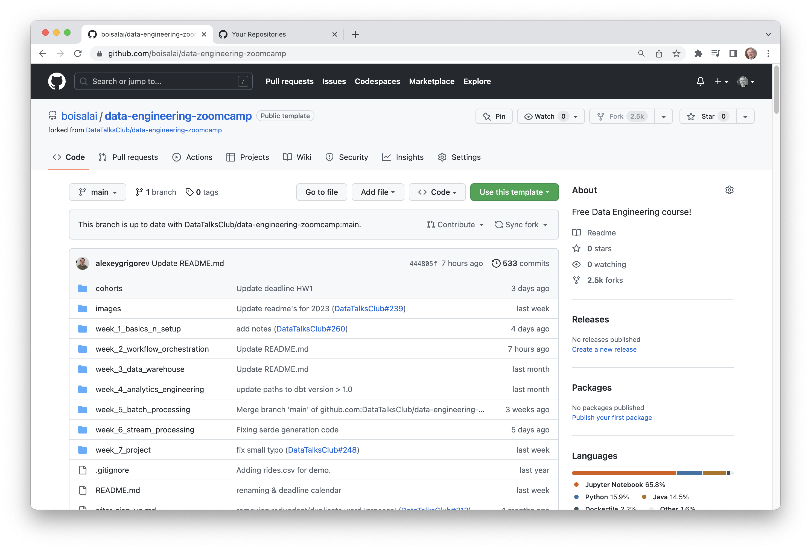

## 2. Clone this forked repo

Now, clone this forked repo to my computer.

To do this, click on the **\<\> Code** button and copy the right link.

In my case, I have already installed the ssh keys to interact with GitHub so I will take the corresponding link to
**SSH**.

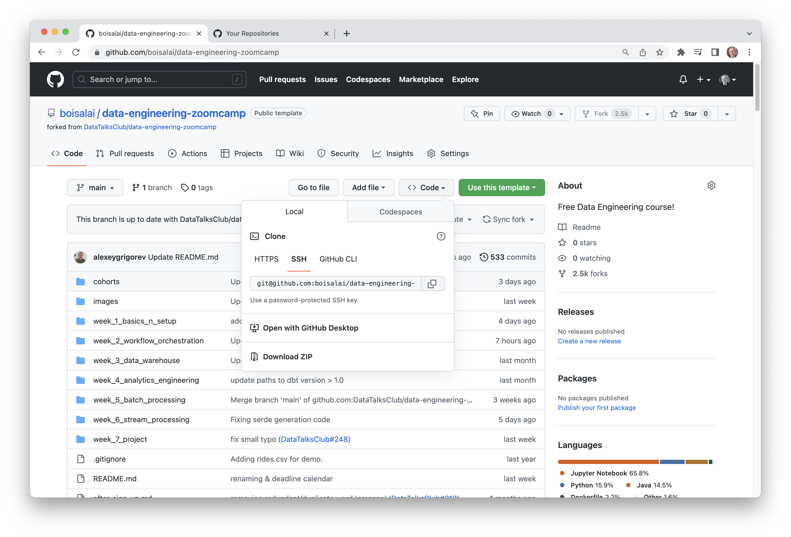

In a terminal window, run the following command.

``` bash
git clone git@github.com:boisalai/data-engineering-zoomcamp.git
```

We should see this in the terminal window.

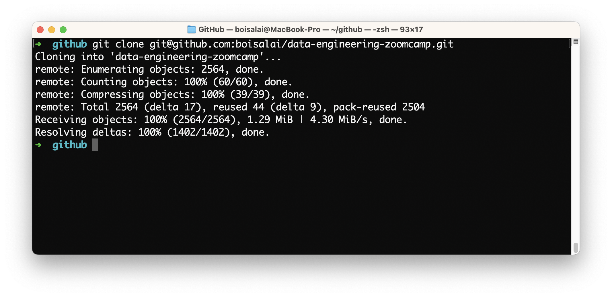

## 3. Create a new branch

Now, we need to create a new branch. I propose to call this new branch **add-link-to-week2**.

To create the new branch, just run this command.

``` bash
cd data-engineering-zoomcap
git checkout -b add-link-to-week2
```

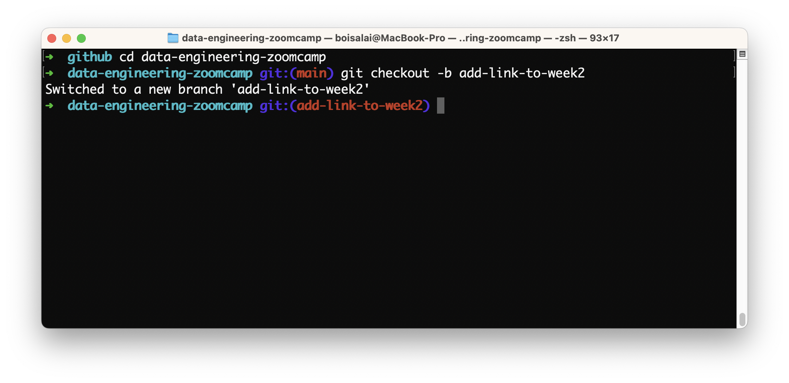

## 4. Modify the README.md file by adding a link to it

In VS Code, add the link to the README.md file like this.

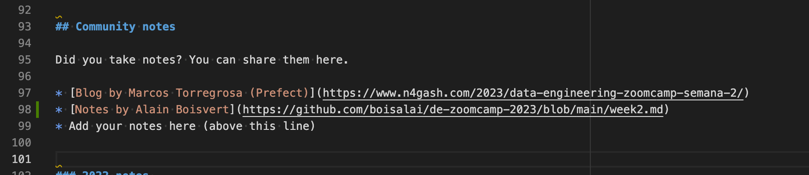

The `git diff` command helps us to see what changes have been made.

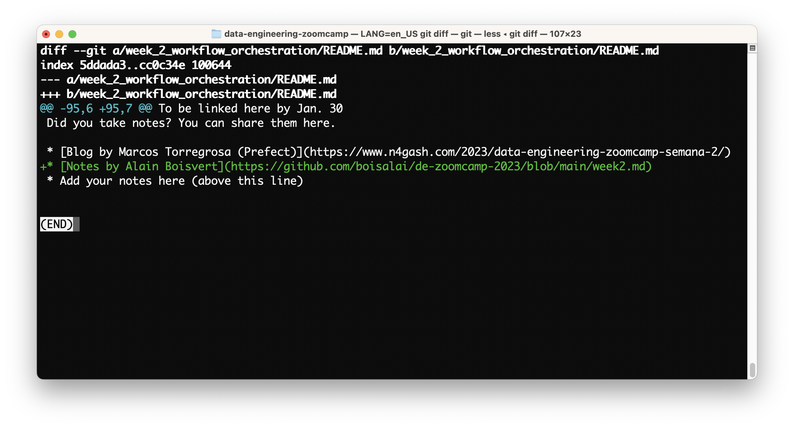

Type `:q` to quit.

## 5. Commit and push

Commit and push this local branch **add-link-to-week2** to our remote forked repository. Note that **origin** is the
conventional shorthand name of the url for the remote repository.

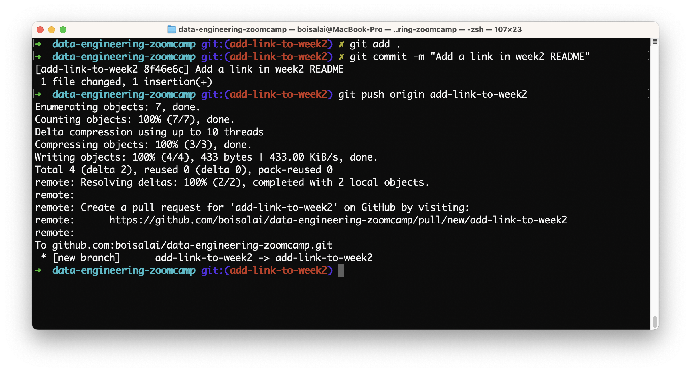

## 6. Compare and pull request

Back to the forked repo, you will see a message indicating our push.

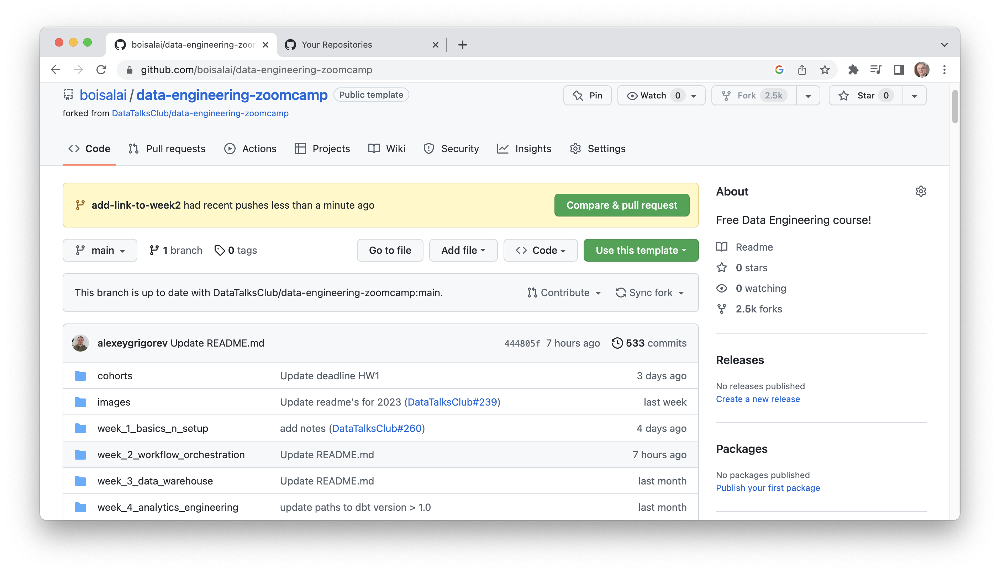

Click on the green **Compare & pull request** button to open a pull request.

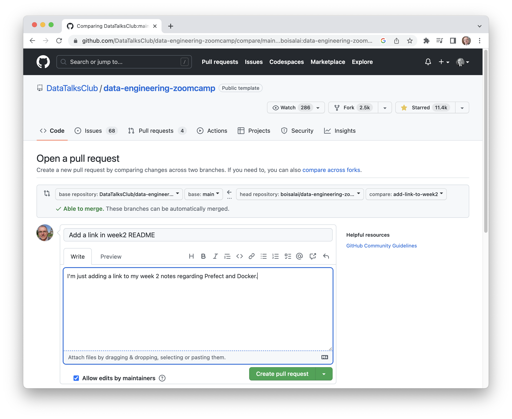

Add a message informing the repo owner of the changes you made and click on the green **Create pull request**.

You can click on the tabs to check if everything is correct.

|                                  |                                  |
|----------------------------------|----------------------------------|
| 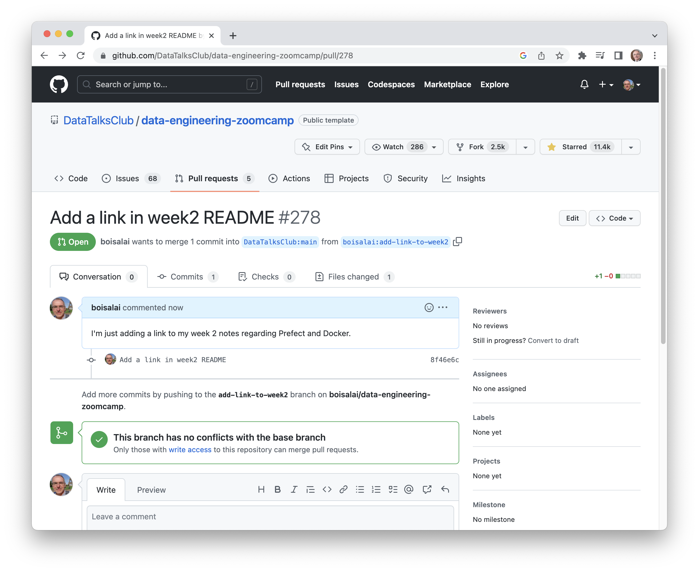 | 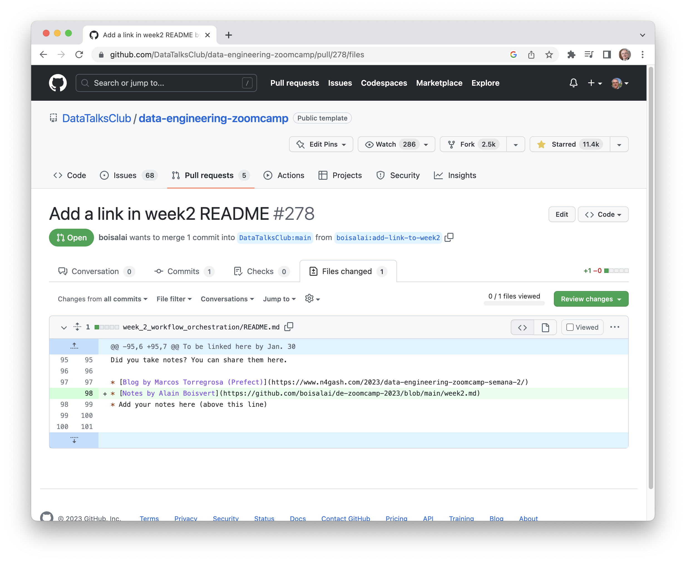 |

Congratulations! For some of you, this may be the first pull request.

For my part, it was really my first pull request of all my life. :wink:
