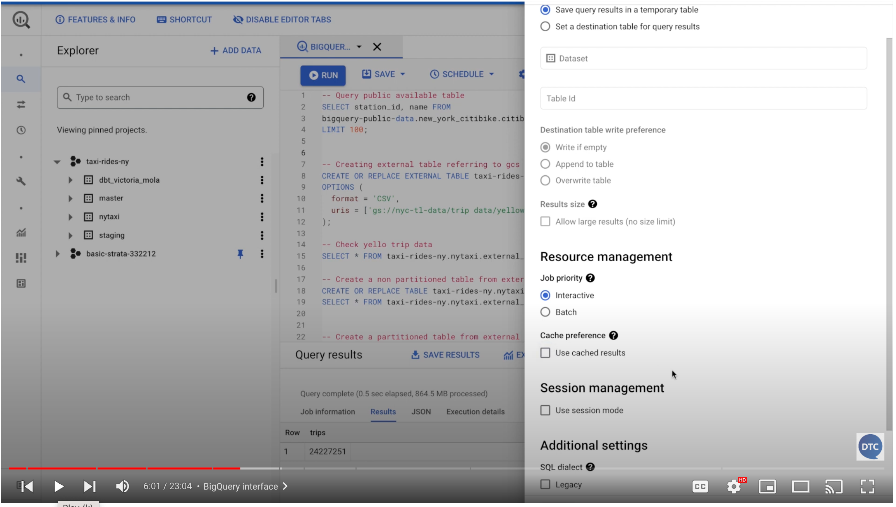
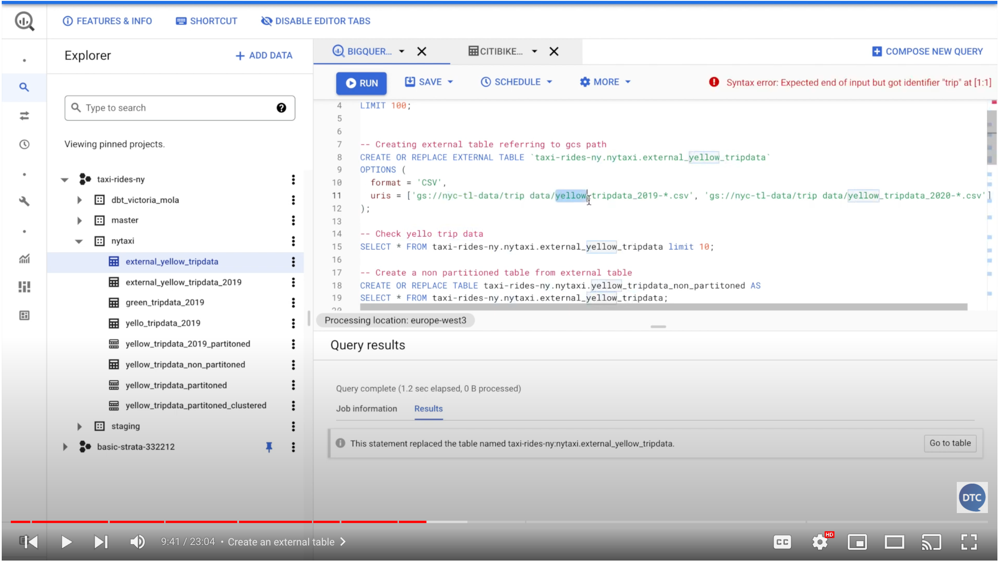
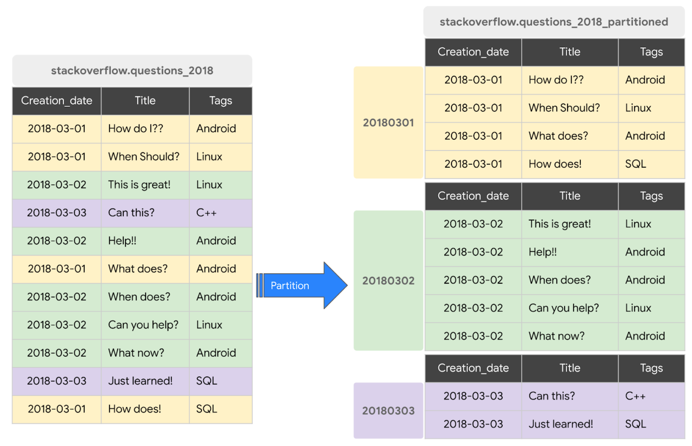
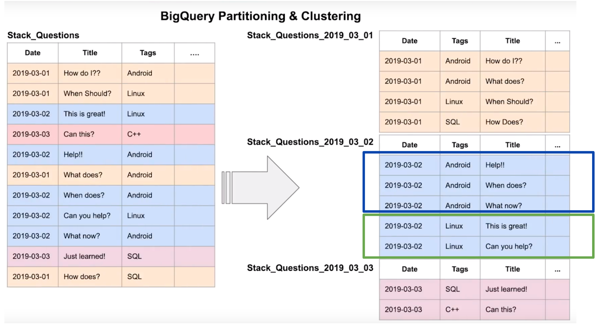
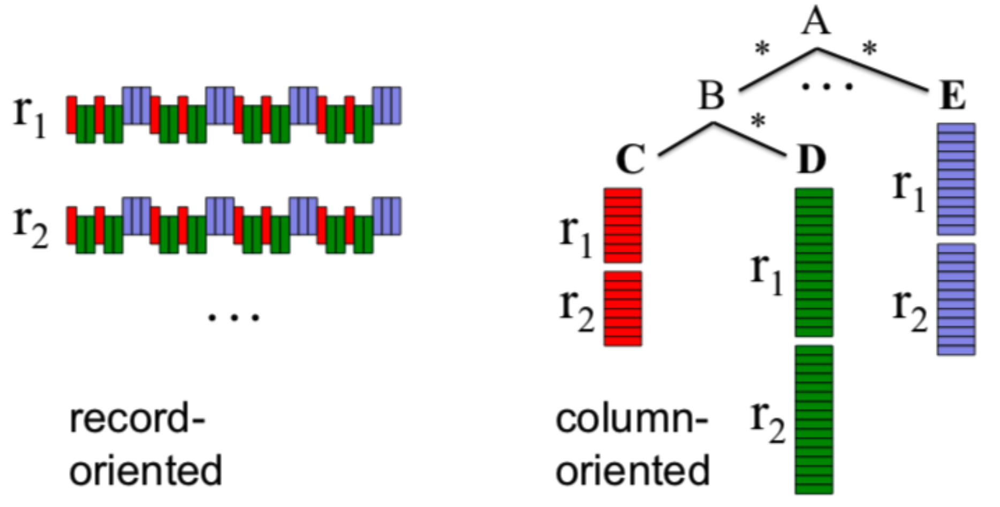
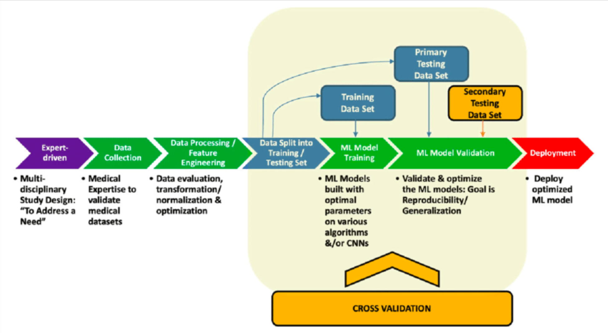
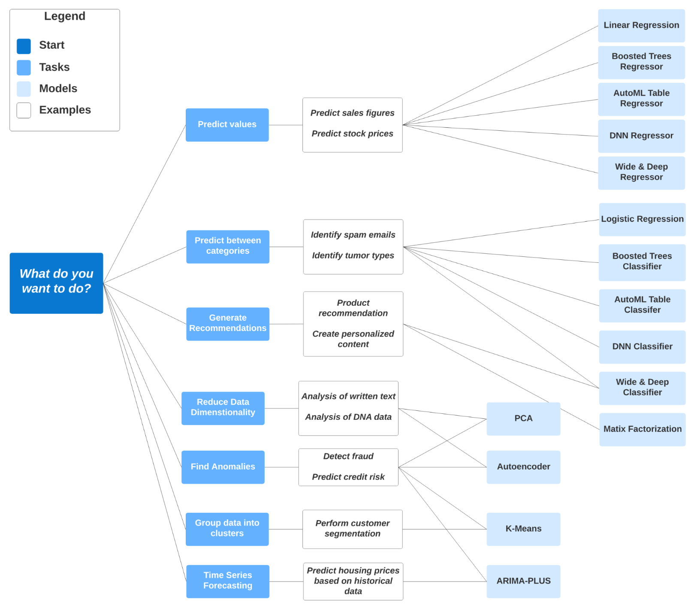

# = Week 3: Data Warehouse and BigQuery

See [week_3\_data_warehouse](https://github.com/DataTalksClub/data-engineering-zoomcamp/tree/main/week_3_data_warehouse)
on GitHub.

Youtube videos:

- [DE Zoomcamp 3.1.1 - Data Warehouse and BigQuery](https://www.youtube.com/watch?v=jrHljAoD6nM)
- [DE Zoomcamp 3.1.2 - Partioning and Clustering](https://www.youtube.com/watch?v=-CqXf7vhhDs)
- [DE Zoomcamp 3.2.1 - BigQuery Best Practices](https://www.youtube.com/watch?v=k81mLJVX08w)
- [DE Zoomcamp 3.2.2 - Internals of BigQuery](https://www.youtube.com/watch?v=eduHi1inM4s)
- [DE Zoomcamp 3.3.1 - BigQuery Machine Learning](https://www.youtube.com/watch?v=B-WtpB0PuG4)
- [DE Zoomcamp 3.3.2 - BigQuery Machine Learning Deployment](https://www.youtube.com/watch?v=BjARzEWaznU)

Basic SQL:

- [BigQuery](https://github.com/DataTalksClub/data-engineering-zoomcamp/blob/main/week_3_data_warehouse/big_query.sql)
- [External
  Table](https://github.com/DataTalksClub/data-engineering-zoomcamp/blob/main/week_3_data_warehouse/big_query_hw.sql)
- [BigQuery
  ML](https://github.com/DataTalksClub/data-engineering-zoomcamp/blob/main/week_3_data_warehouse/big_query_ml.sql)

## Concepts

### OLAP vs OLTP

**OLTP** systems are designed to handle large volumes of transactional data involving multiple users.

**OLAP** system is designed to process large amounts of data quickly, allowing users to analyze multiple data dimensions
in tandem. Teams can use this data for decision-making and problem-solving.

|                     | **OLTP**                                                                                          | **OLAP**                                                                          |
|---------------------|---------------------------------------------------------------------------------------------------|-----------------------------------------------------------------------------------|
| Purpose             | Control and run essential business operations in real time                                        | Plan, solve problems, support decisions, discover hidden insights                 |
| Data updates        | Short, fast updates initiated by user                                                             | Data periodically refreshed with scheduled, long-running batch jobs               |
| Database design     | Normalized databases for efficiency                                                               | Denormalized databases for analysis                                               |
| Space requirements  | Generally small if historical data is archived                                                    | Generally large due to aggregating large datasets                                 |
| Backup and recovery | Regular backups required to ensure business continuity and meet legal and governance requirements | Lost data can be reloaded from OLTP database as needed in lieu of regular backups |
| Productivity        | Increases productivity of end users                                                               | Increases productivity of business managers, data analysts, and executives        |
| Data view           | Lists day-to-day business transactions                                                            | Multi-dimensional view of enterprise data                                         |
| User examples       | Customer-facing personnel, clerks, online shoppers                                                | Knowledge workers such as data analysts, business analysts, and executives        |

### What is a data wahehouse

- OLAP solution
- Used for reporting and data analysis

See also [The Data Warehouse Toolkit 3rd
Edition](https://www.kimballgroup.com/data-warehouse-business-intelligence-resources/books/data-warehouse-dw-toolkit/)
by Ralph Kimball and Margy Ross.

## BigQuery

### Overwiew

BigQuery is a fully managed enterprise data warehouse that helps you manage and analyze your data with built-in features
like machine learning, geospatial analysis, and business intelligence.

- Serverless data warehouse
  - There are no servers to manage or database software to install
- Software as well as infrastructure including
  - **scalability** and **high-availability**
- Built-in features like
  - machine learning
  - geospatial analysis
  - business intelligence
- BigQuery maximizes flexibility by separating the compute engine that analyzes your data from your storage
- On demand pricing
  - 1 TB of data processed is \$5
- Flat rate pricing
  - Based on number of pre requested slots
  - 100 slots → \$2,000/month = 400 TB data processed on demand pricing

See [What is BigQuery?](https://cloud.google.com/bigquery/docs/introduction) for more information.

### Query Settings

> 5:59/23:04 (3.1.1)



Click on **MORE** button, select **Query Settings**. In the **Resource management** section, we should disable **Use
cached results**.

> 9:41/23:04 (3.1.1)



**File `big_query.sql`**

``` sql
-- Query public available table
SELECT station_id, name FROM
    bigquery-public-data.new_york_citibike.citibike_stations
LIMIT 100;

-- Creating external table referring to gcs path
CREATE OR REPLACE EXTERNAL TABLE `taxi-rides-ny.nytaxi.external_yellow_tripdata`
OPTIONS (
  format = 'CSV',
  uris = ['gs://nyc-tl-data/trip data/yellow_tripdata_2019-*.csv', 'gs://nyc-tl-data/trip data/yellow_tripdata_2020-*.csv']
);
```

> 11:45/23:04 (3.1.1)

**File `big_query.sql`**

``` sql
-- Check yello trip data
SELECT * FROM taxi-rides-ny.nytaxi.external_yellow_tripdata limit 10;
```

### BigQuery Partition

A partitioned table is divided into segments, called partitions, that make it easier to manage and query your data. By
dividing a large table into smaller partitions, you can improve query performance and control costs by reducing the
number of bytes read by a query. You partition tables by specifying a partition column which is used to segment the
table.

> 0:17/7:43 (3.1.2)

- Time-unit column
- Ingestion time (`_PARTITIONTIME`)
- Integer range partitioning
- When using Time unit or ingestion time
  - Daily (Default)
  - Hourly
  - Monthly or yearly
- Number of partitions limit is 4000

See [Introduction to partitioned tables](https://cloud.google.com/bigquery/docs/partitioned-tables) for more
information.

**Partition in BigQuery**



> 16:10/23:04 (3.1.1)

**File `big_query.sql`**

``` sql
-- Create a non partitioned table from external table
CREATE OR REPLACE TABLE taxi-rides-ny.nytaxi.yellow_tripdata_non_partitoned AS
SELECT * FROM taxi-rides-ny.nytaxi.external_yellow_tripdata;

-- Create a partitioned table from external table
CREATE OR REPLACE TABLE taxi-rides-ny.nytaxi.yellow_tripdata_partitoned
PARTITION BY
  DATE(tpep_pickup_datetime) AS
SELECT * FROM taxi-rides-ny.nytaxi.external_yellow_tripdata;
```

> 16:59/23:04 (3.1.1)

**File `big_query.sql`**

``` sql
-- Impact of partition
-- Scanning 1.6GB of data
SELECT DISTINCT(VendorID)
FROM taxi-rides-ny.nytaxi.yellow_tripdata_non_partitoned
WHERE DATE(tpep_pickup_datetime) BETWEEN '2019-06-01' AND '2019-06-30';

-- Scanning ~106 MB of DATA
SELECT DISTINCT(VendorID)
FROM taxi-rides-ny.nytaxi.yellow_tripdata_partitoned
WHERE DATE(tpep_pickup_datetime) BETWEEN '2019-06-01' AND '2019-06-30';
```

> 18:01/23:04 (3.1.1)

**File `big_query.sql`**

``` sql
-- Let's look into the partitons
SELECT table_name, partition_id, total_rows
FROM `nytaxi.INFORMATION_SCHEMA.PARTITIONS`
WHERE table_name = 'yellow_tripdata_partitoned'
ORDER BY total_rows DESC;
```

### BigQuery Clustering

Clustered tables in BigQuery are tables that have a user-defined column sort order using clustered columns. Clustered
tables can improve query performance and reduce query costs.

In BigQuery, a clustered column is a user-defined table property that sorts storage blocks based on the values in the
clustered columns. The storage blocks are adaptively sized based on the size of the table. A clustered table maintains
the sort properties in the context of each operation that modifies it. Queries that filter or aggregate by the clustered
columns only scan the relevant blocks based on the clustered columns instead of the entire table or table partition. As
a result, BigQuery might not be able to accurately estimate the bytes to be processed by the query or the query costs,
but it attempts to reduce the total bytes at execution.

See [Introduction to clustered tables](https://cloud.google.com/bigquery/docs/clustered-tables).

> 1:58/7:43 (3.1.2)

- Columns you specify are used to colocate related data
- Order of the column is important
- The order of the specified columns determines the sort order of the data.
- Clustering improves
  - Filter queries
  - Aggregate queries
- Table with data size \< 1 GB, don’t show significant improvement with partitioning and clustering
- You can specify up to four clustering columns

> 3.01/7:43 (3.1.2)

Clustering columns must be top-level, non-repeated columns:

- `DATE`
- `BOOL`
- `GEOGRAPHY`
- `INT64`
- `NUMERIC`
- `BIGNUMERIC`
- `STRING`
- `TIMESTAMP`
- `DATETIME`

> 19:38/23:04 (3.1.1)

**Clustering in BigQuery**



**File `big_query.sql`**

``` sql
-- Creating a partition and cluster table
CREATE OR REPLACE TABLE taxi-rides-ny.nytaxi.yellow_tripdata_partitoned_clustered
PARTITION BY DATE(tpep_pickup_datetime)
CLUSTER BY VendorID AS
SELECT * FROM taxi-rides-ny.nytaxi.external_yellow_tripdata;

-- Query scans 1.1 GB
SELECT count(*) as trips
FROM taxi-rides-ny.nytaxi.yellow_tripdata_partitoned
WHERE DATE(tpep_pickup_datetime) BETWEEN '2019-06-01' AND '2020-12-31'
  AND VendorID=1;

-- Query scans 864.5 MB
SELECT count(*) as trips
FROM taxi-rides-ny.nytaxi.yellow_tripdata_partitoned_clustered
WHERE DATE(tpep_pickup_datetime) BETWEEN '2019-06-01' AND '2020-12-31'
  AND VendorID=1;
```

### Partitioning vs Clustering

> 3:18/7:43 (3.1.2)

| **Clustering**                                                                        | **Partitoning**                       |
|---------------------------------------------------------------------------------------|---------------------------------------|
| Cost benefit unknown.                                                                 | Cost known upfront.                   |
| You need more granularity than partitioning alone allows.                             | You need partition-level management.  |
| Your queries commonly use filters or aggregation against multiple particular columns. | Filter or aggregate on single column. |
| The cardinality of the number of values in a column or group of columns is large.     |                                       |

### Clustering over paritioning

Like clustering, partitioning uses user-defined partition columns to specify how data is partitioned and what data is
stored in each partition. Unlike clustering, partitioning provides granular query cost estimates before you run a query.

See [Introduction to clustered tables](https://cloud.google.com/bigquery/docs/clustered-tables).

> 5:03/7:43 (3.1.2)

- Partitioning results in a small amount of data per partition (approximately less than 1 GB).
- Partitioning results in a large number of partitions beyond the limits on partitioned tables.
- Partitioning results in your mutation operations modifying the majority of partitions in the table frequently (for
  example, every few minutes).

### Automatic reclustering

> 6:04/7:43 (3.1.2)

As data is added to a clustered table

- The newly inserted data can be written to blocks that contain key ranges that overlap with the key ranges in
  previously written blocks
- These overlapping keys weaken the sort property of the table

To maintain the performance characteristics of a clustered table

- BigQuery performs automatic re-clustering in the background to restore the sort property of the table
- For partitioned tables, clustering is maintained for data within the scope of each partition.

### BigQuery Best Practice

> 0:00/3:44 (3.2.1)

- Cost reduction
  - Avoid `SELECT *`
  - Price your queries before running them
  - Use clustered or partitioned tables
  - Use streaming inserts with caution
  - Materialize query results in stages

In BigQuery, materialized views are precomputed views that periodically cache the results of a query for increased
performance and efficiency. BigQuery leverages precomputed results from materialized views and whenever possible reads
only delta changes from the base tables to compute up-to-date results. See [Introduction to materialized
views](https://cloud.google.com/bigquery/docs/materialized-views-intro)

> 1:56/3:44 (3.2.1)

- Query performance
  - Filter on partitioned columns
  - Denormalizing data
  - Use nested or repeated columns
  - Use external data sources appropriately
  - Don’t use it, in case u want a high query performance
  - Reduce data before using a `JOIN`
  - Do not treat `WITH` clauses as prepared statements
  - Avoid oversharding tables

> 2:43/3:44 (3.2.1)

- Query performance
  - Avoid JavaScript user-defined functions
  - Use approximate aggregation functions (HyperLogLog++)
  - Order Last, for query operations to maximize performance
  - Optimize your join patterns
    - As a best practice, place the table with the largest number of rows first, followed by the table with the fewest
      rows, and then place the remaining tables by decreasing size.

### Internals of BigQuery

> 0:00/6:05 (3.2.2)

**A high-level architecture for BigQuery service**


See also:

- [BigQuery under the hood](https://cloud.google.com/blog/products/bigquery/bigquery-under-the-hood)
- [A Deep Dive Into Google BigQuery Architecture](https://panoply.io/data-warehouse-guide/bigquery-architecture/)
- [BigQuery explained: An overview of BigQuery’s
  architecture](https://cloud.google.com/blog/products/data-analytics/new-blog-series-bigquery-explained-overview)

> 2:49/6:05 (3.2.2)

**Record-oriented vs column-oriented**



BigQuery stores table data in columnar format, meaning it stores each column separately. Column-oriented databases are
particularly efficient at scanning individual columns over an entire dataset.

Column-oriented databases are optimized for analytic workloads that aggregate data over a very large number of records.
Often, an analytic query only needs to read a few columns from a table. See [Overview of BigQuery
storage](https://cloud.google.com/bigquery/docs/storage_overview) and [Storage
layout](https://cloud.google.com/bigquery/docs/storage_overview#storage_layout).

> 3:58/6:05 (3.2.2)

**An example of Dremel serving tree**


See [A Deep Dive Into Google BigQuery Architecture](https://panoply.io/data-warehouse-guide/bigquery-architecture/).

### BigQuery References

> 5:53/6:05 (3.2.2)

- [BigQuery How-to-guides](https://cloud.google.com/bigquery/docs/how-to)
- [Dremel: Interactive Analysis of Web-Scale Datasets](https://research.google/pubs/pub36632/)
- [A Deep Dive Into Google BigQuery Architecture](https://panoply.io/data-warehouse-guide/bigquery-architecture/)
- [A Look at Dremel](http://www.goldsborough.me/distributed-systems/2019/05/18/21-09-00-a_look_at_dremel/)

## BigQuery ML

### Overwiew

BigQuery ML lets you create and execute machine learning models in BigQuery using standard SQL queries. BigQuery ML
democratizes machine learning by letting SQL practitioners build models using existing SQL tools and skills. BigQuery ML
increases development speed by eliminating the need to move data.

See [What is BigQuery ML?](https://cloud.google.com/bigquery-ml/docs/introduction#supported_models_in)

> 0:00/15:51 (3.3.1)

- Target audience Data analysts, managers
- No need for Python or Java knowledge
- No need to export data into a different system

> 1:17/15:51 (3.3.1)

- Free
  - 10 GB per month of data storage
  - 1 TB per month of queries processed
  - ML Create model step: First 10 GB per month is free
- [BigQuery ML pricing](https://cloud.google.com/bigquery/pricing#bqml)

> 2:20/15:51 (3.3.1)



Supervised (labeled) machine learning model study design overview. Steps for the deployment of a supervised machine
learning model. From left to right, the figure shows the initial team of multidisciplinary experts defining a study
design to address a need. Data are then collected, processed, trained tested, validated, and ultimately deployed. See
Rashidi, Hooman & Tran, Nam & Betts, Elham & Howell, Lydia & Green, Ralph. (2019). [Artificial Intelligence and Machine
Learning in Pathology: The Present Landscape of Supervised
Methods](https://www.researchgate.net/publication/335604816_Artificial_Intelligence_and_Machine_Learning_in_Pathology_The_Present_Landscape_of_Supervised_Methods).

### Model selection guide

> 3:37/15:51 (3.3.1)

**Model selection guide**



See [Model selection guide](https://cloud.google.com/bigquery-ml/docs/introduction#model_selection_guide).

### Create dataset

> 4:48/15:51 (3.3.1)

✅ This query will process 6.5 GB when run.

**File `big_query_ml.sql`**

``` sql
-- SELECT THE COLUMNS INTERESTED FOR YOU
SELECT passenger_count, trip_distance, PULocationID, DOLocationID, payment_type, fare_amount, tolls_amount, tip_amount
FROM `taxi-rides-ny.nytaxi.yellow_tripdata_partitoned` WHERE fare_amount != 0;
```

### Feature preprocessing

> 6:49/15:51 (3.3.1)

**Feature preprocessing** is one of the most important steps in developing a machine learning model. It consists of the
creation of features as well as the cleaning of the data. Sometimes, the creation of features is also referred as
"feature engineering". See [Feature preprocessing
overview](https://cloud.google.com/bigquery-ml/docs/reference/standard-sql/bigqueryml-syntax-preprocess-overview).

Here, we cast as string some columns for automatic feature reprocessing by BigQuery ML.

**File `big_query_ml.sql`**

``` sql
-- CREATE A ML TABLE WITH APPROPRIATE TYPE
CREATE OR REPLACE TABLE `taxi-rides-ny.nytaxi.yellow_tripdata_ml` (
    `passenger_count` INTEGER,
    `trip_distance` FLOAT64,
    `PULocationID` STRING,
    `DOLocationID` STRING,
    `payment_type` STRING,
    `fare_amount` FLOAT64,
    `tolls_amount` FLOAT64,
    `tip_amount` FLOAT64
) AS (
    SELECT passenger_count, trip_distance, cast(PULocationID AS STRING), CAST(DOLocationID AS STRING),
    CAST(payment_type AS STRING), fare_amount, tolls_amount, tip_amount
    FROM `taxi-rides-ny.nytaxi.yellow_tripdata_partitoned` WHERE fare_amount != 0
);
```

### Create a model

> 10:27/15:51 (3.3.1)

To create a model in BigQuery, use the BigQuery ML `CREATE MODEL` statement. See [The CREATE MODEL
statement](https://cloud.google.com/bigquery-ml/docs/reference/standard-sql/bigqueryml-syntax-create).

This query below may take 5 minutes to run…​

**File `big_query_ml.sql`**

``` sql
-- CREATE MODEL WITH DEFAULT SETTING
CREATE OR REPLACE MODEL `taxi-rides-ny.nytaxi.tip_model`
OPTIONS
    (model_type='linear_reg',
    input_label_cols=['tip_amount'],
    DATA_SPLIT_METHOD='AUTO_SPLIT') AS
SELECT
    *
FROM
    `taxi-rides-ny.nytaxi.yellow_tripdata_ml`
WHERE
    tip_amount IS NOT NULL;
```

> 12:04/15:51 (3.3.1)

The `ML.FEATURE_INFO` function allows you to see information about the input features used to train a model. See [The
ML.FEATURE_INFO function](https://cloud.google.com/bigquery-ml/docs/reference/standard-sql/bigqueryml-syntax-feature).

**File `big_query_ml.sql`**

``` sql
-- CHECK FEATURES
SELECT * FROM ML.FEATURE_INFO(MODEL `taxi-rides-ny.nytaxi.tip_model`);
```

### Evaluate the model

> 12:50/15:51 (3.3.1)

Use the `ML.EVALUATE` function to evaluate model metrics. See [The ML.EVALUATE
function](https://cloud.google.com/bigquery-ml/docs/reference/standard-sql/bigqueryml-syntax-evaluate).

**File `big_query_ml.sql`**

``` sql
-- EVALUATE THE MODEL
SELECT
    *
FROM
    ML.EVALUATE(MODEL `taxi-rides-ny.nytaxi.tip_model`,
        (
        SELECT
            *
        FROM
            `taxi-rides-ny.nytaxi.yellow_tripdata_ml`
        WHERE
            tip_amount IS NOT NULL
        ));
```

### Predict the model

> 13:27/15:51 (3.3.1)

The `ML.PREDICT` function is used to predict outcomes using the model. See [The ML.PREDICT
function](https://cloud.google.com/bigquery-ml/docs/reference/standard-sql/bigqueryml-syntax-predict).

**File `big_query_ml.sql`**

``` sql
-- PREDICT THE MODEL
SELECT
    *
FROM
    ML.PREDICT(MODEL `taxi-rides-ny.nytaxi.tip_model`,
        (
        SELECT
            *
        FROM
            `taxi-rides-ny.nytaxi.yellow_tripdata_ml`
        WHERE
            tip_amount IS NOT NULL
        ));
```

> 13:27/15:51 (3.3.1)

The `ML.EXPLAIN_PREDICT` function generates a predicted value and a set of feature attributions per instance of the
input data. Feature attributions indicate how much each feature in your model contributed to the final prediction for
each given instance. See [The ML.EXPLAIN_PREDICT
function](https://cloud.google.com/bigquery-ml/docs/reference/standard-sql/bigqueryml-syntax-explain-predict).

**File `big_query_ml.sql`**

``` sql
-- PREDICT AND EXPLAIN
SELECT
    *
FROM
    ML.EXPLAIN_PREDICT(MODEL `taxi-rides-ny.nytaxi.tip_model`,
        (
        SELECT
            *
        FROM
            `taxi-rides-ny.nytaxi.yellow_tripdata_ml`
        WHERE
            tip_amount IS NOT NULL
        ), STRUCT(3 as top_k_features));
```

### Hyperparameter tuning

> 14:43/15:51 (3.3.1)

In machine learning, hyperparameter tuning identifies a set of optimal hyperparameters for a learning algorithm. A
hyperparameter is a model argument whose value is set before the learning process begins. See [BigQuery ML
Hyperparameter Tuning
Overview](https://cloud.google.com/bigquery-ml/docs/reference/standard-sql/bigqueryml-syntax-hp-tuning-overview).

See also [The CREATE MODEL statement for generalized linear
models](https://cloud.google.com/bigquery-ml/docs/reference/standard-sql/bigqueryml-syntax-create-glm) to know the
hyperparameters we can tune for linear and logistic regression.

**File `big_query_ml.sql`**

``` sql
-- HYPER PARAM TUNNING
CREATE OR REPLACE MODEL `taxi-rides-ny.nytaxi.tip_hyperparam_model`
OPTIONS
    (model_type='linear_reg',
    input_label_cols=['tip_amount'],
    DATA_SPLIT_METHOD='AUTO_SPLIT',
    num_trials=5,
    max_parallel_trials=2,
    l1_reg=hparam_range(0, 20),
    l2_reg=hparam_candidates([0, 0.1, 1, 10])) AS
SELECT
    *
FROM
    `taxi-rides-ny.nytaxi.yellow_tripdata_ml`
WHERE
    tip_amount IS NOT NULL;
```

### BigQuery Machine Learning Deployment

> 0:00/4:26 (3.3.2)

This tutorial shows how to export a BigQuery ML model and then deploy the model either on AI Platform or on a local
machine. See [Exporting a BigQuery ML model for online
prediction](https://cloud.google.com/bigquery-ml/docs/export-model-tutorial).

### Steps for model deployment

See
[extract_model.md](https://github.com/DataTalksClub/data-engineering-zoomcamp/blob/main/week_3_data_warehouse/extract_model.md).

**File `extract_model.md`**

``` bash
gcloud auth login
bq --project_id taxi-rides-ny extract -m nytaxi.tip_model gs://taxi_ml_model/tip_model
mkdir /tmp/model
gsutil cp -r gs://taxi_ml_model/tip_model /tmp/model
mkdir -p serving_dir/tip_model/1
cp -r /tmp/model/tip_model/* serving_dir/tip_model/1
docker pull tensorflow/serving
docker run -p 8501:8501 \\
    --mount type=bind,source=pwd/serving_dir/tip_model,target=/models/tip_model \\
    -e MODEL_NAME=tip_model -t tensorflow/serving &
docker ps # Check if TensorFlow Serving is running.
curl -d '{"instances": [{"passenger_count":1, "trip_distance":12.2, "PULocationID":"193", \\
    "DOLocationID":"264", "payment_type":"2","fare_amount":20.4,"tolls_amount":0.0}]}' \\
    -X POST http://localhost:8501/v1/models/tip_model:predict
```

> 2:57/4:26 (3.3.2)

[TensorFlow Serving](https://www.tensorflow.org/tfx/guide/serving?hl=en) is a flexible, high-performance serving system
for machine learning models, designed for production environments.

> 3:04/4:26 (3.3.2)

We use [Postman](https://www.postman.com/) to make some HTTP requests

Finally, open this url <http://localhost:8501/v1/models/tip_model>.

### BigQuery ML References

- [BigQuery ML Tutorials](https://cloud.google.com/bigquery-ml/docs/tutorials)
- [BigQuery ML Reference patterns](https://cloud.google.com/bigquery-ml/docs/analytics-reference-patterns)
- [Exporting a BigQuery ML model for online prediction](https://cloud.google.com/bigquery-ml/docs/export-model-tutorial)

## See also

Links not directly related to Data Warehouse and BigQuery.

- [Fundamentals of Data Engineering](https://www.oreilly.com/library/view/fundamentals-of-data/9781098108298/) by Joe
  Reis, Matt Housley
  - [The book of the week from 15 Aug 2022 to 19 Aug
    2022](https://datatalks.club/books/20220815-fundamentals-of-data-engineering.html)
- [Black](https://github.com/psf/black) The Uncompromising Code Formatter
- [Clean Code: A Handbook of Agile Software
  Craftsmanship](https://www.oreilly.com/library/view/clean-code-a/9780136083238/) by Robert C. Martin
- [Clean Code in Python - Second
  Edition](https://www.packtpub.com/product/clean-code-in-python-second-edition/9781800560215) By Mariano Anaya
- [Python Best Practices](https://github.com/DataTalksClub/mlops-zoomcamp/tree/main/06-best-practices)
- [Python Best Practices for a New Project in
  2021](https://mitelman.engineering/blog/python-best-practice/automating-python-best-practices-for-a-new-project/)
- [Prefect Recipes](https://docs.prefect.io/recipes/recipes/)
- [Prefect Youtube](https://www.youtube.com/c/PrefectIO)

