# Week 5: Batch Processing

## Materials

See [Week 5: Batch
Processing](https://github.com/DataTalksClub/data-engineering-zoomcamp/blob/main/week_5_batch_processing) on GitHub.

Youtube videos:

- [DE Zoomcamp 5.1.1 - Introduction to Batch processing](https://www.youtube.com/watch?v=dcHe5Fl3MF8)
- [DE Zoomcamp 5.1.2 - Introduction to Spark](https://www.youtube.com/watch?v=FhaqbEOuQ8U)
- [DE Zoomcamp 5.2.1 - (Optional) Installing Spark on Linux](https://www.youtube.com/watch?v=hqUbB9c8sKg)
- [DE Zoomcamp 5.3.1 - First Look at Spark/PySpark](https://www.youtube.com/watch?v=r_Sf6fCB40c)
- [DE Zoomcamp 5.3.2 - Spark DataFrames](https://www.youtube.com/watch?v=ti3aC1m3rE8)
- [DE Zoomcamp 5.3.3 - (Optional) Preparing Yellow and Green Taxi Data](https://www.youtube.com/watch?v=CI3P4tAtru4)
- [DE Zoomcamp 5.3.4 - SQL with Spark](https://www.youtube.com/watch?v=uAlp2VuZZPY)
- [DE Zoomcamp 5.4.1 - Anatomy of a Spark Cluster](https://www.youtube.com/watch?v=68CipcZt7ZA)
- [DE Zoomcamp 5.4.2 - GroupBy in Spark](https://www.youtube.com/watch?v=9qrDsY_2COo)
- [DE Zoomcamp 5.4.3 - Joins in Spark](https://www.youtube.com/watch?v=lu7TrqAWuH4)

## Introduction

> 0:00/9:30 (5.1.1) What we will cover in this week.

This week, we’ll dive into Batch Processing.

We’ll cover:

- Spark, Spark DataFrames, and Spark SQL
- Joins in Spark
- Resilient Distributed Datasets (RDDs)
- Spark internals
- Spark with Docker
- Running Spark in the Cloud
- Connecting Spark to a Data Warehouse (DWH)

> 1:30/9:30 (5.1.1)

We can process data by batch or by streaming.

- **Batch processing** is when the processing and analysis happens on a set of data that have already been stored over a
  period of time. An example is payroll and billing systems that have to be processed weekly or monthly.
- **Streaming data processing** happens as the data flows through a system. This results in analysis and reporting of
  events as it happens. An example would be fraud detection or intrusion detection.

Source: [Batch Processing vs Real Time Data Streams](https://www.confluent.io/learn/batch-vs-real-time-data-processing)
from Confluent.

We will cover streaming in week 6.

> 3:37/9:30 (5.1.1)

A batch job can run weekly, daily, hourly, three times per hour, every 5 minutes.

> 4:15/9:30 (5.1.1)

The technologies used can be python scripts, SQL, dbt, Spark, Flink, Kubernetes, AWS Batch, Prefect or Airflow.

> 5:27/9:30 (5.1.1)

A typical workflow might look like this:

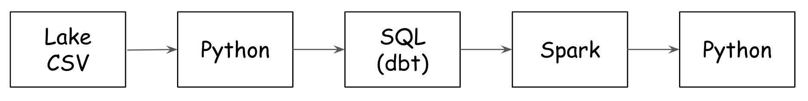

> 6:05/9:30 (5.1.1)

- Advantages of batch: easy to manage, easier to retry and scale.
- Disadvantage: delay.

The majority of processing jobs (may be 80%) are still in batch.

## Introduction to Spark

> 0:00/6:46 (5.1.2)


[Apache Spark](https://spark.apache.org/) is a unified analytics engine for large-scale data processing.

Spark is a distributed data processing engine with its components working collaboratively on a cluster of machines. At a
high level in the Spark architecture, a Spark application consists of a driver program that is responsible for
orchestrating parallel operations on the Spark cluster. The driver accesses the distributed components in the
cluster—the Spark executors and cluster manager—through a `SparkSession`.

**Apache Spark components and architecture**


Source: <https://www.oreilly.com/library/view/learning-spark-2nd/9781492050032/ch01.html>

> 1:30/6:46 (5.1.2)

It provides high-level APIs in Java, Scala, Python ([PySpark](https://spark.apache.org/docs/latest/api/python/)) and R,
and an optimized engine that supports general execution graphs. It also supports a rich set of higher-level tools
including:

- [Spark SQL](https://spark.apache.org/docs/latest/sql-programming-guide.html) for SQL and structured data processing,
- [pandas API on Spark](https://spark.apache.org/docs/latest/api/python/getting_started/quickstart_ps.html) for pandas
  workloads,
- [MLlib](https://spark.apache.org/docs/latest/ml-guide.html) for machine learning,
- [GraphX](https://spark.apache.org/docs/latest/graphx-programming-guide.html) for graph processing,
- [Structured Streaming](https://spark.apache.org/docs/latest/structured-streaming-programming-guide.html) for
  incremental computation and stream processing.

See [Spark Overview](https://spark.apache.org/docs/latest/index.html) for more.

[Apache Spark](https://spark.apache.org/) is a multi-language engine for executing data engineering, data science, and
machine learning on single-node machines or clusters.

> 2:30/6:46 (5.1.2)

Spark is used for batch jobs but can be also used for streaming. In this week, we will focus on batch jobs.

> 2:58/6:46 (5.1.2) When to use Spark?

**When to use Spark?**


> 5:00/6:46 (5.1.2) Workflow for Machine Learning

**Typical workflow for ML**

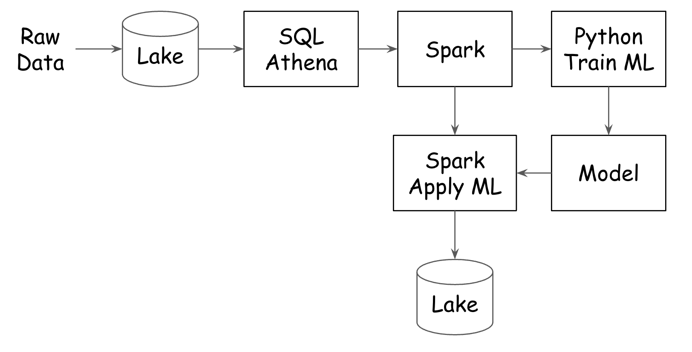

## Installation

Follow [these
intructions](https://github.com/DataTalksClub/data-engineering-zoomcamp/tree/main/week_5_batch_processing/setup) to
install Spark.

- [Windows](https://github.com/DataTalksClub/data-engineering-zoomcamp/blob/main/week_5_batch_processing/setup/windows.md)
- [Linux](https://github.com/DataTalksClub/data-engineering-zoomcamp/blob/main/week_5_batch_processing/setup/linux.md)
- [MacOS](https://github.com/DataTalksClub/data-engineering-zoomcamp/blob/main/week_5_batch_processing/setup/macos.md)

And follow
[this](https://github.com/DataTalksClub/data-engineering-zoomcamp/blob/main/week_5_batch_processing/setup/pyspark.md) to
run PySpark in Jupyter.

### Installation on MacOS

Since my computer is a MacBook Pro, I will focus on installing Spark on MacOS.

#### Install Java

Install Brew and Java, if not already done.

``` bash
# Install Homebrew.
xcode-select –install /bin/bash -c "$(curl -fsSL https://raw.githubusercontent.com/Homebrew/install/master/install.sh)"
# Install Java.
brew install java
```

Find where Java is installed.

- Running `brew list` shows a list of all your installed Homebrew packages. If you run `brew list`, you should see
  **openjdk@11**.
- Running `which brew` indicates where brew is installed. Brew is installed in `/opt/homebrew/bin/brew`.
- Searching around this directory, I find that java is installed in `/opt/homebrew/Cellar/openjdk@11/11.0.18`.

So, I add these instructions in my `~/.zshrc`.

``` bash
export JAVA_HOME="/opt/homebrew/Cellar/openjdk@11/11.0.18"
export PATH="$JAVA_HOME/bin:$PATH"
```

#### Install Scala

Install Scala.

This [page](https://www.scala-lang.org/download/all.html) shows that the current version for Scala 2 is 2.13.10. So I
run this command.

``` bash
brew install scala@2.13
```

Then, I add these instructions to my `~/.zshrc`.

``` bash
export SCALA_HOME="/opt/homebrew/opt/scala@2.13"
export PATH="$SCALA_HOME/bin:$PATH"
```

#### Install Apache Spark

I run this command.

``` bash
brew install spark-shell
```

Then, I add these instructions to my `~/.zshrc`.

``` bash
export SPARK_HOME="/opt/homebrew/Cellar/apache-spark/3.3.2/libexec"
export PATH="$SPARK_HOME/bin:$PATH"
```

Finally, I think we should run this command: `source ~/.zshrc`.

#### Testing Spark

Execute `spark-shell` and run the following in scala. You can ignore the warnings.

``` scala
val data = 1 to 10000
val distData = sc.parallelize(data)
distData.filter(_ < 10).collect()
```

We should see this.

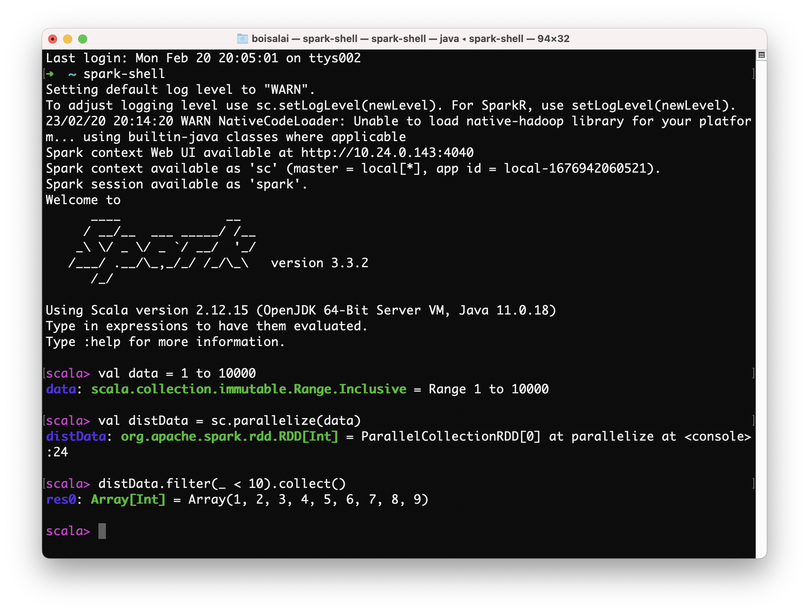

To close Spark shell, you press `Ctrl+D` or type in `:quit` or `:q`.

#### Install PySpark

It’s the same for all platforms. Go to
[pyspark.md](https://github.com/DataTalksClub/data-engineering-zoomcamp/blob/main/week_5_batch_processing/setup/pyspark.md).

To run PySpark, we first need to add it to `PYTHONPATH`.

`PYTHONPATH` is a special environment variable that provides guidance to the Python interpreter about where to find
various libraries and applications. See [Understanding the Python Path Environment Variable in
Python](https://www.simplilearn.com/tutorials/python-tutorial/python-path) for more information.

So, I add these instructions to `~/.zshrc` file.

Make sure that the version under `$SPARK_HOME/python/lib/` matches the filename of `py4j` or you will encounter
`ModuleNotFoundError: No module named 'py4j'` while executing `import pyspark`.

``` bash
export PYTHONPATH="/opt/homebrew/Cellar/python@3.11/3.11.2_1"
export PYTHONPATH="${SPARK_HOME}/python/:$PYTHONPATH"
export PYTHONPATH="${SPARK_HOME}/python/lib/py4j-0.10.9.5-src.zip:$PYTHONPATH"
```

Finally, I think we have to run this command: `source ~/.zshrc`.

Now you can run Jupyter to test if things work.

Go to some other directory and download a CSV file that we’ll use for testing.

``` bash
cd ~/downloads
wget https://s3.amazonaws.com/nyc-tlc/misc/taxi+_zone_lookup.csv
```

Now let’s run `jupyter notebook`, create a new notebook with the **Python 3 (ipykernel)** and execute this:

``` python
import pyspark
from pyspark.sql import SparkSession

spark = SparkSession.builder \
    .master("local[*]") \
    .appName('test') \
    .getOrCreate()

df = spark.read \
    .option("header", "true") \
    .csv('taxi+_zone_lookup.csv')

df.show()
```

We should see some thing like this.

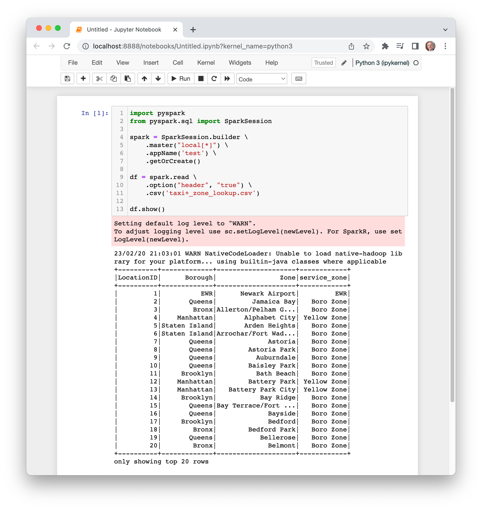

Test that writing works as well:

``` python
df.write.parquet('zones')
```

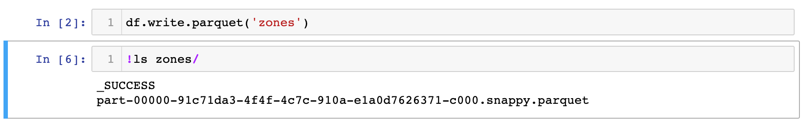

### Installation on Cloud Virtual Machine (VM)

> 0:00/14:15 (5.2.1)

Here we will install Spark 3.3.2 for Linux on Cloud VM.

#### Start VM instance on Google Cloud

> 0:39/14:15 (5.2.1) Start VM

In week 1, we created a VM instance on Google Cloud. We will use this VM here.

Go to **Google Cloud**, **Compute Engine**, **VM instances**. Start the `de-zoomcamp` virtual machine.

We get this.

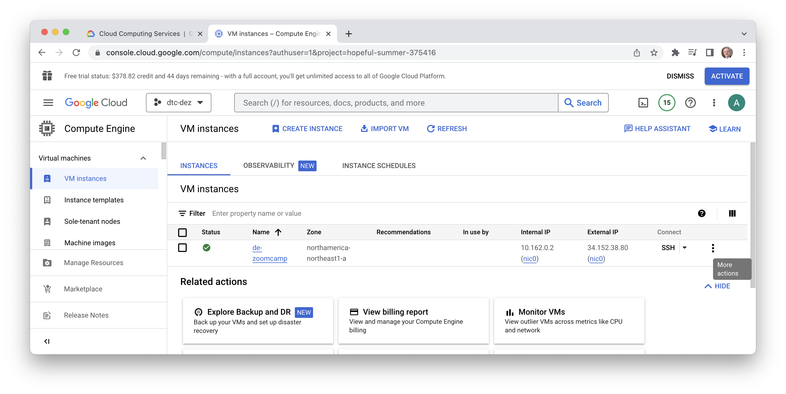

Copy the **External IP** (34.152.38.80) and adjust the HostName of the `~/.ssh/config` file.

**File `~/.ssh/config`**

``` bash
Host de-zoomcamp
    HostName 34.152.38.80
    User boisalai
    IdentityFile /Users/boisalai/.ssh/gcp
```

Then, run this command to enter to the server:

``` bash
ssh de-zoomcamp
```

You should see some thing like this.

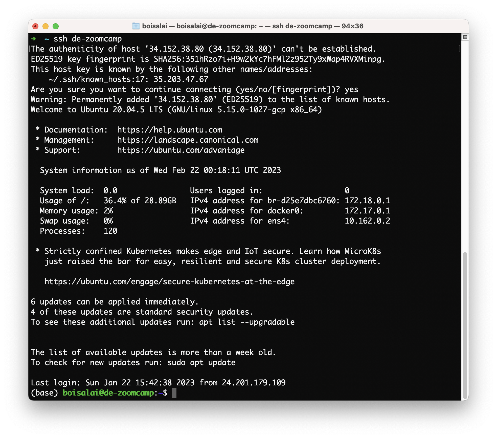

To quit the server, press `Ctrl+D` or run the `logout` command.

#### Install Java

> 0:55/14:15 (5.2.1) Installing Java

Download OpenJDK 11 or Oracle JDK 11. It’s important that the version is 11 because Spark requires 8 or 11.

Here, we will use OpenJDK. This [page](https://jdk.java.net/archive/) is an archive of previously released builds of the
OpenJDK.

To install Java, run the following commands.

``` bash
# Create directory.
> mkdir spark
> cd spark

# Download and unpack OpenJDK.
> wget https://download.java.net/java/GA/jdk11/9/GPL/openjdk-11.0.2_linux-x64_bin.tar.gz
> tar xzfv openjdk-11.0.2_linux-x64_bin.tar.gz
> ls
jdk-11.0.2
> pwd
/home/boisalai/spark

# Setup Java.
> export JAVA_HOME="${HOME}/spark/jdk-11.0.2"
> export PATH="${JAVA_HOME}/bin:${PATH}"
> java --version
openjdk 11.0.2 2019-01-15
OpenJDK Runtime Environment 18.9 (build 11.0.2+9)
OpenJDK 64-Bit Server VM 18.9 (build 11.0.2+9, mixed mode)

# Remove the archive.
> rm openjdk-11.0.2_linux-x64_bin.tar.gz
```

#### Install Spark

> 3:30/14:15 (5.2.1) Installing Spark

Go to this [page](https://spark.apache.org/downloads.html) to download Apache Spark.

We will use Spark **3.3.2 (Feb 17 2023)** version and package type **Pre-built for Apache Hadoop 3.3 and later**.

To install Spark, run the following commands.

``` bash
# Download and unpack Spark 3.3.1.
> wget https://dlcdn.apache.org/spark/spark-3.3.2/spark-3.3.2-bin-hadoop3.tgz
> tar xzfv spark-3.3.2-bin-hadoop3.tgz

# Setup Spark.
> export SPARK_HOME="${HOME}/spark/spark-3.3.2-bin-hadoop3"
> export PATH="${SPARK_HOME}/bin:${PATH}"

# Remove the archive.
> rm spark-3.3.2-bin-hadoop3.tgz
```

Now let’s check if spark is working

Execute `spark-shell` and run the following in scala. You can ignore the warnings.

``` scala
val data = 1 to 10000
val distData = sc.parallelize(data)
distData.filter(_ < 10).collect()
```

We should see this.

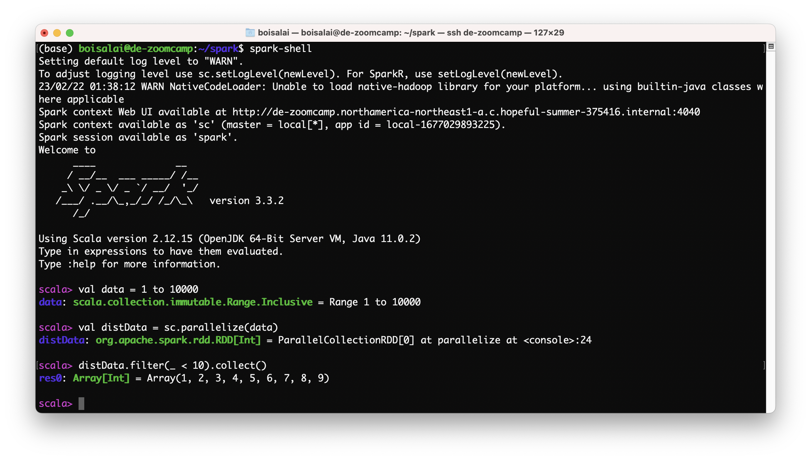

To close Spark shell, you press `Ctrl+D` or type in `:quit` or `:q`.

#### Add PATH to `.bashrc` file

> 6:45/14:15 (5.2.1) .bashrc

Add these lines to the bottom of the `.bashrc` file. Use `nano .bashrc`.

``` bash
export JAVA_HOME="${HOME}/spark/jdk-11.0.2"
export PATH="${JAVA_HOME}/bin:${PATH}"

export SPARK_HOME="${HOME}/spark/spark-3.3.2-bin-hadoop3"
export PATH="${SPARK_HOME}/bin:${PATH}"
```

Press `Ctrl+O` to save the file and `Ctrl+X` to exit.

Then run the following commands.

``` bash
> source .bashrc

# Quit the server.
> logout

# Connect to Ubuntu server.
> ssh de-zoomcamp
> which java
/home/boisalai/spark/jdk-11.0.2/bin/java
> which pyspark
/home/boisalai/spark/spark-3.3.2-bin-hadoop3/bin/pyspark
```

#### How to use PySpark

> 8:32/14:15 (5.2.1) Setup PySpark

To run PySpark, we first need to add it to `PYTHONPATH`.

`PYTHONPATH` is a special environment variable that provides guidance to the Python interpreter about where to find
various libraries and applications. See [Understanding the Python Path Environment Variable in
Python](https://www.simplilearn.com/tutorials/python-tutorial/python-path) for more information.

So, I add these instructions to the bottom of cloud VM `~/.bashrc` file with `nano ~/.bashrc`.

``` bash
export PYTHONPATH="${SPARK_HOME}/python/:$PYTHONPATH"
export PYTHONPATH="${SPARK_HOME}/python/lib/py4j-0.10.9.5-src.zip:$PYTHONPATH"
```

Make sure that the version under `$SPARK_HOME/python/lib/` matches the filename of `py4j` or you will encounter
`ModuleNotFoundError: No module named 'py4j'` while executing `import pyspark`.

Press `Ctrl+O` to save and `Ctrl+X` to exit.

Then, run this command: `source ~/.bashrc`.

> 8:00/14:15 (5.2.1) Connect to the remote machine

Because this is a remote machine, we will connect to this machine with Visual Studio Code (VS Code).

In VS Code, find and install the **Remote - SSH extension**. Then go to the **Command Palette** (`Shift+Cmd+P`)
and select **Remote-SSH: Connect to Host…​** and **de-zoomcamp**. A new VS Code window should appear.

In VS Code, open the terminal, and open the port `8888`.

A **port** is basically an address on your computer. By default, Jupyter uses port `8888` to let you talk to it (you can
see this in the URL when you’re looking at a notebook: `localhost:8888`).

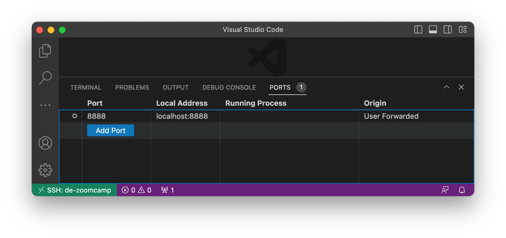

> 7:38/14:15 (5.2.1) Start Jupyter

Start Jupyter notebook in a new folder on the cloud VM.

``` bash
> mkdir notebooks
> cd notebooks
> jupyter notebook
```

> 9:10/14:15 (5.2.1) Start Jupyter

Copy and paste one of the URLs (I have <http://localhost:8888/?token=550c3c075aff45531c9dcc7940daa28f15e3ba9b748b1cb8>)
to the browser.

In Jupyter, create a new notebook with the **Python 3 (ipykernel)**.

We will run this script
([03_test.ipynb](https://github.com/DataTalksClub/data-engineering-zoomcamp/blob/main/week_5_batch_processing/code/03_test.ipynb)).
from the data-engineering-zoomcamp repo.

Run this:

``` python
import pyspark
print(pyspark.__version__)
print(pyspark.__file__)
# 3.3.2
# /home/boisalai/spark/spark-3.3.2-bin-hadoop3/python/pyspark/__init__.py
```

In Jupyter, download the taxi zone lookup file.

``` bash
!wget https://s3.amazonaws.com/nyc-tlc/misc/taxi+_zone_lookup.csv
!head taxi+_zone_lookup.csv
```

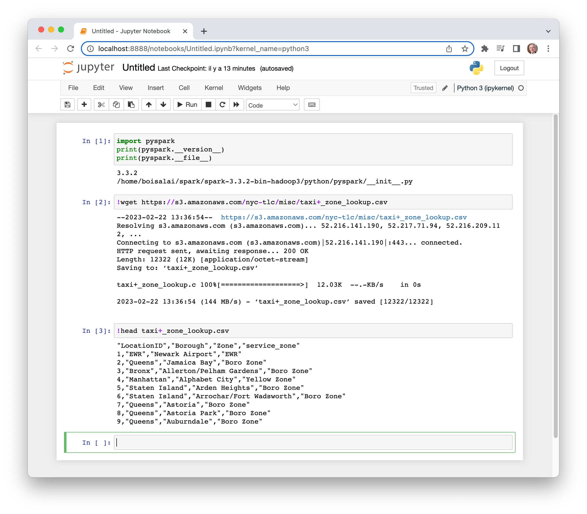

Now, read this file with Spark.

The entry point into all functionality in Spark is the
[SparkSession](https://spark.apache.org/docs/latest/api/python/reference/pyspark.sql/api/pyspark.sql.SparkSession.html)
class.

A SparkSession can be used create
[DataFrame](https://spark.apache.org/docs/latest/api/python/reference/pyspark.sql/api/pyspark.sql.DataFrame.html#pyspark.sql.DataFrame),
register DataFrame as tables, execute SQL over tables, cache tables, and read parquet files.

To create a basic SparkSession, just use `SparkSession.builder`.

Also, we need to set:

- the Spark `master` URL to connect to, such as `local` to run locally, `local[4]` to run locally with 4 cores, or
  `spark://master:7077` to run on a Spark standalone cluster;
- the `appName` for the application, which will be shown in the Spark Web UI. If no application name is set, a randomly
  generated name will be used;
- how to get an existing SparkSession or, if there is no existing one, create a new one based on the options set in this
  builder.

Run this PySpark script into Jupyter.

``` python
import pyspark
from pyspark.sql import SparkSession

spark = SparkSession.builder \
    .master("local[*]") \
    .appName('test') \
    .getOrCreate()

df = spark.read \
    .option("header", "true") \
    .csv('taxi+_zone_lookup.csv')

df.show()
```

We should see this. You can ignore the warnings.

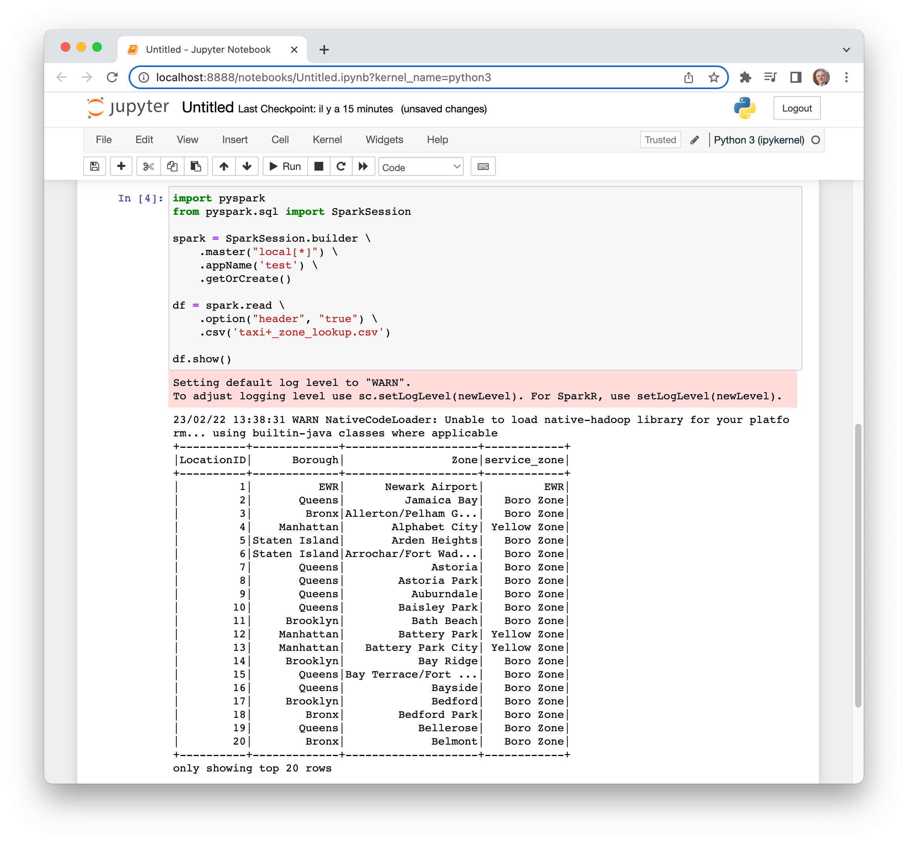

> 11:59/14:15 (5.2.1) Save it to parquet

Test that writing works too.

``` python
df.write.parquet('zones')
!ls -lh
# total 28K
# -rw-rw-r-- 1 boisalai boisalai 6.6K Feb 22 13:43 Untitled.ipynb
# -rw-rw-r-- 1 boisalai boisalai  13K Aug 17  2016 taxi+_zone_lookup.csv
# drwxr-xr-x 2 boisalai boisalai 4.0K Feb 22 13:41 zones
!ls zones/
# _SUCCESS  part-00000-2e2cdbde-082b-4330-9484-ebdaa3e4d743-c000.snappy.parquet
!ls -lh zones/
# total 8.0K
# -rw-r--r-- 1 boisalai boisalai    0 Feb 22 13:41 _SUCCESS
# -rw-r--r-- 1 boisalai boisalai 5.8K Feb 22 13:41 part-00000-2e2cdbde-082b-4330-9484-ebdaa3e4d743-c000.snappy.parquet
```

> 12:40/14:15 (5.2.1) One more thing…​

In VS Code, open the terminal, and open the port `4040`. Then open the web browser to `localhost:4040/jobs/`.

We should see this.

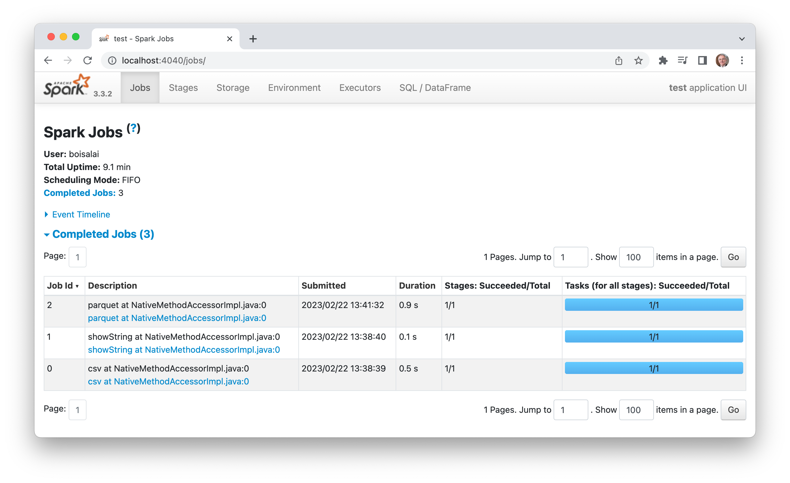

Every SparkContext launches a web UI, by default on port 4040, that displays useful information about the application.
This includes:

- A list of scheduler stages and tasks
- A summary of RDD sizes and memory usage
- Environmental information
- Information about the running executors

You can access this interface by simply opening `http://<driver-node>:4040` in a web browser. If multiple SparkContexts
are running on the same host, they will bind to successive ports beginning with 4040 (4041, 4042, etc).

See [Monitoring and Instrumentation](https://spark.apache.org/docs/2.2.3/monitoring.html) for more.

## First Look at Spark/PySpark

> 0:00/18:14 (5.3.1) First Look at Spark/PySpark

We will cover:

- Reading CSV files
- Partitions
- Saving data to Parquet for local experiments
- Spark master UI

### Start Jupyter on remote machine

Run enter to the remote machine and clone a latest version of the data-engineering-zoomcamp repo.

``` bash
> ssh de-zoomcamp
> git clone https://github.com/DataTalksClub/data-engineering-zoomcamp.git
```

Start Jupyter notebook on the cloud VM.

``` bash
> cd
> cd data-engineering-zoomcamp/
> cd week_5_batch_processing/
> jupyter notebook
```

Copy and paste one of the URLs (I have <http://localhost:8888/?token=867547600579e51683e76441800b4b7b4a9213b4de12fcd8>)
to the web browser.

Make sure ports `8888` and `4040` are open. If not, see instructions in previous section.

### Read file with PySpark

> 1:32/18:14 (5.3.1) Create a new notebook

Create a new notebook with the **Python 3 (ipykernel)**, or open `code/04_pyspark.ipynb` file directly.

Open a Spark session.

``` python
import pyspark
from pyspark.sql import SparkSession

spark = SparkSession.builder \
    .master("local[*]") \
    .appName('test') \
    .getOrCreate()
```

Download this file.

``` python
!wget https://github.com/DataTalksClub/nyc-tlc-data/releases/download/fhvhv/fhvhv_tripdata_2021-01.csv.gz
```

Unzip it.

``` bash
%%sh
gzip -d fhvhv_tripdata_2021-01.csv.gz
!ls -lh fhvhv_tripdata_2021-01.*
# -rw-rw-r-- 1 boisalai boisalai 718M Jul 14  2022 fhvhv_tripdata_2021-01.csv
!wc -l fhvhv_tripdata_2021-01.csv
# 11908469 fhvhv_tripdata_2021-01.csv
```

> 3:18/18:14 (5.3.1) Read this file with Spark

``` python
df = spark.read \
    .option("header", "true") \
    .csv('fhvhv_tripdata_2021-01.csv')

df.show()
```

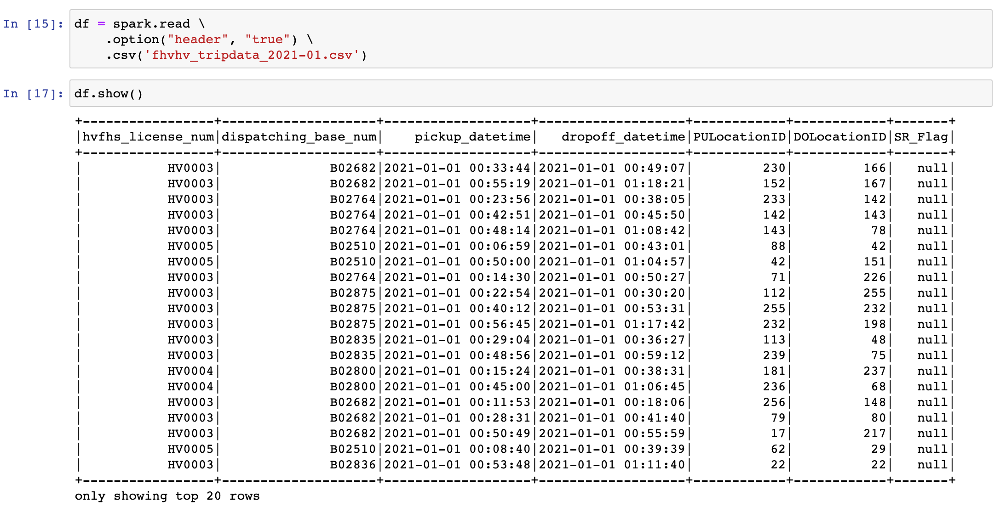

### Define the structure of the DataFrame

Prints out the schema in the tree format.

``` python
>>> df.printSchema()
root
 |-- hvfhs_license_num: string (nullable = true)
 |-- dispatching_base_num: string (nullable = true)
 |-- pickup_datetime: string (nullable = true)
 |-- dropoff_datetime: string (nullable = true)
 |-- PULocationID: string (nullable = true)
 |-- DOLocationID: string (nullable = true)
 |-- SR_Flag: string (nullable = true)
```

We see that the columns are all in string. By default, Spark does not try to infer column types.

Prints the first 5 rows.

``` python
>>> df.head(5)
[Row(hvfhs_license_num='HV0003', dispatching_base_num='B02682', pickup_datetime='2021-01-01 00:33:44',
dropoff_datetime='2021-01-01 00:49:07', PULocationID='230', DOLocationID='166', SR_Flag=None),
 Row(hvfhs_license_num='HV0003', dispatching_base_num='B02682', pickup_datetime='2021-01-01 00:55:19',
 dropoff_datetime='2021-01-01 01:18:21', PULocationID='152', DOLocationID='167', SR_Flag=None),
 Row(hvfhs_license_num='HV0003', dispatching_base_num='B02764', pickup_datetime='2021-01-01 00:23:56',
 dropoff_datetime='2021-01-01 00:38:05', PULocationID='233', DOLocationID='142', SR_Flag=None),
 Row(hvfhs_license_num='HV0003', dispatching_base_num='B02764', pickup_datetime='2021-01-01 00:42:51',
 dropoff_datetime='2021-01-01 00:45:50', PULocationID='142', DOLocationID='143', SR_Flag=None),
 Row(hvfhs_license_num='HV0003', dispatching_base_num='B02764', pickup_datetime='2021-01-01 00:48:14',
 dropoff_datetime='2021-01-01 01:08:42', PULocationID='143', DOLocationID='78', SR_Flag=None)]
```

> 4:43/18:14 (5.3.1) Read the first rows of this file with pandas

Create a file with only the first 1001 lines.

``` python
!head -n 1001 fhvhv_tripdata_2021-01.csv > head.csv
```

Read this small file in pandas.

``` python
>>> import pandas as pd
>>> df_pandas = pd.read_csv('head.csv')
>>> df_pandas.info()
<class 'pandas.core.frame.DataFrame'>
RangeIndex: 1000 entries, 0 to 999
Data columns (total 7 columns):
 #   Column                Non-Null Count  Dtype
---  ------                --------------  -----
 0   hvfhs_license_num     1000 non-null   object
 1   dispatching_base_num  1000 non-null   object
 2   pickup_datetime       1000 non-null   object
 3   dropoff_datetime      1000 non-null   object
 4   PULocationID          1000 non-null   int64
 5   DOLocationID          1000 non-null   int64
 6   SR_Flag               0 non-null      float64
dtypes: float64(1), int64(2), object(4)
memory usage: 54.8+ KB
```

> 6:08/18:14 (5.3.1) Enforce a custom schema

Create a Spark
[DataFrame](https://spark.apache.org/docs/3.1.1/api/python/reference/api/pyspark.sql.DataFrame.html#pyspark.sql.DataFrame)
from a pandas.DataFrame.

``` python
>>> spark.createDataFrame(df_pandas).schema
StructType([
    StructField('hvfhs_license_num', StringType(), True),
    StructField('dispatching_base_num', StringType(), True),
    StructField('pickup_datetime', StringType(), True),
    StructField('dropoff_datetime', StringType(), True),
    StructField('PULocationID', LongType(), True),
    StructField('DOLocationID', LongType(), True),
    StructField('SR_Flag', DoubleType(), True)
])

>>> spark.createDataFrame(df_pandas).printSchema()
root
 |-- hvfhs_license_num: string (nullable = true)
 |-- dispatching_base_num: string (nullable = true)
 |-- pickup_datetime: string (nullable = true)
 |-- dropoff_datetime: string (nullable = true)
 |-- PULocationID: long (nullable = true)
 |-- DOLocationID: long (nullable = true)
 |-- SR_Flag: double (nullable = true)
```

Spark provides `spark.sql.types.StructType` class to define the structure of the DataFrame and It is a collection or
list on StructField objects.

Spark provides `` spark.sql.types.StructField` `` class to define the column name(String), column type (DataType),
nullable column (Boolean) and metadata (MetaData)

All of the data types shown below are supported in Spark and the DataType class is a base class for all them.

- StringType
- ArrayType
- MapType
- StructType
- DateType
- TimestampType
- BooleanType
- CalendarIntervalType
- BinaryType
- NumericType
- ShortType
- IntegerType
- LongType
- FloatType
- DoubleType
- DecimalType
- ByteType
- HiveStringType
- ObjectType
- NullType

See [Spark SQL Data Types with Examples](https://sparkbyexamples.com/spark/spark-sql-dataframe-data-types/) for more.

So, the preferred option while reading any file would be to enforce a custom schema, this ensures that the data types
are consistent and avoids any unexpected behavior.

In order to do that you first declare the schema to be enforced, and then read the data by setting `schema` option.

``` python
from pyspark.sql import types

schema = types.StructType([
    types.StructField('hvfhs_license_num', types.StringType(), True),
    types.StructField('dispatching_base_num', types.StringType(), True),
    types.StructField('pickup_datetime', types.TimestampType(), True),
    types.StructField('dropoff_datetime', types.TimestampType(), True),
    types.StructField('PULocationID', types.IntegerType(), True),
    types.StructField('DOLocationID', types.IntegerType(), True),
    types.StructField('SR_Flag', types.StringType(), True)
])

df = spark.read \
    .option("header", "true") \
    .schema(schema) \
    .csv('fhvhv_tripdata_2021-01.csv')

df.printSchema()
```

We should see this.

``` txt
root
 |-- hvfhs_license_num: string (nullable = true)
 |-- dispatching_base_num: string (nullable = true)
 |-- pickup_datetime: timestamp (nullable = true)
 |-- dropoff_datetime: timestamp (nullable = true)
 |-- PULocationID: integer (nullable = true)
 |-- DOLocationID: integer (nullable = true)
 |-- SR_Flag: string (nullable = true)
```

**Note**: The other way to infer the schema (apart from pandas) for the csv files, is to set the `inferSchema` option to
`true` while reading the files in Spark.

### Save as partitioned parquet files

> 10:18/18:14 (5.3.1) Save as parquet files.

Spark/PySpark partitioning is a way to split the data into multiple partitions so that you can execute transformations
on multiple partitions in parallel which allows completing the job faster. See [Spark Partitioning & Partition
Understanding](https://sparkbyexamples.com/spark/spark-partitioning-understanding/) for more.

Spark DataFrame `repartition()` method is used to increase or decrease the partitions. This is very expensive operation
as it shuffle the data across many partitions hence try to minimize repartition as much as possible.

Let’s run this.

``` python
df = df.repartition(24)
df.write.parquet('fhvhv/2021/01/')
```

In the Spark master UI, we a lot information about this job.

<table>
<tr><td>
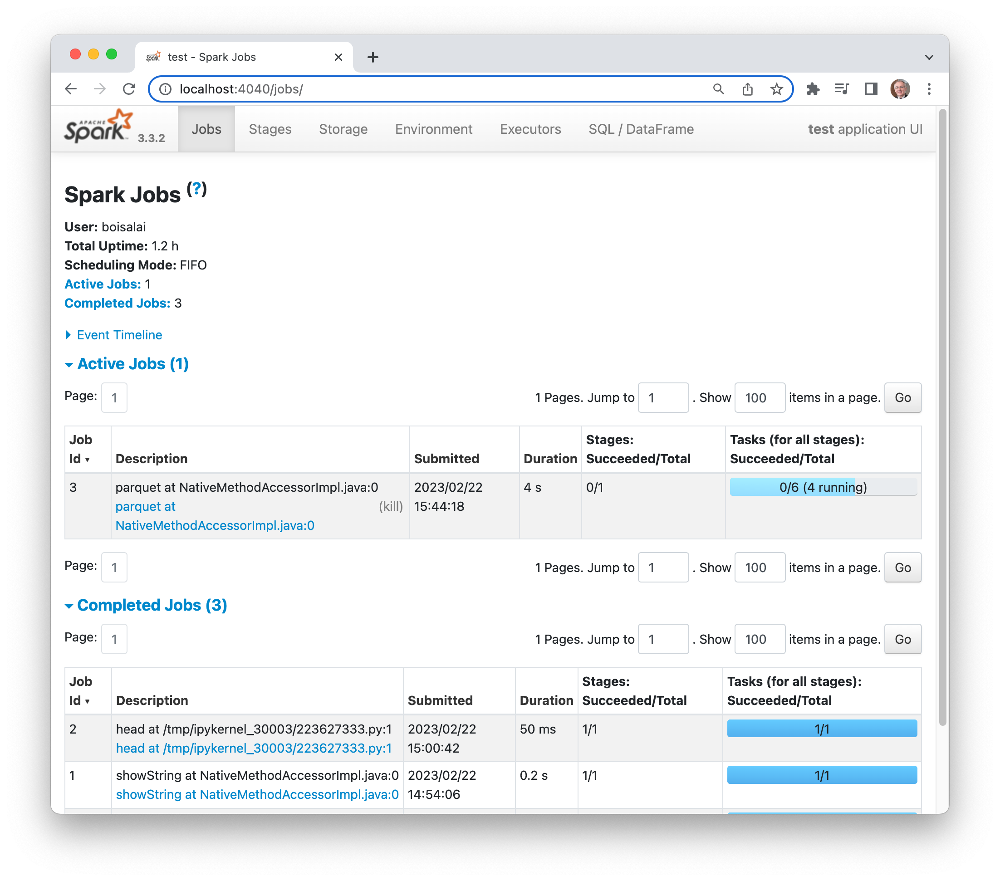
</td><td>

</td></tr>
</table>

On the remote machine, we can see 24 parquet files created in `fhvhv/2021/01` folder.

## Spark DataFrames

> 0:00/14:09 (5.3.2)

We will cover:

- Actions vs tranfromations
- Functions and UDFs

We can read the parquet files that we created in the last section with this command.

``` python
>>> df = spark.read.parquet('fhvhv/2021/01/')
>>> df.printSchema()
root
 |-- hvfhs_license_num: string (nullable = true)
 |-- dispatching_base_num: string (nullable = true)
 |-- pickup_datetime: timestamp (nullable = true)
 |-- dropoff_datetime: timestamp (nullable = true)
 |-- PULocationID: integer (nullable = true)
 |-- DOLocationID: integer (nullable = true)
 |-- SR_Flag: string (nullable = true)
```

> 1:38/14:09 (5.3.2) Select

[DataFrame.select](https://spark.apache.org/docs/latest/api/python/reference/pyspark.sql/api/pyspark.sql.DataFrame.select.html)
DataFrame.select is a transformation function that returns a new DataFrame with the desired columns as specified in the
inputs.

[DataFrame.filter](https://spark.apache.org/docs/latest/api/python/reference/pyspark.sql/api/pyspark.sql.DataFrame.filter.html)
filters rows using the given condition.

For example…​

``` python
df.select('pickup_datetime', 'dropoff_datetime', 'PULocationID', 'DOLocationID') \
  .filter(df.hvfhs_license_num == 'HV0003')
```

I we run this code, nothing happens. The execution is Lazy by default for Spark. This means all the operations over an
RDD/DataFrame/Dataset are never computed until the action is called.

### Actions vs Transformations

> 3:10/14:09 (5.3.2) Actions vs Transformations

Spark support two types of operations: **transformations**, which create a new dataset from an existing one, and
**actions**, which return a value to the driver program after running a computation on the dataset.

All transformations in Spark are lazy, in that they do not compute their results right away. Instead, they just remember
the transformations applied to some base dataset (e.g. a file). The transformations are only computed when an action
requires a result to be returned to the driver program. This design enables Spark to run more efficiently.

- Transformations: Lazy (not executed immediatly)
  - Selecting columns
  - Filtering
  - Join, GroupBy
  - etc.
- Actions: Eager (executed immediatly)
  - Show, Take, Head
  - Write
  - etc.

See [RDD Programming Guide](https://spark.apache.org/docs/latest/rdd-programming-guide.html) for more information.

- [Transformations](https://spark.apache.org/docs/latest/rdd-programming-guide.html#transformations)
- [Actions](https://spark.apache.org/docs/latest/rdd-programming-guide.html#actions)

So, to make the computation happen, we must add instruction like `.show()`.

``` python
df.select('pickup_datetime', 'dropoff_datetime', 'PULocationID', 'DOLocationID') \
  .filter(df.hvfhs_license_num == 'HV0003')
  .show()
```

### Functions avalaible in Spark

> 6:50/14:09 (5.3.2) Functions avalaible in Spark

Spark comes with a lot of
[functions](https://spark.apache.org/docs/latest/api/python/reference/pyspark.sql/functions.html).

Run this.

``` python
from pyspark.sql import functions as F
```

I a new cell, insert `F.` and press on `Tab` to show completion options.

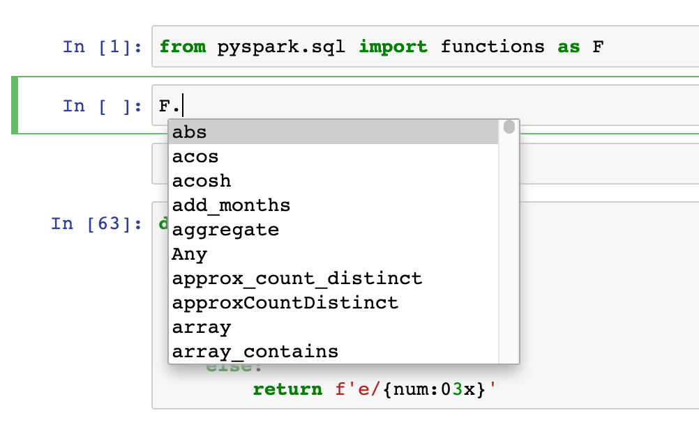

Here is an example using functions.

``` python
df \
    .withColumn('pickup_date', F.to_date(df.pickup_datetime)) \
    .withColumn('dropoff_date', F.to_date(df.dropoff_datetime)) \
    .select('pickup_date', 'dropoff_date', 'PULocationID', 'DOLocationID') \
    .show()
```

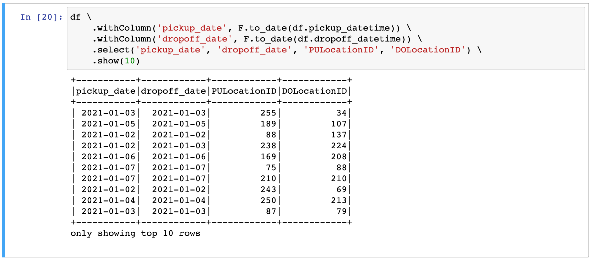

### User defined functions (UDF)

> 9:23/14:09 (5.3.2) User defined functions

User-Defined Functions (UDFs) are user-programmable routines that act on one row. See [Scalar User Defined Functions
(UDFs)](https://spark.apache.org/docs/latest/sql-ref-functions-udf-scalar.html) and
[functions.udf](https://spark.apache.org/docs/latest/api/python/reference/pyspark.sql/api/pyspark.sql.functions.udf.html#pyspark.sql.functions.udf)
for more information.

Here is an example using an UDF.

``` python
def crazy_stuff(base_num):
    num = int(base_num[1:])
    if num % 7 == 0:
        return f's/{num:03x}'
    elif num % 3 == 0:
        return f'a/{num:03x}'
    else:
        return f'e/{num:03x}'

crazy_stuff('B02884')  # Return 's/b44'

crazy_stuff_udf = F.udf(crazy_stuff, returnType=types.StringType())

df \
    .withColumn('pickup_date', F.to_date(df.pickup_datetime)) \
    .withColumn('dropoff_date', F.to_date(df.dropoff_datetime)) \
    .withColumn('base_id', crazy_stuff_udf(df.dispatching_base_num)) \
    .select('base_id', 'pickup_date', 'dropoff_date', 'PULocationID', 'DOLocationID') \
    .show(5)
```

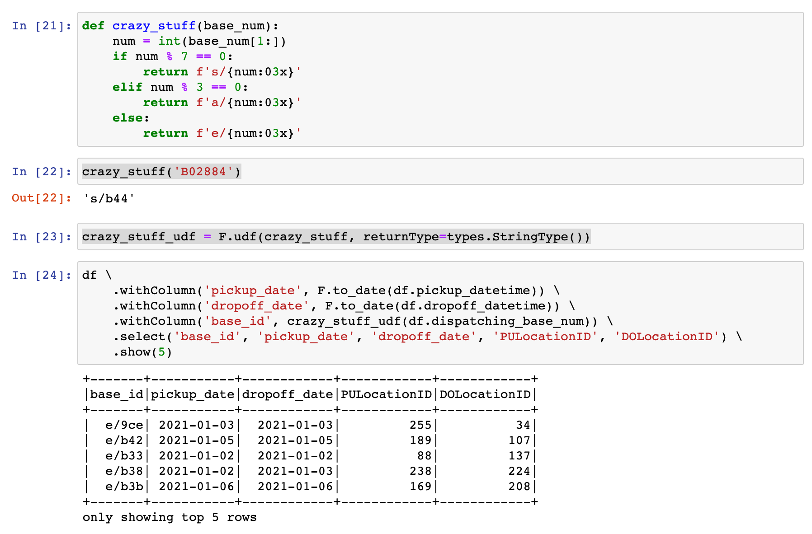

## Spark SQL

> 0:00/15:32 (5.4.3)

We will cover:

- Temporary tables
- Some simple queries from week 4

### Prepare the data

Edit and change the `URL_PREFIX` of the

Modify `code/download_data.sh` file like this.

**File `code/download_data.sh`**

``` bash
set -e

URL_PREFIX="https://github.com/DataTalksClub/nyc-tlc-data/releases/download"

for TAXI_TYPE in "yellow" "green"
do
    for YEAR in 2020 2021
    do
        for MONTH in {1..12}
        do

        if [ $YEAR == 2020 ] || [ $MONTH -lt 8 ]
        then
            FMONTH=`printf "%02d" ${MONTH}`

            URL="${URL_PREFIX}/${TAXI_TYPE}/${TAXI_TYPE}_tripdata_${YEAR}-${FMONTH}.csv.gz"

            LOCAL_PREFIX="data/raw/${TAXI_TYPE}/${YEAR}/${FMONTH}"
            LOCAL_FILE="${TAXI_TYPE}_tripdata_${YEAR}_${FMONTH}.csv.gz"
            LOCAL_PATH="${LOCAL_PREFIX}/${LOCAL_FILE}"

            echo "donwloading ${URL} to ${LOCAL_PATH}"
            mkdir -p ${LOCAL_PREFIX}
            wget ${URL} -O ${LOCAL_PATH}
        fi
        done
    done
done
```

Run `./download_data.sh`.

In Jupyter, create a new note with **Python 3 (ipykernel)** and run the code below.

**File `05_taxi_schema.ipynb`**

``` python
import pyspark
from pyspark.sql import SparkSession

spark = SparkSession.builder \
    .master("local[*]") \
    .appName('test') \
    .getOrCreate()

import pandas as pd

from pyspark.sql import types

green_schema = types.StructType([
    types.StructField("VendorID", types.IntegerType(), True),
    types.StructField("lpep_pickup_datetime", types.TimestampType(), True),
    types.StructField("lpep_dropoff_datetime", types.TimestampType(), True),
    types.StructField("store_and_fwd_flag", types.StringType(), True),
    types.StructField("RatecodeID", types.IntegerType(), True),
    types.StructField("PULocationID", types.IntegerType(), True),
    types.StructField("DOLocationID", types.IntegerType(), True),
    types.StructField("passenger_count", types.IntegerType(), True),
    types.StructField("trip_distance", types.DoubleType(), True),
    types.StructField("fare_amount", types.DoubleType(), True),
    types.StructField("extra", types.DoubleType(), True),
    types.StructField("mta_tax", types.DoubleType(), True),
    types.StructField("tip_amount", types.DoubleType(), True),
    types.StructField("tolls_amount", types.DoubleType(), True),
    types.StructField("ehail_fee", types.DoubleType(), True),
    types.StructField("improvement_surcharge", types.DoubleType(), True),
    types.StructField("total_amount", types.DoubleType(), True),
    types.StructField("payment_type", types.IntegerType(), True),
    types.StructField("trip_type", types.IntegerType(), True),
    types.StructField("congestion_surcharge", types.DoubleType(), True)
])

yellow_schema = types.StructType([
    types.StructField("VendorID", types.IntegerType(), True),
    types.StructField("tpep_pickup_datetime", types.TimestampType(), True),
    types.StructField("tpep_dropoff_datetime", types.TimestampType(), True),
    types.StructField("passenger_count", types.IntegerType(), True),
    types.StructField("trip_distance", types.DoubleType(), True),
    types.StructField("RatecodeID", types.IntegerType(), True),
    types.StructField("store_and_fwd_flag", types.StringType(), True),
    types.StructField("PULocationID", types.IntegerType(), True),
    types.StructField("DOLocationID", types.IntegerType(), True),
    types.StructField("payment_type", types.IntegerType(), True),
    types.StructField("fare_amount", types.DoubleType(), True),
    types.StructField("extra", types.DoubleType(), True),
    types.StructField("mta_tax", types.DoubleType(), True),
    types.StructField("tip_amount", types.DoubleType(), True),
    types.StructField("tolls_amount", types.DoubleType(), True),
    types.StructField("improvement_surcharge", types.DoubleType(), True),
    types.StructField("total_amount", types.DoubleType(), True),
    types.StructField("congestion_surcharge", types.DoubleType(), True)
])

for taxi_type in ["yellow", "green"]:
    if taxi_type == "yellow":
        schema = yellow_schema
    else:
        schema = green_schema

    for year in [2020, 2021]:
        for month in range(1, 13):
            if year == 2020 or month < 8:
                print(f'processing data for {taxi_type}/{year}/{month}')

                input_path = f'data/raw/{taxi_type}/{year}/{month:02d}/'
                output_path = f'data/pq/{taxi_type}/{year}/{month:02d}/'

                df_green = spark.read \
                    .option("header", "true") \
                    .schema(schema) \
                    .csv(input_path)

                df_green \
                    .repartition(4) \
                    .write.parquet(output_path)
```

This code will take time to run.

### Read parquet files with Spark

> 0:59/15:32 (5.4.3) Read

In Jupyter, create a new note with **Python 3 (ipykernel)** with this code (or simply open `06_spark.sql.ipynb`).

**File `06_spark.sql.ipynb`**

``` python
import pyspark
from pyspark.sql import SparkSession

spark = SparkSession.builder \
    .master("local[*]") \
    .appName('test') \
    .getOrCreate()

df_green = spark.read.parquet('data/pq/green/*/*')
df_yellow = spark.read.parquet('data/pq/yellow/*/*')
```

### Combine two datasets into one

> 2:21/15:32 (5.4.3) Combine these two files into one

We will create `trips_data` which is the combination of files `df_green` and `df_yellow`.

``` python
# Rename some columns.
df_green = df_green \
    .withColumnRenamed('lpep_pickup_datetime', 'pickup_datetime') \
    .withColumnRenamed('lpep_dropoff_datetime', 'dropoff_datetime')
df_yellow = df_yellow \
    .withColumnRenamed('tpep_pickup_datetime', 'pickup_datetime') \
    .withColumnRenamed('tpep_dropoff_datetime', 'dropoff_datetime')

# Create the list of columns present in the two datasets
# while preserving the order of the columns of the green dataset.
common_colums = []
yellow_columns = set(df_yellow.columns)

for col in df_green.columns:
    if col in yellow_columns:
        common_colums.append(col)

# Create a column `service_type` indicating where the data comes from.
from pyspark.sql import functions as F

df_green_sel = df_green \
    .select(common_colums) \
    .withColumn('service_type', F.lit('green'))

df_yellow_sel = df_yellow \
    .select(common_colums) \
    .withColumn('service_type', F.lit('yellow'))

# Create a new DataFrame containing union of rows of green and yellow DataFrame.
df_trips_data = df_green_sel.unionAll(df_yellow_sel)
```

See
[DataFrame.unionAll](https://spark.apache.org/docs/latest/api/python/reference/pyspark.sql/api/pyspark.sql.DataFrame.unionAll.html)
for more information.

To check if the combination of the two files worked, run the following code

``` python
df_trips_data.groupBy('service_type').count().show()
```

We should see this.

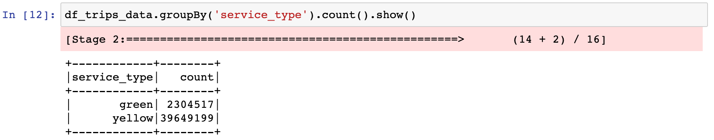

### Querying this data with SQL

> 8:00/15:32 (5.4.3) Using SQL

First, let’s get all column names as a list.

``` python
>>> df_trips_data.columns
['VendorID',
 'pickup_datetime',
 'dropoff_datetime',
 'store_and_fwd_flag',
 'RatecodeID',
 'PULocationID',
 'DOLocationID',
 'passenger_count',
 'trip_distance',
 'fare_amount',
 'extra',
 'mta_tax',
 'tip_amount',
 'tolls_amount',
 'improvement_surcharge',
 'total_amount',
 'payment_type',
 'congestion_surcharge',
 'service_type']
```

Write a query. We also need to create a local temporary view with the DataFrame. See
[DataFrame.createOrReplaceTempView](https://spark.apache.org/docs/3.1.3/api/python/reference/api/pyspark.sql.DataFrame.createOrReplaceTempView.html).

``` python
# df_trips_data.registerTempTable('trips_data') # Deprecated.
df_trips_data.createOrReplaceTempView("trips_data")

spark.sql("""
SELECT
    service_type,
    count(1)
FROM
    trips_data
GROUP BY
    service_type
""").show()
```

We should see this.

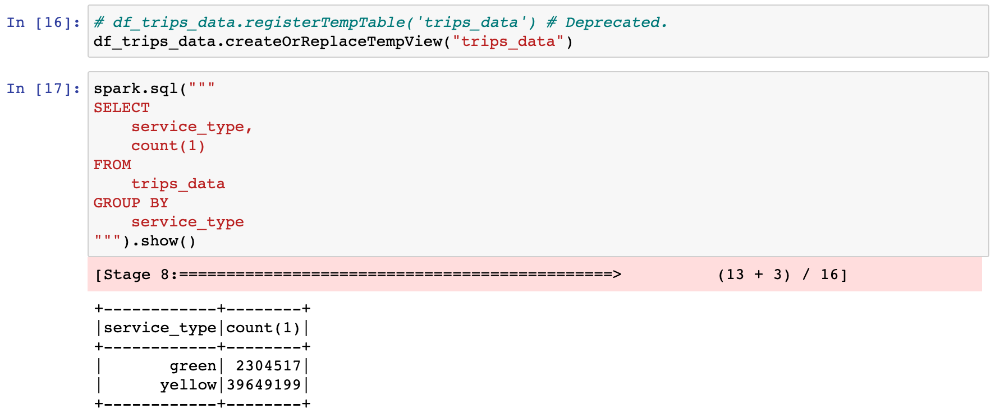

We can execute a more complicated query like this.

``` python
df_result = spark.sql("""
SELECT
    -- Reveneue grouping
    PULocationID AS revenue_zone,
    date_trunc('month', pickup_datetime) AS revenue_month,
    service_type,

    -- Revenue calculation
    SUM(fare_amount) AS revenue_monthly_fare,
    SUM(extra) AS revenue_monthly_extra,
    SUM(mta_tax) AS revenue_monthly_mta_tax,
    SUM(tip_amount) AS revenue_monthly_tip_amount,
    SUM(tolls_amount) AS revenue_monthly_tolls_amount,
    SUM(improvement_surcharge) AS revenue_monthly_improvement_surcharge,
    SUM(total_amount) AS revenue_monthly_total_amount,
    SUM(congestion_surcharge) AS revenue_monthly_congestion_surcharge,

    -- Additional calculations
    AVG(passenger_count) AS avg_montly_passenger_count,
    AVG(trip_distance) AS avg_montly_trip_distance
FROM
    trips_data
GROUP BY
    1, 2, 3
""")
```

### Save the results

> 10:55/15:32 (5.4.3) Save the results

The `coalesce()` is used to decrease the number of partitions in an efficient way.

``` python
df_result.coalesce(1).write.parquet('data/report/revenue/', mode='overwrite')
```

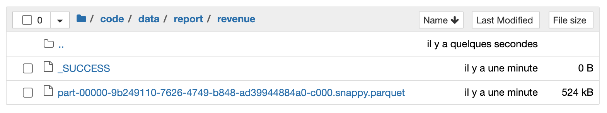

## Anatomy of a Spark Cluster

> 0:00/7:29 (5.4.1) Spark Cluster

We will cover Spark Driver, Master and Executors.

The text below does not cover exactly what the instructor said but still helps to understand the main concepts. The
reader is encouraged to view the [video 5.4.1](https://www.youtube.com/watch?v=68CipcZt7ZA).

### Spark Cluster

**Spark Execution modes**: It is possible to run a spark application using **cluster mode**, **local mode**
(pseudo-cluster) or with an **interactive** shell (*pypsark* or *spark-shell*).

Using cluster mode:

- Spark applications are run as independent sets of processes, coordinated by a SparkContext object in your main program
  (called the *driver program*).
- The *context* connects to the cluster manager *which allocate resources*.
- Each *worker* in the cluster is managed by an *executor*.
- The *executor* manages computation as well as storage and caching on each machine.
- The application code is sent from the *driver* to the executors, and the executors specify the context and the various
  *tasks* to be run.
- The *driver* program must listen for and accept incoming connections from its executors throughout its lifetime


See [Cluster Mode Overview](https://spark.apache.org/docs/3.3.2/cluster-overview.html).

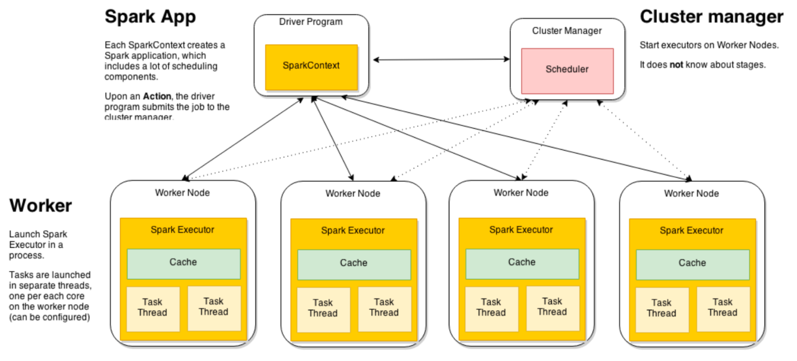

See [Spark Cluster Overview](https://events.prace-ri.eu/event/850/sessions/2616/attachments/955/1528/Spark_Cluster.pdf).

### Cluster and partitions

To distribute work across the cluster and reduce the memory requirements of each node, Spark will split the data into
smaller parts called Partitions. Each of these is then sent to an Executor to be processed. Only one partition is
computed per executor thread at a time, therefore the size and quantity of partitions passed to an executor is directly
proportional to the time it takes to complete.

See [Apache Spark - Performance](https://blog.scottlogic.com/2018/03/22/apache-spark-performance.html) for more.

### Glossary

The following table (from [this page](https://spark.apache.org/docs/3.3.2/cluster-overview.html)) summarizes terms
you’ll see used to refer to cluster concepts:

| **Term**  | **Meaning**  |
|-----------------|----------------------------------------------------------------------------|
| Application | User program built on Spark. Consists of a *driver program* and *executors* on the cluster.  |
| Application jar | A jar containing the user’s Spark application. In some cases users will want to create an "uber jar" containing their application along with its dependencies. The user’s jar should never include Hadoop or Spark libraries, however, these will be added at runtime. |
| Driver program  | The process running the main() function of the application and creating the SparkContext.  |
| Cluster manager | An external service for acquiring resources on the cluster (e.g. standalone manager, Mesos, YARN, Kubernetes). |
| Deploy mode | Distinguishes where the driver process runs. In "cluster" mode, the framework launches the driver inside of the cluster. In "client" mode, the submitter launches the driver outside of the cluster. |
| Worker node | Any node that can run application code in the cluster. |
| Executor  | A process launched for an application on a worker node, that runs tasks and keeps data in memory or disk storage across them. Each application has its own executors.  |
| Task  | A unit of work that will be sent to one executor.  |
| Job | A parallel computation consisting of multiple tasks that gets spawned in response to a Spark action (e.g. save, collect); you’ll see this term used in the driver’s logs.  |
| Stage | Each job gets divided into smaller sets of tasks called stages that depend on each other (similar to the map and reduce stages in MapReduce); you’ll see this term used in the driver’s logs.  |

## GroupBy in Spark

> 0:00/15:08 (5.4.2) GroupBy

We will cover:

- How GroupBy works internally
- Shuffling

### Prepare the data

In Jupyter, run the following script.

``` python
import pyspark
from pyspark.sql import SparkSession

spark = SparkSession.builder \
    .master("local[*]") \
    .appName('test') \
    .getOrCreate()

df_green = spark.read.parquet('data/pq/green/*/*')
df_green.createOrReplaceTempView("green")

df_green_revenue = spark.sql("""
SELECT
    date_trunc('hour', lpep_pickup_datetime) AS hour,
    PULocationID AS zone,

    SUM(total_amount) AS amount,
    COUNT(1) AS number_records
FROM
    green
WHERE
    lpep_pickup_datetime >= '2020-01-01 00:00:00'
GROUP BY
    1, 2
""")

# Materialized the result.
df_green_revenue \
    .repartition(20) \
    .write.parquet('data/report/revenue/green', mode='overwrite')

df_yellow = spark.read.parquet('data/pq/yellow/*/*')
df_yellow.createOrReplaceTempView("yellow")

df_yellow_revenue = spark.sql("""
SELECT
    date_trunc('hour', tpep_pickup_datetime) AS hour,
    PULocationID AS zone,

    SUM(total_amount) AS amount,
    COUNT(1) AS number_records
FROM
    yellow
WHERE
    tpep_pickup_datetime >= '2020-01-01 00:00:00'
GROUP BY
    1, 2
""")

# Materialized the result.
df_yellow_revenue \
    .repartition(20) \
    .write.parquet('data/report/revenue/yellow', mode='overwrite')
```

Run this code to see what the data looks like.

``` python
df_yellow_revenue.show(10)
```

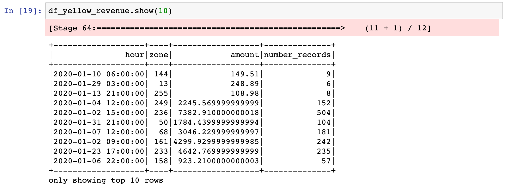

### What exactly Spark is doing

> 4:58/15:08 (5.4.2) What exactly Spark is doing

This diagram shows how Spark works with multiple partitions and clusters to combine files.

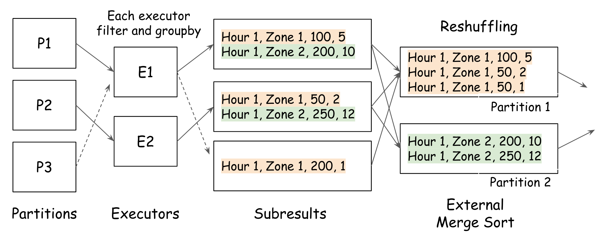

Shuffling is a mechanism Spark uses to redistribute the data across different executors and even across machines.

Shuffle is an expensive operation as it involves moving data across the nodes in your cluster, which involves network
and disk I/O. It is always a good idea to reduce the amount of data that needs to be shuffled. Here are some tips to
reduce shuffle:

- Tune the `spark.sql.shuffle.partitions`.
- Partition the input dataset appropriately so each task size is not too big.
- Use the Spark UI to study the plan to look for opportunity to reduce the shuffle as much as possible.
- Formula recommendation for `spark.sql.shuffle.partitions`:
  - For large datasets, aim for anywhere from 100MB to less than 200MB task target size for a partition (use target size
    of 100MB, for example).
  - `spark.sql.shuffle.partitions` = quotient (shuffle stage input size/target size)/total cores) \* total cores.

See [Explore best practices for Spark performance
optimization](https://developer.ibm.com/blogs/spark-performance-optimization-guidelines/) for more information.

## Joins in Spark

> 0:00/17:04 (5.4.3) Joins in Spark

We will cover:

- Joining two large tables
- Merge sort join
- Joining one large and one small table
- Broadcasting

### Joining two large tables

> 0:42/17:04 (5.4.3) Joining

Spark can join two tables quite easily. The syntax is easy to understand.

``` python
df_green_revenue = spark.read.parquet('data/report/revenue/green')
df_yellow_revenue = spark.read.parquet('data/report/revenue/yellow')

df_green_revenue_tmp = df_green_revenue \
    .withColumnRenamed('amount', 'green_amount') \
    .withColumnRenamed('number_records', 'green_number_records')

df_yellow_revenue_tmp = df_yellow_revenue \
    .withColumnRenamed('amount', 'yellow_amount') \
    .withColumnRenamed('number_records', 'yellow_number_records')

df_join = df_green_revenue_tmp.join(df_yellow_revenue_tmp, on=['hour', 'zone'], how='outer')

# Materialized the result.
df_join.write.parquet('data/report/revenue/total', mode='overwrite')

df_join.show(5)
```

We should see this.

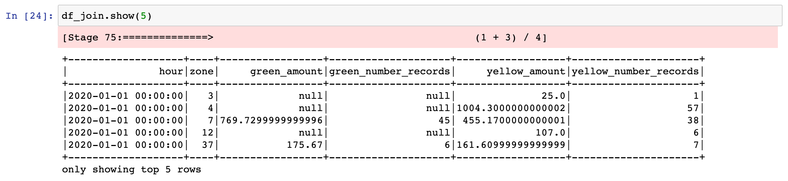

### What exactly Spark is doing

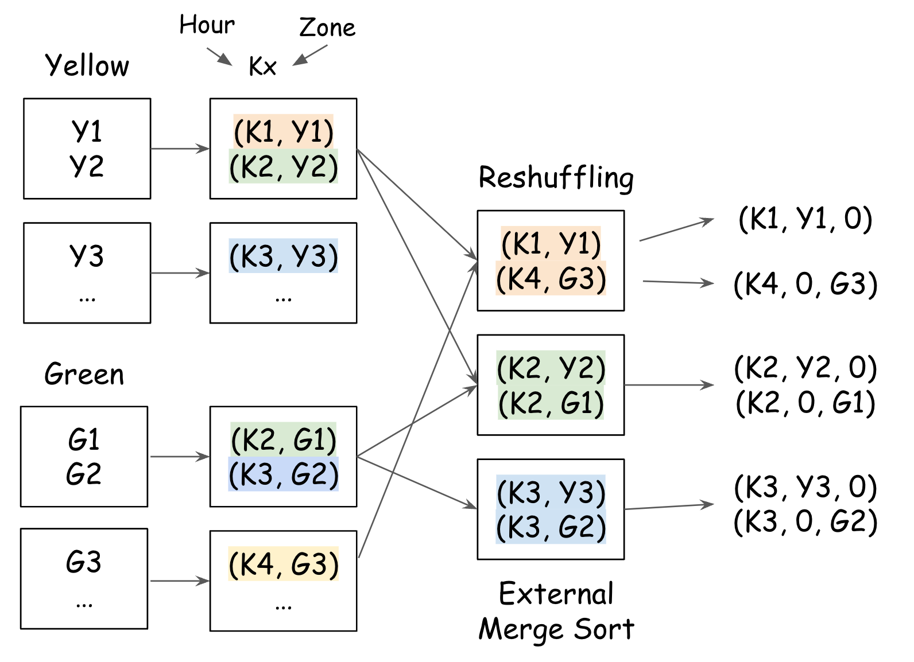

### Joining zones

> 11:32/17:04 (5.4.3) Joining zones

Read the result previously created.

``` python
>>> df_join = spark.read.parquet('data/report/revenue/total')
>>> df_join.printSchema()
root
 |-- hour: timestamp (nullable = true)
 |-- zone: integer (nullable = true)
 |-- green_amount: double (nullable = true)
 |-- green_number_records: long (nullable = true)
 |-- yellow_amount: double (nullable = true)
 |-- yellow_number_records: long (nullable = true)
>>> df_join.show(5)
```

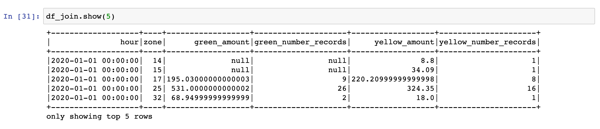

Read the zones.

``` python
>>> !wget https://s3.amazonaws.com/nyc-tlc/misc/taxi+_zone_lookup.csv
>>> df = spark.read.option("header", "true").csv('taxi+_zone_lookup.csv')
>>> df.write.parquet('zones')
>>> df_zones = spark.read.parquet('zones/')
>>> df_zones.printSchema()
root
 |-- LocationID: string (nullable = true)
 |-- Borough: string (nullable = true)
 |-- Zone: string (nullable = true)
 |-- service_zone: string (nullable = true)
>>> df_zones.show(5)
```

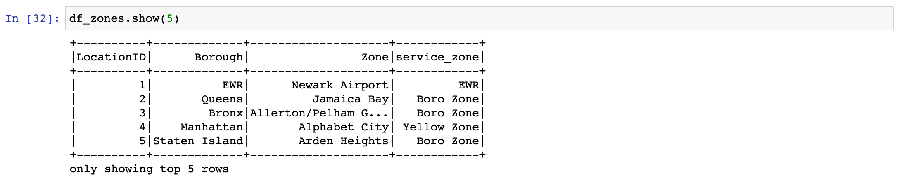

Join this two datasets and materialized the result.

``` python
df_result = df_join.join(df_zones, df_join.zone == df_zones.LocationID)
df_result.drop('LocationID', 'zone').write.parquet('tmp/revenue-zones')
```

### What exactly Spark is doing

> 14:40/17:04 (5.4.3) What happens

- Each executor processes a partition of Revenue DataFrame.
- Zones DataFrame is a small table.
- Because Zones is very small, each executor gets a copy of the entire Zones DataFrame and merges it with their
  partition of Revenue DataFrame within memory.
- Spark broadcast joins are perfect for joining a large DataFrame with a small DataFrame.
  - Spark can "broadcast" a small DataFrame by sending all the data in that small DataFrame to all nodes in the cluster.
  - After the small DataFrame is broadcasted, Spark can perform a join without shuffling any of the data in the large
    DataFrame.
- This is really (really!) fast.

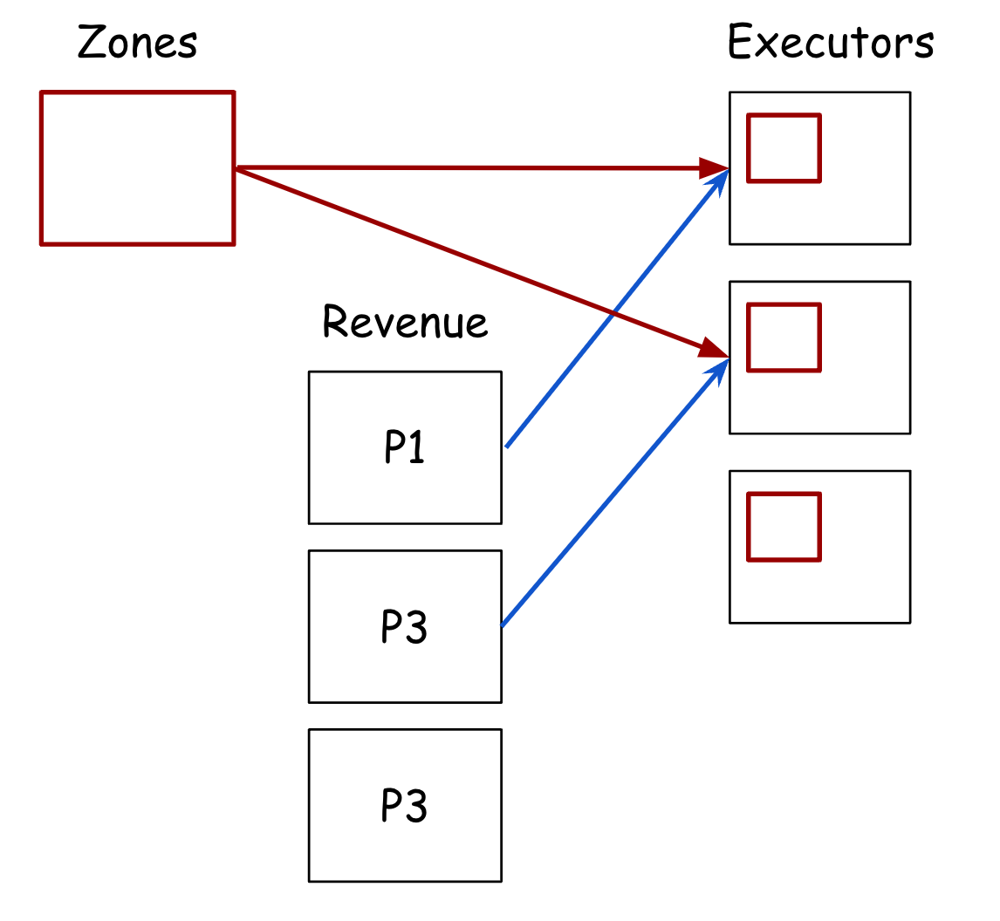

## RDDs

I don't have any notes about RDD yet.

In the meantime, see :

- [RDD Programming Guide](https://spark.apache.org/docs/latest/rdd-programming-guide.html).
- [Resilient Distributed Dataset (RDD)](https://www.databricks.com/glossary/what-is-rdd) on databricks.
- [Spark RDD Tutorial | Learn with Scala Examples](https://sparkbyexamples.com/spark-rdd-tutorial/).

Last updated: February 23, 2023
