# Week 5: Batch Processing

## Materials

See [Week 5: Batch
Processing](https://github.com/DataTalksClub/data-engineering-zoomcamp/blob/main/week_5_batch_processing) on GitHub.

Youtube videos:

- [DE Zoomcamp 5.1.1 - Introduction to Batch processing](https://www.youtube.com/watch?v=dcHe5Fl3MF8)
- [DE Zoomcamp 5.1.2 - Introduction to Spark](https://www.youtube.com/watch?v=FhaqbEOuQ8U)
- [DE Zoomcamp 5.2.1 - (Optional) Installing Spark on Linux](https://www.youtube.com/watch?v=hqUbB9c8sKg)
- [DE Zoomcamp 5.3.1 - First Look at Spark/PySpark](https://www.youtube.com/watch?v=r_Sf6fCB40c)
- [DE Zoomcamp 5.3.2 - Spark DataFrames](https://www.youtube.com/watch?v=ti3aC1m3rE8)
- [DE Zoomcamp 5.3.3 - (Optional) Preparing Yellow and Green Taxi Data](https://www.youtube.com/watch?v=CI3P4tAtru4)
- [DE Zoomcamp 5.3.4 - SQL with Spark](https://www.youtube.com/watch?v=uAlp2VuZZPY)
- [DE Zoomcamp 5.4.1 - Anatomy of a Spark Cluster](https://www.youtube.com/watch?v=68CipcZt7ZA)
- [DE Zoomcamp 5.4.2 - GroupBy in Spark](https://www.youtube.com/watch?v=9qrDsY_2COo)
- [DE Zoomcamp 5.4.3 - Joins in Spark](https://www.youtube.com/watch?v=lu7TrqAWuH4)
- [DE Zoomcamp 5.5.1 - (Optional) Operations on Spark RDDs](https://www.youtube.com/watch?v=Bdu-xIrF3OM)
- [DE Zoomcamp 5.5.2 - (Optional) Spark RDD mapPartition](https://www.youtube.com/watch?v=k3uB2K99roI)
- [DE Zoomcamp 5.6.1 - Connecting to Google Cloud Storage](https://www.youtube.com/watch?v=Yyz293hBVcQ)
- [DE Zoomcamp 5.6.2 - Creating a Local Spark Cluster](https://www.youtube.com/watch?v=HXBwSlXo5IA)
- [DE Zoomcamp 5.6.3 - Setting up a Dataproc Cluster](https://www.youtube.com/watch?v=osAiAYahvh8)
- [DE Zoomcamp 5.6.4 - Connecting Spark to Big Query](https://www.youtube.com/watch?v=HIm2BOj8C0Q)

## 5.1 Introduction

### 5.1.1 Introduction to Batch processing

> 0:00/9:30 (5.1.1) What we will cover in this week.

This week, we’ll dive into Batch Processing.

We’ll cover:

- Spark, Spark DataFrames, and Spark SQL
- Joins in Spark
- Resilient Distributed Datasets (RDDs)
- Spark internals
- Spark with Docker
- Running Spark in the Cloud
- Connecting Spark to a Data Warehouse (DWH)

> 1:30/9:30 (5.1.1)

We can process data by batch or by streaming.

- **Batch processing** is when the processing and analysis happens on a set of data that have already been stored over a
  period of time.
  - Processing *chunks* of data at *regular intervals*.
  - An example is payroll and billing systems that have to be processed weekly or monthly.
- **Streaming data processing** happens as the data flows through a system. This results in analysis and reporting of
  events as it happens.
  - processing data *on the fly*.
  - An example would be fraud detection or intrusion detection.

Source: [Batch Processing vs Real Time Data Streams](https://www.confluent.io/learn/batch-vs-real-time-data-processing)
from Confluent.

We will cover streaming in week 6.

> 3:37/9:30 (5.1.1)

A batch job is a job (a unit of work) that will process data in batches.

Batch jobs may be scheduled in many ways: weekly, daily, hourly, three times per hour, every 5 minutes.

> 4:15/9:30 (5.1.1)

The technologies used can be python scripts, SQL, dbt, Spark, Flink, Kubernetes, AWS Batch, Prefect or Airflow.

> 5:27/9:30 (5.1.1)

Batch jobs are commonly orchestrated with tools such as dbt or Airflow.

A typical workflow for batch jobs might look like this:


> 6:05/9:30 (5.1.1)

- Advantages:
  - Easy to manage. There are multiple tools to manage them (the technologies we already mentioned)
  - Re-executable. Jobs can be easily retried if they fail.
  - Scalable. Scripts can be executed in more capable machines; Spark can be run in bigger clusters, etc.
- Disadvantages:
  - Delay. Each task of the workflow in the previous section may take a few minutes; assuming the whole workflow takes
    20 minutes, we would need to wait those 20 minutes until the data is ready for work.

However, the advantages of batch jobs often compensate for its shortcomings, and as a result most companies that deal
with data tend to work with batch jobs most of the time. The majority of processing jobs (may be 80%) are still in
batch.

### 5.1.2 Introduction to Spark

> 0:00/6:46 (5.1.2)


[Apache Spark](https://spark.apache.org/) is a unified analytics engine for large-scale data processing.

Spark is a distributed data processing engine with its components working collaboratively on a cluster of machines. At a
high level in the Spark architecture, a Spark application consists of a driver program that is responsible for
orchestrating parallel operations on the Spark cluster. The driver accesses the distributed components in the
cluster—the Spark executors and cluster manager—through a `SparkSession`.

**Apache Spark components and architecture**


Source: <https://www.oreilly.com/library/view/learning-spark-2nd/9781492050032/ch01.html>

> 1:30/6:46 (5.1.2)

It provides high-level APIs in Java, Scala, Python ([PySpark](https://spark.apache.org/docs/latest/api/python/)) and R,
and an optimized engine that supports general execution graphs. It also supports a rich set of higher-level tools
including:

- [Spark SQL](https://spark.apache.org/docs/latest/sql-programming-guide.html) for SQL and structured data processing,
- [pandas API on Spark](https://spark.apache.org/docs/latest/api/python/getting_started/quickstart_ps.html) for pandas
  workloads,
- [MLlib](https://spark.apache.org/docs/latest/ml-guide.html) for machine learning,
- [GraphX](https://spark.apache.org/docs/latest/graphx-programming-guide.html) for graph processing,
- [Structured Streaming](https://spark.apache.org/docs/latest/structured-streaming-programming-guide.html) for
  incremental computation and stream processing.

See [Spark Overview](https://spark.apache.org/docs/latest/index.html) for more.

[Apache Spark](https://spark.apache.org/) is a multi-language engine for executing data engineering, data science, and
machine learning on single-node machines or clusters.

> 2:30/6:46 (5.1.2)

Spark is used for batch jobs but can be also used for streaming. In this week, we will focus on batch jobs.

> 2:58/6:46 (5.1.2) When to use Spark?

There are tools such as Hive, Presto or Athena (a AWS managed Presto) that allow you to express jobs as SQL queries.
However, there are times where you need to apply more complex manipulation which are very difficult or even impossible
to express with SQL (such as ML models); in those instances, Spark is the tool to use.

**When to use Spark?**

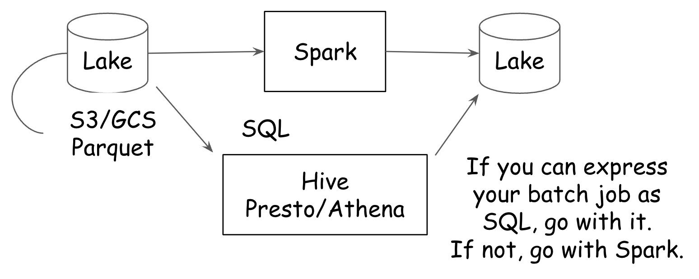

> 5:00/6:46 (5.1.2) Workflow for Machine Learning

A typical workflow may combine both tools. Here’s an example of a workflow involving Machine Learning:

**Typical workflow for ML**


## 5.2 Installation

Follow [these
intructions](https://github.com/DataTalksClub/data-engineering-zoomcamp/tree/main/week_5_batch_processing/setup) to
install Spark.

- [Windows](https://github.com/DataTalksClub/data-engineering-zoomcamp/blob/main/week_5_batch_processing/setup/windows.md)
- [Linux](https://github.com/DataTalksClub/data-engineering-zoomcamp/blob/main/week_5_batch_processing/setup/linux.md)
- [MacOS](https://github.com/DataTalksClub/data-engineering-zoomcamp/blob/main/week_5_batch_processing/setup/macos.md)

And follow
[this](https://github.com/DataTalksClub/data-engineering-zoomcamp/blob/main/week_5_batch_processing/setup/pyspark.md) to
run PySpark in Jupyter.

### 5.2.0 Installation on MacOS

Since my computer is a MacBook Pro, I will focus on installing Spark on MacOS.

#### Install Java

Install Brew and Java, if not already done.

``` bash
# Install Homebrew.
xcode-select –install /bin/bash -c "$(curl -fsSL https://raw.githubusercontent.com/Homebrew/install/master/install.sh)"
# Install Java.
brew install java
```

Find where Java is installed.

- Running `brew list` shows a list of all your installed Homebrew packages. If you run `brew list`, you should see
  **openjdk@11**.
- Running `which brew` indicates where brew is installed. Brew is installed in `/opt/homebrew/bin/brew`.
- Searching around this directory, I find that java is installed in `/opt/homebrew/Cellar/openjdk@11/11.0.18`.

So, I add these instructions in my `~/.zshrc`.

``` bash
export JAVA_HOME="/opt/homebrew/Cellar/openjdk@11/11.0.18"
export PATH="$JAVA_HOME/bin:$PATH"
```

#### Install Scala

Install Scala.

This [page](https://www.scala-lang.org/download/all.html) shows that the current version for Scala 2 is 2.13.10. So I
run this command.

``` bash
brew install scala@2.13
```

Then, I add these instructions to my `~/.zshrc`.

``` bash
export SCALA_HOME="/opt/homebrew/opt/scala@2.13"
export PATH="$SCALA_HOME/bin:$PATH"
```

#### Install Apache Spark

I run this command.

``` bash
brew install apache-spark
```

Then, I add these instructions to my `~/.zshrc`.

``` bash
export SPARK_HOME="/opt/homebrew/Cellar/apache-spark/3.3.2/libexec"
export PATH="$SPARK_HOME/bin:$PATH"
```

Finally, I think we should run this command: `source ~/.zshrc`.

#### Testing Spark

Execute `spark-shell` and run the following in scala. You can ignore the warnings.

``` scala
val data = 1 to 10000
val distData = sc.parallelize(data)
distData.filter(_ < 10).collect()
```

We should see this.

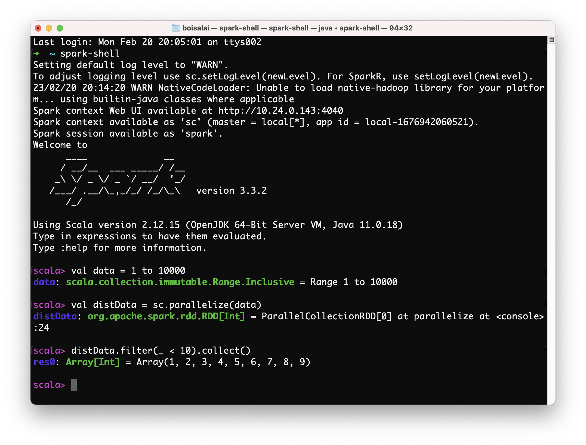

To close Spark shell, you press kbd:\[Ctrl+D\] or type in `:quit` or `:q`.

#### Install PySpark

It’s the same for all platforms. Go to
[pyspark.md](https://github.com/DataTalksClub/data-engineering-zoomcamp/blob/main/week_5_batch_processing/setup/pyspark.md).

To run PySpark, we first need to add it to `PYTHONPATH`.

`PYTHONPATH` is a special environment variable that provides guidance to the Python interpreter about where to find
various libraries and applications. See [Understanding the Python Path Environment Variable in
Python](https://www.simplilearn.com/tutorials/python-tutorial/python-path) for more information.

So, I add these instructions to `~/.zshrc` file.

Make sure that the version under `$SPARK_HOME/python/lib/` matches the filename of `py4j` or you will encounter
`ModuleNotFoundError: No module named 'py4j'` while executing `import pyspark`.

``` bash
export PYTHONPATH="/opt/homebrew/Cellar/python@3.11/3.11.2_1"
export PYTHONPATH="${SPARK_HOME}/python/:$PYTHONPATH"
export PYTHONPATH="${SPARK_HOME}/python/lib/py4j-0.10.9.5-src.zip:$PYTHONPATH"
```

Finally, I think we have to run this command: `source ~/.zshrc`.

Now you can run Jupyter to test if things work.

Go to some other directory and download a CSV file that we’ll use for testing.

``` bash
cd ~/downloads
wget https://s3.amazonaws.com/nyc-tlc/misc/taxi+_zone_lookup.csv
```

Now let’s run `jupyter notebook`, create a new notebook with the **Python 3 (ipykernel)** and execute this:

``` python
# We first need to import PySpark
import pyspark
from pyspark.sql import SparkSession

# We now need to instantiate a Spark session, an object that we use to interact with Spark.
spark = SparkSession.builder \
    .master("local[*]") \
    .appName('test') \
    .getOrCreate()

df = spark.read \
    .option("header", "true") \
    .csv('taxi+_zone_lookup.csv')

df.show()
```

Note that:

- `SparkSession` is the class of the object that we instantiate.
  - `builder` is the builder method.
- `master()` sets the Spark *master URL* to connect to.
  - The `local` string means that Spark will run on a local cluster.
  - `[*]` means that Spark will run with as many CPU cores as possible.
- `appName()` defines the name of our application/session. This will show in the Spark UI.
- `getOrCreate()` will create the session or recover the object if it was previously created.

Similarlly to pandas, Spark can read CSV files into dataframes, a tabular data structure. Unlike pandas, Spark can
handle much bigger datasets but it’s unable to infer the datatypes of each column.

We should see some thing like this.


Test that writing works as well:

``` python
df.write.parquet('zones')
```


### 5.2.1 (Optional) Installing Spark on Linux

> 0:00/14:15 (5.2.1)

Here we will install Spark 3.3.2 for Linux on Cloud VM.

#### Start VM instance on Google Cloud

> 0:39/14:15 (5.2.1) Start VM

In week 1, we created a VM instance on Google Cloud. We will use this VM here.

Go to **Google Cloud**, **Compute Engine**, **VM instances**. Start the `de-zoomcamp` virtual machine.

We get this.

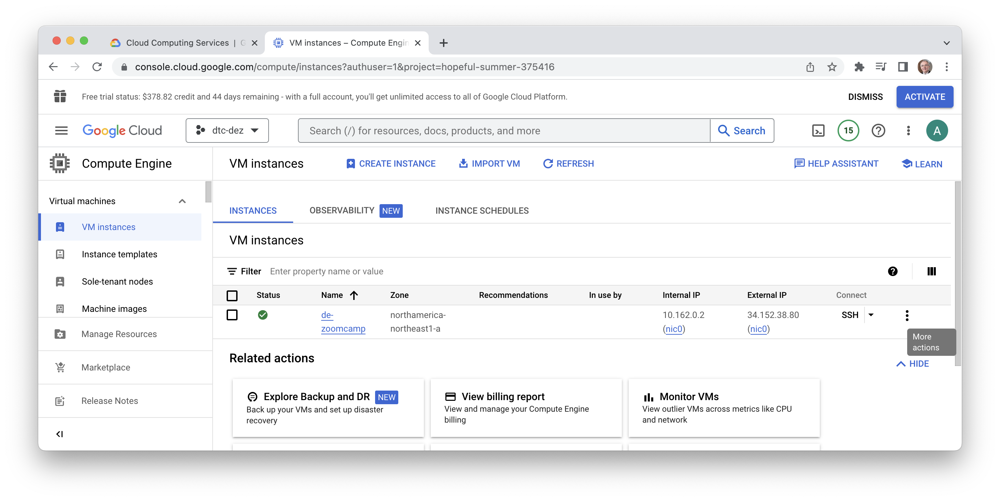

Copy the **External IP** (34.152.38.80) and adjust the HostName of the `~/.ssh/config` file.

**File `~/.ssh/config`**

``` bash
Host de-zoomcamp
    HostName 34.152.38.80
    User boisalai
    IdentityFile /Users/boisalai/.ssh/gcp
```

Then, run this command to enter to the server:

``` bash
ssh de-zoomcamp
```

You should see some thing like this.


To quit the server, press `Ctrl+D` or run the `logout` command.

#### Install Java

> 0:55/14:15 (5.2.1) Installing Java

Download OpenJDK 11 or Oracle JDK 11. It’s important that the version is 11 because Spark requires 8 or 11.

Here, we will use OpenJDK. This [page](https://jdk.java.net/archive/) is an archive of previously released builds of the
OpenJDK.

To install Java, run the following commands.

``` bash
# Create directory.
> mkdir spark
> cd spark

# Download and unpack OpenJDK.
> wget https://download.java.net/java/GA/jdk11/9/GPL/openjdk-11.0.2_linux-x64_bin.tar.gz
> tar xzfv openjdk-11.0.2_linux-x64_bin.tar.gz
> ls
jdk-11.0.2
> pwd
/home/boisalai/spark

# Setup Java.
> export JAVA_HOME="${HOME}/spark/jdk-11.0.2"
> export PATH="${JAVA_HOME}/bin:${PATH}"
> java --version
openjdk 11.0.2 2019-01-15
OpenJDK Runtime Environment 18.9 (build 11.0.2+9)
OpenJDK 64-Bit Server VM 18.9 (build 11.0.2+9, mixed mode)

# Remove the archive.
> rm openjdk-11.0.2_linux-x64_bin.tar.gz
```

#### Install Spark

> 3:30/14:15 (5.2.1) Installing Spark

Go to this [page](https://spark.apache.org/downloads.html) to download Apache Spark.

We will use Spark **3.3.2 (Feb 17 2023)** version and package type **Pre-built for Apache Hadoop 3.3 and later**.

To install Spark, run the following commands.

``` bash
# Download and unpack Spark 3.3.1.
> wget https://dlcdn.apache.org/spark/spark-3.3.2/spark-3.3.2-bin-hadoop3.tgz
> tar xzfv spark-3.3.2-bin-hadoop3.tgz

# Setup Spark.
> export SPARK_HOME="${HOME}/spark/spark-3.3.2-bin-hadoop3"
> export PATH="${SPARK_HOME}/bin:${PATH}"

# Remove the archive.
> rm spark-3.3.2-bin-hadoop3.tgz
```

Now let’s check if spark is working

Execute `spark-shell` and run the following in scala. You can ignore the warnings.

``` scala
val data = 1 to 10000
val distData = sc.parallelize(data)
distData.filter(_ < 10).collect()
```

We should see this.

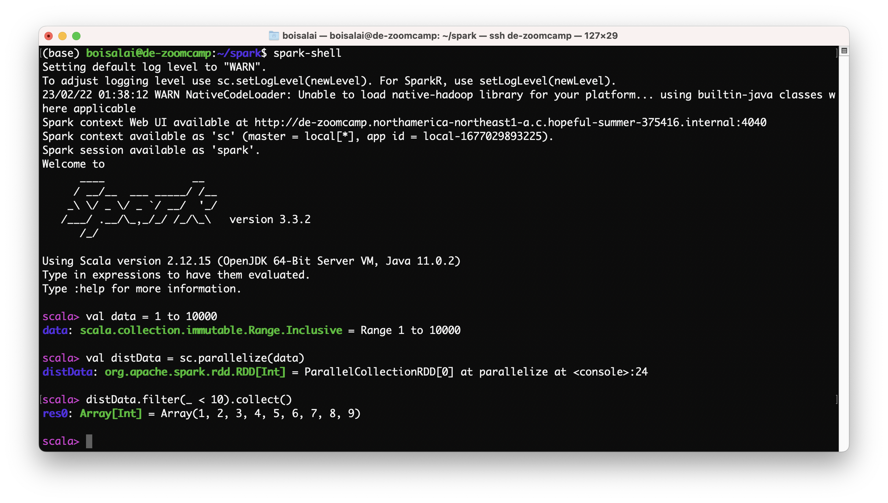

To close Spark shell, you press `Ctrl+D` or type in `:quit` or `:q`.

#### Add PATH to `.bashrc` file

> 6:45/14:15 (5.2.1) .bashrc

Add these lines to the bottom of the `.bashrc` file. Use `nano .bashrc`.

``` bash
export JAVA_HOME="${HOME}/spark/jdk-11.0.2"
export PATH="${JAVA_HOME}/bin:${PATH}"

export SPARK_HOME="${HOME}/spark/spark-3.3.2-bin-hadoop3"
export PATH="${SPARK_HOME}/bin:${PATH}"
```

Press `Ctrl+O` to save the file and `Ctrl+X` to exit.

Then run the following commands.

``` bash
> source .bashrc

# Quit the server.
> logout

# Connect to Ubuntu server.
> ssh de-zoomcamp
> which java
/home/boisalai/spark/jdk-11.0.2/bin/java
> which pyspark
/home/boisalai/spark/spark-3.3.2-bin-hadoop3/bin/pyspark
```

#### How to use PySpark

> 8:32/14:15 (5.2.1) Setup PySpark

To run PySpark, we first need to add it to `PYTHONPATH`.

`PYTHONPATH` is a special environment variable that provides guidance to the Python interpreter about where to find
various libraries and applications. See [Understanding the Python Path Environment Variable in
Python](https://www.simplilearn.com/tutorials/python-tutorial/python-path) for more information.

So, I add these instructions to the bottom of cloud VM `~/.bashrc` file with `nano ~/.bashrc`.

``` bash
export PYTHONPATH="${SPARK_HOME}/python/:$PYTHONPATH"
export PYTHONPATH="${SPARK_HOME}/python/lib/py4j-0.10.9.5-src.zip:$PYTHONPATH"
```

Make sure that the version under `$SPARK_HOME/python/lib/` matches the filename of `py4j` or you will encounter
`ModuleNotFoundError: No module named 'py4j'` while executing `import pyspark`.

Press `Ctrl+O` to save and `Ctrl+X` to exit.

Then, run this command: `source ~/.bashrc`.

> 8:00/14:15 (5.2.1) Connect to the remote machine

Because this is a remote machine, we will connect to this machine with Visual Studio Code (VS Code).

In VS Code, find and install the **Remote - SSH extension**. Then go to the **Command Palette** (`Shift+Cmd+P`)
and select **Remote-SSH: Connect to Host…​** and **de-zoomcamp**. A new VS Code window should appear.

In VS Code, open the terminal, and open the port `8888`.

A **port** is basically an address on your computer. By default, Jupyter uses port `8888` to let you talk to it (you can
see this in the URL when you’re looking at a notebook: `localhost:8888`).

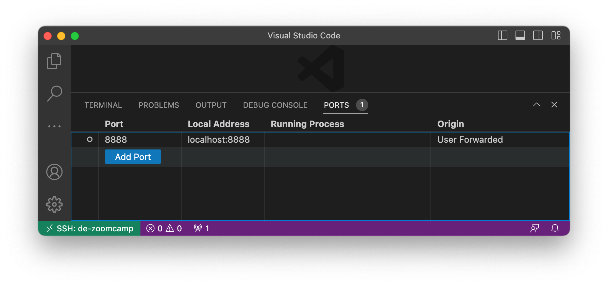

> 7:38/14:15 (5.2.1) Start Jupyter

Start Jupyter notebook in a new folder on the cloud VM.

``` bash
> mkdir notebooks
> cd notebooks
> jupyter notebook
```

> 9:10/14:15 (5.2.1) Start Jupyter

Copy and paste one of the URLs (I have <http://localhost:8888/?token=550c3c075aff45531c9dcc7940daa28f15e3ba9b748b1cb8>)
to the browser.

In Jupyter, create a new notebook with the **Python 3 (ipykernel)**.

We will run this script
([03_test.ipynb](https://github.com/DataTalksClub/data-engineering-zoomcamp/blob/main/week_5_batch_processing/code/03_test.ipynb)).
from the data-engineering-zoomcamp repo.

Run this:

``` python
import pyspark
print(pyspark.__version__)
print(pyspark.__file__)
# 3.3.2
# /home/boisalai/spark/spark-3.3.2-bin-hadoop3/python/pyspark/__init__.py
```

In Jupyter, download the taxi zone lookup file.

``` bash
!wget https://s3.amazonaws.com/nyc-tlc/misc/taxi+_zone_lookup.csv
!head taxi+_zone_lookup.csv
```

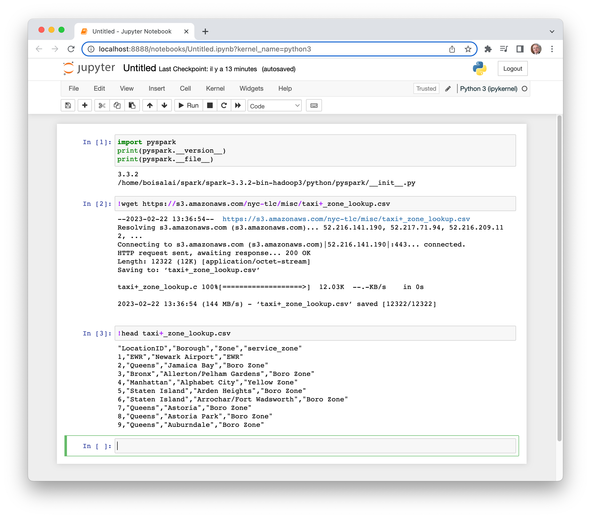

Now, read this file with Spark.

The entry point into all functionality in Spark is the
[SparkSession](https://spark.apache.org/docs/latest/api/python/reference/pyspark.sql/api/pyspark.sql.SparkSession.html)
class.

A SparkSession can be used create
[DataFrame](https://spark.apache.org/docs/latest/api/python/reference/pyspark.sql/api/pyspark.sql.DataFrame.html#pyspark.sql.DataFrame),
register DataFrame as tables, execute SQL over tables, cache tables, and read parquet files.

To create a basic SparkSession, just use `SparkSession.builder`.

Also, we need to set:

- the Spark `master` URL to connect to, such as `local` to run locally, `local[4]` to run locally with 4 cores, or
  `spark://master:7077` to run on a Spark standalone cluster;
- the `appName` for the application, which will be shown in the Spark Web UI. If no application name is set, a randomly
  generated name will be used;
- how to get an existing SparkSession or, if there is no existing one, create a new one based on the options set in this
  builder.

Run this PySpark script into Jupyter.

``` python
import pyspark
from pyspark.sql import SparkSession

spark = SparkSession.builder \
    .master("local[*]") \
    .appName('test') \
    .getOrCreate()

df = spark.read \
    .option("header", "true") \
    .csv('taxi+_zone_lookup.csv')

df.show()
```

We should see this. You can ignore the warnings.

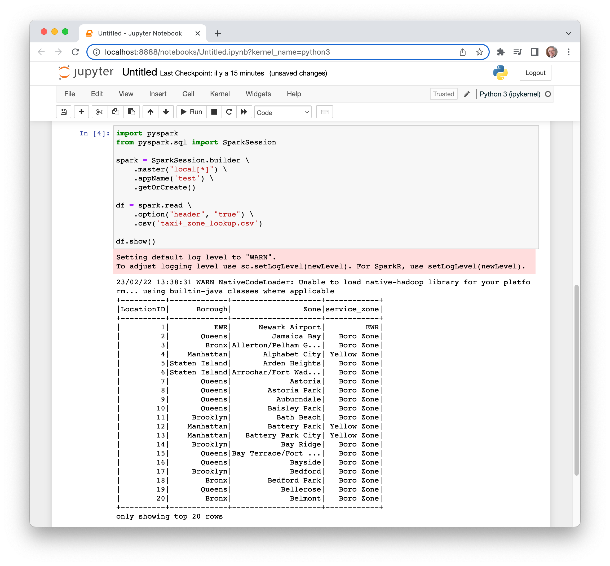

> 11:59/14:15 (5.2.1) Save it to parquet

Test that writing works too.

``` python
df.write.parquet('zones')
!ls -lh
# total 28K
# -rw-rw-r-- 1 boisalai boisalai 6.6K Feb 22 13:43 Untitled.ipynb
# -rw-rw-r-- 1 boisalai boisalai  13K Aug 17  2016 taxi+_zone_lookup.csv
# drwxr-xr-x 2 boisalai boisalai 4.0K Feb 22 13:41 zones
!ls zones/
# _SUCCESS  part-00000-2e2cdbde-082b-4330-9484-ebdaa3e4d743-c000.snappy.parquet
!ls -lh zones/
# total 8.0K
# -rw-r--r-- 1 boisalai boisalai    0 Feb 22 13:41 _SUCCESS
# -rw-r--r-- 1 boisalai boisalai 5.8K Feb 22 13:41 part-00000-2e2cdbde-082b-4330-9484-ebdaa3e4d743-c000.snappy.parquet
```

> 12:40/14:15 (5.2.1) One more thing…​

In VS Code, open the terminal, and open the port `4040`. Then open the web browser to `localhost:4040/jobs/`.

We should see this.


Every SparkContext launches a web UI, by default on port 4040, that displays useful information about the application.
This includes:

- A list of scheduler stages and tasks
- A summary of RDD sizes and memory usage
- Environmental information
- Information about the running executors

You can access this interface by simply opening `http://<driver-node>:4040` in a web browser. If multiple SparkContexts
are running on the same host, they will bind to successive ports beginning with 4040 (4041, 4042, etc).

See [Monitoring and Instrumentation](https://spark.apache.org/docs/2.2.3/monitoring.html) for more.

## 5.3 Spark SQL and DataFrames

### 5.3.1 First Look at Spark/PySpark

> 0:00/18:14 (5.3.1) First Look at Spark/PySpark

We will cover:

- Reading CSV files
- Partitions
- Saving data to Parquet for local experiments
- Spark master UI

#### Start Jupyter on remote machine

Run enter to the remote machine and clone a latest version of the data-engineering-zoomcamp repo.

``` bash
> ssh de-zoomcamp
> git clone https://github.com/DataTalksClub/data-engineering-zoomcamp.git
```

Start Jupyter notebook on the cloud VM.

``` bash
> cd
> cd data-engineering-zoomcamp/
> cd week_5_batch_processing/
> jupyter notebook
```

Copy and paste one of the URLs (I have <http://localhost:8888/?token=867547600579e51683e76441800b4b7b4a9213b4de12fcd8>)
to the web browser.

Make sure ports `8888` and `4040` are open. If not, see instructions in previous section.

#### Read file with PySpark

> 1:32/18:14 (5.3.1) Create a new notebook

Create a new notebook with the **Python 3 (ipykernel)**, or open `code/04_pyspark.ipynb` file directly.

Open a Spark session.

``` python
import pyspark
from pyspark.sql import SparkSession

spark = SparkSession.builder \
    .master("local[*]") \
    .appName('test') \
    .getOrCreate()
```

Download this file.

``` python
!wget https://github.com/DataTalksClub/nyc-tlc-data/releases/download/fhvhv/fhvhv_tripdata_2021-01.csv.gz
```

Unzip it.

``` bash
%%sh
gzip -d fhvhv_tripdata_2021-01.csv.gz
!ls -lh fhvhv_tripdata_2021-01.*
# -rw-rw-r-- 1 boisalai boisalai 718M Jul 14  2022 fhvhv_tripdata_2021-01.csv
!wc -l fhvhv_tripdata_2021-01.csv
# 11908469 fhvhv_tripdata_2021-01.csv
```

> 3:18/18:14 (5.3.1) Read this file with Spark

``` python
df = spark.read \
    .option("header", "true") \
    .csv('fhvhv_tripdata_2021-01.csv')

df.show()
```

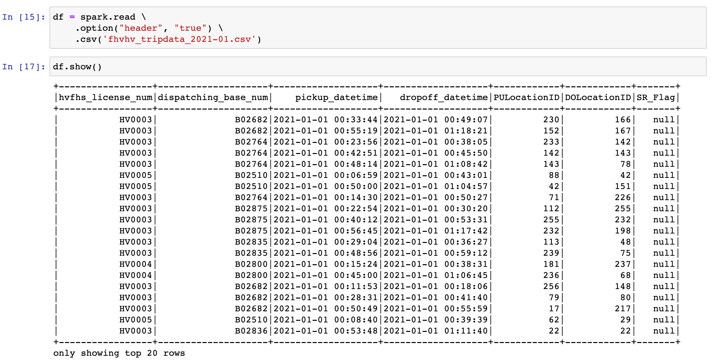

#### Define the structure of the DataFrame

Prints out the schema in the tree format.

``` python
>>> df.printSchema()
root
 |-- hvfhs_license_num: string (nullable = true)
 |-- dispatching_base_num: string (nullable = true)
 |-- pickup_datetime: string (nullable = true)
 |-- dropoff_datetime: string (nullable = true)
 |-- PULocationID: string (nullable = true)
 |-- DOLocationID: string (nullable = true)
 |-- SR_Flag: string (nullable = true)
```

We see that the columns are all in string. By default, Spark does not try to infer column types.

Prints the first 5 rows.

``` python
>>> df.head(5)
[Row(hvfhs_license_num='HV0003', dispatching_base_num='B02682', pickup_datetime='2021-01-01 00:33:44',
dropoff_datetime='2021-01-01 00:49:07', PULocationID='230', DOLocationID='166', SR_Flag=None),
 Row(hvfhs_license_num='HV0003', dispatching_base_num='B02682', pickup_datetime='2021-01-01 00:55:19',
 dropoff_datetime='2021-01-01 01:18:21', PULocationID='152', DOLocationID='167', SR_Flag=None),
 Row(hvfhs_license_num='HV0003', dispatching_base_num='B02764', pickup_datetime='2021-01-01 00:23:56',
 dropoff_datetime='2021-01-01 00:38:05', PULocationID='233', DOLocationID='142', SR_Flag=None),
 Row(hvfhs_license_num='HV0003', dispatching_base_num='B02764', pickup_datetime='2021-01-01 00:42:51',
 dropoff_datetime='2021-01-01 00:45:50', PULocationID='142', DOLocationID='143', SR_Flag=None),
 Row(hvfhs_license_num='HV0003', dispatching_base_num='B02764', pickup_datetime='2021-01-01 00:48:14',
 dropoff_datetime='2021-01-01 01:08:42', PULocationID='143', DOLocationID='78', SR_Flag=None)]
```

> 4:43/18:14 (5.3.1) Read the first rows of this file with pandas

Create a file with only the first 1001 lines.

``` python
!head -n 1001 fhvhv_tripdata_2021-01.csv > head.csv
```

Read this small file in pandas.

``` python
>>> import pandas as pd
>>> df_pandas = pd.read_csv('head.csv')
>>> df_pandas.info()
<class 'pandas.core.frame.DataFrame'>
RangeIndex: 1000 entries, 0 to 999
Data columns (total 7 columns):
 #   Column                Non-Null Count  Dtype
---  ------                --------------  -----
 0   hvfhs_license_num     1000 non-null   object
 1   dispatching_base_num  1000 non-null   object
 2   pickup_datetime       1000 non-null   object
 3   dropoff_datetime      1000 non-null   object
 4   PULocationID          1000 non-null   int64
 5   DOLocationID          1000 non-null   int64
 6   SR_Flag               0 non-null      float64
dtypes: float64(1), int64(2), object(4)
memory usage: 54.8+ KB
```

> 6:08/18:14 (5.3.1) Enforce a custom schema

Create a Spark
[DataFrame](https://spark.apache.org/docs/3.1.1/api/python/reference/api/pyspark.sql.DataFrame.html#pyspark.sql.DataFrame)
from a pandas.DataFrame.

``` python
>>> spark.createDataFrame(df_pandas).schema
StructType([
    StructField('hvfhs_license_num', StringType(), True),
    StructField('dispatching_base_num', StringType(), True),
    StructField('pickup_datetime', StringType(), True),
    StructField('dropoff_datetime', StringType(), True),
    StructField('PULocationID', LongType(), True),
    StructField('DOLocationID', LongType(), True),
    StructField('SR_Flag', DoubleType(), True)
])

>>> spark.createDataFrame(df_pandas).printSchema()
root
 |-- hvfhs_license_num: string (nullable = true)
 |-- dispatching_base_num: string (nullable = true)
 |-- pickup_datetime: string (nullable = true)
 |-- dropoff_datetime: string (nullable = true)
 |-- PULocationID: long (nullable = true)
 |-- DOLocationID: long (nullable = true)
 |-- SR_Flag: double (nullable = true)
```

Spark provides `spark.sql.types.StructType` class to define the structure of the DataFrame and It is a collection or
list on StructField objects.

Spark provides `` spark.sql.types.StructField` `` class to define the column name(String), column type (DataType),
nullable column (Boolean) and metadata (MetaData)

All of the data types shown below are supported in Spark and the DataType class is a base class for all them.

- StringType
- ArrayType
- MapType
- StructType
- DateType
- TimestampType
- BooleanType
- CalendarIntervalType
- BinaryType
- NumericType
- ShortType
- IntegerType
- LongType
- FloatType
- DoubleType
- DecimalType
- ByteType
- HiveStringType
- ObjectType
- NullType

See [Spark SQL Data Types with Examples](https://sparkbyexamples.com/spark/spark-sql-dataframe-data-types/) for more.

So, the preferred option while reading any file would be to enforce a custom schema, this ensures that the data types
are consistent and avoids any unexpected behavior.

In order to do that you first declare the schema to be enforced, and then read the data by setting `schema` option.

``` python
from pyspark.sql import types

schema = types.StructType([
    types.StructField('hvfhs_license_num', types.StringType(), True),
    types.StructField('dispatching_base_num', types.StringType(), True),
    types.StructField('pickup_datetime', types.TimestampType(), True),
    types.StructField('dropoff_datetime', types.TimestampType(), True),
    types.StructField('PULocationID', types.IntegerType(), True),
    types.StructField('DOLocationID', types.IntegerType(), True),
    types.StructField('SR_Flag', types.StringType(), True)
])

df = spark.read \
    .option("header", "true") \
    .schema(schema) \
    .csv('fhvhv_tripdata_2021-01.csv')

df.printSchema()
```

We should see this.

``` txt
root
 |-- hvfhs_license_num: string (nullable = true)
 |-- dispatching_base_num: string (nullable = true)
 |-- pickup_datetime: timestamp (nullable = true)
 |-- dropoff_datetime: timestamp (nullable = true)
 |-- PULocationID: integer (nullable = true)
 |-- DOLocationID: integer (nullable = true)
 |-- SR_Flag: string (nullable = true)
```

**Note**: The other way to infer the schema (apart from pandas) for the csv files, is to set the `inferSchema` option to
`true` while reading the files in Spark.

#### Save as partitioned parquet files

> 10:18/18:14 (5.3.1) Save as parquet files.

A **Spark cluster** is made up of multiple **executors**. Each executor can process data independently to parallelize
and speed up work.

In the previous example, we are reading a single large CSV file. A file can only be read by a single executor, which
means that the code we have written so far is not parallelized and will therefore only be executed by a single executor
rather than several at the same time.

In order to solve this problem, we can split a file into several parts so that each executor can take care of one part
and all executors work simultaneously. These splits are called **partitions**.

Spark/PySpark partitioning is a way to split the data into multiple partitions so that you can execute transformations
on multiple partitions in parallel which allows completing the job faster. See [Spark Partitioning & Partition
Understanding](https://sparkbyexamples.com/spark/spark-partitioning-understanding/) for more.

Spark DataFrame `repartition()` method is used to increase or decrease the partitions. This is very expensive operation
as it shuffle the data across many partitions hence try to minimize repartition as much as possible.

Let’s run this.

``` python
# Create 24 partitions in our dataframe.
df = df.repartition(24)
# Parquetize and write to fhvhv/2021/01/ folder.
df.write.parquet('fhvhv/2021/01/')
```

You can check out the Spark UI at any time and see the progress of the current task, which is divided into steps
containing tasks. Tasks in a stage will not start until all tasks in the previous stage are complete.

When creating a dataframe, Spark creates as many partitions as available CPU cores by default, and each partition
creates a task. So, assuming that the dataframe was initially partitioned into 6 partitions, the `write.parquet()`
method will have 2 stages: the first with 6 tasks and the second with 24 tasks.

Besides the 24 Parquet files, you should also see a `_SUCCESS` file which should be empty. This file is created when the
job completes successfully.

<table><tr><td>
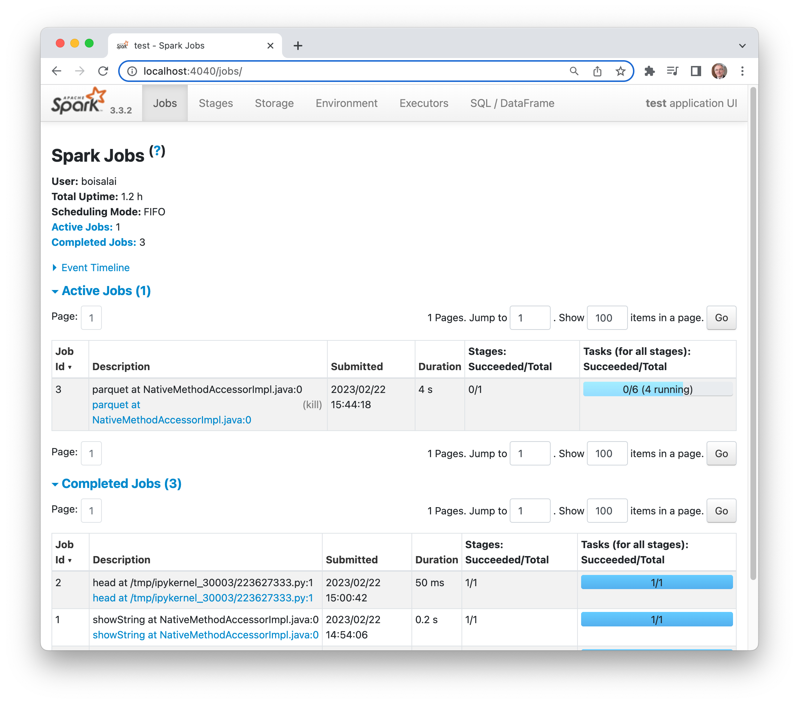
</td><td>
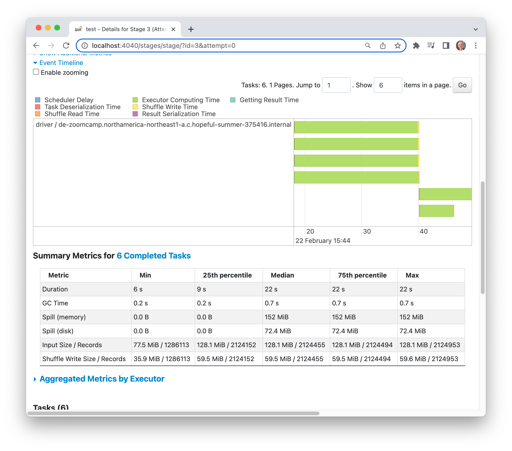
</td></tr></table>

On the remote machine, we can see 24 parquet files created in `fhvhv/2021/01` folder.

### 5.3.2 Spark DataFrames

> 0:00/14:09 (5.3.2)

We will cover:

- Actions vs tranfromations
- Functions and UDFs

We can read the parquet files that we created in the last section with this command.

``` python
>>> df = spark.read.parquet('fhvhv/2021/01/')
>>> df.printSchema()
root
 |-- hvfhs_license_num: string (nullable = true)
 |-- dispatching_base_num: string (nullable = true)
 |-- pickup_datetime: timestamp (nullable = true)
 |-- dropoff_datetime: timestamp (nullable = true)
 |-- PULocationID: integer (nullable = true)
 |-- DOLocationID: integer (nullable = true)
 |-- SR_Flag: string (nullable = true)
```

> 1:38/14:09 (5.3.2) Select

[DataFrame.select](https://spark.apache.org/docs/latest/api/python/reference/pyspark.sql/api/pyspark.sql.DataFrame.select.html)
DataFrame.select is a transformation function that returns a new DataFrame with the desired columns as specified in the
inputs.

[DataFrame.filter](https://spark.apache.org/docs/latest/api/python/reference/pyspark.sql/api/pyspark.sql.DataFrame.filter.html)
filters rows using the given condition.

For example…​

``` python
df.select('pickup_datetime', 'dropoff_datetime', 'PULocationID', 'DOLocationID') \
  .filter(df.hvfhs_license_num == 'HV0003')
```

I we run this code, nothing happens. The execution is Lazy by default for Spark. This means all the operations over an
RDD/DataFrame/Dataset are never computed until the action is called.

#### Actions vs Transformations

> 3:10/14:09 (5.3.2) Actions vs Transformations

Spark support two types of operations: **transformations**, which create a new dataset from an existing one, and
**actions**, which return a value to the driver program after running a computation on the dataset.

All transformations in Spark are lazy, in that they do not compute their results right away. Instead, they just remember
the transformations applied to some base dataset (e.g. a file). The transformations are only computed when an action
requires a result to be returned to the driver program. This design enables Spark to run more efficiently.

- Transformations: Lazy (not executed immediatly)
  - Selecting columns
  - Filtering
  - Join, GroupBy
  - etc.
- Actions: Eager (executed immediatly)
  - Show, Take, Head
  - Write
  - etc.

See [RDD Programming Guide](https://spark.apache.org/docs/latest/rdd-programming-guide.html) for more information.

- [Transformations](https://spark.apache.org/docs/latest/rdd-programming-guide.html#transformations)
- [Actions](https://spark.apache.org/docs/latest/rdd-programming-guide.html#actions)

So, to make the computation happen, we must add instruction like `.show()`.

``` python
df.select('pickup_datetime', 'dropoff_datetime', 'PULocationID', 'DOLocationID') \
  .filter(df.hvfhs_license_num == 'HV0003')
  .show()
```

#### Functions avalaible in Spark

> 6:50/14:09 (5.3.2) Functions avalaible in Spark

Besides the SQL and Pandas-like commands we’ve seen so far, Spark provides additional built-in functions that allow for
more complex data manipulation. By convention, these functions are imported as follows:

``` python
from pyspark.sql import functions as F
```

In a new cell, insert `F.` and press on `Tab` to show completion options.


See [functions](https://spark.apache.org/docs/latest/api/python/reference/pyspark.sql/functions.html) for a list of
built-in functions.

Here’s an example of built-in function usage:

``` python
df \
    .withColumn('pickup_date', F.to_date(df.pickup_datetime)) \
    .withColumn('dropoff_date', F.to_date(df.dropoff_datetime)) \
    .select('pickup_date', 'dropoff_date', 'PULocationID', 'DOLocationID') \
    .show()
```

- `.withColumn()` is a transformation that adds a new column to the dataframe.
  - Adding a new column with the same name as a previously existing column will overwrite the existing column.
- `.select()` is another transformation that selects the stated columns.
- `F.to_date()` is a built-in Spark function that converts a timestamp to date format (year, month and day only, no hour
  and minute).
- `.show()` is an action.

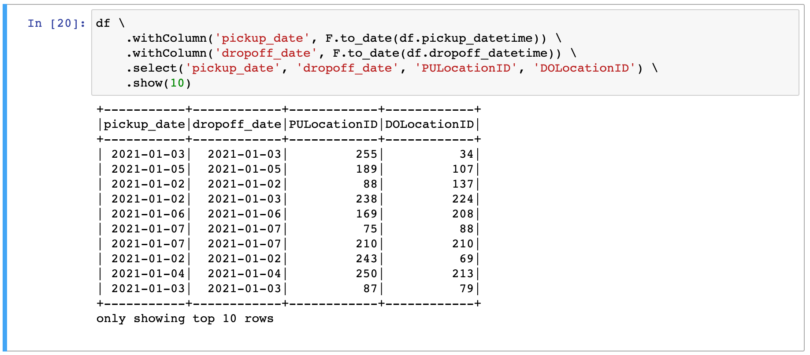

#### User defined functions (UDF)

> 9:23/14:09 (5.3.2) User defined functions

Besides these built-in functions, Spark allows us to create **User Defined Functions** (UDFs) with custom behavior for
those instances where creating SQL queries for that behaviour becomes difficult both to manage and test. In short, UDFs
are user-programmable routines that act on one row.

See [Scalar User Defined Functions (UDFs)](https://spark.apache.org/docs/latest/sql-ref-functions-udf-scalar.html) and
[functions.udf](https://spark.apache.org/docs/latest/api/python/reference/pyspark.sql/api/pyspark.sql.functions.udf.html#pyspark.sql.functions.udf)
for more information.

Here is an example using an UDF.

``` python
def crazy_stuff(base_num):
    num = int(base_num[1:])
    if num % 7 == 0:
        return f's/{num:03x}'
    elif num % 3 == 0:
        return f'a/{num:03x}'
    else:
        return f'e/{num:03x}'

crazy_stuff('B02884')  # Return 's/b44'

crazy_stuff_udf = F.udf(crazy_stuff, returnType=types.StringType())

df \
    .withColumn('pickup_date', F.to_date(df.pickup_datetime)) \
    .withColumn('dropoff_date', F.to_date(df.dropoff_datetime)) \
    .withColumn('base_id', crazy_stuff_udf(df.dispatching_base_num)) \
    .select('base_id', 'pickup_date', 'dropoff_date', 'PULocationID', 'DOLocationID') \
    .show(5)
```

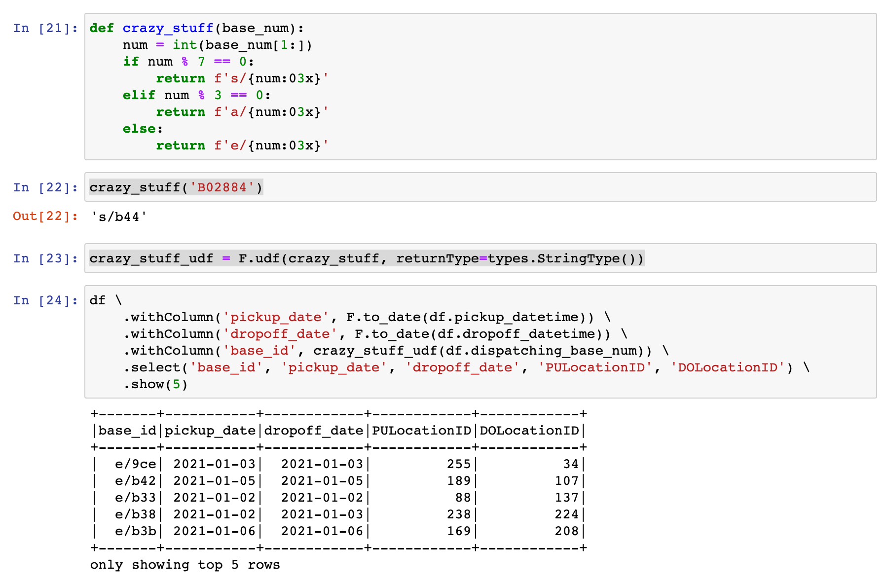

### 5.3.4 SQL with Spark

> 0:00/15:32 (5.3.4) SQL with Spark

We will cover:

- Temporary tables
- Some simple queries from week 4

Spark can run SQL queries, which can come in handy if you already have a Spark cluster and setting up an additional tool
for sporadic use isn’t desirable.

Let’s now load all of the yellow and green taxi data for 2020 and 2021 to Spark dataframes.

#### Prepare the data

Edit and change the `URL_PREFIX` of the

Modify `code/download_data.sh` file like this.

**File `code/download_data.sh`**

``` bash
set -e

URL_PREFIX="https://github.com/DataTalksClub/nyc-tlc-data/releases/download"

for TAXI_TYPE in "yellow" "green"
do
    for YEAR in 2020 2021
    do
        for MONTH in {1..12}
        do

        if [ $YEAR == 2020 ] || [ $MONTH -lt 8 ]
        then
            FMONTH=`printf "%02d" ${MONTH}`

            URL="${URL_PREFIX}/${TAXI_TYPE}/${TAXI_TYPE}_tripdata_${YEAR}-${FMONTH}.csv.gz"

            LOCAL_PREFIX="data/raw/${TAXI_TYPE}/${YEAR}/${FMONTH}"
            LOCAL_FILE="${TAXI_TYPE}_tripdata_${YEAR}_${FMONTH}.csv.gz"
            LOCAL_PATH="${LOCAL_PREFIX}/${LOCAL_FILE}"

            echo "donwloading ${URL} to ${LOCAL_PATH}"
            mkdir -p ${LOCAL_PREFIX}
            wget ${URL} -O ${LOCAL_PATH}
        fi
        done
    done
done
```

Run `./download_data.sh`.

In Jupyter, create a new note with **Python 3 (ipykernel)** and run the code below.

**File `05_taxi_schema.ipynb`**

``` python
import pyspark
from pyspark.sql import SparkSession

spark = SparkSession.builder \
    .master("local[*]") \
    .appName('test') \
    .getOrCreate()

import pandas as pd

from pyspark.sql import types

green_schema = types.StructType([
    types.StructField("VendorID", types.IntegerType(), True),
    types.StructField("lpep_pickup_datetime", types.TimestampType(), True),
    types.StructField("lpep_dropoff_datetime", types.TimestampType(), True),
    types.StructField("store_and_fwd_flag", types.StringType(), True),
    types.StructField("RatecodeID", types.IntegerType(), True),
    types.StructField("PULocationID", types.IntegerType(), True),
    types.StructField("DOLocationID", types.IntegerType(), True),
    types.StructField("passenger_count", types.IntegerType(), True),
    types.StructField("trip_distance", types.DoubleType(), True),
    types.StructField("fare_amount", types.DoubleType(), True),
    types.StructField("extra", types.DoubleType(), True),
    types.StructField("mta_tax", types.DoubleType(), True),
    types.StructField("tip_amount", types.DoubleType(), True),
    types.StructField("tolls_amount", types.DoubleType(), True),
    types.StructField("ehail_fee", types.DoubleType(), True),
    types.StructField("improvement_surcharge", types.DoubleType(), True),
    types.StructField("total_amount", types.DoubleType(), True),
    types.StructField("payment_type", types.IntegerType(), True),
    types.StructField("trip_type", types.IntegerType(), True),
    types.StructField("congestion_surcharge", types.DoubleType(), True)
])

yellow_schema = types.StructType([
    types.StructField("VendorID", types.IntegerType(), True),
    types.StructField("tpep_pickup_datetime", types.TimestampType(), True),
    types.StructField("tpep_dropoff_datetime", types.TimestampType(), True),
    types.StructField("passenger_count", types.IntegerType(), True),
    types.StructField("trip_distance", types.DoubleType(), True),
    types.StructField("RatecodeID", types.IntegerType(), True),
    types.StructField("store_and_fwd_flag", types.StringType(), True),
    types.StructField("PULocationID", types.IntegerType(), True),
    types.StructField("DOLocationID", types.IntegerType(), True),
    types.StructField("payment_type", types.IntegerType(), True),
    types.StructField("fare_amount", types.DoubleType(), True),
    types.StructField("extra", types.DoubleType(), True),
    types.StructField("mta_tax", types.DoubleType(), True),
    types.StructField("tip_amount", types.DoubleType(), True),
    types.StructField("tolls_amount", types.DoubleType(), True),
    types.StructField("improvement_surcharge", types.DoubleType(), True),
    types.StructField("total_amount", types.DoubleType(), True),
    types.StructField("congestion_surcharge", types.DoubleType(), True)
])

for taxi_type in ["yellow", "green"]:
    if taxi_type == "yellow":
        schema = yellow_schema
    else:
        schema = green_schema

    for year in [2020, 2021]:
        for month in range(1, 13):
            if year == 2020 or month < 8:
                print(f'processing data for {taxi_type}/{year}/{month}')

                input_path = f'data/raw/{taxi_type}/{year}/{month:02d}/'
                output_path = f'data/pq/{taxi_type}/{year}/{month:02d}/'

                df_green = spark.read \
                    .option("header", "true") \
                    .schema(schema) \
                    .csv(input_path)

                df_green \
                    .repartition(4) \
                    .write.parquet(output_path)
```

This code will take time to run.

#### Read parquet files with Spark

> 0:59/15:32 (5.3.4) Read

In Jupyter, create a new note with **Python 3 (ipykernel)** with this code (or simply open `06_spark.sql.ipynb`).

**File `06_spark.sql.ipynb`**

``` python
import pyspark
from pyspark.sql import SparkSession

spark = SparkSession.builder \
    .master("local[*]") \
    .appName('test') \
    .getOrCreate()

df_green = spark.read.parquet('data/pq/green/*/*')
df_yellow = spark.read.parquet('data/pq/yellow/*/*')
```

#### Combine two datasets into one

> 2:21/15:32 (5.3.4) Combine these two files into one

We will create `trips_data` which is the combination of files `df_green` and `df_yellow`.

``` python
# Rename some columns.
df_green = df_green \
    .withColumnRenamed('lpep_pickup_datetime', 'pickup_datetime') \
    .withColumnRenamed('lpep_dropoff_datetime', 'dropoff_datetime')
df_yellow = df_yellow \
    .withColumnRenamed('tpep_pickup_datetime', 'pickup_datetime') \
    .withColumnRenamed('tpep_dropoff_datetime', 'dropoff_datetime')

# Create the list of columns present in the two datasets
# while preserving the order of the columns of the green dataset.
common_colums = []
yellow_columns = set(df_yellow.columns)

for col in df_green.columns:
    if col in yellow_columns:
        common_colums.append(col)

# Create a column `service_type` indicating where the data comes from.
from pyspark.sql import functions as F

df_green_sel = df_green \
    .select(common_colums) \
    .withColumn('service_type', F.lit('green'))

df_yellow_sel = df_yellow \
    .select(common_colums) \
    .withColumn('service_type', F.lit('yellow'))

# Create a new DataFrame containing union of rows of green and yellow DataFrame.
df_trips_data = df_green_sel.unionAll(df_yellow_sel)
```

See
[DataFrame.unionAll](https://spark.apache.org/docs/latest/api/python/reference/pyspark.sql/api/pyspark.sql.DataFrame.unionAll.html)
for more information.

To check if the combination of the two files worked, run the following code

``` python
df_trips_data.groupBy('service_type').count().show()
```

We should see this.

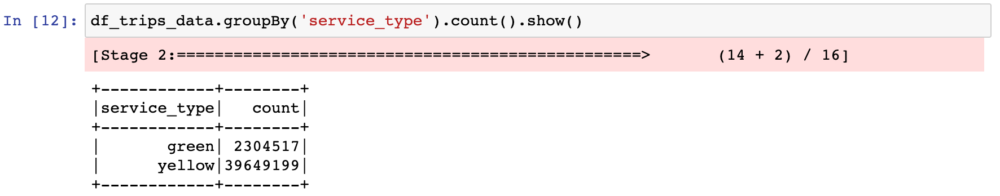

#### Querying this data with SQL

> 8:00/15:32 (5.3.4) Using SQL

First, let’s get all column names as a list.

``` python
>>> df_trips_data.columns
['VendorID',
 'pickup_datetime',
 'dropoff_datetime',
 'store_and_fwd_flag',
 'RatecodeID',
 'PULocationID',
 'DOLocationID',
 'passenger_count',
 'trip_distance',
 'fare_amount',
 'extra',
 'mta_tax',
 'tip_amount',
 'tolls_amount',
 'improvement_surcharge',
 'total_amount',
 'payment_type',
 'congestion_surcharge',
 'service_type']
```

Write a query. We also need to create a local temporary view with the DataFrame. See
[DataFrame.createOrReplaceTempView](https://spark.apache.org/docs/3.1.3/api/python/reference/api/pyspark.sql.DataFrame.createOrReplaceTempView.html).

``` python
# df_trips_data.registerTempTable('trips_data') # Deprecated.
df_trips_data.createOrReplaceTempView("trips_data")

spark.sql("""
SELECT
    service_type,
    count(1)
FROM
    trips_data
GROUP BY
    service_type
""").show()
```

We should see this.

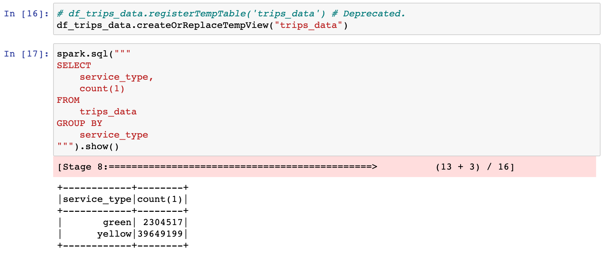

We can execute a more complicated query like this.

``` python
df_result = spark.sql("""
SELECT
    -- Reveneue grouping
    PULocationID AS revenue_zone,
    date_trunc('month', pickup_datetime) AS revenue_month,
    service_type,

    -- Revenue calculation
    SUM(fare_amount) AS revenue_monthly_fare,
    SUM(extra) AS revenue_monthly_extra,
    SUM(mta_tax) AS revenue_monthly_mta_tax,
    SUM(tip_amount) AS revenue_monthly_tip_amount,
    SUM(tolls_amount) AS revenue_monthly_tolls_amount,
    SUM(improvement_surcharge) AS revenue_monthly_improvement_surcharge,
    SUM(total_amount) AS revenue_monthly_total_amount,
    SUM(congestion_surcharge) AS revenue_monthly_congestion_surcharge,

    -- Additional calculations
    AVG(passenger_count) AS avg_montly_passenger_count,
    AVG(trip_distance) AS avg_montly_trip_distance
FROM
    trips_data
GROUP BY
    1, 2, 3
""")
```

#### Save the results

> 10:55/15:32 (5.3.4) Save the results

The `coalesce()` is used to decrease the number of partitions in an efficient way.

``` python
df_result.coalesce(1).write.parquet('data/report/revenue/', mode='overwrite')
```

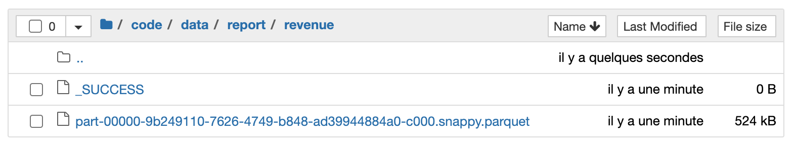

## 5.4 Spark internals

### 5.4.1 Anatomy of a Spark Cluster

> 0:00/7:29 (5.4.1) Spark Cluster

#### Spark Cluster

**Spark Execution modes**: It is possible to run a spark application using **cluster mode**, **local mode**
(pseudo-cluster) or with an **interactive** shell (*pypsark* or *spark-shell*).

So far we’ve used a **local cluster** to run our Spark code, but Spark **clusters** often contain multiple computers
that act as **executors**.

Spark clusters are managed by a **master**, which behaves similarly to an entry point to a Kubernetes cluster. A
**driver** (an Airflow DAG, a computer running a local script, etc.) who wants to run a Spark job will send the job to
the master, who in turn will distribute the work among the **executors in the cluster**. If an executor fails and
becomes offline for any reason, the master will reassign the task to another executor.

Using cluster mode:

- Spark applications are run as independent sets of processes, coordinated by a SparkContext object in your main program
  (called the *driver program*).
- The *context* connects to the cluster manager *which allocate resources*.
- Each *worker* in the cluster is managed by an *executor*.
- The *executor* manages computation as well as storage and caching on each machine.
- The application code is sent from the *driver* to the executors, and the executors specify the context and the various
  *tasks* to be run.
- The *driver* program must listen for and accept incoming connections from its executors throughout its lifetime


See [Cluster Mode Overview](https://spark.apache.org/docs/3.3.2/cluster-overview.html).

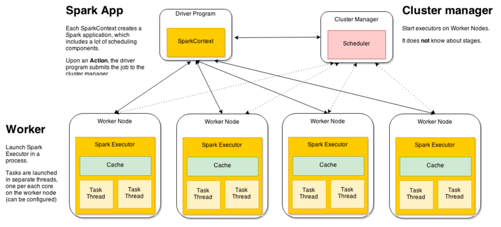

See [Spark Cluster Overview](https://events.prace-ri.eu/event/850/sessions/2616/attachments/955/1528/Spark_Cluster.pdf).

#### Cluster and partitions

To distribute work across the cluster and reduce the memory requirements of each node, Spark will split the data into
smaller parts called Partitions. Each of these is then sent to an Executor to be processed. Only one partition is
computed per executor thread at a time, therefore the size and quantity of partitions passed to an executor is directly
proportional to the time it takes to complete.

See [Apache Spark - Performance](https://blog.scottlogic.com/2018/03/22/apache-spark-performance.html) for more.

#### Glossary

The following table (from [this page](https://spark.apache.org/docs/3.3.2/cluster-overview.html)) summarizes terms
you’ll see used to refer to cluster concepts:

| **Term**  | **Meaning**   |
|-----------------|----------------------------------------------------------------------|
| Application  | User program built on Spark. Consists of a *driver program* and *executors* on the cluster. |
| Application jar | A jar containing the user’s Spark application. In some cases users will want to create an "uber jar" containing their application along with its dependencies. The user’s jar should never include Hadoop or Spark libraries, however, these will be added at runtime. |
| Driver program  | The process running the main() function of the application and creating the SparkContext.   |
| Cluster manager | An external service for acquiring resources on the cluster (e.g. standalone manager, Mesos, YARN, Kubernetes).   |
| Deploy mode  | Distinguishes where the driver process runs. In "cluster" mode, the framework launches the driver inside of the cluster. In "client" mode, the submitter launches the driver outside of the cluster. |
| Worker node  | Any node that can run application code in the cluster.  |
| Executor  | A process launched for an application on a worker node, that runs tasks and keeps data in memory or disk storage across them. Each application has its own executors.  |
| Task   | A unit of work that will be sent to one executor. |
| Job | A parallel computation consisting of multiple tasks that gets spawned in response to a Spark action (e.g. save, collect); you’ll see this term used in the driver’s logs. |
| Stage  | Each job gets divided into smaller sets of tasks called stages that depend on each other (similar to the map and reduce stages in MapReduce); you’ll see this term used in the driver’s logs.  |

### 5.4.2 GroupBy in Spark

> 0:00/15:08 (5.4.2) GroupBy

We will cover:

- How GroupBy works internally
- Shuffling

#### Prepare the data

In Jupyter, run the following script.

``` python
import pyspark
from pyspark.sql import SparkSession

spark = SparkSession.builder \
    .master("local[*]") \
    .appName('test') \
    .getOrCreate()

df_green = spark.read.parquet('data/pq/green/*/*')
df_green.createOrReplaceTempView("green")

df_green_revenue = spark.sql("""
SELECT
    date_trunc('hour', lpep_pickup_datetime) AS hour,
    PULocationID AS zone,

    SUM(total_amount) AS amount,
    COUNT(1) AS number_records
FROM
    green
WHERE
    lpep_pickup_datetime >= '2020-01-01 00:00:00'
GROUP BY
    1, 2
""")

# Materialized the result.
df_green_revenue \
    .repartition(20) \
    .write.parquet('data/report/revenue/green', mode='overwrite')

df_yellow = spark.read.parquet('data/pq/yellow/*/*')
df_yellow.createOrReplaceTempView("yellow")

df_yellow_revenue = spark.sql("""
SELECT
    date_trunc('hour', tpep_pickup_datetime) AS hour,
    PULocationID AS zone,

    SUM(total_amount) AS amount,
    COUNT(1) AS number_records
FROM
    yellow
WHERE
    tpep_pickup_datetime >= '2020-01-01 00:00:00'
GROUP BY
    1, 2
""")

# Materialized the result.
df_yellow_revenue \
    .repartition(20) \
    .write.parquet('data/report/revenue/yellow', mode='overwrite')
```

Run this code to see what the data looks like.

``` python
df_yellow_revenue.show(10)
```

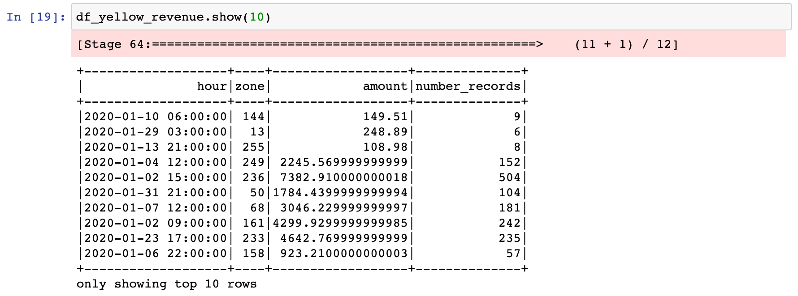

#### What exactly Spark is doing

> 4:58/15:08 (5.4.2) What exactly Spark is doing

This diagram shows how Spark works with multiple partitions and clusters to combine files.

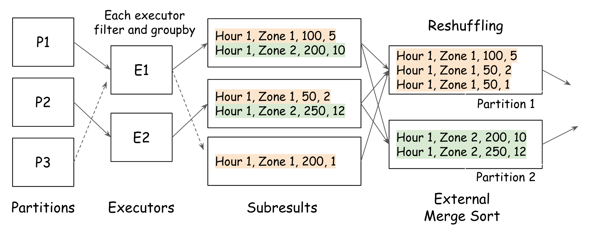

Shuffling is a mechanism Spark uses to redistribute the data across different executors and even across machines.

Shuffle is an expensive operation as it involves moving data across the nodes in your cluster, which involves network
and disk I/O. It is always a good idea to reduce the amount of data that needs to be shuffled. Here are some tips to
reduce shuffle:

- Tune the `spark.sql.shuffle.partitions`.
- Partition the input dataset appropriately so each task size is not too big.
- Use the Spark UI to study the plan to look for opportunity to reduce the shuffle as much as possible.
- Formula recommendation for `spark.sql.shuffle.partitions`:
  - For large datasets, aim for anywhere from 100MB to less than 200MB task target size for a partition (use target size
    of 100MB, for example).
  - `spark.sql.shuffle.partitions` = quotient (shuffle stage input size/target size)/total cores) \* total cores.

See [Explore best practices for Spark performance
optimization](https://developer.ibm.com/blogs/spark-performance-optimization-guidelines/) for more information.

### 5.4.3 Joins in Spark

> 0:00/17:04 (5.4.3) Joins in Spark

We will cover:

- Joining two large tables
- Merge sort join
- Joining one large and one small table
- Broadcasting

#### Joining two large tables

> 0:42/17:04 (5.4.3) Joining

Spark can join two tables quite easily. The syntax is easy to understand.

``` python
df_green_revenue = spark.read.parquet('data/report/revenue/green')
df_yellow_revenue = spark.read.parquet('data/report/revenue/yellow')

df_green_revenue_tmp = df_green_revenue \
    .withColumnRenamed('amount', 'green_amount') \
    .withColumnRenamed('number_records', 'green_number_records')

df_yellow_revenue_tmp = df_yellow_revenue \
    .withColumnRenamed('amount', 'yellow_amount') \
    .withColumnRenamed('number_records', 'yellow_number_records')

df_join = df_green_revenue_tmp.join(df_yellow_revenue_tmp, on=['hour', 'zone'], how='outer')

# Materialized the result.
df_join.write.parquet('data/report/revenue/total', mode='overwrite')

df_join.show(5)
```

We should see this.

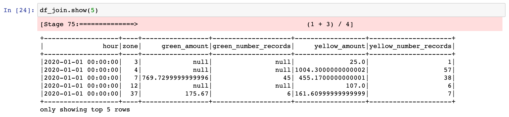

#### What exactly Spark is doing

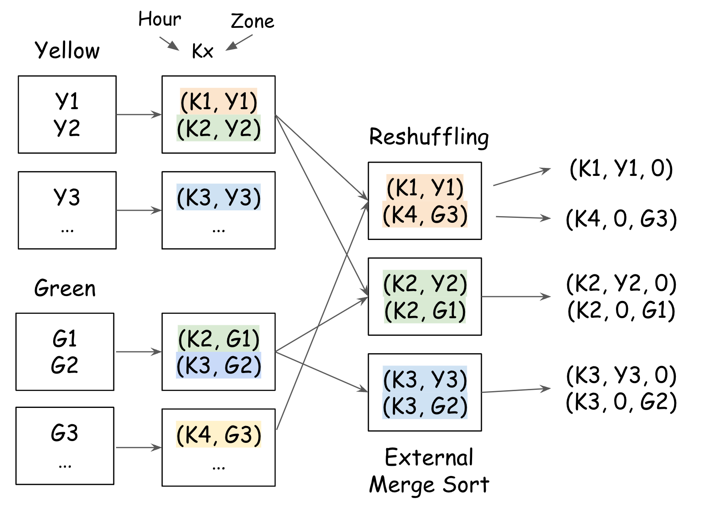

#### Joining zones

> 11:32/17:04 (5.4.3) Joining zones

Read the result previously created.

``` python
>>> df_join = spark.read.parquet('data/report/revenue/total')
>>> df_join.printSchema()
root
 |-- hour: timestamp (nullable = true)
 |-- zone: integer (nullable = true)
 |-- green_amount: double (nullable = true)
 |-- green_number_records: long (nullable = true)
 |-- yellow_amount: double (nullable = true)
 |-- yellow_number_records: long (nullable = true)
>>> df_join.show(5)
```

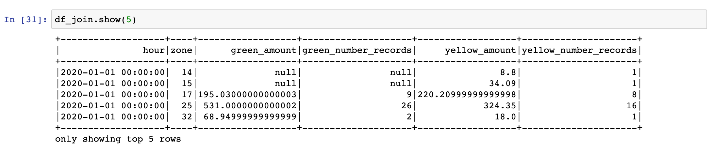

Read the zones.

``` python
>>> !wget https://s3.amazonaws.com/nyc-tlc/misc/taxi+_zone_lookup.csv
>>> df = spark.read.option("header", "true").csv('taxi+_zone_lookup.csv')
>>> df.write.parquet('zones')
>>> df_zones = spark.read.parquet('zones/')
>>> df_zones.printSchema()
root
 |-- LocationID: string (nullable = true)
 |-- Borough: string (nullable = true)
 |-- Zone: string (nullable = true)
 |-- service_zone: string (nullable = true)
>>> df_zones.show(5)
```

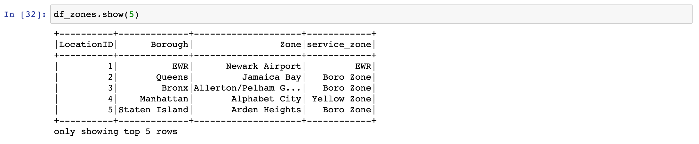

Join this two datasets and materialized the result.

``` python
df_result = df_join.join(df_zones, df_join.zone == df_zones.LocationID)
df_result.drop('LocationID', 'zone').write.parquet('tmp/revenue-zones')
```

#### What exactly Spark is doing

> 14:40/17:04 (5.4.3) What happens

- Each executor processes a partition of Revenue DataFrame.
- Zones DataFrame is a small table.
- Because Zones is very small, each executor gets a copy of the entire Zones DataFrame and merges it with their
  partition of Revenue DataFrame within memory.
- Spark broadcast joins are perfect for joining a large DataFrame with a small DataFrame.
  - Spark can "broadcast" a small DataFrame by sending all the data in that small DataFrame to all nodes in the cluster.
  - After the small DataFrame is broadcasted, Spark can perform a join without shuffling any of the data in the large
    DataFrame.
- This is really (really!) fast.


## 5.5 (Optional) Resilient Distributed Datasets

### 5.5.1 Operations on Spark RDDs

> 0:00/24:13 (5.5.1) Operations on Spark RDDs

We will cover :

- What is RDD and how is it related to dataframe
- From DataFrame to RDD
- Operators on RDDs: map, filter, reduceByKey
- From RDD to DataFrame

**Resilient Distributed Datasets** (RDDs) are the main abstraction provided by Spark and consist of collection of
elements partitioned accross the nodes of the cluster.

Dataframes are actually built on top of RDDs and contain a schema as well, which plain RDDs do not.

#### Start Jupyter on remote machine

First, start VM instance on Google Cloud. If needed, see the previous section called "Start VM instance on Google
Cloud".

Start Jupyter notebook on the cloud VM.

``` bash
> cd
> cd data-engineering-zoomcamp/
> cd week_5_batch_processing/
> jupyter notebook
```

Copy and paste one of the URLs (I have <http://localhost:8888/?token=867547600579e51683e76441800b4b7b4a9213b4de12fcd8>)
to the web browser.

Make sure ports `8888` and `4040` are open. If not, see instructions in previous section.

#### Create a new notebook

> 2:19/24:13 (5.5.1) Create a new notebook

In Jupyter, create a new notebook with the **Python 3 (ipykernel)** (or simply open `08_rdds.ipynb`).

**File `08_rdds.ipynb`**

``` python
import pyspark
from pyspark.sql import SparkSession

spark = SparkSession.builder \
    .master("local[*]") \
    .appName('test') \
    .getOrCreate()

df_green = spark.read.parquet('data/pq/green/*/*')

print(type(df_green.rdd.take(1)[0]))
# <class 'pyspark.sql.types.Row'>

df_green.rdd.take(3)
```

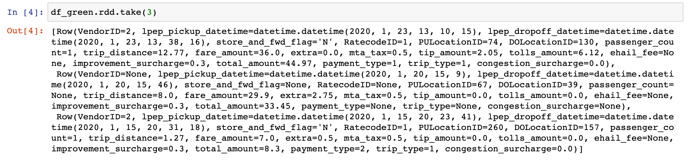

A `Row` is a special object `pyspark.sql.types.Row`.

#### Implement a SQL query in RDD

We want to implement this SQL query below but with RDD.

``` sql
SELECT
    date_trunc('hour', lpep_pickup_datetime) AS hour,
    PULocationID AS zone,

    SUM(total_amount) AS amount,
    COUNT(1) AS number_records
FROM
    green
WHERE
    lpep_pickup_datetime >= '2020-01-01 00:00:00'
GROUP BY
    1, 2
```

First, keep only columns that we need.

``` python
rdd = df_green \
    .select('lpep_pickup_datetime', 'PULocationID', 'total_amount') \
    .rdd

rdd.take(5)
```


#### Operations on RDDs: filter, map, reduceByKey, map, toDF

We will do five steps:

- `.filter()` because we don’t want outliers
- `.map()` to generate intermediate results better suited for aggregation
- `.reduceByKey()` to merge the values for each key
- `.map()` to unwrap the rows
- `.toDF()` to return the rows to a dataframe properly

#### WHERE vs .filter()

> 5:10/24:13 (5.5.1) WHERE vs .filter()

Next, we don’t want outliers and only need trips since January 1, 2020. So we create a filter.

A filter returns a new RDD containing only the elements that satisfy a predicate.

``` python
# This returns the first row.
>>> rdd.filter(lambda row: True).take(1)

# This filters the while dataset and returns an empty list.
>>> rdd.filter(lambda row: False).take(1)

# This returns even numbers.
# See https://spark.apache.org/docs/3.1.3/api/python/reference/api/pyspark.RDD.filter.html
>>> rdd = sc.parallelize([1, 2, 3, 4, 5])
>>> rdd.filter(lambda x: x % 2 == 0).collect()
[2, 4]
```

We will use this to filter a Timestamp.

``` python
from datetime import datetime

start = datetime(year=2020, month=1, day=1)

rdd.filter(lambda row: riw.lpep_pickup_datetime >= start).take(5)

# Better, because with lambda we gets messy quiet fast.
def filter_outliers(row):
    return row.lpep_pickup_datetime >= start

rdd \
    .filter(filter_outliers)
    .take(3)
```


#### GROUP BY vs .map()

> 7:10/24:13 (5.5.1) GROUP BY vs .map()

To implement the equivalent of GroupBy, we need the `.map()` function. A `map()` applied a transformation to every `Row`
and return a transformed RDD.

We create a function that transforms a `row` by creating a tuple composed of a `key` and a `value`. The `key` is a tuple
of `hour` and `zone`, the same two columns of the `GROUP BY`. The `value` is a tuple of `amount` and
`number of records`, the same two columns that are returned by the SQL query above.

``` python
def prepare_for_grouping(row):
    hour = row.lpep_pickup_datetime.replace(minute=0, second=0, microsecond=0)
    zone = row.PULocationID
    key = (hour, zone)

    amount = row.total_amount
    count = 1
    value = (amount, count)

    return (key, value)

rdd \
    .filter(filter_outliers) \
    .map(prepare_for_grouping) \
    .take(5)
```

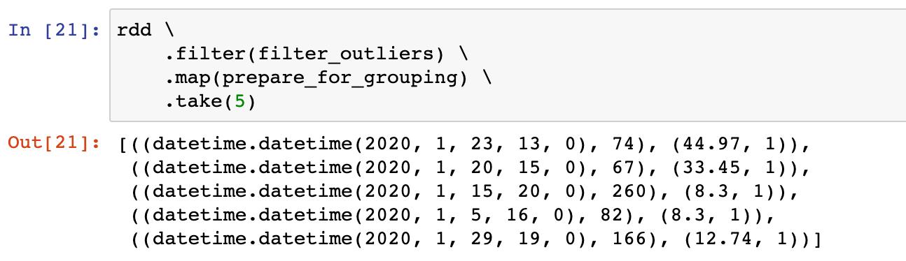

#### .reduceByKey()

> 12:10/24:13 (5.5.1) Reduce by key

Now, we will aggregate this RDD transformed RDD by the key.

To do so, we will use
[pyspark.RDD.reduceByKey](https://spark.apache.org/docs/latest/api/python/reference/api/pyspark.RDD.reduceByKey.html) to
merge the values for each key using an associative and commutative reduce function.

Here, `left_value` and `rigth_value` are tuple of `amount` and `number of records`.

``` python
def calculate_revenue(left_value, right_value):
    left_amount, left_count = left_value
    right_amount, right_count = right_value

    output_amount = left_amount + right_amount
    output_count = left_count + right_count

    return (output_amount, output_count)

df_result = rdd \
    .filter(filter_outliers) \
    .map(prepare_for_grouping) \
    .reduceByKey(calculate_revenue) \
    .take(5)
```

This code takes some time to run. We see that key is now unique and value is aggregated.

#### Unwrap the row

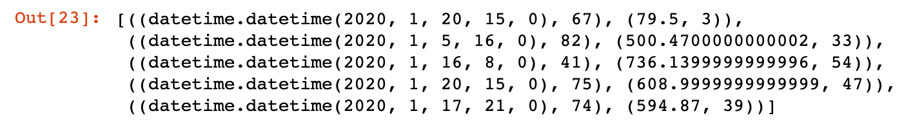

> 16:49/24:13 (5.5.1) Unnest the row

The nested Row structure isn’t really nice to use, and we want to fall back to a data frame.

To do so, we apply another `map` function to transform the rows into the desired columns.

``` python
from collections import namedtuple

RevenueRow = namedtuple('RevenueRow', ['hour', 'zone', 'revenue', 'count'])

def unwrap(row):
    return RevenueRow(
        hour=row[0][0],
        zone=row[0][1],
        revenue=row[1][0],
        count=row[1][1]
    )

rdd \
    .filter(filter_outliers) \
    .map(prepare_for_grouping) \
    .reduceByKey(calculate_revenue) \
    .map(unwrap) \
    .take(5)
```

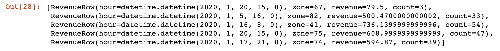

#### Returning to a dataframe

> 16:49/24:13 (5.5.1) Turn back to a dataframe

To return to a dataframe properly, we want to fix the schema.

``` python
from pyspark.sql import types

result_schema = types.StructType([
    types.StructField('hour', types.TimestampType(), True),
    types.StructField('zone', types.IntegerType(), True),
    types.StructField('revenue', types.DoubleType(), True),
    types.StructField('count', types.IntegerType(), True)
])

df_result = rdd \
    .filter(filter_outliers) \
    .map(prepare_for_grouping) \
    .reduceByKey(calculate_revenue) \
    .map(unwrap) \
    .toDF(result_schema)

df_result.show(5)
```

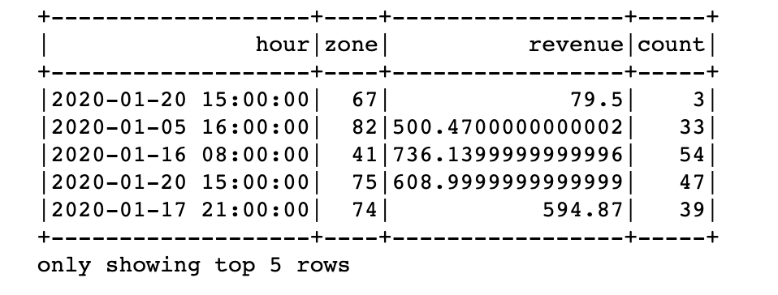

``` python
>>> df_result.printSchema()
root
 |-- hour: timestamp (nullable = true)
 |-- zone: integer (nullable = true)
 |-- revenue: double (nullable = true)
 |-- count: integer (nullable = true)
```

> 21:00/24:13 (5.5.1) Save.

``` python
df_result.write.parquet('tmp/green-revenue')
```

Nowadays, we don’t often need to write code like before. Everything can be generated automatically of SQL on the
DataFrame.

### 5.5.2 Spark RDD mapPartitions

> 0:00/16:43 (5.5.2) Spark RDD: mapPartitions

`mapPartitions()` returns a new RDD by applying a function to each partition of this RDD.

`` mapPartitions() is exactly the same as `map() ``; the difference being, Spark `mapPartitions()` provides a facility
to do heavy initializations (for example Database connection) once for each partition instead of doing it on every
DataFrame row. This helps the performance of the job when you dealing with heavy-weighted initialization on larger
datasets.

See [Spark map() vs mapPartitions() with
Examples](https://sparkbyexamples.com/spark/spark-map-vs-mappartitions-transformation/) for more.

To present a use case of `mapPartitions()`, we will create an application that predict the duration of a trips.

First, select the necessary columns and turn this to a RDD.

``` python
columns = ['VendorID', 'lpep_pickup_datetime', 'PULocationID', 'DOLocationID', 'trip_distance']

duration_rdd = df_green \
    .select(columns) \
    .rdd

duration_rdd.take(5)
```

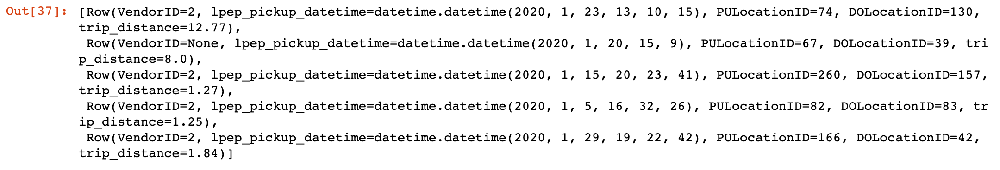

#### How to use .mapPartitions()

> 4:07/16:43 (5.5.2) How to use .mapPartitions()

Below is a two simples codes that helps to understand how `mapPartitions()` works.

The code below returns `[1]` for each partitions and flattens the list.

``` python
def apply_model_in_batch(partition):
    return [1]

rdd.mapPartitions(apply_model_in_batch).collect()
# [1, 1, 1, 1]
```

The code below returns the number of rows per for each partition and flattens the list.

``` python
def apply_model_in_batch(partition):
    cnt = 0

    for row in partition:
        cnt = cnt + 1

    return [cnt]

rdd.mapPartitions(apply_model_in_batch).collect()
# [1141148, 436983, 433476, 292910]
```

We see that partition a not really balanced. One partition is very large compared to others.

#### Turn partition to a pandas dataframe

> 7:02/16:43 (5.5.2) Turn partition to a pandas dataframe

``` python
import pandas as pd

def apply_model_in_batch(rows):
    df = pd.DataFrame(rows, columns=columns)
    cnt = len(df)
    return [cnt]

duration_rdd.mapPartitions(apply_model_in_batch).collect()
# [1141148, 436983, 433476, 292910]
```

It put the entire partition in a dataframe, which isn’t always good. If you want to solve it, you can use `.islice()` to
break a partition into 100,000 rows subpartitions and treat them them separately.

> 9:37/16:43 (5.5.2) Machine Learning

Now, we are ready to apply a machine learning model.

Normally we would have a model that calculates predictions from an algorithm and data from a dataframe. But since we
don’t have a model yet, let’s calculate an arbitrary duration (5 minutes per km).

``` python
# model = ...

def model_predict(df):
    # y_pred = model.predict(df)
    y_pred = df.trip_distance * 5
    return y_pred

def apply_model_in_batch(rows):
    df = pd.DataFrame(rows, columns=columns)
    predictions = model_predict(df)
    df['predicted_duration'] = predictions

    for row in df.itertuples():
        yield row

df_predicts = duration_rdd \
    .mapPartitions(apply_model_in_batch) \
    .toDF() \
    .drop('Index')

df_predicts.select('predicted_duration').show(10)
```


Here, [itertuples()](https://pandas.pydata.org/docs/reference/api/pandas.DataFrame.itertuples.html) iterates over
DataFrame rows as namedtuples.

For illustrative purposes…​

``` python
rows = duration_rdd.take(5)
df = pd.DataFrame(rows, columns=columns)
list(df.itertuples())
```

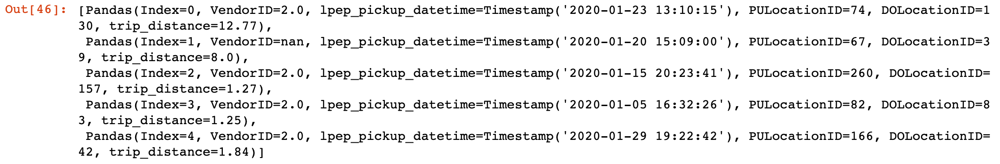

The `yield` keyword in Python is similar to a return statement used for returning values or objects in Python. However,
there is a slight difference. The yield statement returns a generator object to the one who calls the function which
contains yield, instead of simply returning a value.

For example…​

``` python
def infinite_seq(flag: bool):
    i = 0
    while True:
        yield i
        i = i + 1

        if flag and i > 10:
            break
```

This produces an infinite sequence.

``` python
>>> seq = infinite_seq(False)
>>> seq
<generator object infinite_seq at 0x7fac2fd95510>
```

But, this produces a finite sequence.

``` python
>>> seq = infinite_seq(True)
>>> seq
>>> list(seq)
[0, 1, 2, 3, 4, 5, 6, 7, 8, 9, 10]
```

So, `yield` write each row to the resulting RDD and then it will flatten it.

## 5.6 Running Spark in the Cloud

### 5.6.1 Connecting to Google Cloud Storage

> 0:00/8:46 (5.6.1) Running Spark in the Cloud

We will cover:

- Uploading data to GCS
- Connecting Spark jobs to GCS

#### Upload data to GCS

On the remote machine, we have already created (in the previous steps) data in this directory:
`/home/boisalai/data-engineering-zoomcamp/week_5_batch_processing/code/data/pq`.

We want to upload this data to our bucket on Google CLoud Storage.

We will use [gsutil tool](https://cloud.google.com/storage/docs/gsutil).

Note that we see `de-zoomcamp-nytaxi` in the video for BigQuery resource name. On my side, I have
`hopeful-summer-375416` for BigQuery resource name.

``` bash
> gsutil -m cp -r pq/ gs://dtc_data_lake_hopeful-summer-375416/
```

We now have the data in GCS.

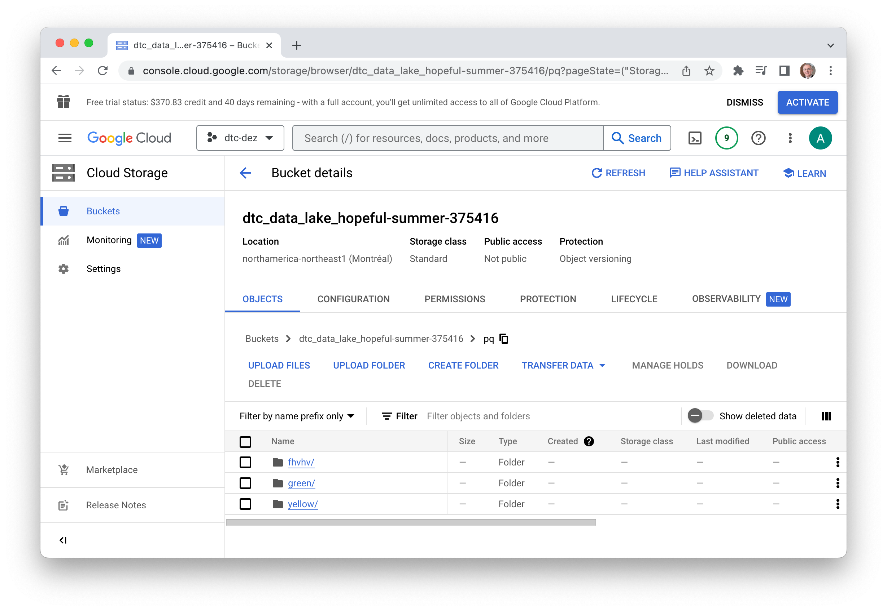

#### Setup to read from GCS

> 3:06/8:46 (5.6.1) Setup to read from GCS

We will now apply (however not completely) the instructions from **Alvin Do**.

**Step 1**: Download the Cloud Storage connector for Hadoop here:
<https://cloud.google.com/dataproc/docs/concepts/connectors/cloud-storage#clusters> As the name implies, this `.jar`
file is what essentially connects PySpark with your GCS.

See [GCS Connector Hadoop3](https://mvnrepository.com/artifact/com.google.cloud.bigdataoss/gcs-connector) for a specific
version.

Go to your remote machine, create a new directory.

``` bash
> pwd
/home/boisalai/data-engineering-zoomcamp/week_5_batch_processing/code
> mkdir lib
> cd lib/
> gsutil cp gs://hadoop-lib/gcs/gcs-connector-hadoop3-2.2.11.jar gcs-connector-hadoop3-2.2.11.jar
> ls
gcs-connector-hadoop3-2.2.11.jar
> pwd
/home/boisalai/data-engineering-zoomcamp/week_5_batch_processing/code/lib
```

**Step 2**: Move the `.jar` file to your Spark file directory. I installed Spark using homebrew on my MacOS machine and
I had to create a `/jars` directory under `/opt/homebrew/Cellar/apache-spark/3.2.1/` (where my spark dir is located).

We do not do this step. We will instead specify the directories directly in our script

**Step 3**: In your Python script, there are a few extra classes you’ll have to import:

Start Jupyter notebook from the remote machine. Create the notebook `06_spark_gcs.ipynb` and insert this code into it.

``` python
import pyspark
from pyspark.sql import SparkSession
from pyspark.conf import SparkConf
from pyspark.context import SparkContext
```

**Step 4**: You must set up your configurations before building your SparkSession. Here’s my code snippet:

I’m using the same key here that I created in week 2 (see the section called **Adding the new key to the service
account**). I just renamed this key "google_credentials.json" like in the video.

``` python
credentials_location = '/Users/boisalai/.google/credentials/google_credentials.json'

conf = SparkConf() \
        .setMaster('local[*]') \
        .setAppName('test') \
        .set("spark.jars", "./lib/gcs-connector-hadoop3-2.2.11.jar") \
        .set("spark.hadoop.google.cloud.auth.service.account.enable", "true") \
        .set("spark.hadoop.google.cloud.auth.service.account.json.keyfile", credentials_location)

sc = SparkContext(conf=conf)

hadoop_conf = sc._jsc.hadoopConfiguration()

hadoop_conf.set("fs.AbstractFileSystem.gs.impl", "com.google.cloud.hadoop.fs.gcs.GoogleHadoopFS")
hadoop_conf.set("fs.gs.impl", "com.google.cloud.hadoop.fs.gcs.GoogleHadoopFileSystem")
hadoop_conf.set("fs.gs.auth.service.account.json.keyfile", credentials_location)
hadoop_conf.set("fs.gs.auth.service.account.enable", "true")
```

**Step 5**: Once you run that, build your `SparkSession` with the new parameters we’d just instantiated in the previous
step:

``` python
spark = SparkSession.builder \
    .config(conf=sc.getConf()) \
    .getOrCreate()
```

Now, this code should work.

``` python
>>> df_green = spark.read.parquet('gs://dtc_data_lake_hopeful-summer-375416/pq/green/*/*')
>>> df_green.count()
2304517
>>> df_green.show(5)
```

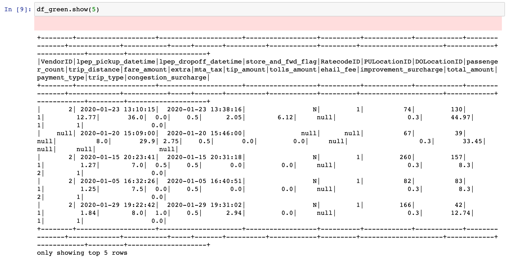

We know now how connect to GCS from our Spark cluster.

### 5.6.2 Creating a Local Spark Cluster

> 0:00/15:29 (5.6.2) Creating a Local Spark Cluster

We will cover:

- Creating a cluster in the cloud
- Turning the notebook into a script
- Using `spark-submit` for submitting spark jobs

0:37/15:29 (5.6.2) Installing Spark Standalone to a Cluster

So far we have created a local cluster from Jupyter notebook. If we stop the Jupyter notebook, the cluster disappears
immediately.

Now, we want to create a Spark cluster outside of the notebook. Fortunately, Spark provides a simple standalone deploy
mode.

We will follow the instructions in [Spark Standalone Mode](https://spark.apache.org/docs/latest/spark-standalone.html).

Go to the remote machine, and run the following commands.

``` bash
echo $SPARK_HOME
# /home/boisalai/spark/spark-3.3.2-bin-hadoop3
cd ~/spark/spark-3.3.2-bin-hadoop3
./sbin/start-master.sh
# starting org.apache.spark.deploy.master.Master, logging to /home/boisalai/spark/spark-3.3.2-bin-hadoop3/logs/spark-boisalai-org.apache.spark.deploy.master.Master-1-de-zoomcamp.out
```

Open another port `8080` (in VS Code terminal, `Shift+Cmd+P`, select **Remote-SSH: Connect to Host…​**).

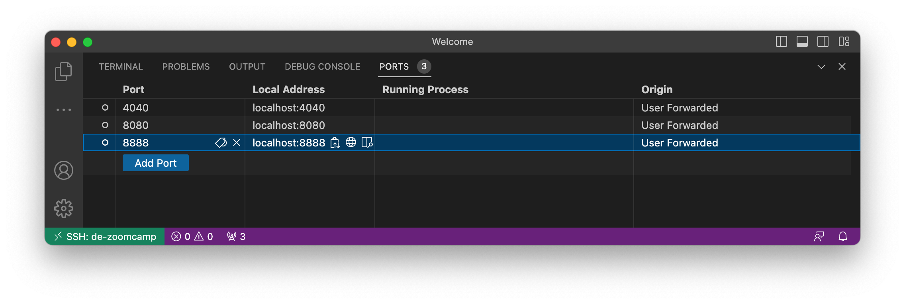

Open the web brouwser to `http://localhost:8080/`.

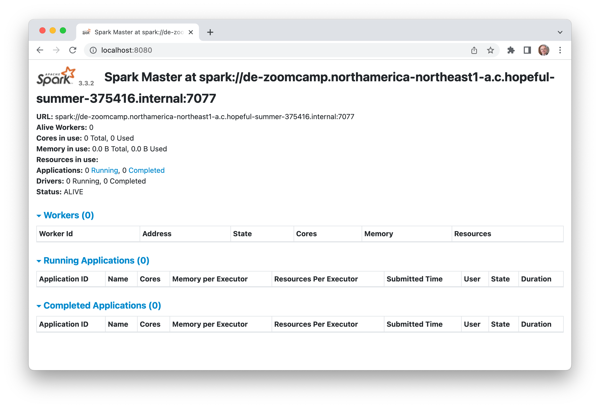

Now, in Jupyter notebook, we can create a SparkSession like this.

``` python
import pyspark
from pyspark.sql import SparkSession

spark = SparkSession.builder \
    .master("spark://de-zoomcamp.northamerica-northeast1-a.c.hopeful-summer-375416.internal:7077") \
    .appName('test') \
    .getOrCreate()
```

Now, let’s run some thing.

``` python
>>> df_green = spark.read.parquet('data/pq/green/*/*')
```

4:08/15:29 (5.6.2) WARN TaskSchedulerImpl

But, we see a warning message.

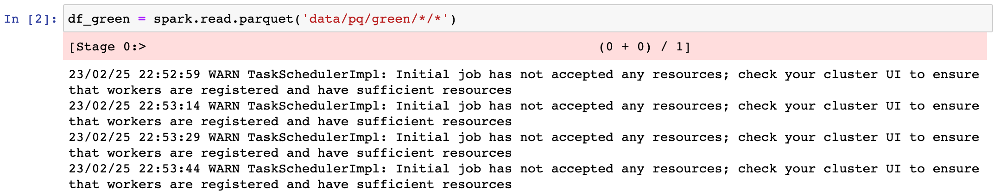

This message is due to the fact that we do not yet have a worker (we have zero worker).

We need to start a worker on the remote machine.

``` bash
echo $SPARK_HOME
# /home/boisalai/spark/spark-3.3.2-bin-hadoop3
cd ~/spark/spark-3.3.2-bin-hadoop3
./sbin/start-slave.sh spark://de-zoomcamp.northamerica-northeast1-a.c.hopeful-summer-375416.internal:7077
```

Refresh the Spark Master Web and you should see a worker created.

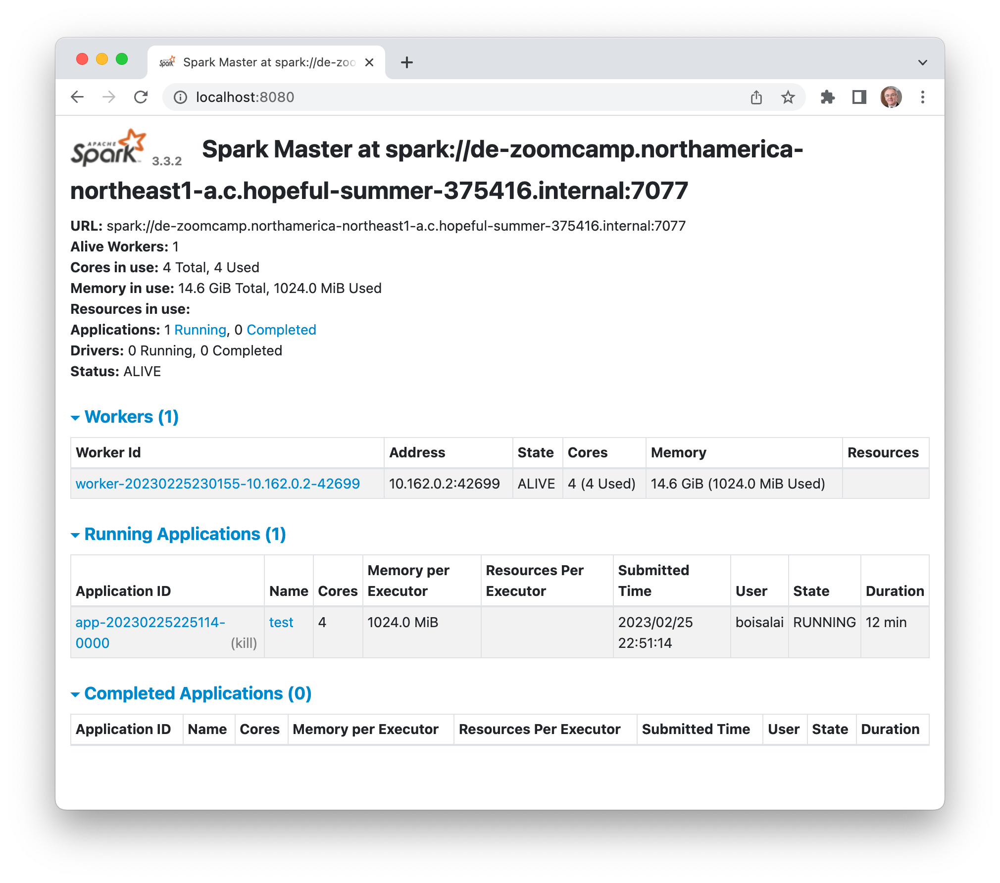

If we run the code below again, we should see this.

``` python
>>> df_green = spark.read.parquet('data/pq/green/*/*')
>>> df_green.count()
2304517
```

#### Create a python script

> 05:42/15:29 (5.6.2) Convert this notebook to python script.

Here, the notebook we want to convert into script.

**File `06_spark_sql.ipynb`**

``` python
import pyspark
from pyspark.sql import SparkSession

spark = SparkSession.builder \
    .master("spark://de-zoomcamp.northamerica-northeast1-a.c.hopeful-summer-375416.internal:7077") \
    .appName('test') \
    .getOrCreate()

df_green = spark.read.parquet('data/pq/green/*/*')

df_green = df_green \
    .withColumnRenamed('lpep_pickup_datetime', 'pickup_datetime') \
    .withColumnRenamed('lpep_dropoff_datetime', 'dropoff_datetime')

df_yellow = spark.read.parquet('data/pq/yellow/*/*')

df_yellow = df_yellow \
    .withColumnRenamed('tpep_pickup_datetime', 'pickup_datetime') \
    .withColumnRenamed('tpep_dropoff_datetime', 'dropoff_datetime')

# common_colums = []

# yellow_columns = set(df_yellow.columns)

# for col in df_green.columns:
#     if col in yellow_columns:
#         common_colums.append(col)

common_colums = ['VendorID',
     'pickup_datetime',
     'dropoff_datetime',
     'store_and_fwd_flag',
     'RatecodeID',
     'PULocationID',
     'DOLocationID',
     'passenger_count',
     'trip_distance',
     'fare_amount',
     'extra',
     'mta_tax',
     'tip_amount',
     'tolls_amount',
     'improvement_surcharge',
     'total_amount',
     'payment_type',
     'congestion_surcharge'
]

from pyspark.sql import functions as F

df_green_sel = df_green \
    .select(common_colums) \
    .withColumn('service_type', F.lit('green'))

df_yellow_sel = df_yellow \
    .select(common_colums) \
    .withColumn('service_type', F.lit('yellow'))

df_trips_data = df_green_sel.unionAll(df_yellow_sel)

# df_trips_data.registerTempTable('trips_data') # Deprecated.
df_trips_data.createOrReplaceTempView("trips_data")

df_result = spark.sql("""
SELECT
    -- Reveneue grouping
    PULocationID AS revenue_zone,
    date_trunc('month', pickup_datetime) AS revenue_month,
    service_type,

    -- Revenue calculation
    SUM(fare_amount) AS revenue_monthly_fare,
    SUM(extra) AS revenue_monthly_extra,
    SUM(mta_tax) AS revenue_monthly_mta_tax,
    SUM(tip_amount) AS revenue_monthly_tip_amount,
    SUM(tolls_amount) AS revenue_monthly_tolls_amount,
    SUM(improvement_surcharge) AS revenue_monthly_improvement_surcharge,
    SUM(total_amount) AS revenue_monthly_total_amount,
    SUM(congestion_surcharge) AS revenue_monthly_congestion_surcharge,

    -- Additional calculations
    AVG(passenger_count) AS avg_montly_passenger_count,
    AVG(trip_distance) AS avg_montly_trip_distance
FROM
    trips_data
GROUP BY
    1, 2, 3
""")

df_result.coalesce(1).write.parquet('data/report/revenue/', mode='overwrite')
```

In the terminal on the remote machine, run the following command.

``` bash
jupyter nbconvert --to=script 06_spark_sql.ipynb
```

Here, the created `06_spark_sql.py` file:

**File `06_spark_sql.py`**

``` python
#!/usr/bin/env python
# coding: utf-8

# In[1]:
import pyspark
from pyspark.sql import SparkSession

spark = SparkSession.builder
    .master("spark://de-zoomcamp.northamerica-northeast1-a.c.hopeful-summer-375416.internal:7077")
    .appName('test')
    .getOrCreate()

# In[2]:
df_green = spark.read.parquet('data/pq/green/*/*')

# In[3]:
df_green.count()

# In[4]:
df_green = df_green
    .withColumnRenamed('lpep_pickup_datetime', 'pickup_datetime')
    .withColumnRenamed('lpep_dropoff_datetime', 'dropoff_datetime')

# In[5]:
df_yellow = spark.read.parquet('data/pq/yellow/*/*')


# In[6]:
df_yellow = df_yellow
    .withColumnRenamed('tpep_pickup_datetime', 'pickup_datetime')
    .withColumnRenamed('tpep_dropoff_datetime', 'dropoff_datetime')

# In[7]:
common_colums = []
yellow_columns = set(df_yellow.columns)

for col in df_green.columns:
    if col in yellow_columns:
        common_colums.append(col)

# In[13]:
common_colums = ['VendorID',
     'pickup_datetime',
     'dropoff_datetime',
     'store_and_fwd_flag',
     'RatecodeID',
     'PULocationID',
     'DOLocationID',
     'passenger_count',
     'trip_distance',
     'fare_amount',
     'extra',
     'mta_tax',
     'tip_amount',
     'tolls_amount',
     'improvement_surcharge',
     'total_amount',
     'payment_type',
     'congestion_surcharge'
]

# In[8]:
from pyspark.sql import functions as F

# In[9]:
df_green_sel = df_green
    .select(common_colums)
    .withColumn('service_type', F.lit('green'))

# In[10]:
df_yellow_sel = df_yellow
    .select(common_colums)
    .withColumn('service_type', F.lit('yellow'))

# In[11]:
df_trips_data = df_green_sel.unionAll(df_yellow_sel)

# In[12]:
df_trips_data.groupBy('service_type').count().show()

# In[13]:
df_trips_data.columns
ls

# In[14]:
# df_trips_data.registerTempTable('trips_data') # Deprecated.
df_trips_data.createOrReplaceTempView("trips_data")

# In[15]:
df_result = spark.sql("""
SELECT
    -- Reveneue grouping
    PULocationID AS revenue_zone,
    date_trunc('month', pickup_datetime) AS revenue_month,
    service_type,

    -- Revenue calculation
    SUM(fare_amount) AS revenue_monthly_fare,
    SUM(extra) AS revenue_monthly_extra,
    SUM(mta_tax) AS revenue_monthly_mta_tax,
    SUM(tip_amount) AS revenue_monthly_tip_amount,
    SUM(tolls_amount) AS revenue_monthly_tolls_amount,
    SUM(improvement_surcharge) AS revenue_monthly_improvement_surcharge,
    SUM(total_amount) AS revenue_monthly_total_amount,
    SUM(congestion_surcharge) AS revenue_monthly_congestion_surcharge,

    -- Additional calculations
    AVG(passenger_count) AS avg_montly_passenger_count,
    AVG(trip_distance) AS avg_montly_trip_distance
FROM
    trips_data
GROUP BY
    1, 2, 3
""")

# In[19]:
df_result.coalesce(1).write.parquet('data/report/revenue/', mode='overwrite')
```

We can edit this file with VS Code. Just run `code .` in the terminal of the remote machine.

#### Submit a job

After, run the following command.

``` bash
python 06_spark_sql.py
```

But, we have this warning message:
`23/02/26 00:49:53 WARN TaskSchedulerImpl: Initial job has not accepted any resources; check your cluster UI to ensure that workers are registered and have sufficient resources`.

This warning message is due to the fact that we have two applications for a single worker. The first takes all the
resources.

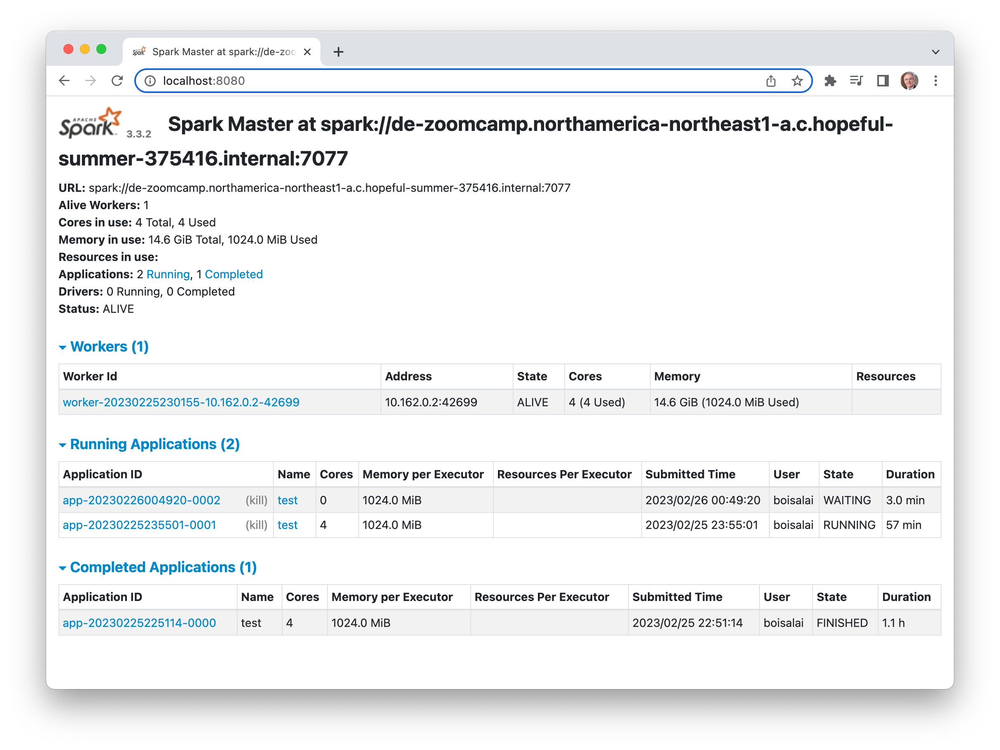

So, we have to kill the first process so that the second one can run.

> 7:30/15:29 (5.6.2) Kill the first process.

Now, if we go to the `~/data-engineering-zoomcamp/week_5_batch_processing/code/data/report` directory, we see that the
`revenue` directory has just been created.

``` bash
ls -lh
# total 4.0K
# drwxr-xr-x 2 boisalai boisalai 4.0K Feb 26 00:58 revenue
```

> 08:10/15:29 (5.6.2) Using `argparse` to configure script

We will use [argparse](https://docs.python.org/3/library/argparse.html) like in week 1, to allow changing parameters
with command line.

**File `06_spark_sql.py`**

``` python
#!/usr/bin/env python
# coding: utf-8

import argparse

import pyspark
from pyspark.sql import SparkSession
from pyspark.sql import functions as F


parser = argparse.ArgumentParser()

parser.add_argument('--input_green', required=True)
parser.add_argument('--input_yellow', required=True)
parser.add_argument('--output', required=True)

args = parser.parse_args()

input_green = args.input_green
input_yellow = args.input_yellow
output = args.output


spark = SparkSession.builder \
    .master("spark://de-zoomcamp.northamerica-northeast1-a.c.hopeful-summer-375416.internal:7077") \
    .appName('test') \
    .getOrCreate()

df_green = spark.read.parquet(input_green)

df_green = df_green \
    .withColumnRenamed('lpep_pickup_datetime', 'pickup_datetime') \
    .withColumnRenamed('lpep_dropoff_datetime', 'dropoff_datetime')

df_yellow = spark.read.parquet(input_yellow)

df_yellow = df_yellow \
    .withColumnRenamed('tpep_pickup_datetime', 'pickup_datetime') \
    .withColumnRenamed('tpep_dropoff_datetime', 'dropoff_datetime')

common_colums = ['VendorID',
     'pickup_datetime',
     'dropoff_datetime',
     'store_and_fwd_flag',
     'RatecodeID',
     'PULocationID',
     'DOLocationID',
     'passenger_count',
     'trip_distance',
     'fare_amount',
     'extra',
     'mta_tax',
     'tip_amount',
     'tolls_amount',
     'improvement_surcharge',
     'total_amount',
     'payment_type',
     'congestion_surcharge'
]


from pyspark.sql import functions as F

df_green_sel = df_green \
    .select(common_colums) \
    .withColumn('service_type', F.lit('green'))

df_yellow_sel = df_yellow \
    .select(common_colums) \
    .withColumn('service_type', F.lit('yellow'))

df_trips_data = df_green_sel.unionAll(df_yellow_sel)

df_trips_data.createOrReplaceTempView("trips_data")

df_result = spark.sql("""
SELECT
    -- Reveneue grouping
    PULocationID AS revenue_zone,
    date_trunc('month', pickup_datetime) AS revenue_month,
    service_type,

    -- Revenue calculation
    SUM(fare_amount) AS revenue_monthly_fare,
    SUM(extra) AS revenue_monthly_extra,
    SUM(mta_tax) AS revenue_monthly_mta_tax,
    SUM(tip_amount) AS revenue_monthly_tip_amount,
    SUM(tolls_amount) AS revenue_monthly_tolls_amount,
    SUM(improvement_surcharge) AS revenue_monthly_improvement_surcharge,
    SUM(total_amount) AS revenue_monthly_total_amount,
    SUM(congestion_surcharge) AS revenue_monthly_congestion_surcharge,

    -- Additional calculations
    AVG(passenger_count) AS avg_montly_passenger_count,
    AVG(trip_distance) AS avg_montly_trip_distance
FROM
    trips_data
GROUP BY
    1, 2, 3
""")


df_result.coalesce(1).write.parquet(output, mode='overwrite')
```

Now, we can run our script with a set of parameters.

``` bash
python 06_spark_sql.py \
    --input_green=data/pq/green/2020/*/ \
    --input_yellow=data/pq/yellow/2020/*/ \
    --output=data/report-2020
```

We see that the report is created with success.

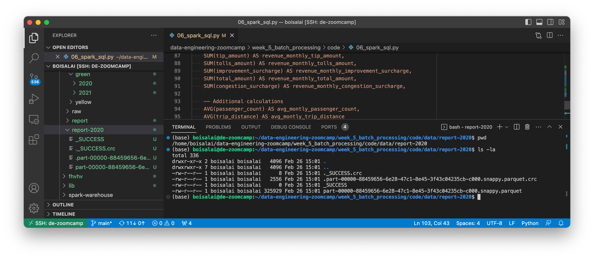

#### Spark-submit

> 10:55/15:29 (5.6.2) Multiple clusters

If we have multiple clusters, specifying the spark master url inside our script is not very practical.

So we remove the master from the script.

**File `06_spark_sql.py`**

``` python
spark = SparkSession.builder \
    .appName('test') \
    .getOrCreate()
```

We will specifiy the master outside in the command line by using `spark-submit` command.

The `spark-submit` script in Spark’s bin directory is used to launch applications on a cluster. See [Submitting
Applications](https://spark.apache.org/docs/latest/submitting-applications.html) for more information.

``` bash
URL="spark://de-zoomcamp.northamerica-northeast1-a.c.hopeful-summer-375416.internal:7077"

spark-submit \
    --master="${URL}" \
    06_spark_sql.py \
        --input_green=data/pq/green/2021/*/ \
        --input_yellow=data/pq/yellow/2021/*/ \
        --output=data/report-2021
```

The 2021 report should be created in `code/data/report-2021` directory.

#### Stop workers and master

> 15:02/15:29 (5.6.2) Stop the workers and stop the master

Before we finish, we have to stop the workers and stop the master.

For that, we just have to run these commands on the remote machine.

``` bash
echo $SPARK_HOME
# /home/boisalai/spark/spark-3.3.2-bin-hadoop3
cd ~/spark/spark-3.3.2-bin-hadoop3
./sbin/stop-slave.sh
# This script is deprecated, use stop-worker.sh
# stopping org.apache.spark.deploy.worker.Worker
./sbin/stop-worker.sh
# no org.apache.spark.deploy.worker.Worker to stop
./sbin/stop-master.sh
# stopping org.apache.spark.deploy.master.Master
```

### 5.6.3 Setting up a Dataproc Cluster

> 0:00/12:05 (5.6.3) Setting up a Dataproc Cluster

We will cover:

- Creating a Spark cluster on Google Cloud Plateform
- Running a Spark job with Dataproc
- Submitting the job with the cloud SDK

Google Cloud Dataproc is a managed service for running Apache Hadoop and Spark jobs. It can be used for big data
processing and machine learning.

Dataproc actually uses Compute Engine instances under the hood, but it takes care of the management details for you.
It’s a layer on top that makes it easy to spin up and down clusters as you need them.

The main benefits are that:

- It’s a managed service, so you don’t need a system administrator to set it up.
- It’s fast. You can spin up a cluster in about 90 seconds.
- It’s cheaper than building your own cluster because you can spin up a Dataproc cluster when you need to run a job and
  shut it down afterward, so you only pay when jobs are running.
- It’s integrated with other Google Cloud services, including Cloud Storage, BigQuery, and Cloud Bigtable, so it’s easy
  to get data into and out of it.

See [What Is Cloud
Dataproc?](https://cloudacademy.com/course/introduction-to-google-cloud-dataproc/what-is-cloud-dataproc-1/) on Cloud
Academy for more.

#### Create a cluster

> 0:39/12:05 (5.6.3) Create a cluster

Go to **Google Cloud Plateform**, find **Dataproc** service, click on **ENABLE** button.

Next, click on **CREATE CLUSTER** button, and click on **CREATE** for **Cluster on Compute Engine**.

<table><tr><td>
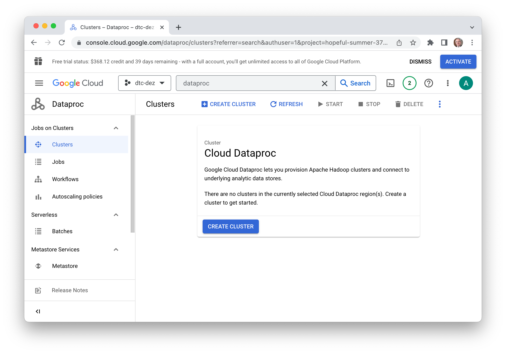
</td><td>
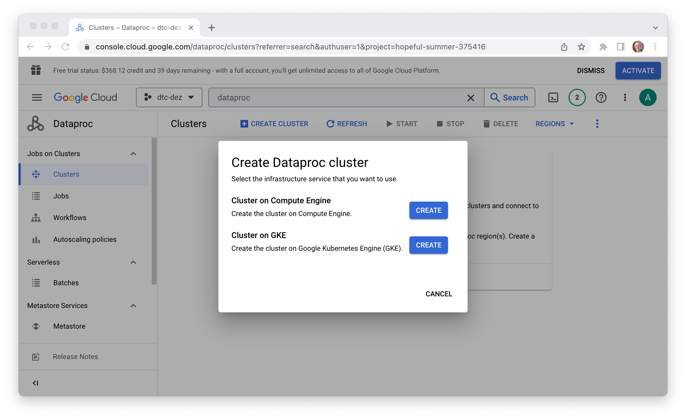
</td></tr></table>

Enter this information:

- **Cluster Name**: de-zoomcamp-cluster
- **Region**: northamerica-northeast1 (the same region as your bucket)
- **Cluster type**: Single Node (1 master, 0 workers) (because we are only experimenting)
- **Components**: Select **Jupyter Notebook** and **Docker**.

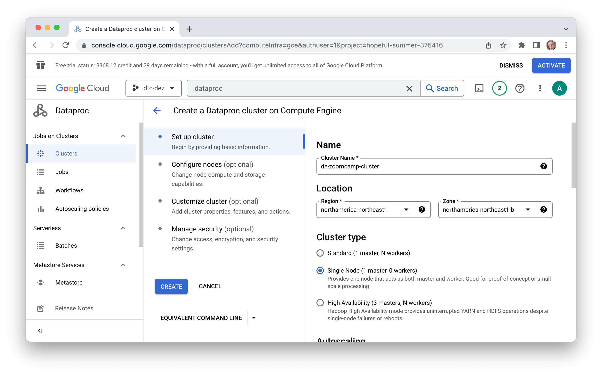

Click **CREATE**. It will take some time.

We should see a VM instances named **de-zoomcamp-cluster-m** created.

<table><tr><td>
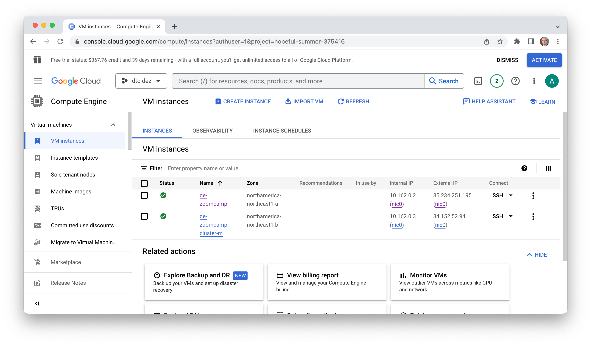
</td><td>
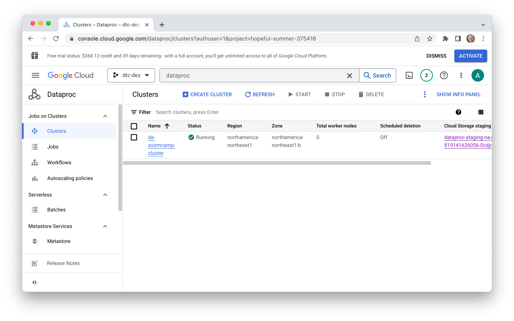
</td></tr></table>

#### Submit a job from UI

> 3:08/12:05 (5.6.3) Submit a job

Now, we can submit a job to the cluster.

With Dataproc, we don’t need to use the same instructions as before to establish the connection with Google Cloud
Storage (GCS). Dataproc is already configured to access GCS.

We have to upload `06_spark_sql.py` file to the bucket. Make sure you don’t specify the spark master in the code. The
code to get a spark session should look like this.

``` python
spark = SparkSession.builder \
    .appName('test') \
    .getOrCreate()
```

To upload `06_spark_sql.py` file to the bucket, we use this command:

``` bash
gsutil cp 06_spark_sql.py gs://dtc_data_lake_hopeful-summer-375416/code/06_spark_sql.py
```

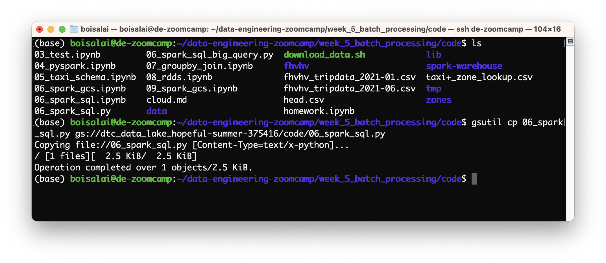

Now, in **Dataproc**, select the cluster **de-zoomcamp-cluster** , click on **SUBMIT JOB** button, and enter this
information.

- **Job type**: PySpark
- **Main python file**: `gs://dtc_data_lake_hopeful-summer-375416/code/06_spark_sql.py`
- **Arguments**: We must add these three arguments individually:
  - `--input_green=gs://dtc_data_lake_hopeful-summer-375416/pq/green/2021/*/`
  - `--input_yellow=gs://dtc_data_lake_hopeful-summer-375416/pq/yellow/2021/*/`
  - `--output=gs://dtc_data_lake_hopeful-summer-375416/report-2021`

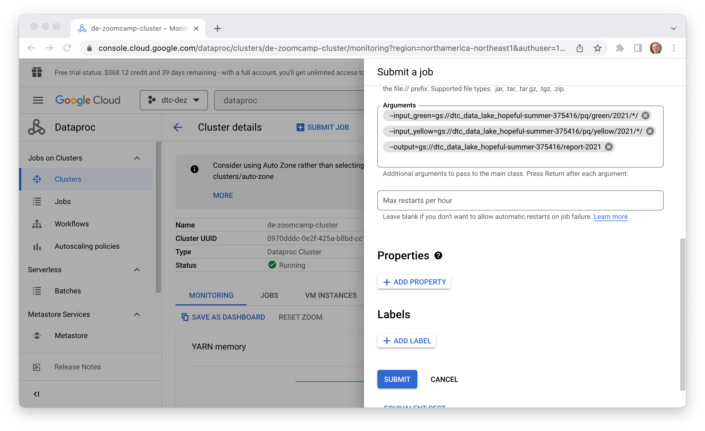

Then click on **SUBMIT** button.

The job takes some time to execute. When the job is finished, we should see this.

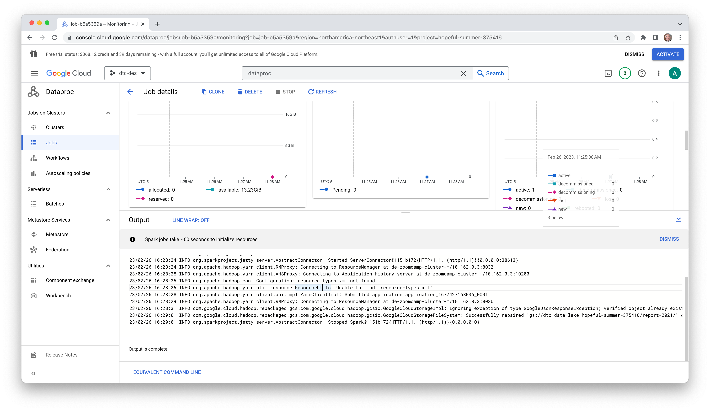

In our bucket, we see that the report is created successfully.

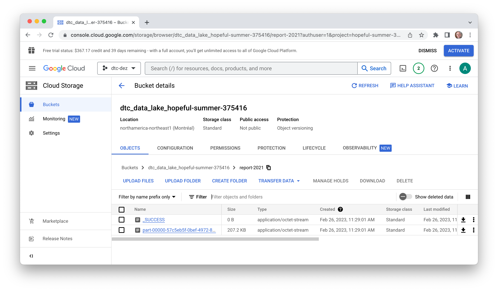

#### Equivalent REST

> 7:27/12:05 (5.6.3) Equivalent REST

You can click the **EQUIVALENT REST** at the bottom of the left panel on the Dataproc to have the Console construct an
equivalent API REST request or `gcloud` tool command to use in your code or from the command line to create a cluster.

The Equivalent REST response looks like this:

``` json
{
  "reference": {
    "jobId": "job-b5a5359a",
    "projectId": "hopeful-summer-375416"
  },
  "placement": {
    "clusterName": "de-zoomcamp-cluster"
  },
  "status": {
    "state": "DONE",
    "stateStartTime": "2023-02-26T16:29:06.653531Z"
  },
  "yarnApplications": [
    {
      "name": "test",
      "state": "FINISHED",
      "progress": 1,
      "trackingUrl": "http://de-zoomcamp-cluster-m:8088/proxy/application_1677427168036_0001/"
    }
  ],
  "statusHistory": [
    {
      "state": "PENDING",
      "stateStartTime": "2023-02-26T16:28:19.328311Z"
    },
    {
      "state": "SETUP_DONE",
      "stateStartTime": "2023-02-26T16:28:19.367781Z"
    },
    {
      "state": "RUNNING",
      "details": "Agent reported job success",
      "stateStartTime": "2023-02-26T16:28:19.866829Z"
    }
  ],
  "driverControlFilesUri": "gs://dataproc-staging-na-northeast1-819141626056-0cdjra2y/google-cloud-dataproc-metainfo/0970dddc-0e2f-425a-b8bd-cc148f86f525/jobs/job-b5a5359a/",
  "driverOutputResourceUri": "gs://dataproc-staging-na-northeast1-819141626056-0cdjra2y/google-cloud-dataproc-metainfo/0970dddc-0e2f-425a-b8bd-cc148f86f525/jobs/job-b5a5359a/driveroutput",
  "jobUuid": "dcd85f9c-eb2e-49a1-860b-3328967ae268",
  "done": true,
  "pysparkJob": {
    "mainPythonFileUri": "gs://dtc_data_lake_hopeful-summer-375416/code/06_spark_sql.py",
    "args": [
      "--input_green=gs://dtc_data_lake_hopeful-summer-375416/pq/green/2021/*/",
      "--input_yellow=gs://dtc_data_lake_hopeful-summer-375416/pq/yellow/2021/*/",
      "--output=gs://dtc_data_lake_hopeful-summer-375416/report-2021"
    ]
  }
}
```

#### Submit a job with gloud CLI

> 7:56/12:05 (5.6.3) Submit a job with gloud CLI

See [Submit a job](https://cloud.google.com/dataproc/docs/guides/submit-job) to know how to submit a job with Google
Cloud SDK.

For exemple, to submit a job to a Dataproc cluster with **gcloud CLI**, run the command below from the terminal.

Before, submit this command, we must add the role **Dataproc Administrator** to the permission **dtc-dez-user** created
in the previous weeks.

``` bash
gcloud dataproc jobs submit pyspark \
    --cluster=de-zoomcamp-cluster \
    --region=northamerica-northeast1 \
    gs://dtc_data_lake_hopeful-summer-375416/code/06_spark_sql.py \
    -- \
        --input_green=gs://dtc_data_lake_hopeful-summer-375416/pq/green/2021/*/ \
        --input_yellow=gs://dtc_data_lake_hopeful-summer-375416/pq/yellow/2021/*/ \
        --output=gs://dtc_data_lake_hopeful-summer-375416/report-2021
```

We see in the logs that the job finished successfully.


In our bucket, we can see that the report is created successfully.

#### Connecting Spark to Big Query

> 11:30/12:05 (5.6.3) Connecting Spark to Big Query

**Week 5 on Spark** - At the end of video 5.6.3 (Setting up a Dataproc Cluster), Alexis says that he will explain how to
connect Spark to BigQuery in the next video. Does this video exist? If so, do you know where it is?

## 5.6.4 Connecting Spark to Big Query

> 0:00/8:55 (5.6.4) Connecting Spark to Big Query

We will cover :

- Writing the spark job results to BigQuery

This [link](https://cloud.google.com/dataproc/docs/tutorials/bigquery-connector-spark-example#pyspark) talks about
connecting Spark to BigQuery. Here is the code appearing at this link.

``` python
#!/usr/bin/env python

"""BigQuery I/O PySpark example."""

from pyspark.sql import SparkSession

spark = SparkSession \
  .builder \
  .master('yarn') \
  .appName('spark-bigquery-demo') \
  .getOrCreate()

# Use the Cloud Storage bucket for temporary BigQuery export data used
# by the connector.
bucket = "[bucket]"
spark.conf.set('temporaryGcsBucket', bucket)

# Load data from BigQuery.
words = spark.read.format('bigquery') \
  .option('table', 'bigquery-public-data:samples.shakespeare') \
  .load()
words.createOrReplaceTempView('words')

# Perform word count.
word_count = spark.sql(
    'SELECT word, SUM(word_count) AS word_count FROM words GROUP BY word')
word_count.show()
word_count.printSchema()

# Saving the data to BigQuery
word_count.write.format('bigquery') \
  .option('table', 'wordcount_dataset.wordcount_output') \
  .save()
```

Using the example code above as a template, we will modify our code. See
[06_spark_sql_big_query.py](https://github.com/DataTalksClub/data-engineering-zoomcamp/blob/main/week_5_batch_processing/code/06_spark_sql_big_query.py)
on the GitHub repo.

First, we need to know the name of the buckets created by dataproc. Go to **Google Cloud**, **Cloud Storage**,
**Buckets**. We see two buckets whose name begins with dataproc. We will use
`dataproc-temp-na-northeast1-819141626056-nykzwckl`.

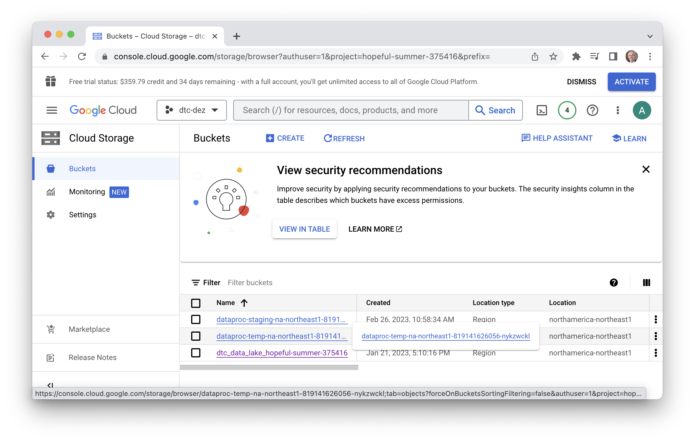

So, I modify the script below accordingly.

**File `06_spark_sql_big_query.py`**

``` python
#!/usr/bin/env python
# coding: utf-8

import argparse

import pyspark
from pyspark.sql import SparkSession
from pyspark.sql import functions as F


parser = argparse.ArgumentParser()

parser.add_argument('--input_green', required=True)
parser.add_argument('--input_yellow', required=True)
parser.add_argument('--output', required=True)

args = parser.parse_args()

input_green = args.input_green
input_yellow = args.input_yellow
output = args.output


spark = SparkSession.builder \
    .appName('test') \
    .getOrCreate()

# First modification.
# Use the Cloud Storage bucket for temporary BigQuery export data used
# by the connector.
bucket = "dataproc-temp-na-northeast1-819141626056-nykzwckl"
spark.conf.set('temporaryGcsBucket', bucket)

df_green = spark.read.parquet(input_green)

df_green = df_green \
    .withColumnRenamed('lpep_pickup_datetime', 'pickup_datetime') \
    .withColumnRenamed('lpep_dropoff_datetime', 'dropoff_datetime')

df_yellow = spark.read.parquet(input_yellow)


df_yellow = df_yellow \
    .withColumnRenamed('tpep_pickup_datetime', 'pickup_datetime') \
    .withColumnRenamed('tpep_dropoff_datetime', 'dropoff_datetime')


common_colums = [
    'VendorID',
    'pickup_datetime',
    'dropoff_datetime',
    'store_and_fwd_flag',
    'RatecodeID',
    'PULocationID',
    'DOLocationID',
    'passenger_count',
    'trip_distance',
    'fare_amount',
    'extra',
    'mta_tax',
    'tip_amount',
    'tolls_amount',
    'improvement_surcharge',
    'total_amount',
    'payment_type',
    'congestion_surcharge'
]


df_green_sel = df_green \
    .select(common_colums) \
    .withColumn('service_type', F.lit('green'))

df_yellow_sel = df_yellow \
    .select(common_colums) \
    .withColumn('service_type', F.lit('yellow'))


df_trips_data = df_green_sel.unionAll(df_yellow_sel)

df_trips_data.registerTempTable('trips_data')


df_result = spark.sql("""
SELECT
    -- Reveneue grouping
    PULocationID AS revenue_zone,
    date_trunc('month', pickup_datetime) AS revenue_month,
    service_type,

    -- Revenue calculation
    SUM(fare_amount) AS revenue_monthly_fare,
    SUM(extra) AS revenue_monthly_extra,
    SUM(mta_tax) AS revenue_monthly_mta_tax,
    SUM(tip_amount) AS revenue_monthly_tip_amount,
    SUM(tolls_amount) AS revenue_monthly_tolls_amount,
    SUM(improvement_surcharge) AS revenue_monthly_improvement_surcharge,
    SUM(total_amount) AS revenue_monthly_total_amount,
    SUM(congestion_surcharge) AS revenue_monthly_congestion_surcharge,

    -- Additional calculations
    AVG(passenger_count) AS avg_montly_passenger_count,
    AVG(trip_distance) AS avg_montly_trip_distance
FROM
    trips_data
GROUP BY
    1, 2, 3
""")

# Second modification.
# Saving the data to BigQuery
df_result.write.format('bigquery') \
    .option('table', output) \
    .save()
```

> 3:35/8:55 (5.6.4) Upload to Google Cloud Storage

We upload this script on Google Cloud Storage with the following command.

``` bash
gsutil cp 06_spark_sql_big_query.py gs://dtc_data_lake_hopeful-summer-375416/code/06_spark_sql_big_query.py
```

> 2:08/8:55 (5.6.4) BigQuery schema name

Remember that we see `de-zoomcamp-nytaxi` in the video for BigQuery resource name. On my side, I have
`hopeful-summer-375416` for BigQuery resource name.

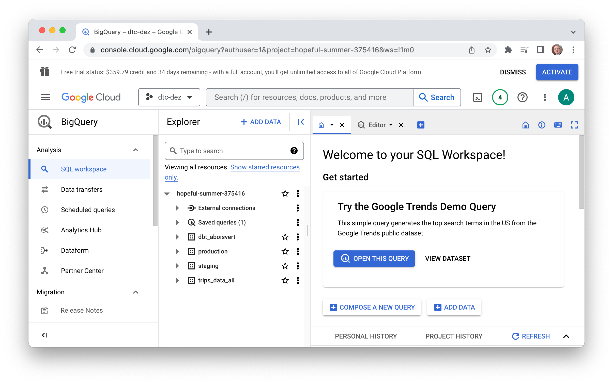

The BigQuery schema we already have is `trips_data_all`.

So, we slightly modify the script created previously to create the report in BigQuery by indicating the schema name for
the report (`--output=trips_data_all.reports-2020`). We also need to specify the connector jar
(`--jars=gs://spark-lib/bigquery/spark-bigquery-latest_2.12.jar`).

``` bash
gcloud dataproc jobs submit pyspark \
    --cluster=de-zoomcamp-cluster \
    --region=northamerica-northeast1 \
    --jars=gs://spark-lib/bigquery/spark-bigquery-latest_2.12.jar \
    gs://dtc_data_lake_hopeful-summer-375416/code/06_spark_sql_big_query.py \
    -- \
        --input_green=gs://dtc_data_lake_hopeful-summer-375416/pq/green/2020/*/ \
        --input_yellow=gs://dtc_data_lake_hopeful-summer-375416/pq/yellow/2020/*/ \
        --output=trips_data_all.reports-2020
```

> 4:05/8:55 (5.6.4) Run the command

Run the `gcloud dataproc` command above on the VM instance and see what happens.

Go to **BigQuery**, we should see the report `reports-2020` created under `trips_data_all`.

To make sure, just run this query.

``` sql
SELECT * FROM `hopeful-summer-375416.trips_data_all.reports-2020` LIMIT 10;
```

Last update: March 3, 2023. 
