# Week 5: Batch Processing

## Materials

See [Week 6: Stream
Processing](https://github.com/DataTalksClub/data-engineering-zoomcamp/tree/main/week_6_stream_processing), particularly
this
[README](https://github.com/DataTalksClub/data-engineering-zoomcamp/blob/main/week_6_stream_processing/python/README.md)
on GitHub.

Youtube videos:

- [DE Zoomcamp 6.0.1 - Introduction](https://www.youtube.com/watch?v=hfvju3iOIP0)
- [DE Zoomcamp 6.0.2 - What is stream processing](https://www.youtube.com/watch?v=WxTxKGcfA-k)
- [DE Zoomcamp 6.3 - What is Kafka?](https://www.youtube.com/watch?v=zPLZUDPi4AY)
- [DE Zoomcamp 6.4 - Confluent cloud](https://www.youtube.com/watch?v=ZnEZFEYKppw)
- [DE Zoomcamp 6.5 - Kafka producer consumer](https://www.youtube.com/watch?v=aegTuyxX7Yg)
- [DE Zoomcamp 6.6 - Kafka configuration](https://www.youtube.com/watch?v=SXQtWyRpMKs)
- [DE Zoomcamp 6.7 - Kafka streams basics](https://www.youtube.com/watch?v=dUyA_63eRb0)
- [DE Zoomcamp 6.8 - Kafka stream join](https://www.youtube.com/watch?v=NcpKlujh34Y)
- [DE Zoomcamp 6.9 - Kafka stream testing](https://www.youtube.com/watch?v=TNx5rmLY8Pk)
- [DE Zoomcamp 6.10 - Kafka stream windowing](https://www.youtube.com/watch?v=r1OuLdwxbRc)
- [DE Zoomcamp 6.11 - Kafka ksqldb & Connect](https://www.youtube.com/watch?v=DziQ4a4tn9Y)
- [DE Zoomcamp 6.12 - Kafka Schema registry](https://www.youtube.com/watch?v=tBY_hBuyzwI)

## Notice

My notes below follow the sequence of the videos and topics presented in them.

## 6.0.1 Introduction to Stream Processing

> 0:00/1:31 (6.0.1) What we will cover in week 6

We will cover in week 6 :

- What is stream processing?
- What is Kafka
- Stream processing message properties
- Kafka setup and configuration
- Time spanning in stream processing
- Kafka producer and Kafka consumer
- Partitions
- How to work with Kafka streams
- Schema and its role in flow processing
- Kafka Connect
- ksqlDB

## 6.0.2 What is stream processing?

**Stream processing** is a data management technique that involves ingesting a continuous data stream to quickly
analyze, filter, transform or enhance the data in real time.

I recommend reading [Introduction to streaming for data
scientists](https://huyenchip.com/2022/08/03/stream-processing-for-data-scientists.html) by Chip Huyen.

### Data exchange

> 0:20/4:19 (6.0.2) Data exchange

Data exchange allows data to be shared between different computer programs.

### Producer and consumers

> 1:10/4:19 (6.0.2) Producer and consumers

More generally, a producer can create messages that consumers can read. The consumers may be interested in certain
topics. The producer indicates the topic of his messages. The consumer can subscribe to the topics of his choice.

### Data exchange in stream processing

> 2:42/4:19 (6.0.2) Data exchange in stream processing

When the producer posts a message on a particular topic, consumers who have subscribed to that topic receive the message
in real time.

> 3:52/4:19 (6.0.2) Real time

Real time does not mean immediately, but rather a few seconds late, or more generally much faster than batch processing.

## 6.3 What is Kafka?


[Apache Pafka](https://kafka.apache.org/Kafka) Apache Kafka is an open-source distributed event streaming platform for
high-performance data pipelines, streaming analytics, data integration, and mission-critical applications. Kafka
provides a high-throughput and low-latency platform for handling real-time data feeds.

Kafka runs as a cluster in one or more servers. The Kafka cluster stores streams of records in categories called topics.
Each record has a key, value, and a timestamp.

It was originally developed at LinkedIn and was subsequently open-sourced under the Apache Software Foundation in 2011.
It’s widely used for high-performance use cases like streaming analytics and data integration.

See [org.apache.kafka](https://javadoc.io/doc/org.apache.kafka) Javadocs.

### Kafka

In this section, you will find my personal notes that I had taken before this course.

These notes come from:

- Effective Kafka, by Emil Koutanov
- Kafka: The Definitive Guide, 2nd Edition, by Gwen Shapira, Todd Palino, Rajini Sivaram, Krit Petty
- [Kafka: A map of traps for the enlightened dev and op](https://www.youtube.com/watch?v=paVdXL5vDzg&t=1s) by Emmanuel
  Bernard And Clement Escoffier on Youtube.

#### Overview

Kafka is a distributed system comprising several key components. These are four main parts in a Kafka system:

- **Broker**: Handles all requests from clients (produce, consume, and metadata) and keeps data replicated within the
  cluster. There can be one or more brokers in a cluster.
- **Zookeeper** (now **KRaft**): Keeps the state of the cluster (brokers, topics, users).
- **Producer**: Sends records to a broker.
- **Consumer**: Consumes batches of records from the broker.

A **record** is the most elemental unit of persistence in Kafka. In the context of event-driven architecture, a record
typically corresponds to some event of interest. It is characterised by the following attributes:

- **Key**: A record can be associated with an optional non-unique key, which acts as a king of classifier, grouping
  relatied records on the basis of their key.
- **Value**: A value is effectively the informational payload of a record.
- **Headers**: A set of free-form key-value pairs that can optionally annotate a record.
- **Partition number**: A zero-based index of the partition that the record appears in. A record must always be tied to
  exactly one partition.
- **Offset**: A 64-bit signed integer for locating a record within its encompassing partition.
- **Timestamp**: A millisecond-precise timestamp of the record.

A **partition** is a totally ordered, unbounded set of records. Published records are appended to the head-end of the
encompassing partition. Where a record can be seen as an elemental unit of persistence, a partition is an elemental unit
of record streaming. In the absence of producer synchronisation, causal order can only be achieved when a single
producer emits records to the same partition.

A **topic** is a logical aggregation of partitions. It comprises one or more partitions, and a partition must be a part
of exactly one topic. Earlier, it was said that partitions exhibit total order. Taking a set-theoretic perspective, a
topic is just a union of the individual underlying sets; since partitions within a topic are mutually independent, the
topic is said to exhibit partial order. In simple terms, this means that certain records may be ordered in relation to
one another, while being unordered with respect to certain other records.

A **cluster** hosts multiple topics, each having an assigned leader and zero or more follower replicas.

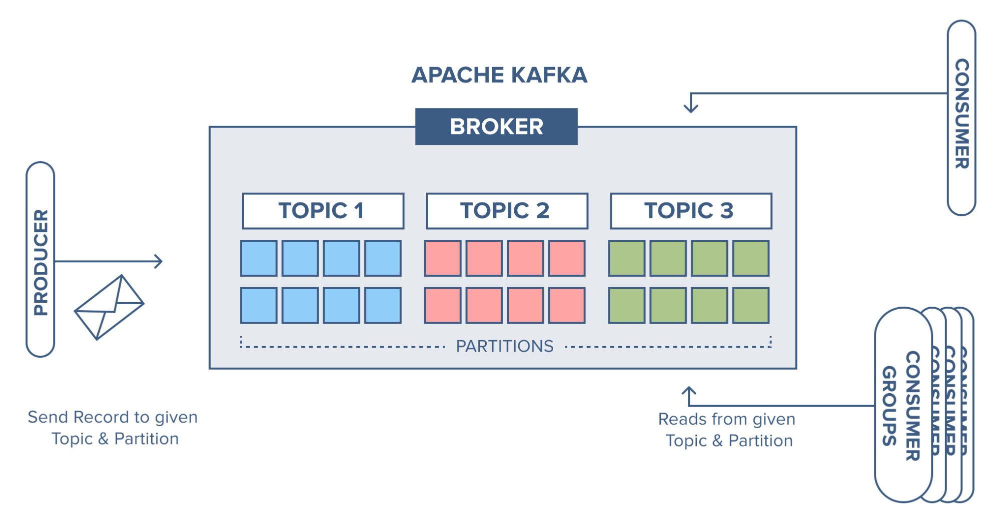

#### Main Concepts

- **Publish/subscribe messaging** is a pattern that is characterized by the sender (publisher) of a piece of data
  (message) not specifically directing it to a receiver.
- These systems often have a **broker**, a central point where messages are published, to facilitate this pattern.
- The unit of data within Kafka is called a **message**.
- A message can have an optional piece of metadata, which is referred to as a **key**.
- While messages are opaque byte arrays to Kafka itself, it is recommended that additional structure, or **schema**, be
  imposed on the message content so that it can be easily understood.
- Messages in Kafka are categorized into **topics**. The closest analogies for a topic are a database table or a folder
  in a filesystem.
- Topics are additionally broken down into a number of **partitions**.
- A **stream** is considered to be a single topic of data, regardless of the number of partitions, moving from the
  producers to the consumers.
- **Producers** create new messages. In other publish/subscribe systems, these may be called **publishers** or
  **writers**.
- **Consumers** read messages. In other publish/subscribe systems, these clients may be called **subscribers** or
  **readers**.
- The consumer keeps track of which messages it has already consumed by keeping track of the **offset** of messages. The
  **offset**, an integer value that continually increases, is another piece of metadata that Kafka adds to each message
  as it is produced.
- Consumers work as part of a **consumer group**, which is one or more consumers that work together to consume a topic.
- A single Kafka server is called a **broker**. The broker receives messages from producers, assigns offsets to them,
  and writes the messages to storage on disk.
- Kafka brokers are designed to operate as part of a **cluster**.
- Within a **cluster of brokers**, one broker will also function as the cluster **controller** (elected automatically
  from the live members of the cluster).
- A partition is owned by a single broker in the cluster, and that broker is called the **leader** of the partition
- A replicated partition is assigned to additional brokers, called **followers** of the partition.

**Replication of partitions in a cluster**

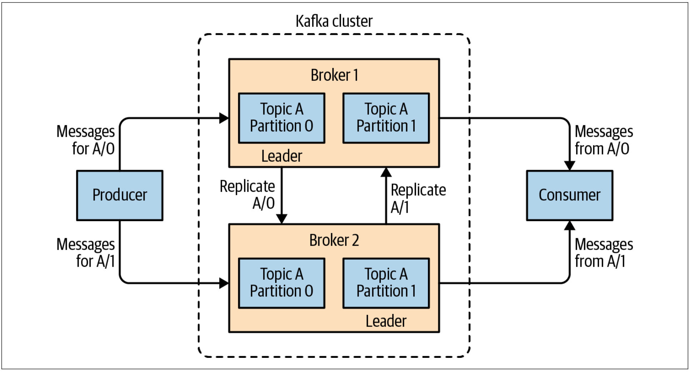

- A key feature of Apache Kafka is that of **retention**, which is the durable storage of messages for some period of
  time. Kafka brokers are configured with a default retention setting for topics, either retaining messages for some
  period of time (e.g., 7 days) or until the partition reaches a certain size in bytes (e.g., 1 GB).

#### Kafka is simple…​

**Kafka is simple**

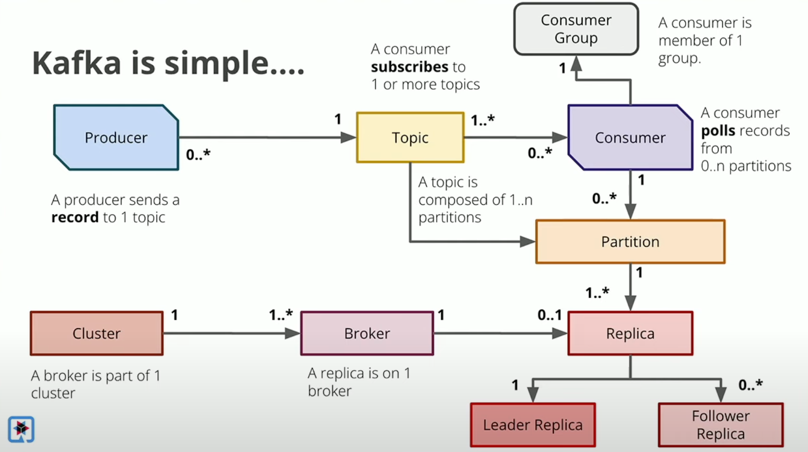

This picture comes from [Kafka: A map of traps for the enlightened dev and
op](https://www.youtube.com/watch?v=paVdXL5vDzg&t=1s) by Emmanuel Bernard And Clement Escoffier on Youtube.

#### Installation

We can install Kafka locally.

If you have already installed Homebrew for macOS, you can use it to install Kafka in one step. This will ensure that you
have Java installed first, and it will then install Apache Kafka 2.8.0 (as of the time of writing).

``` bash
$ brew install kafka
```

Homebrew will install Kafka under `/opt/homebrew/Cellar/kafka/`.

But, in this course, we use [Confluent Cloud](https://www.confluent.io/confluent-cloud/). Confluent cloud provides a
free 30 days trial for, you can signup [here](https://www.confluent.io/confluent-cloud/tryfree/).

### Topic

> 1:19/10:42 (6.3) Topic

Topic is a container stream of events. An event is a single data point in timestamp.

Multiple producers are able to publish to a topic, picking a partition at will. The partition may be selected directly —
by specifying a partition number, or indirectly — by way of a record key, which deterministically hashes to a partition
number.

Each topic can have one or many consumers which subscribe to the data written to the topic.

### Partition

A Kafka Topic is grouped into several partitions for scalability. Each partition is an sequence of records that are
continually added to a structured commit log. A sequential ID number called the offset is assigned to each record in the
partition.

### Logs

> 2:31/10:42 (6.3) Logs

Kafka logs are a collection of various data segments present on your disk, having a name as that of a form-topic
partition or any specific topic-partition. Each Kafka log provides a logical representation of a unique topic-based
partitioning.

Logs are how data is actually stored in a topic.

### Event

> 2:59/10:42 (6.3) Event

Each event contains a number of messages. A message has properties.

### Message

> 3:30/10:42 (6.3) Message

The basic communication abstraction used by producers and consumers in order to share information in Kafka is called a
**message**.

Messages have 3 main components:

- **Key**: used to identify the message and for additional Kafka stuff such as partitions (covered later).
- **Value**: the actual information that producers push and consumers are interested in.
- **Timestamp**: used for logging.

### Why Kafka?

> 4:00/10:42 (6.3) Why Kafka?

**Kafka brings robustness**: For example, when a server goes down, we can still access the data. Apache Kafka achieves a
certain level of resiliency through replication, both across machines in a cluster and across multiple clusters in
multiple data centers.

**Kafka offers a lot of flexibility**: The data exchange application can be small or very large. Kafka can be connected
to multiple databases with Kafka connect

**Kafka provides scalability**: Kafka has no problem handling a number of events that increases dramatically in a short
time.

### Availability of messages

> 5:55/10:42 (6.3) Availability of messages

When a consumer reads a message, that message is not lost and is still available to other consumers. There is some kind
of expiration date for messages.

### Need of stream processing

> 6:44/10:42 (6.3) Need of stream processing

Before, we often had monolithic applications. Now, we can have several microservices talking to each other. Kafka helps
simplify data exchange between these microservices

See also [What is Apache Kafka](https://kafka.apache.org/intro) for more.

## 6.4 Confluent cloud

### Create a free account

> 0:00/7:07 (6.4) Create a free account

Go to <https://confluent.cloud/signup> and create a free account. You do not need to enter your credit card number.

### Confluent Cloud Interface

> 1:17/7:07 (6.4) Confluent Cloud Interface

The first page you should see is this:

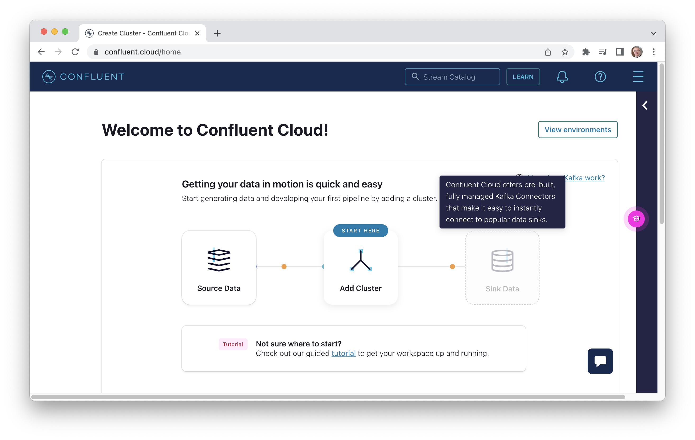

Click on **Add Cluster** to create a cluster.

Click on **Begin configuration** button from the Free Basic option.

Select a **Region** near you (ideally offering low carbon intensity) and click on **Continue** button.

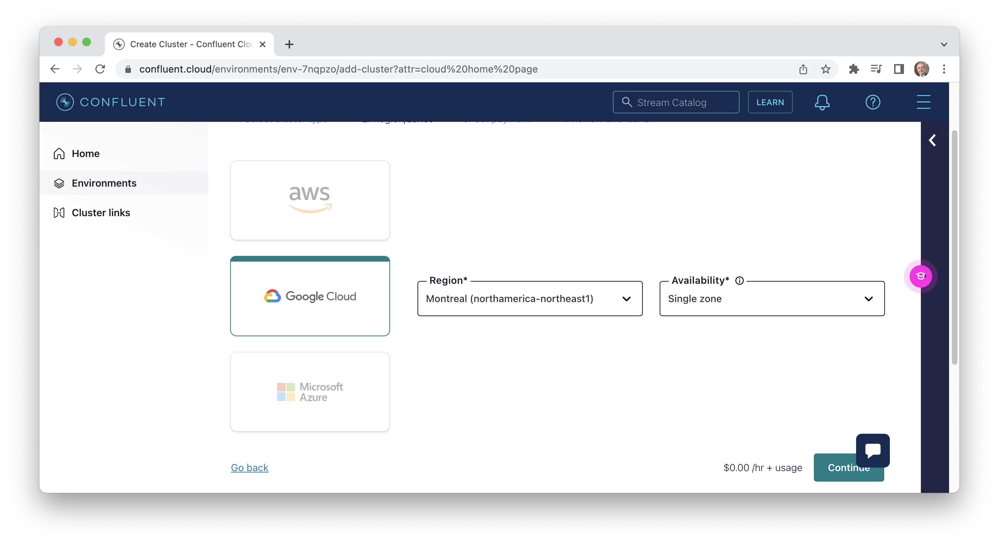

You do not need to enter your credit card number. So, we can click on **Skip payment** button.

In **Create cluster** form, enter the **Cluster name** `kafka_tutorial_cluster` and click on **Lauch cluster** button.

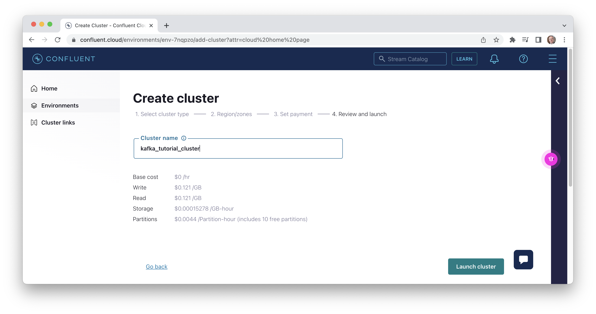

### Explore interface

> 2:07/7:07 (6.4) Explore interface

After that you should see this:

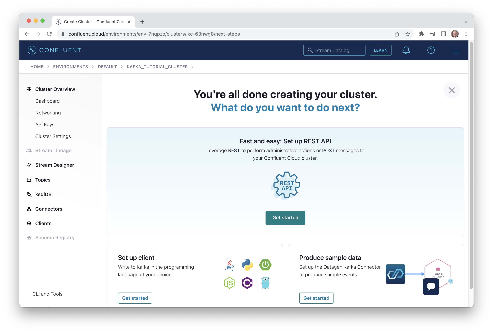

Explore the different interfaces : Dashboard, Networking, API Keys, etc.

### API Keys

> 2:26/7:07 (6.4) API Keys

An API key consists of a key and a secret. Kafka API keys are required to interact with Kafka clusters in Confluent
Cloud. Each Kafka API key is valid for a specific Kafka cluster.

Click on **API Keys** and on **Create key** button.

Select **Global access** and click on **Next** button.

Enter the following description: `kafka_cluster_tutorial_api_key`.

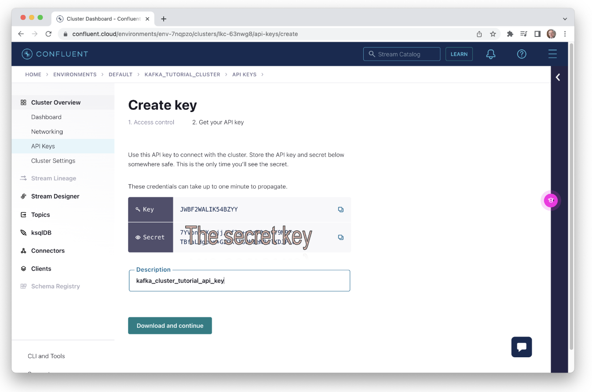

Click on **Download and continue** button.

Our key is downloaded. You should also see in **Cluster Settings** the **Endpoints** Bootstrap server and REST endpoint.

### Create a topic

> 3:04/7:07 (6.4) Create a topic

A Topic is a category/feed name to which records are stored and published. All Kafka records are organized into topics.
Producer applications write data to topics and consumer applications read from topics. Records published to the cluster
stay in the cluster until a configurable retention period has passed by.

Select **Topics** in the left menu, and click on **Create topic** button.

In the **New topic form**, enter :

- **Topic name** : tutorial_topic
- **Partitions** : 2
- Click on **Show advanced settings**
- **Retention time**: 1 day

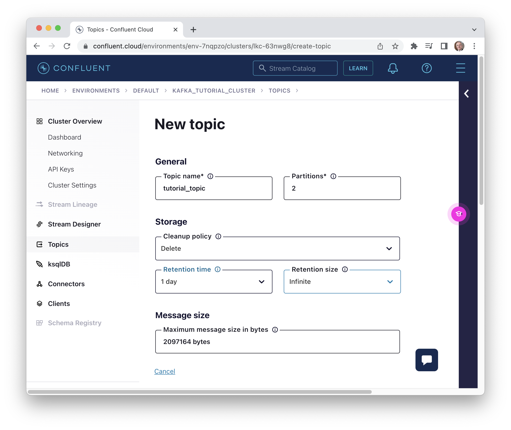

Click on **Save & create** button.

We should see this:

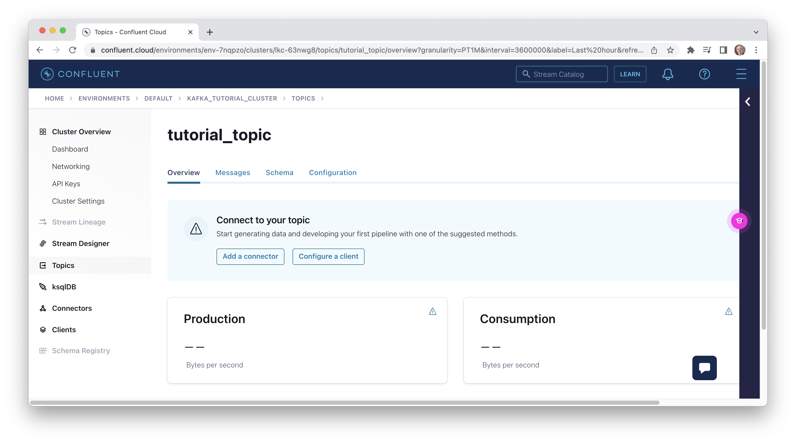

### Produce a new message

> 3:36/7:07 (6.4) Produce a new message

Now, we can produce some new messages.

Select the **Messages** tab, click on **+ Produce a new message to this topic**.

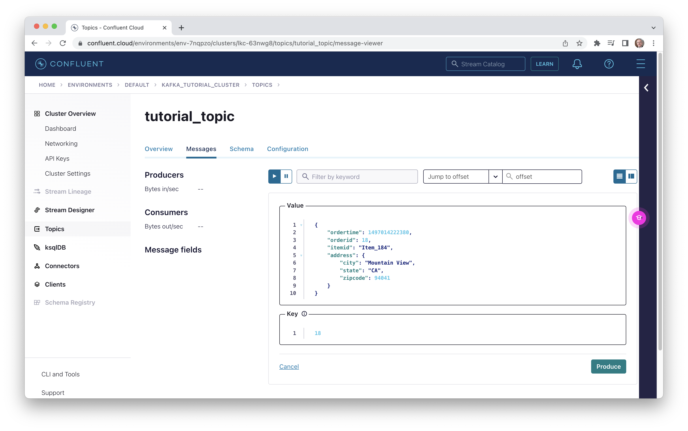

Click on **Produce** button.

The message produced has a **Value**, an empty **Header** and a **Key**.

I notice that we do not see certain fields of the message such as the partition, offset, timestamp.

### Create a connector

> 4:32/7:07 (6.4) Create a connector

Confluent Cloud offers pre-built, fully managed Kafka connectors that make it easy to instantly connect your clusters to
popular data sources and sinks. Connect to external data systems effortlessly with simple configuration and no ongoing
operational burden.

Select **Connectors** in the left menu, and click on **Datagen Source**.

Select **tutorial_topic**.

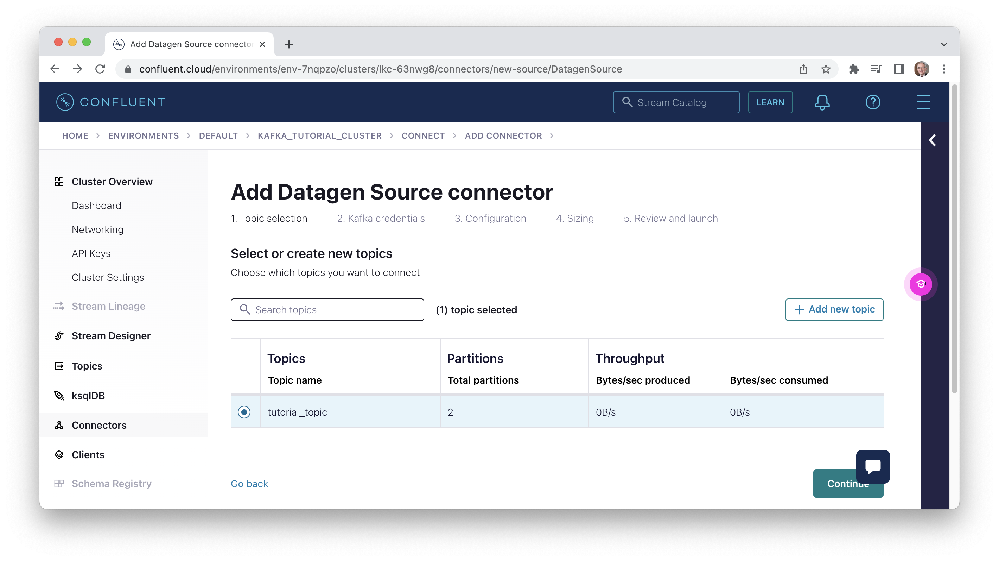

Click on **Continue** button.

Select **Global access** and click on **Continue** button.

Under **Select output record value format**, select **JSON**. Under **Select a template**, select **Orders**. Click on
**Continue** button.

The instructor says that the **Connector sizing** is fine. Click on **Continue** button.

Change the **Connector name** for `OrdersConnector_tutorial`

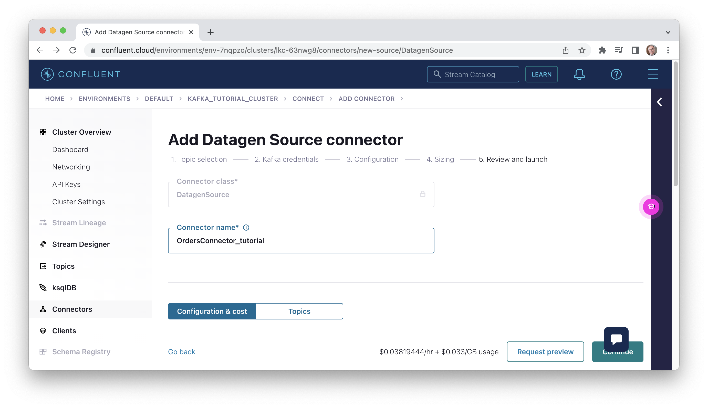

Click on **Continue** button.

We should see this.

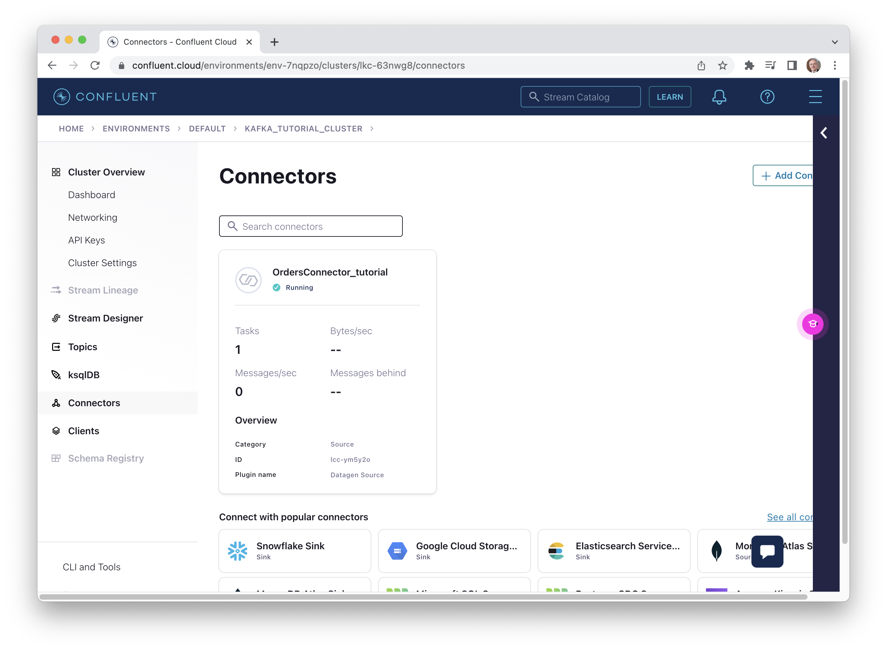

The connector is being provisioned. This may take 2 or 3 minutes.

Click on the **OrderConnector_tutorial** connector. You should see that the connector is active.

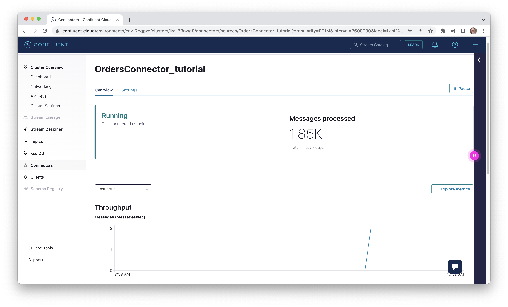

Now that the connector is up and running, let’s navigate nack to the topics view to inspect the incoming message.

Click on **Explore metrics** button. We should see some thing like this. Take the time to explore and learn the
available metrics.

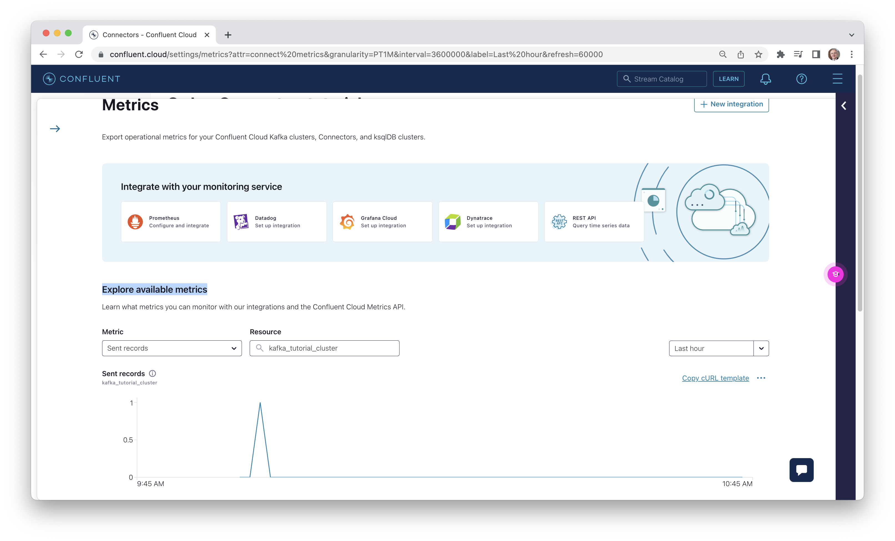

### Return to the topic

> 6:15/7:07 (6.4) Return to the topic

Select the **tutorial_topic** that we just configured the connector to produce to, to view more details.

Under **Overview** tab, we see the production rate and consumption rate as bytes per second.

Under **Messages** tab, we see that a number of messages have been created.

<table>
<tr><td>
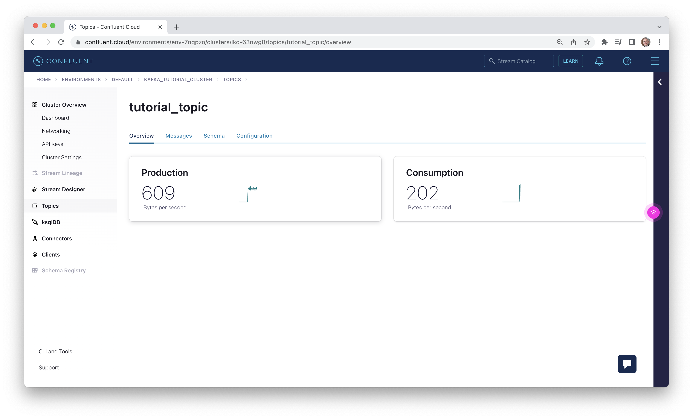
</td><td>
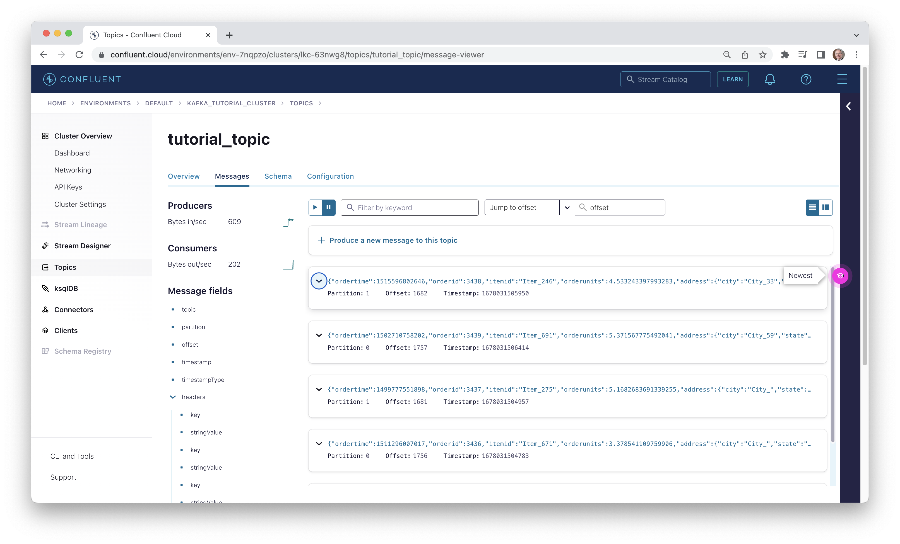
</td></tr>
</table>

### Shut down the connector

> 6:49/7:07 (6.4) Shut down the connector

Select **Connectors** in the left menu, select our connector **OrdersConnector_tutorial**, and click on **Pause**
button.

We always have to stop processes at the end of a work session so we don’t burn our \$400 free credit dollars.

See also [Confluent Cloud](https://docs.confluent.io/cloud/current/overview.html) and [Confluent
Documentation](https://docs.confluent.io/home/overview.html).

## 6.5 Kafka producer consumer

### What we will cover

> 0:00/21:02 (6.5) What we will cover

We will cover :

- Produce some messages programmaticaly
- Consume some data programmaticaly

We will use Java for this. If we want to use Python, there’s a Docker image to help us.

### Create a topic with Confluent cloud

> 1:07/21:02 (6.5) Create a topic with Confluent cloud

Login to [Confluent Cloud](https://confluent.cloud/).

From the **Welcome back** page, click on **Environments**, select the **Default cluster**, click on
**kafka_tutorial_cluster** and select **Topics** in the left menu.

Click on **Add topic** button.

In the **New topic form**, enter :

- **Topic name** : rides
- **Partitions** : 2
- Click on **Show advanced settings**
- **Retention time**: 1 day

Click on **Save & create** button.

This topic has no messages, schema or configuration.

### Create a client

> 1:59/21:02 (6.5) Create a client

Select **Clients** on the left menu, click on **New client** button, and choose **Java** as language. This provides
snippet code to configure our client.

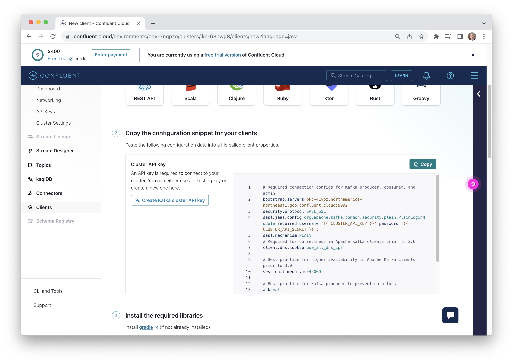

Here the snippet code created.

**Snippet**

``` yaml
# Required connection configs for Kafka producer, consumer, and admin
bootstrap.servers=pkc-41voz.northamerica-northeast1.gcp.confluent.cloud:9092
security.protocol=SASL_SSL
sasl.jaas.config=org.apache.kafka.common.security.plain.PlainLoginModule required username='{{ CLUSTER_API_KEY }}' password='{{ CLUSTER_API_SECRET }}';
sasl.mechanism=PLAIN
# Required for correctness in Apache Kafka clients prior to 2.6
client.dns.lookup=use_all_dns_ips

# Best practice for higher availability in Apache Kafka clients prior to 3.0
session.timeout.ms=45000

# Best practice for Kafka producer to prevent data loss
acks=all

# Required connection configs for Confluent Cloud Schema Registry
schema.registry.url=https://{{ SR_ENDPOINT }}
basic.auth.credentials.source=USER_INFO
basic.auth.user.info={{ SR_API_KEY }}:{{ SR_API_SECRET }}
```

### Java class

> 2:29/21:02 (6.5) Java class

Start your Java IDE (I use IntelliJ IDEA) et open `week_6_stream_processing/java/kafka_examples` directory from a cloned
repo on your disk of [data-engineering-zoomcamp](https://github.com/DataTalksClub/data-engineering-zoomcamp).

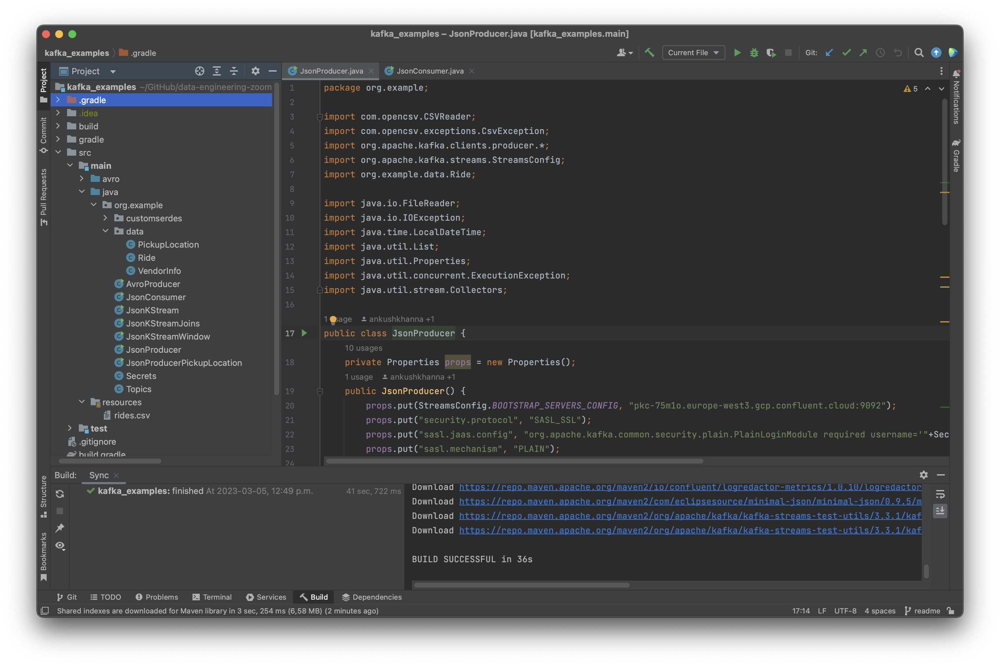

A Java class `Ride` has been created with the same structure as the taxi trip files in New York City.

The `JsonProducer` class contains de `getRides()` method that reads a CSV file and return a list of `Ride`.

**File `JsonProducer.java`**

``` java
public List<Ride> getRides() throws IOException, CsvException {
    var ridesStream = this.getClass().getResource("/rides.csv");
    var reader = new CSVReader(new FileReader(ridesStream.getFile()));
    reader.skip(1);
    return reader.readAll().stream().map(arr -> new Ride(arr))
            .collect(Collectors.toList());
}
```

Remember that Java streams enable functional-style operations on streams of elements. A stream is an abstraction of a
non-mutable collection of functions applied in some order to the data. A stream is not a collection where you can store
elements. See [Using Java Streams in Java 8 and Beyond](https://www.jrebel.com/blog/java-streams-in-java-8) for more
information about Java streams.

The `main()` method creates a new producer, get a list of `Ride`, and publish these rides.

**File `JsonProducer.java`**

``` java
public static void main(String[] args) throws IOException, CsvException,
    ExecutionException, InterruptedException {

    var producer = new JsonProducer();
    var rides = producer.getRides();
    producer.publishRides(rides);
}
```

### Create Properties

> 3:51/21:02 (6.5) Create Properties

We have to create properties using the snippet code obtained previously.

**File `JsonProducer.java`**

``` java
private Properties props = new Properties();

public JsonProducer() {
    String BOOTSTRAP_SERVER = "pkc-41voz.northamerica-northeast1.gcp.confluent.cloud:9092";
    String KAFKA_CLUSTER_KEY = "JWBF2WALIK54BZYY";
    String KAFKA_CLUSTER_SECRET = "7YVpnTS...............................................NRelKDJPL0";

    props.put(StreamsConfig.BOOTSTRAP_SERVERS_CONFIG, BOOTSTRAP_SERVER);
    props.put("security.protocol", "SASL_SSL");
    props.put("sasl.jaas.config",
        "org.apache.kafka.common.security.plain.PlainLoginModule required username='"
        + KAFKA_CLUSTER_KEY + "' password='" + KAFKA_CLUSTER_SECRET + "';");
    props.put("sasl.mechanism", "PLAIN");
    props.put("client.dns.lookup", "use_all_dns_ips");
    props.put("session.timeout.ms", "45000");
    props.put(ProducerConfig.ACKS_CONFIG, "all");
    props.put(ProducerConfig.KEY_SERIALIZER_CLASS_CONFIG, "org.apache.kafka.common.serialization.StringSerializer");
    props.put(ProducerConfig.VALUE_SERIALIZER_CLASS_CONFIG, "io.confluent.kafka.serializers.KafkaJsonSerializer");
}
```

We need two types of serializer: **StringSerializer** and **JsonSerializer**. Remember that serialization is the process
of converting objects into bytes. Apache Kafka provides a pre-built serializer and deserializer for several basic types
:

- [StringSerializer](https://kafka.apache.org/34/javadoc/org/apache/kafka/common/serialization/StringSerializer.html)
- ShortSerializer
- IntegerSerializer
- LongSerializer
- DoubleSerializer
- BytesSerializer

See [StringSerializer](https://kafka.apache.org/34/javadoc/org/apache/kafka/common/serialization/StringSerializer.html)
and [JSON Schema
Serializer](https://docs.confluent.io/platform/current/schema-registry/serdes-develop/serdes-json.html#json-schema-serializer).

### Create `publishRides()` method

> 5:30/21:02 (6.5) Create publishRides() method

Now create the `publishRides()` method.

**File `JsonProducer.java`**

``` java
 public void publishRides(List<Ride> rides) throws ExecutionException, InterruptedException {
    KafkaProducer<String, Ride> kafkaProducer = new KafkaProducer<String, Ride>(props);
    for(Ride ride: rides) {
        ride.tpep_pickup_datetime = LocalDateTime.now().minusMinutes(20);
        ride.tpep_dropoff_datetime = LocalDateTime.now();
        var record = kafkaProducer.send(new ProducerRecord<>("rides",
            String.valueOf(ride.DOLocationID), ride), (metadata, exception) -> {

            if(exception != null) {
                System.out.println(exception.getMessage());
            }
        });
        System.out.println(record.get().offset());
        System.out.println(ride.DOLocationID);
        Thread.sleep(500);
    }
}
```

[KafkaProducer](https://javadoc.io/static/org.apache.kafka/kafka-clients/3.4.0/org/apache/kafka/clients/producer/KafkaProducer.html)
is a Kafka client that publishes records to the Kafka cluster.

### `build.gradle` file

> 8:36/21:02 (6.5) `build.gradle` file

We need to add implementations in the dependencies of `build.gradle` file.

**File `build.gradle`**

``` txt
plugins {
    id 'java'
    id "com.github.davidmc24.gradle.plugin.avro" version "1.5.0"
}


group 'org.example'
version '1.0-SNAPSHOT'

repositories {
    mavenCentral()
    maven {
        url "https://packages.confluent.io/maven"
    }
}

dependencies {
    implementation 'org.apache.kafka:kafka-clients:3.3.1'
    implementation 'com.opencsv:opencsv:5.7.1'
    implementation 'io.confluent:kafka-json-serializer:7.3.1'
    implementation 'org.apache.kafka:kafka-streams:3.3.1'
    implementation 'io.confluent:kafka-avro-serializer:7.3.1'
    implementation 'io.confluent:kafka-schema-registry-client:7.3.1'
    implementation 'io.confluent:kafka-streams-avro-serde:7.3.1'
    implementation "org.apache.avro:avro:1.11.0"
    testImplementation 'org.junit.jupiter:junit-jupiter-api:5.8.1'
    testRuntimeOnly 'org.junit.jupiter:junit-jupiter-engine:5.8.1'
    testImplementation 'org.apache.kafka:kafka-streams-test-utils:3.3.1'
}

sourceSets.main.java.srcDirs = ['build/generated-main-avro-java','src/main/java']

test {
    useJUnitPlatform()
}
```

### Run `JsonProducer`

> 9:20/21:02 (6.5) Run JsonProducer

Now, let’s run `JsonProducer`.

If all goes well, you should see messages appear in the log of the Java IDE and also under **Messages** tab of the topic
**rides** in Confluent cloud.

<table>
<tr><td>
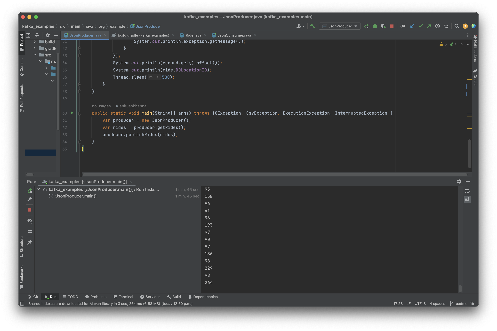
</td><td>
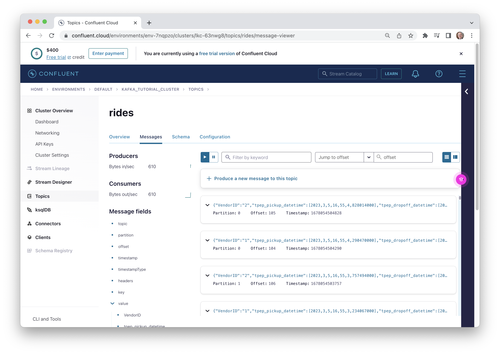
</td></tr>
</table>

### Create `JsonConsumer` class

> 9:50/21:02 (6.5) Create JsonConsumer class

Now, for the consumer, we’re going to do basically the same thing as before with the producer.

### Create `Properties` for Consumer

> 3:51/21:02 (6.5) Create Properties for Consumer

We have to create properties using the snippet code obtained previously.

**File `JsonConsumer.java`**

``` java
private Properties props = new Properties();

private KafkaConsumer<String, Ride> consumer;

public JsonConsumer() {
    String BOOTSTRAP_SERVER = "pkc-41voz.northamerica-northeast1.gcp.confluent.cloud:9092";
    String KAFKA_CLUSTER_KEY = "JWBF2WALIK54BZYY";
    String KAFKA_CLUSTER_SECRET = "7YVpnTS...............................................NRelKDJPL0";

    props.put(ConsumerConfig.BOOTSTRAP_SERVERS_CONFIG, BOOTSTRAP_SERVER);
    props.put("security.protocol", "SASL_SSL");
    props.put("sasl.jaas.config", "org.apache.kafka.common.security.plain.PlainLoginModule required username='"
        + KAFKA_CLUSTER_KEY + "' password='" + KAFKA_CLUSTER_SECRET + "';");
    props.put("sasl.mechanism", "PLAIN");
    props.put("client.dns.lookup", "use_all_dns_ips");
    props.put("session.timeout.ms", "45000");

    props.put(ConsumerConfig.KEY_DESERIALIZER_CLASS_CONFIG, "org.apache.kafka.common.serialization.StringDeserializer");
    props.put(ConsumerConfig.VALUE_DESERIALIZER_CLASS_CONFIG, "io.confluent.kafka.serializers.KafkaJsonDeserializer");
    props.put(ConsumerConfig.GROUP_ID_CONFIG, "kafka_tutorial_example.jsonconsumer.v1");
    props.put(ConsumerConfig.AUTO_OFFSET_RESET_CONFIG, "earliest");
    props.put(KafkaJsonDeserializerConfig.JSON_VALUE_TYPE, Ride.class);

    consumer = new KafkaConsumer<String, Ride>(props);
    consumer.subscribe(List.of("rides"));
}
```

Remember that deserialization is the inverse process of the serialization — converting a stream of bytes into an object.

[KafkaConsumer](https://javadoc.io/static/org.apache.kafka/kafka-clients/3.4.0/org/apache/kafka/clients/consumer/KafkaConsumer.html)
is a client that consumes records from a Kafka cluster.

### Create `consumeFromKafka()` method

> 11:30/21:02 (6.5) Create `consumeFromKafka()` method

Let’s ceate the `consumeFromKafka()` method.

**File `JsonConsumer.java`**

``` java
public void consumeFromKafka() {
    System.out.println("Consuming form kafka started");
    var results = consumer.poll(Duration.of(1, ChronoUnit.SECONDS));
    var i = 0;
    do {
        for(ConsumerRecord<String, Ride> result: results) {
            System.out.println(result.value().DOLocationID);
        }
        results =  consumer.poll(Duration.of(1, ChronoUnit.SECONDS));
        System.out.println("RESULTS:::" + results.count());
        i++;
    }
    while(!results.isEmpty() || i < 10);
}
```

> 13:35/21:02 (6.5) Create `main()` method

Finally, we create the `main()` method

**File `JsonConsumer.java`**

``` java
public static void main(String[] args) {
    JsonConsumer jsonConsumer = new JsonConsumer();
    jsonConsumer.consumeFromKafka();
}
```

### Default constructor for `Ride` class

> 20:20/21:02 (6.5) Default constructor for `Ride` class

After encountering several exceptions (from 14:00 to 20:00), the instructor adds a default constructor to the `Ride`
class.

**File `Ride.java`**

``` java
public Ride() {}
```

### Run `JsonConsumer`

> 20:25/21:02 (6.5) Run JsonConsumer

Now, let’s run `JsonConsumer`.

If all goes well, you should see messages appear in the log of the Java IDE like this.

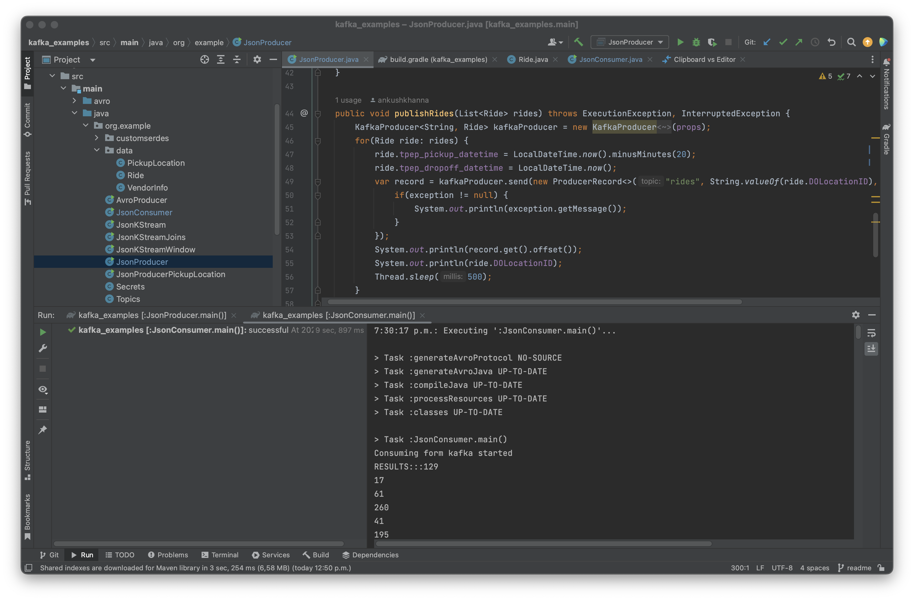

## 6.6 Kafka configuration

### What is a Kafka cluster?

> 0:55/42:18 (6.6) What is a Kafka cluster?

Kafka cluster is nodes of machines that communicate with each other.

Kafka has recently shifted from [ZooKeeper](https://zookeeper.apache.org/) to a quorum-based controller that uses a new
consensus protocol called Kafka Raft, shortened as Kraft (pronounced “craft”).

Being a distributed system with high availability and fault-tolerant, Kafka requires a mechanism for coordinating
multiple decisions between all the active brokers. It also requires maintaining a consistent view of the cluster and its
configurations. Kafka has been using ZooKeeper to achieve this for a long time now.

But, ZooKeeper adds an extra management layer for Kafka. Managing distributed systems is a complex task, even if it’s as
simple and robust as ZooKeeper. This is one of the reasons why it was deemed preferable for Kafka to rely for this
purpose on internal mechanisms.

Apache Kafka Raft (KRaft) is the consensus protocol that was introduced to remove Apache Kafka’s dependency on ZooKeeper
for metadata management. This greatly simplifies Kafka’s architecture by consolidating responsibility for metadata into
Kafka itself, rather than splitting it between two different systems: ZooKeeper and Kafka.

See [Kafka’s Shift from ZooKeeper to Kraft](https://www.baeldung.com/kafka-shift-from-zookeeper-to-kraft) and [KRaft:
Apache Kafka Without ZooKeeper](https://developer.confluent.io/learn/kraft/) for more information.

### What is a topic?

> 2:20/42:18 (6.6) What is a topic?

A topic is a sequence of events coming in.

A Topic is a category/feed name to which records are stored and published. All Kafka records are organized into topics.
Producer applications write data to topics and consumer applications read from topics. Records published to the cluster
stay in the cluster until a configurable retention period has passed by.

See [Topics](https://developer.confluent.io/learn-kafka/apache-kafka/topics/) and [What is Apache
Kafka?](https://www.cloudkarafka.com/blog/part1-kafka-for-beginners-what-is-apache-kafka.html) for more.

Kafka topics are the categories used to organize messages. Messages are sent to and read from specific topics. Each
message has a key, a value and a timestamp.

### How Kafka provides availability?

> 3:45/42:18 (6.6) How Kafka provides availability?

Suppose we have a cluster with three nodes (N0, N1, N2). Each node communicating with each other.

Suppose also we have one topic. This topic leaves in N1.

What happens when N1 goes down? This is where the concept of replication comes in.

Each node replicates its messages to another node. N1 is the leader, N0 and N2 are the followers. The producer writes a
message to N1 and the consumers read the message from N1. But as leader, N1 replicates this message to N0.

If N1 goes down, the producer and consumers will be automatically redirected to N0. Additionally, N0 will now act as the
leader and replicate messages to N2.

### Replication Factor

> 9:10/42:18 (6.6) Replication Factor

Apache Kafka ensures high data availability by replicating data via the replication factor in Kafka. The replication
factor is the number of nodes to which your data is replicated.

When a producer writes data to Kafka, it sends it to the broker designated as the **Leader** for that topic:partition in
the cluster. Such a broker is the entry point to the cluster for the topic’s data:partition.

If we use **replication factor** \> 1, writes will also propagate to other brokers called **followers**. This
fundamental operation enables Kafka to provide high availability (HA).

See [Kafka Replication and Committed
Messages](https://docs.confluent.io/kafka/design/replication.html#kafka-replication-and-committed-messages) and [Apache
Kafka replication factor – What’s the perfect
number?](https://www.cloudkarafka.com/blog/apache-kafka-replication-factor-perfect-number.html) for more.

### Retention Period

> 9:20/42:18 (6.6) Retention Period

When a producer sends a message to Apache Kafka, it appends it in a log file and retains it for a configured duration.

With retention period properties in place, messages have a TTL (time to live). Upon expiry, messages are marked for
deletion, thereby freeing up the disk space.

he same retention period property applies to all messages within a given Kafka topic.

See [Configuring Message Retention Period in Apache Kafka](https://www.baeldung.com/kafka-message-retention) for more.

### Partitions

> 11:30/42:18 (6.6) Partition

Partitioning takes the single topic log and breaks it into multiple logs, each of which can live on a separate node in
the Kafka cluster. Each partition is also replicated to the other nodes of the cluster. This way, the work of storing
messages, writing new messages, and processing existing messages can be split among many nodes in the cluster.

[Introduction to Apache Kafka Partitions](https://developer.confluent.io/learn-kafka/apache-kafka/partitions/) and [Main
Concepts and Terminology](https://kafka.apache.org/documentation/#intro_concepts_and_terms) for more.

### Consumer Groups

> 16:50/42:18 (6.6) Consumer Group

Kafka consumers are typically part of a **Consumer Group**. When multiple consumers are subscribed to a topic and belong
to the same consumer group, each consumer in the group will receive messages from a different subset of the partitions
in the topic.

More precisely, a **Consumer Group** is a set of consumers which cooperate to consume data from some topics. The
partitions of all the topics are divided among the consumers in the group. As new group members arrive and old members
leave, the partitions are re-assigned so that each member receives a proportional share of the partitions. This is known
as rebalancing the group.

See [Chapter 4. Kafka Consumers: Reading Data from
Kafka](https://www.oreilly.com/library/view/kafka-the-definitive/9781491936153/ch04.html) from Kafka: The Definitive
Guide book.

### Consumer Offset

> 20:25/42:18 (6.6) Consumer Offset

The **Consumer Offset** is a way of tracking the sequential order in which messages are received by Kafka topics.
Keeping track of the offset, or position, is important for nearly all Kafka use cases and can be an absolute necessity
in certain instances, such as financial services.

The Kafka consumer works by issuing "fetch" requests to the brokers leading the partitions it wants to consume. The
consumer offset is specified in the log with each request. The consumer receives back a chunk of log beginning from the
offset position. The consumer has significant control over this position and can rewind it to re-consume data if
desired.

See [Kafka Consumer](https://docs.confluent.io/platform/current/clients/consumer.html) for more information about
offset.

Kafka brokers use an internal topic named `__consumer_offsets` that keeps track of what messages a given consumer group
last successfully processed.

As we know, each message in a Kafka topic has a partition ID and an offset ID attached to it.

Therefore, in order to "checkpoint" how far a consumer has been reading into a topic partition, the consumer will
regularly **commit** the latest processed message, also known as **consumer offset**.

**Offsets Management**

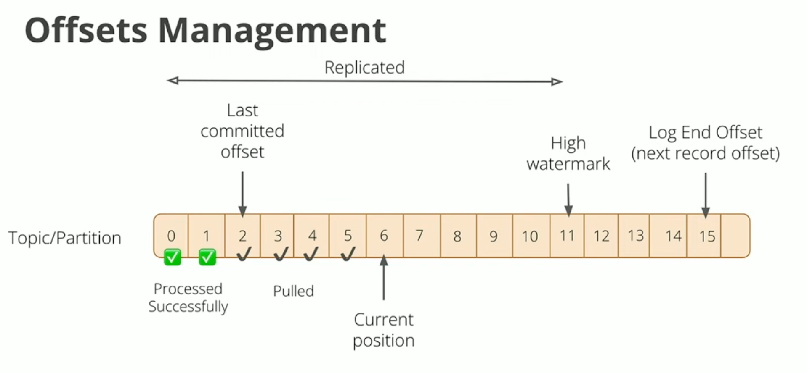

### `auto.offset.reset` configuration

> 22:22/42:18 (6.6) `auto.offset.reset`

The `auto.offset.reset` property controls the behavior of the consumer when it starts reading a partition for which it
doesn’t have a committed offset or if the committed offset it has is invalid (usually because the consumer was down for
so long that the record with that offset was already aged out of the broker).

- The default is `latest`, which means that lacking a valid offset, the consumer will start reading from the newest
  records (records that were written after the consumer started running).
- The alternative is `earliest` which means that lacking a valid offset, the consumer will read all the data in the
  partition, starting from the very beginning.

See also [auto.offset.reset](https://kafka.apache.org/documentation/#consumerconfigs_auto.offset.reset) from Kafka
Documentation.

### Acknowledgment

> 27:40/42:18 (6.6) Acknowledgment

The number of acknowledgments the producer requires the leader to have received before considering a request complete.
This controls the durability of records that are sent. The following settings are allowed:

- `acks=0`: If set to zero then the producer will not wait for any acknowledgment from the server at all. The record
  will be immediately added to the socket buffer and considered sent. No guarantee can be made that the server has
  received the record in this case, and the retries configuration will not take effect (as the client won’t generally
  know of any failures). The offset given back for each record will always be set to `-1`.
- `acks=1`: This will mean the leader will write the record to its local log but will respond without awaiting full
  acknowledgement from all followers. In this case should the leader fail immediately after acknowledging the record but
  before the followers have replicated it then the record will be lost.
- `acks=all`: This means the leader will wait for the full set of in-sync replicas to acknowledge the record. This
  guarantees that the record will not be lost as long as at least one in-sync replica remains alive. This is the
  strongest available guarantee. This is equivalent to the `acks=-1` setting.

The option chosen depends on the desired speed of the application and whether or not all records are actually read and
not lost in the event of a failure. We should use `acks=all` for a financial application because it is more important
not to lose data than to lose a few milliseconds.

See [acks](https://docs.confluent.io/platform/current/installation/configuration/producer-configs.html#acks) from
Confluent Documentation.

### Recap in one minute

> 34:24/42:18 (6.6) Recap in one minute

- Kafka cluster is a set of nodes talking to each other running Kafka.
- Topic is a collection of events created by a producer.
- Inside topic, there are messages composed of a key, a value and a timestamp.
- Replication Factor is equivalent to the number of nodes where data are replicated.
- What happens if one of the nodes goes down and how does the leader follower changes.
- Retention and how messages would be deleted after a certain amount of time which you as producer can set.
- Partitions and how partitions are stored inside the nodes.
- How consumers can consume from different partitions. We need to have multiple partitions so that different consumers
  can consume and we can parallelize our stuff.
- Consumer Group…​
- Offset…​
- `auto.offset.reset`…​
- Acknowledgment…​

### Documentation

> 38:45/42:18 (6.6) Documentation

Kafka provides a lot of configurations. See [Configuration](https://kafka.apache.org/documentation/#configuration) from
Kafka Documentation.

**With great power comes great responsability** This is why it is important to understand the different configuration
values.

## 6.7 Kafka streams basics

> 0:00/19:33 (6.7) Introduction

In this section, we will create a very simple Kafka stream example. This exemple will be a basic building block which we
will need to work on a more complicated case later on.

Also, we will see how keys play an important role when messages are outputted to Kafka, especially in stream processing

### `JsonKStream` class

> 0:44/19:33 (6.7) JsonKStream class

### `getJsonSerde()` method

> 1:08/19:33 (6.7) Serde() method

Serde method sets the serializer ("ser") and the deserializer ("de"). A SerDe (Serializer/Deserializer) is a way in
which Kafka interacts with data in various formats.

**File `JsonKStream.java`**

``` java
import io.confluent.kafka.serializers.KafkaJsonDeserializer;
import io.confluent.kafka.serializers.KafkaJsonSerializer;

private Serde<Ride> getJsonSerde() {
    Map<String, Object> serdeProps = new HashMap<>();
    serdeProps.put("json.value.type", Ride.class);
    final Serializer<Ride> mySerializer = new KafkaJsonSerializer<>();
    mySerializer.configure(serdeProps, false);

    final Deserializer<Ride> myDeserializer = new KafkaJsonDeserializer<>();
    myDeserializer.configure(serdeProps, false);
    return Serdes.serdeFrom(mySerializer, myDeserializer);
}
```

### Properties

> 2:25/19:33 (6.7) Properties

**File `JsonKStream.java`**

``` java
import org.apache.kafka.clients.consumer.ConsumerConfig;
import org.apache.kafka.streams.StreamsConfig;

private Properties props = new Properties();

public JsonKStream() {
    String BOOTSTRAP_SERVER = "pkc-41voz.northamerica-northeast1.gcp.confluent.cloud:9092";
    String KAFKA_CLUSTER_KEY = "JWBF2WALIK54BZYY";
    String KAFKA_CLUSTER_SECRET = "7YVpnTS...............................................NRelKDJPL0";

    props.put(StreamsConfig.BOOTSTRAP_SERVERS_CONFIG, BOOTSTRAP_SERVER);
    props.put("security.protocol", "SASL_SSL");
    props.put("sasl.jaas.config",
        "org.apache.kafka.common.security.plain.PlainLoginModule required username='"
        + KAFKA_CLUSTER_KEY + "' password='" + KAFKA_CLUSTER_SECRET + "';");
    props.put("sasl.mechanism", "PLAIN");
    props.put("client.dns.lookup", "use_all_dns_ips");
    props.put("session.timeout.ms", "45000");
    props.put(StreamsConfig.APPLICATION_ID_CONFIG,
        "kafka_tutorial.kstream.count.plocation.v1");
    props.put(ConsumerConfig.AUTO_OFFSET_RESET_CONFIG, "latest");
    props.put(StreamsConfig.CACHE_MAX_BYTES_BUFFERING_CONFIG, 0);
}
```

**application ID** (`StreamsConfig.BOOTSTRAP_SERVERS_CONFIG`).  
Each stream processing application must have a unique ID. The same ID must be given to all instances of the application.

**cache.max.bytes.buffering** (`CACHE_MAX_BYTES_BUFFERING_CONFIG`)  
We set to zero this configuration to turn off caching. Note that this configuration is deprecated on the latest version
of Kafka.

See
[org.apache.kafka.streams.StreamsConfig](https://javadoc.io/static/org.apache.kafka/kafka-streams/3.4.0/org/apache/kafka/streams/StreamsConfig.html)
and
[org.apache.kafka.clients.consumer.ConsumerConfig](https://javadoc.io/static/org.apache.kafka/kafka-clients/3.4.0/org/apache/kafka/clients/consumer/ConsumerConfig.html)
for Kafka 3.4.0.

### String Builder

> 4:00/19:33 (6.7) String Builder

We need a string builder.

**File `JsonKStream.java`**

``` java
import org.apache.kafka.common.serialization.Serdes;
import org.apache.kafka.streams.StreamsBuilder;

public void countPLocation() {
    StreamsBuilder streamsBuilder = new StreamsBuilder();
    var kstream = streamsBuilder.stream("rides", Consumed.with(Serdes.String(), getJsonSerde()));
    var kCountStream = kstream.groupByKey().count().toStream();
    kCountStream.to("rides-pulocation-count", Produced.with(Serdes.String(), Serdes.Long()));
}
```

[StreamsBuilder](https://javadoc.io/static/org.apache.kafka/kafka-streams/3.4.0/org/apache/kafka/streams/StreamsBuilder.html)
provide the high-level Kafka Streams DSL to specify a Kafka Streams topology. Topology will be explained in video 6.8.

### Create a new topic in Confluent cloud

> 7:19/19:33 (6.7) Create a new topic in Confluent cloud

In **Confluent cloud**, let’s create a new topic `rides-pulocation-count` with 2 partitions.

> 7:45/19:33 (6.7) KafkaStreams instance

We need to start our job explicitly by calling the start() method on the KafkaStreams instance. To do this, we add some
instructions to the `countPLocation()` method.

**File `JsonKStream.java`**

``` java
import org.apache.kafka.common.serialization.Serdes;
import org.apache.kafka.streams.KafkaStreams;
import org.apache.kafka.streams.StreamsBuilder;

public void countPLocation() {
    StreamsBuilder streamsBuilder = new StreamsBuilder();
    var ridesStream = streamsBuilder.stream("rides", Consumed.with(Serdes.String(), getJsonSerde()));
    var puLocationCount = kstream.groupByKey().count().toStream();
    kCountStream.to("rides-pulocation-count", Produced.with(Serdes.String(), Serdes.Long()));

    var kStreams = new KafkaStreams(streamsBuilder.build(), props);
    kStreams.start();

    Runtime.getRuntime().addShutdownHook(new Thread(kStreams::close));
}
```

[KafkaStreams](https://javadoc.io/static/org.apache.kafka/kafka-streams/3.4.0/org/apache/kafka/streams/KafkaStreams.html)
is a Kafka client that allows for performing continuous computation on input coming from one or more input topics and
sends output to zero, one, or more output topics.

### Run JsonKStream

> 9:20/19:33 (6.7) Run JsonKStream

Let’s run this class. Below, the `main()` method.

``` java
public static void main(String[] args) throws InterruptedException {
    var object = new JsonKStream();
    object.countPLocation();
}
```

### `publishRides()` method

> 9:30/19:33 (6.7) publishRides() method

Instead of producing all the messages in one go, we just added a `Thread.sleep(500)` to our JsonProducer. We change also
the pickup datetime and dropoff datetime just to be now, so that travel times are 20 minutes.

**File `JsonProducer.java`**

``` java
public void publishRides(List<Ride> rides) throws ExecutionException, InterruptedException {
    KafkaProducer<String, Ride> kafkaProducer = new KafkaProducer<String, Ride>(props);
    for(Ride ride: rides) {
        ride.tpep_pickup_datetime = LocalDateTime.now().minusMinutes(20);
        ride.tpep_dropoff_datetime = LocalDateTime.now();
        var record = kafkaProducer.send(new ProducerRecord<>("rides", String.valueOf(ride.DOLocationID), ride), (metadata, exception) -> {
            if(exception != null) {
                System.out.println(exception.getMessage());
            }
        });
        // System.out.println(record.get().offset());
        // System.out.println(ride.DOLocationID);
        Thread.sleep(500);
    }
}
```

### What’s happens in Confluent Cloud

> 10:00/19:33 (6.7) What’s happens in Confluent Cloud

Let’s see if Kafka strean is running. Go to **Confluent Cloud**, select **Topics** in the left menu, select **rides**
topic, click **Messages** tab. We should see that some messages are coming in, this is because our producer is running.

Now, select **rides-pulocation-count** topic and click **Messages** tab. We should also see that some messages are
coming in.

This is our basic example of using Kafka streams. In summary:

- Somes rides coming in from our topic.
- We grouped it by key (this key was pulocation).
- We counted it.
- We outputted it to a new topic.

### Example with two streaming apps

> 12:30/19:33 (6.7) Example with two streaming apps

Let’s see what happens when we have two applications, both of which are stream processing.

Partition 0 will be assigned to one application and partition 1 will be assigned to the second application. Everything
else happens the same way, so grouping and counting will happen either way.

The count can be erroneous if the data is not distributed correctly in the partitions. To store the record in the
correct partition, we will hash the key and modulus it by two.

### What to do when key is None?

> 16:48/19:33 (6.7) What to do when key is None?

When the key is None, it is suggested to choose the partition randomly so that the two partitions have approximately the
same number of records. The consumers should be aware of the assumptions we made to partition the data.

### See also

- [How to build your first Apache Kafka Streams
  application](https://developer.confluent.io/tutorials/creating-first-apache-kafka-streams-application/confluent.html)

## 6.8 Kafka stream join

### Example use case

> 0:00/20:51 (6.8) Example use case

For this example, we have a **rides** topic with drop-off location as key. We will create another topic which is called
a **pickup-location** topic. The pickup location will be inside the message itself. We will use locationid to join these
two topics.

### Java Code explained

> 2:15/20:51 (6.8) Java Code explained

The instructor has already setup this example. See
[sonKStreamJoins.java](https://raw.githubusercontent.com/DataTalksClub/data-engineering-zoomcamp/main/week_6_stream_processing/java/kafka_examples/src/main/java/org/example/JsonKStreamJoins.java).

The instructor briefly explains the code of `JsonKStreamJoins` and `JsonProducerPickupLocation`.

### Processor Topology

A **topology** (short for **processor topology**) defines the stream computational logic for our app. In other words, it
defines how input data is transformed into output data.

Essentially, a topology is a graph of **stream processors** (the graph nodes) which are connected by streams (the graph
edges). A topology is a useful abstraction to design and understand Streams applications. A **stream processor** is a
node which represents a processing step (i.e. it transforms data), such as map, filter, join or aggregation.

See [Processor Topology](https://docs.confluent.io/platform/current/streams/architecture.html#processor-topology) for
more.

### `createTopology()` method

> 4:04/20:51 (6.8) createTopology() method

First, to simplify the code, we created a static method `Serde<T>` to serialize and deserialize objects.

**File `CustomSerdes.java`**

``` java
public static <T> Serde<T> getSerde(Class<T> classOf) {
    Map<String, Object> serdeProps = new HashMap<>();
    serdeProps.put("json.value.type", classOf);
    final Serializer<T> mySerializer = new KafkaJsonSerializer<>();
    mySerializer.configure(serdeProps, false);

    final Deserializer<T> myDeserializer = new KafkaJsonDeserializer<>();
    myDeserializer.configure(serdeProps, false);
    return Serdes.serdeFrom(mySerializer, myDeserializer);
}
```

After, we create a topology method in `JsonKStreamJoins` class.

**File `JsonKStreamJoins.java`**

``` java
public Topology createTopology() {
    StreamsBuilder streamsBuilder = new StreamsBuilder();
    KStream<String, Ride> rides = streamsBuilder.stream(Topics.INPUT_RIDE_TOPIC, Consumed.with(Serdes.String(), CustomSerdes.getSerde(Ride.class)));
    KStream<String, PickupLocation> pickupLocations = streamsBuilder.stream(Topics.INPUT_RIDE_LOCATION_TOPIC, Consumed.with(Serdes.String(), CustomSerdes.getSerde(PickupLocation.class)));

    var pickupLocationsKeyedOnPUId = pickupLocations.selectKey(
        (key, value) -> String.valueOf(value.PULocationID));

    var joined = rides.join(pickupLocationsKeyedOnPUId, (ValueJoiner<Ride, PickupLocation, Optional<VendorInfo>>) (ride, pickupLocation) -> {
                var period = Duration.between(ride.tpep_dropoff_datetime, pickupLocation.tpep_pickup_datetime);
                if (period.abs().toMinutes() > 10) return Optional.empty();
                else return Optional.of(new VendorInfo(ride.VendorID, pickupLocation.PULocationID, pickupLocation.tpep_pickup_datetime, ride.tpep_dropoff_datetime));
            }, JoinWindows.ofTimeDifferenceAndGrace(Duration.ofMinutes(20), Duration.ofMinutes(5)),
            StreamJoined.with(Serdes.String(), CustomSerdes.getSerde(Ride.class), CustomSerdes.getSerde(PickupLocation.class)));

    joined.filter(((key, value) -> value.isPresent())).mapValues(Optional::get)
        .to(Topics.OUTPUT_TOPIC, Produced.with(Serdes.String(), CustomSerdes.getSerde(VendorInfo.class)));

    return streamsBuilder.build();
}
```

### Run `JsonKStreamJoins`

> 15:35/20:51 (6.8) Run JsonKStreamJoins

### What’s happens in Confluent Cloud

> 16:40/20:51 (6.8) Run JsonKStreamJoins

### Co-partitioning

> 19:13/20:51 (6.8) Co-partitioning

Co-partitioning is an essential concept of Kafka Streams. It ensures that the behavior of two joined streams is what
you’d expect. Say you have a stream of customer addresses and a stream of customer purchases, and you’d like to join
them for a customer order stream. You need to ensure the two streams are co-partitioned before executing the join.

In fact, Kafka Streams does not permit joining streams that are not co-partitioned.

There are three criteria for co-partitioning.

- The input records for the join must have the same keying strategy
- The source topics must have the same number of partitions on each side
- Both sides of the join must have the same partitioning strategy in terms of hashing

See [Co-Partitioning with Apache Kafka](https://www.confluent.io/blog/co-partitioning-in-kafka-streams/) for more.

## 6.9 Kafka stream testing

> 0:00/23:24 (6.9) How to do testing

We’ve covered the essential building blocks for building a Kafka Streams app. But there’s one crucial part of app
development that I’ve left out so far: how to test your app.

In our count and join example, we basically played with two classes of Kafka streams.

The String Builder does something like read from these two topics, maybe join them or rely on them and then, for
example, publish it on another topic. This process of defining inside the Stream Builder basically which topics to read
from which actions to actually take place and where to exit is called a topology.

And this is exactly what we can test.

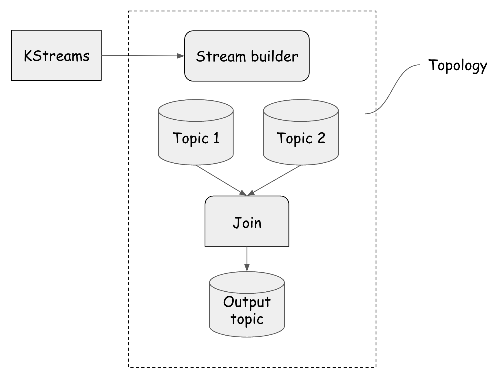

### Extract topology

> 1:50/23:24 (6.9) Extract topology

We will modify the code to extract topology. To do this, we will create `createTopology()` method inside `JsonKStream`
class.

**File `JsonKStream.java`**

``` java
public Topology createTopology() {
    StreamsBuilder streamsBuilder = new StreamsBuilder();
    var ridesStream = streamsBuilder.stream("rides", Consumed.with(Serdes.String(), CustomSerdes.getSerde(Ride.class)));
    var puLocationCount = ridesStream.groupByKey().count().toStream();
    puLocationCount.to("rides-pulocation-count", Produced.with(Serdes.String(), Serdes.Long()));
    return streamsBuilder.build();
}

public void countPLocation() throws InterruptedException {
    var topology = createTopology();
    var kStreams = new KafkaStreams(topology, props);
    kStreams.start();
    while (kStreams.state() != KafkaStreams.State.RUNNING) {
        System.out.println(kStreams.state());
        Thread.sleep(1000);
    }
    System.out.println(kStreams.state());
    Runtime.getRuntime().addShutdownHook(new Thread(kStreams::close));
}
```

### Importing the test utilities

To test a Kafka Streams application, Kafka provides a test-utils artifact that can be added as regular dependency to
your test code base.

In `build.gradle` file, we should add to the `build.gradle` file these dependencies :

``` txt
testImplementation 'org.junit.jupiter:junit-jupiter-api:5.8.1'
testRuntimeOnly 'org.junit.jupiter:junit-jupiter-engine:5.8.1'
testImplementation 'org.apache.kafka:kafka-streams-test-utils:3.3.1'
```

See [Testing Kafka Streams](https://kafka.apache.org/21/documentation/streams/developer-guide/testing.html) for more.

### Create a test class

> 3:45/23:24 (6.9) Create a test class

The instructor creates `JsonKStreamTest` class. See
[JsonKStreamTest.java](https://github.com/DataTalksClub/data-engineering-zoomcamp/blob/main/week_6_stream_processing/java/kafka_examples/src/test/java/org/example/JsonKStreamTest.java).

**File `JsonKStreamTest.java`**

``` java
package org.example;

import org.apache.kafka.common.serialization.Serdes;
import org.apache.kafka.streams.*;
import org.example.customserdes.CustomSerdes;
import org.example.data.Ride;
import org.example.helper.DataGeneratorHelper;
import org.junit.jupiter.api.AfterAll;
import org.junit.jupiter.api.BeforeEach;
import org.junit.jupiter.api.Test;
import static org.junit.jupiter.api.Assertions.*;
import java.util.Properties;

class JsonKStreamTest {
    private Properties props;
    private static TopologyTestDriver testDriver;
    private TestInputTopic<String, Ride> inputTopic;
    private TestOutputTopic<String, Long> outputTopic;
    private Topology topology = new JsonKStream().createTopology();

    @BeforeEach
    public void setup() {
        props = new Properties();
        props.setProperty(StreamsConfig.APPLICATION_ID_CONFIG, "testing_count_application");
        props.setProperty(StreamsConfig.BOOTSTRAP_SERVERS_CONFIG, "dummy:1234");
        if (testDriver != null) {
            testDriver.close();
        }
        testDriver = new TopologyTestDriver(topology, props);
        inputTopic = testDriver.createInputTopic("rides", Serdes.String().serializer(), CustomSerdes.getSerde(Ride.class).serializer());
        outputTopic = testDriver.createOutputTopic("rides-pulocation-count", Serdes.String().deserializer(), Serdes.Long().deserializer());
    }

    @Test
    public void testIfOneMessageIsPassedToInputTopicWeGetCountOfOne() {
        Ride ride = DataGeneratorHelper.generateRide();
        inputTopic.pipeInput(String.valueOf(ride.DOLocationID), ride);

        assertEquals(outputTopic.readKeyValue(), KeyValue.pair(String.valueOf(ride.DOLocationID), 1L));
        assertTrue(outputTopic.isEmpty());
    }

    @Test
    public void testIfTwoMessageArePassedWithDifferentKey() {
        Ride ride1 = DataGeneratorHelper.generateRide();
        ride1.DOLocationID = 100L;
        inputTopic.pipeInput(String.valueOf(ride1.DOLocationID), ride1);

        Ride ride2 = DataGeneratorHelper.generateRide();
        ride2.DOLocationID = 200L;
        inputTopic.pipeInput(String.valueOf(ride2.DOLocationID), ride2);

        assertEquals(outputTopic.readKeyValue(), KeyValue.pair(String.valueOf(ride1.DOLocationID), 1L));
        assertEquals(outputTopic.readKeyValue(), KeyValue.pair(String.valueOf(ride2.DOLocationID), 1L));
        assertTrue(outputTopic.isEmpty());
    }

    @Test
    public void testIfTwoMessageArePassedWithSameKey() {
        Ride ride1 = DataGeneratorHelper.generateRide();
        ride1.DOLocationID = 100L;
        inputTopic.pipeInput(String.valueOf(ride1.DOLocationID), ride1);

        Ride ride2 = DataGeneratorHelper.generateRide();
        ride2.DOLocationID = 100L;
        inputTopic.pipeInput(String.valueOf(ride2.DOLocationID), ride2);

        assertEquals(outputTopic.readKeyValue(), KeyValue.pair("100", 1L));
        assertEquals(outputTopic.readKeyValue(), KeyValue.pair("100", 2L));
        assertTrue(outputTopic.isEmpty());
    }

    @AfterAll
    public static void tearDown() {
        testDriver.close();
    }
}
```

We use [JUnit 5](https://junit.org/junit5/) for testing. See [JUnit 5 User
Guide](https://junit.org/junit5/docs/current/user-guide/).

### Create a test for joins

> 13:15/23:24 (6.9) Create a test for joins

The instructor creates also a test for joins. See
[JsonKStreamJoinsTest.java](https://raw.githubusercontent.com/DataTalksClub/data-engineering-zoomcamp/main/week_6_stream_processing/java/kafka_examples/src/test/java/org/example/JsonKStreamJoinsTest.java).

**File `JsonKStreamJoinsTest.java`**

``` java
package org.example;

import org.apache.kafka.clients.consumer.ConsumerConfig;
import org.apache.kafka.common.internals.Topic;
import org.apache.kafka.common.serialization.Serdes;
import org.apache.kafka.streams.*;
import org.example.customserdes.CustomSerdes;
import org.example.data.PickupLocation;
import org.example.data.Ride;
import org.example.data.VendorInfo;
import org.example.helper.DataGeneratorHelper;
import org.junit.jupiter.api.AfterAll;
import org.junit.jupiter.api.BeforeEach;
import org.junit.jupiter.api.Test;

import javax.xml.crypto.Data;
import java.util.Properties;

import static org.junit.jupiter.api.Assertions.*;

class JsonKStreamJoinsTest {
    private Properties props = new Properties();
    private static TopologyTestDriver testDriver;
    private TestInputTopic<String, Ride> ridesTopic;
    private TestInputTopic<String, PickupLocation> pickLocationTopic;
    private TestOutputTopic<String, VendorInfo> outputTopic;

    private Topology topology = new JsonKStreamJoins().createTopology();
    @BeforeEach
    public void setup() {
        props = new Properties();
        props.setProperty(StreamsConfig.APPLICATION_ID_CONFIG, "testing_count_application");
        props.setProperty(StreamsConfig.BOOTSTRAP_SERVERS_CONFIG, "dummy:1234");
        if (testDriver != null) {
            testDriver.close();
        }
        testDriver = new TopologyTestDriver(topology, props);
        ridesTopic = testDriver.createInputTopic(Topics.INPUT_RIDE_TOPIC, Serdes.String().serializer(), CustomSerdes.getSerde(Ride.class).serializer());
        pickLocationTopic = testDriver.createInputTopic(Topics.INPUT_RIDE_LOCATION_TOPIC, Serdes.String().serializer(), CustomSerdes.getSerde(PickupLocation.class).serializer());
        outputTopic = testDriver.createOutputTopic(Topics.OUTPUT_TOPIC, Serdes.String().deserializer(), CustomSerdes.getSerde(VendorInfo.class).deserializer());
    }

    @Test
    public void testIfJoinWorksOnSameDropOffPickupLocationId() {
        Ride ride = DataGeneratorHelper.generateRide();
        PickupLocation pickupLocation = DataGeneratorHelper.generatePickUpLocation(ride.DOLocationID);
        ridesTopic.pipeInput(String.valueOf(ride.DOLocationID), ride);
        pickLocationTopic.pipeInput(String.valueOf(pickupLocation.PULocationID), pickupLocation);

        assertEquals(outputTopic.getQueueSize(), 1);
        var expected = new VendorInfo(ride.VendorID, pickupLocation.PULocationID, pickupLocation.tpep_pickup_datetime, ride.tpep_dropoff_datetime);
        var result = outputTopic.readKeyValue();
        assertEquals(result.key, String.valueOf(ride.DOLocationID));
        assertEquals(result.value.VendorID, expected.VendorID);
        assertEquals(result.value.pickupTime, expected.pickupTime);
    }


    @AfterAll
    public static void shutdown() {
        testDriver.close();
    }
}
```

### Conclusion

> 23:03/23:24 (6.9) Conclusion

Now we can see that we can easily test our topologies using this methodology.

The instructor highly suggest us to write unit tests whatever language we are using, to be sure that our topology is
working.

## 6.10 Kafka Stream Windowing

### Intro

> 0:00/17:30 (6.10) Intro

We will cover some of the concepts of stream processing.

When dealing with streaming data, it’s important to make the disctinction between these 2 concepts:

- **Streams** (aka **KStreams**) are individual messages that are read sequentially.
- **State** (aka **KTable**) can be thought of as a stream changelog: essentially a table which contains a view of the
  stream at a specific point of time. KTables are also stored as topics in Kafka.

### Global KTable

> 0:38/17:30 (6.10) Global KTable

Event streams are series or sequences of key value pairs, which are independent of each other.

In contrast to that, an update stream is also sequences of key value pairs, but instead of complimentary events that
each represent a single physical event, an update stream is an update that is applied to a previous value.

The main difference between a `KTable` and a `GlobalKTable` is that a `KTable` shards data between Kafka Streams
instances, while a `GlobalKTable` extends a full copy of the data to each instance.

See [KTable](https://developer.confluent.io/learn-kafka/kafka-streams/ktable) from Confluent Kafka Streams 101.

### Joining

> 4:01/17:30 (6.10) Joining

Taking a leaf out of SQLs book, Kafka Streams supports three kinds of joins:

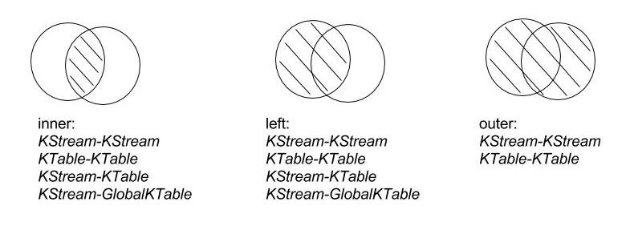

**Inner Joins**: Emits an output when both input sources have records with the same key.

**Left Joins**: Emits an output for each record in the left or primary input source. If the other source does not have a
value for a given key, it is set to null.

**Outer Joins**: Emits an output for each record in either input source. If only one source contains a key, the other is
null.

See [Crossing the Streams – Joins in Apache Kafka](https://www.confluent.io/blog/crossing-streams-joins-apache-kafka/)
for more.

### Windowing

> 8:06/17:30 (6.10) Windowing

In Kafka Streams, **windows** refer to a time reference in which a series of events happen.

Windowing allows you to bucket stateful operations by time, without which your aggregations would endlessly accumulate.
A window gives you a snapshot of an aggregate within a given timeframe, and can be set as hopping, tumbling, session, or
sliding.

- **Tumbling**: Fixed size non overlapping
- **Hopping**: Fixed size and overlapping
- **Sliding**: Fixed-size, overlapping windows that work on differences between record timestamps
- **Session**: Dynamically-sized, non-overlapping, data-driven windows

See also :

- [Tumbling time
  windows](https://docs.confluent.io/platform/current/streams/developer-guide/dsl-api.html#tumbling-time-windows).
- [Hopping time
  windows](https://docs.confluent.io/platform/current/streams/developer-guide/dsl-api.html#hopping-time-windows).
- [Session Windows](https://docs.confluent.io/platform/current/streams/developer-guide/dsl-api.html#session-windows).
- [Windowing](https://developer.confluent.io/learn-kafka/kafka-streams/windowing/) from Confluent Kafka Streams 101.
- [Apache Kafka Beyond the Basics: Windowing](https://www.confluent.io/blog/windowing-in-kafka-streams/).

### Code example

> 13:06/17:30 (6.10) Code example

See
[JsonKStreamWindow.java](https://github.com/DataTalksClub/data-engineering-zoomcamp/blob/main/week_6_stream_processing/java/kafka_examples/src/main/java/org/example/JsonKStreamWindow.java).

**File `JsonKStreamWindow.java`**

``` java
public Topology createTopology() {
    StreamsBuilder streamsBuilder = new StreamsBuilder();
    var ridesStream = streamsBuilder.stream("rides", Consumed.with(Serdes.String(), CustomSerdes.getSerde(Ride.class)));
    var puLocationCount = ridesStream.groupByKey()
            // A tumbling time window with a size of 10 seconds (and, by definition, an implicit
            // advance interval of 10 seconds), and grace period of 5 seconds.
            .windowedBy(TimeWindows.ofSizeAndGrace(Duration.ofSeconds(10), Duration.ofSeconds(5)))
            .count().toStream();
    var windowSerde = WindowedSerdes.timeWindowedSerdeFrom(String.class, 10*1000);

    puLocationCount.to("rides-pulocation-window-count", Produced.with(windowSerde, Serdes.Long()));
    return streamsBuilder.build();
}

public void countPLocationWindowed() {
    var topology = createTopology();
    var kStreams = new KafkaStreams(topology, props);
    kStreams.start();

    Runtime.getRuntime().addShutdownHook(new Thread(kStreams::close));
}

public static void main(String[] args) {
    var object = new JsonKStreamWindow();
    object.countPLocationWindowed();
}
```

> 14:42/17:30 (6.10) Run this

Run `JsonProducer` and than run `JsonKStreamWindow`.

## 6.11 Kafka ksqlDB & Connect

> 0:00/14:48 (6.11) What is ksqlDB?

[ksqlDB](https://ksqldb.io/) is a tool for specifying stream transformations in SQL such as joins. The output of these
transformations is a new topic.

ksqlDB allows you to query, read, write, and process data in Apache Kafka in real-time and at scale using a lightweight
SQL syntax. ksqlDB does not require proficiency with a programming language such as Java or Scala, and you don’t have to
install a separate processing cluster technology.

ksqlDB is complementary to the Kafka Streams API, and indeed executes queries through Kafka Streams applications.

One of the key benefits of ksqlDB is that it does not require the user to develop any code in Java or Scala. This
enables users to leverage a SQL-like interface alone to construct streaming ETL pipelines, to respond to real-time,
continuous business requests, to spot anomalies, and more. ksqlDB is a great fit when your processing logic can be
naturally expressed through SQL.

For more, see:

- [ksqlDB Overview](https://docs.confluent.io/platform/current/ksqldb/index.html#ksqldb-overview)
- [ksqlDB Introduction](https://developer.confluent.io/learn-kafka/ksqldb/intro/)
- [ksqlDB Documentation](https://docs.ksqldb.io/en/latest/)
- [ksqlDB Reference](https://docs.ksqldb.io/en/latest/developer-guide/ksqldb-reference/)

### ksqlDB in Confluent Cloud

> 0:59/14:48 (6.11) ksqlDB in Confluent Cloud

See [ksqlDB in Confluent Cloud](https://docs.confluent.io/cloud/current/ksqldb/index.html) for more.

Below are examples of ksqlDB queries.

**Create streams**

``` sql
CREATE STREAM ride_streams (
    VendorId varchar,
    trip_distance double,
    payment_type varchar
)  WITH (KAFKA_TOPIC='rides',
        VALUE_FORMAT='JSON');
```

**Query stream**

``` sql
select * from RIDE_STREAMS
EMIT CHANGES;
```

**Query stream count**

``` sql
SELECT VENDORID, count(*) FROM RIDE_STREAMS
GROUP BY VENDORID
EMIT CHANGES;
```

**Query stream with filters**

``` sql
SELECT payment_type, count(*) FROM RIDE_STREAMS
WHERE payment_type IN ('1', '2')
GROUP BY payment_type
EMIT CHANGES;
```

**Query stream with window functions**

``` sql
CREATE TABLE payment_type_sessions AS
  SELECT payment_type,
         count(*)
  FROM  RIDE_STREAMS
  WINDOW SESSION (60 SECONDS)
  GROUP BY payment_type
  EMIT CHANGES;
```

### ksqlDB Documentation for details

- [ksqlDB Reference](https://docs.ksqldb.io/en/latest/developer-guide/ksqldb-reference/quick-reference/)
- [ksqlDB Java Client](https://docs.ksqldb.io/en/latest/developer-guide/ksqldb-clients/java-client/)

### Connectors

> 11:16/14:48 (6.11) Connectors

Kafka Connect is the pluggable, declarative data integration framework for Kafka to perform streaming integration
between Kafka and other systems such as databases, cloud services, search indexes, file systems, and key-value stores.

Kafka Connect makes it easy to stream data from numerous sources into Kafka, and stream data out of Kafka to numerous
targets. The diagram you see here shows a small sample of these sources and sinks (targets). There are literally
hundreds of different connectors available for Kafka Connect. Some of the most popular ones include:

- RDBMS (Oracle, SQL Server, Db2, Postgres, MySQL)
- Cloud object stores (Amazon S3, Azure Blob Storage, Google Cloud Storage)
- Message queues (ActiveMQ, IBM MQ, RabbitMQ)
- NoSQL and document stores (Elasticsearch, MongoDB, Cassandra)
- Cloud data warehouses (Snowflake, Google BigQuery, Amazon Redshift)

See [Introduction to Kafka Connect](https://developer.confluent.io/learn-kafka/kafka-connect/intro/), [Kafka Connect
Fundamentals: What is Kafka Connect?](https://www.confluent.io/blog/kafka-connect-tutorial/) and [Self-managed
connectors](https://docs.confluent.io/kafka-connectors/self-managed/kafka_connectors.html) for more.

## 6.12 Kafka Schema registry

### Why are schemas needed?

Kafka messages can be anything, from plain text to binary objects. This makes Kafka very flexible but it can lead to
situations where consumers can’t understand messages from certain producers because of incompatibility.

In order to solve this, we can introduce a **schema** to the data so that producers can define the kind of data they’re
pushing and consumers can understand it.

### Kafka Schema registry

> 0:00/31:19 (6.12) Kafka Schema registry

The **schema registry** is a component that stores schemas and can be accessed by both producers and consumers to fetch
them.

This is the usual workflow of a working schema registry with Kafka:

- The producer checks the schema registry, informing it that they want to publish to some particular topic with schema
  v1.
- The registry verifies the schema.
  - If no schema exists for the subject, he saves the schema and gives his consent to the producer.
  - If a schema already exists for the subject, the registry checks for compatibility with the producer and registered
    schemas.
  - If the compatibility check passes, the registry sends a message back to the producer giving them permission to start
    publishing messages.
  - If the check fails, the registry tells the producer that the schema is incompatible and the producer returns an
    error.
- The producer starts sending messages to the topic using the v1 schema to a Kafka broker.
- When the consumer wants to consume from a topic, it checks with the Schema Registry which version to use.

[Confluent Schema Registry](https://docs.confluent.io/platform/current/schema-registry/index.html) provides a serving
layer for your metadata. It provides a RESTful interface for storing and retrieving your Avro, JSON Schema, and Protobuf
schemas. It stores a versioned history of all schemas based on a specified subject name strategy, provides multiple
compatibility settings and allows evolution of schemas according to the configured compatibility settings and expanded
support for these schema types. It provides serializers that plug into Apache Kafka clients that handle schema storage
and retrieval for Kafka messages that are sent in any of the supported formats.

See [Schema Registry Overview](https://docs.confluent.io/platform/current/schema-registry/index.html) and [Apache Kafka®
101: Schema Registry](https://www.youtube.com/watch?v=_x9RacHDQY0) for more.

### Avro

> 8:21/31:19 (6.12) Avro

Many Kafka developers favor the use of [Apache Avro](https://avro.apache.org/) which is an open source project that
provides data serialization and data exchange services for Apache Hadoop.

Avro provides a compact serialization format, schemas that are separate from the message payloads and that do not
require code to be generated when they change, and strong data typing and schema evolution, with both backward and
forward compatibility.

In the following figure we have summarized some reasons what makes the framework so ingenious.

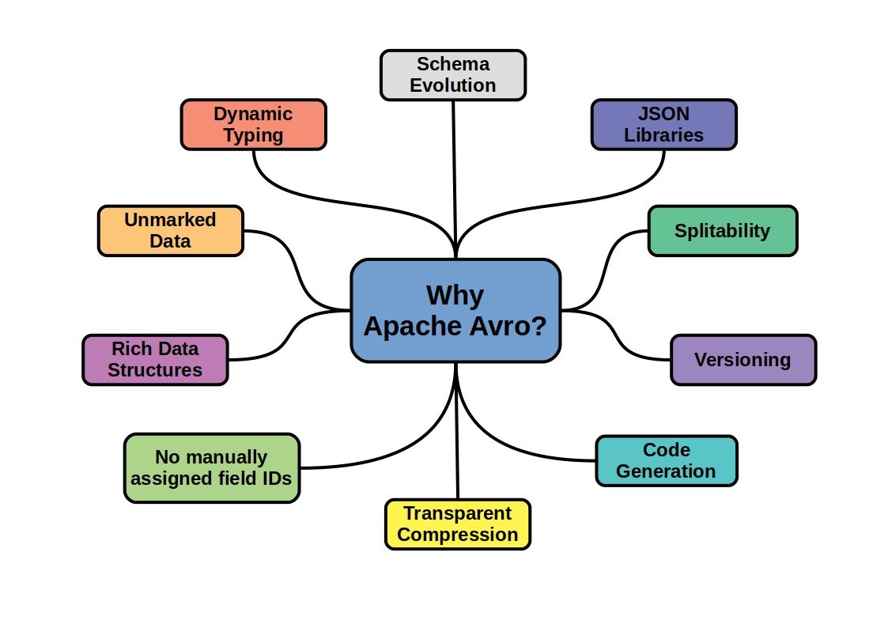

See [Apache Avro – Effective Big Data Serialization Solution for
Kafka](https://starship-knowledge.com/category/net-core) and [Exploring Avro as a Kafka data
format](https://inakianduaga.github.io/kafka-image-processor/#/) for more.

### Schema evolution and compatibility

> 10:10/31:19 (6.12) Avro schema evolution

An important aspect of data management is schema evolution. After the initial schema is defined, applications may need
to evolve it over time. When this happens, it’s critical for the downstream consumers to be able to handle data encoded
with both the old and the new schema seamlessly.

We can define 3 different kinds of evolutions for schemas:

- **Forward compatibility** means that data produced with a new schema can be read by consumers using the last schema,
  even though they may not be able to use the full capabilities of the new schema.
- **Backward compatibility** means that consumers using the new schema can read data produced with the last schema.
- **Full** (or **mixed**) compatibility means schemas are both backward and forward compatible.

<table>
<tr><td>
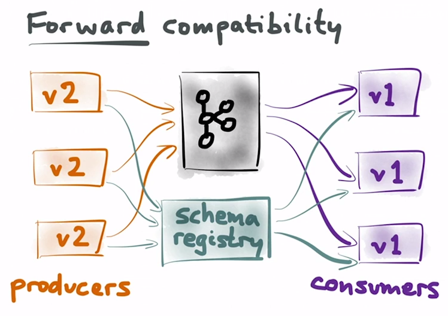
</td><td>

</td><td>
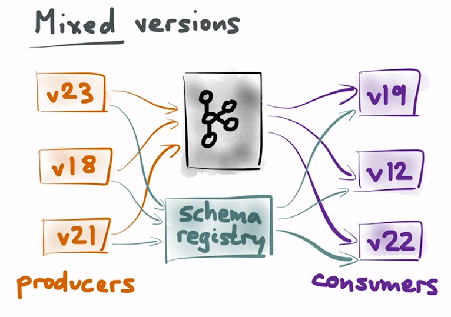
</td></tr>
</table>

See [Schema Evolution and Compatibility](https://docs.confluent.io/platform/current/schema-registry/avro.html) for more.


### Code example

> 11:52/31:19 (6.12) Code example

The instructor explained
[AvroProducer.java](https://github.com/DataTalksClub/data-engineering-zoomcamp/blob/main/week_6_stream_processing/java/kafka_examples/src/main/java/org/example/AvroProducer.java).

**File `AvroProducer.java`**

``` java
public class AvroProducer {

    private Properties props = new Properties();

    public AvroProducer() {
        String BOOTSTRAP_SERVER = "pkc-41voz.northamerica-northeast1.gcp.confluent.cloud:9092";
        String KAFKA_CLUSTER_KEY = "JWBF2WALIK54BZYY";
        String KAFKA_CLUSTER_SECRET = "7YVpnTS...............................................NRelKDJPL0";

        props.put(StreamsConfig.BOOTSTRAP_SERVERS_CONFIG, BOOTSTRAP_SERVER);
        props.put("security.protocol", "SASL_SSL");
        props.put("sasl.jaas.config",
            "org.apache.kafka.common.security.plain.PlainLoginModule required username='"
            + KAFKA_CLUSTER_KEY + "' password='" + KAFKA_CLUSTER_SECRET + "';");
        props.put("sasl.mechanism", "PLAIN");
        props.put("client.dns.lookup", "use_all_dns_ips");
        props.put("session.timeout.ms", "45000");
        props.put(ProducerConfig.ACKS_CONFIG, "all");
        props.put(ProducerConfig.KEY_SERIALIZER_CLASS_CONFIG, "org.apache.kafka.common.serialization.StringSerializer");
        props.put(ProducerConfig.VALUE_SERIALIZER_CLASS_CONFIG, KafkaAvroSerializer.class.getName());

        props.put(AbstractKafkaAvroSerDeConfig.SCHEMA_REGISTRY_URL_CONFIG, "https://psrc-kk5gg.europe-west3.gcp.confluent.cloud");
        props.put("basic.auth.credentials.source", "USER_INFO");
        props.put("basic.auth.user.info", Secrets.SCHEMA_REGISTRY_KEY+":"+Secrets.SCHEMA_REGISTRY_SECRET);
    }

    public List<RideRecord> getRides() throws IOException, CsvException {
        var ridesStream = this.getClass().getResource("/rides.csv");
        var reader = new CSVReader(new FileReader(ridesStream.getFile()));
        reader.skip(1);

        return reader.readAll().stream().map(row ->
            RideRecord.newBuilder()
                    .setVendorId(row[0])
                    .setTripDistance(Double.parseDouble(row[4]))
                    .setPassengerCount(Integer.parseInt(row[3]))
                    .build()
                ).collect(Collectors.toList());
    }

    public void publishRides(List<RideRecord> rides) throws ExecutionException, InterruptedException {
        KafkaProducer<String, RideRecord> kafkaProducer = new KafkaProducer<>(props);
        for (RideRecord ride : rides) {
            var record = kafkaProducer.send(new ProducerRecord<>("rides_avro", String.valueOf(ride.getVendorId()), ride), (metadata, exception) -> {
                if (exception != null) {
                    System.out.println(exception.getMessage());
                }
            });
            System.out.println(record.get().offset());
            Thread.sleep(500);
        }
    }

    public static void main(String[] args) throws IOException, CsvException, ExecutionException, InterruptedException {
        var producer = new AvroProducer();
        var rideRecords = producer.getRides();
        producer.publishRides(rideRecords);
    }
}
```

The central part of the Producer API is Producer class. Producer class provides an option to connect Kafka broker in its
constructor by the following methods.

[KafkaProducer](https://javadoc.io/static/org.apache.kafka/kafka-clients/3.4.0/org/apache/kafka/clients/producer/KafkaProducer.html)
is a Kafka client that publishes records to the Kafka cluster.

The producer class provides `.send()` method to send messages to either single or multiple topics using the following
signatures `public void send(KeyedMessaget<k,v> message)` sends the data to a single topic, partitioned by key using
either sync or async producer.

[ProducerRecord](https://javadoc.io/static/org.apache.kafka/kafka-clients/3.4.0/org/apache/kafka/clients/producer/ProducerRecord.html)
is a key/value pair to be sent to Kafka. This consists of a topic name to which the record is being sent, an optional
partition number, and an optional key and value.

We need also to configure the producer to use Schema Registry and the `KafkaAvroSerializer` class. We need to import
this class and Avro dependencies into our Gradle project (I think
[io.confluent:kafka-avro-serializer:5.3.0](https://mvnrepository.com/artifact/io.confluent/kafka-avro-serializer) and
[org.apache.avro:avro:1.11.1](https://mvnrepository.com/artifact/org.apache.avro/avro)).

To write the consumer, you will need to configure it to use Schema Registry and to use the `KafkaAvroDeserializer`.

The `rides.csv` filke is
[here](https://github.com/DataTalksClub/data-engineering-zoomcamp/blob/main/week_6_stream_processing/java/kafka_examples/src/main/resources/rides.csv).

### Run this

> 19:35/31:19 (6.12) Run this

The instructor runs AvroProducer and sees that messages are being created in Confluent Cloud.

### Example with modified schema

> 21:27/31:19 (6.12) Example with modified schema

## Conclusion

> 28:58/31:19 (6.12) Conclusion

## Selected links

- Kafka Documentation

  - [Documentation](https://kafka.apache.org/documentation/)
  - [Run Kafka Streams demo application](https://kafka.apache.org/documentation/streams/quickstart)
  - [APIs and Javadocs](https://docs.confluent.io/platform/current/api-javadoc/index.html#apis-and-javadocs)
  - [Javadocs](https://javadoc.io/doc/org.apache.kafka/kafka-clients/latest/index.html)
- Books
  - [Kafka: The Definitive Guide](https://www.oreilly.com/library/view/kafka-the-definitive/9781491936153/) by Neha
    Narkhede, Gwen Shapira, Todd Palino (O’Reilly)
  - [Kafka in Axtion](https://www.manning.com/books/kafka-in-action) by Dylan Scott, Viktor Gamov, Dave Klein (Manning)
- Courses/Tutorials
  - [Apache Kafka QuickStart](https://kafka.apache.org/quickstart)
  - [Learn Apache Kafka](https://developer.confluent.io/learn-kafka/) from Confluent
  - [Conduktor Kafkademy](https://www.conduktor.io/kafka)
  - [Apache Kafka for beginners](https://www.cloudkarafka.com/blog/part1-kafka-for-beginners-what-is-apache-kafka.html)
    from cloudkarafka
  - [Kafka: a map of traps for the enlightened dev and op](https://www.youtube.com/watch?v=paVdXL5vDzg&t=1s) by Emmanuel
    Bernard And Clement Escoffier
- Tools
  - [Kafdrop](https://github.com/obsidiandynamics/kafdrop) is a web UI for viewing Kafka topics and browsing consumer
    groups.
- Others
  - [awesome-kafka](https://github.com/infoslack/awesome-kafka/blob/master/README.md)

Last updated: March 7, 2023
